# Chapter 11: Graph Algorithms

[Previous: Chapter 10 - Branch and Bound](../Chapter%2010%20-%20Branch%20and%20Bound/README.md) | [Home](../README.md) | [Next: Chapter 12 - Flow Algorithms](../Chapter%2012%20-%20Flow%20Algorithms/README.md)

---

Graph Algorithms study how to model relationships and solve problems on connected objects. A graph can represent cities connected by roads, courses connected by prerequisites, computers connected in a network, or tasks connected by dependencies.

This chapter keeps only the requested graph theory and graph algorithm topics. Each topic is explained in a simple sequence with definitions, diagrams, walkthrough tables, algorithm sketches, and complexity analysis.

---

## Table of Contents

1. [Graph Algorithms](#graph-algorithms)
2. [Tree vs Graph](#1-tree-vs-graph)
3. [Graph Categories](#2-graph-categories)
   - [Weighted vs Unweighted](#weighted-vs-unweighted)
   - [Directed vs Undirected](#directed-vs-undirected)
   - [Cyclic vs Acyclic](#cyclic-vs-acyclic)
4. [Graph Representation](#3-graph-representation)
   - [Adjacency Matrix](#adjacency-matrix)
   - [Adjacency List](#adjacency-list)
5. [Shortest Path Problem Overview](#4-shortest-path-problem-overview)
6. [BFS for Unweighted Shortest Path](#5-bfs-for-unweighted-shortest-path)
7. [Single Source Shortest Path - Bellman-Ford Algorithm](#6-single-source-shortest-path---bellman-ford-algorithm)
8. [Topological Sorting](#7-topological-sorting)
   - [Definition](#definition)
   - [DAG](#dag)
   - [DFS-Based Topological Sort](#dfs-based-topological-sort)
   - [Kahn's Algorithm - Optional/Self-Study](#kahns-algorithm---optionalself-study)
   - [Time Complexity](#time-complexity)
   - [Applications](#applications)
9. [Connected Components](#8-connected-components)
10. [Strongly Connected Components](#9-strongly-connected-components)
	- [Kosaraju's Algorithm](#kosarajus-algorithm)
	- [Tarjan's Algorithm - Optional/Self-Study](#tarjans-algorithm---optionalself-study)
11. [Union-Find / Disjoint Set Union for Kruskal Support](#10-union-find--disjoint-set-union-for-kruskal-support)
12. [Analyze Time Complexity of Above Topics](#analyze-time-complexity-of-above-topics)

---

## Graph Algorithms

A **graph** is a mathematical structure used to represent relationships.

A graph is written as:

$$
G=(V,E)
$$

Where:

- $V$ is the set of **vertices** or **nodes**.
- $E$ is the set of **edges** or **connections** between vertices.

Example:

- Vertices: $V = \{A,B,C,D\}$
- Edges: $E = \{(A,B),(A,C),(B,D),(C,D)\}$

Graph algorithms usually answer questions like:

- Can one vertex reach another vertex?
- What is the shortest path from a source vertex?
- Does the graph contain a cycle?
- In what order should dependent tasks be completed?
- Which vertices belong to the same connected group?
- Can adding an edge create a cycle?

### Recommended Study Sequence

Study this chapter in the following order:

1. Understand what graphs are and how they differ from trees.
2. Learn graph categories: weighted, unweighted, directed, undirected, cyclic, and acyclic.
3. Learn how to store graphs using adjacency matrix and adjacency list.
4. Use BFS to solve shortest path in an unweighted graph.
5. Learn the general shortest path idea and Bellman-Ford for weighted graphs.
6. Learn topological sorting for dependency ordering in a DAG.
7. Learn connected components in undirected graphs.
8. Learn strongly connected components in directed graphs.
9. Learn Union-Find / DSU as support for Kruskal's algorithm.

### Visual Map: Graph Algorithm Roadmap

```mermaid
flowchart TB
	Graph["Graph G = (V, E)"] --> Types["Graph categories"]
	Graph --> Store["Graph representation"]
	Graph --> Traverse["Traversal-based algorithms"]
	Graph --> Weighted["Weighted path algorithms"]
	Graph --> Sets["Set-based structure"]

	Types --> T1["Weighted or unweighted"]
	Types --> T2["Directed or undirected"]
	Types --> T3["Cyclic or acyclic"]

	Store --> Matrix["Adjacency matrix"]
	Store --> List["Adjacency list"]

	Traverse --> BFS["BFS shortest path<br/>unweighted graph"]
	Traverse --> Topo["Topological sorting<br/>DAG only"]
	Traverse --> CC["Connected components<br/>undirected graph"]
	Traverse --> SCC["Strongly connected components<br/>directed graph"]

	Weighted --> BF["Bellman-Ford<br/>single source shortest path"]
	Sets --> DSU["Union-Find / DSU<br/>cycle support for Kruskal"]

	classDef root fill:#e0f2fe,stroke:#0284c7,stroke-width:2px,color:#0f172a;
	classDef group fill:#fef3c7,stroke:#d97706,stroke-width:2px,color:#111827;
	classDef algo fill:#dcfce7,stroke:#16a34a,stroke-width:2px,color:#052e16;
	classDef detail fill:#f1f5f9,stroke:#64748b,stroke-dasharray: 5 5,color:#0f172a;
	class Graph root;
	class Types,Store,Traverse,Weighted,Sets group;
	class BFS,Topo,CC,SCC,BF,DSU algo;
	class T1,T2,T3,Matrix,List detail;
```

---

## 1. Tree vs Graph

A **tree** is a special type of graph. Every tree is a graph, but every graph is not a tree.

The easiest way to remember this:

- A tree is connected and has no cycle.
- A general graph may be disconnected and may contain cycles.

| Feature | Tree | Graph |
| :--- | :--- | :--- |
| Meaning | A connected acyclic structure | A general node-edge structure |
| Cycle allowed? | No | May or may not have cycles |
| Connected? | Always connected | May be connected or disconnected |
| Number of edges | Exactly $|V|-1$ for $|V|$ vertices | Can be from $0$ up to many edges |
| Path between two vertices | Exactly one simple path | May have zero, one, or many paths |
| Root needed? | Often rooted in applications | Usually no root unless defined |

### Example

For $4$ vertices:

- A tree must have $4-1=3$ edges and no cycle.
- A graph may have $0$, $1$, $2$, $3$, or more edges depending on the category.

### Visual Map: Tree Is a Special Graph

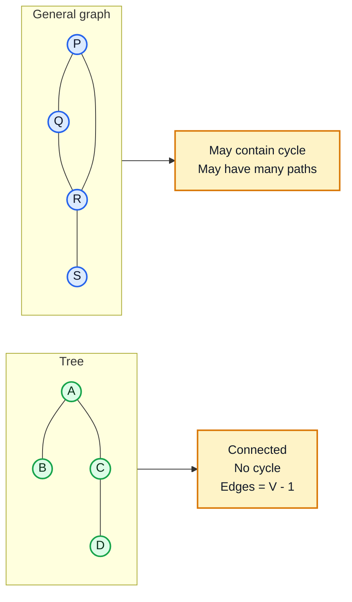

---

## 2. Graph Categories

Graph categories describe what type of edges the graph has and what kind of algorithms are suitable for it.

### Weighted vs Unweighted

An **unweighted graph** treats every edge as having the same cost.

Example: friendship connection.

A **weighted graph** gives a value or cost to each edge.

Example: road distance, flight price, network delay.

| Type | Edge meaning | Example | Common shortest path idea |
| :--- | :--- | :--- | :--- |
| Unweighted graph | Every edge has equal cost | Social network | BFS |
| Weighted graph | Each edge has a weight/cost | Road map | Bellman-Ford for this chapter |

### Directed vs Undirected

An **undirected graph** has edges that work both ways.

If $A-B$ exists, then $A$ can reach $B$ and $B$ can reach $A$ through that edge.

A **directed graph** has edges with direction.

If $A \to B$ exists, then $A$ can go to $B$, but $B$ cannot automatically go to $A$.

| Type | Edge notation | Meaning | Example |
| :--- | :--- | :--- | :--- |
| Undirected | $(A,B)$ | Two-way connection | Roads with two-way movement |
| Directed | $A \to B$ | One-way connection | Course prerequisite, one-way road |

### Cyclic vs Acyclic

A **cycle** is a path that starts and ends at the same vertex without repeating other vertices.

A **cyclic graph** contains at least one cycle.

An **acyclic graph** contains no cycle.

A **DAG** means **Directed Acyclic Graph**. DAGs are very important for topological sorting.

| Type | Cycle present? | Example use |
| :--- | :---: | :--- |
| Cyclic graph | Yes | Routes with loops, mutual dependencies |
| Acyclic graph | No | Trees, dependency chains |
| DAG | No directed cycle | Course prerequisite ordering, task scheduling |

### Visual Map: Main Graph Categories

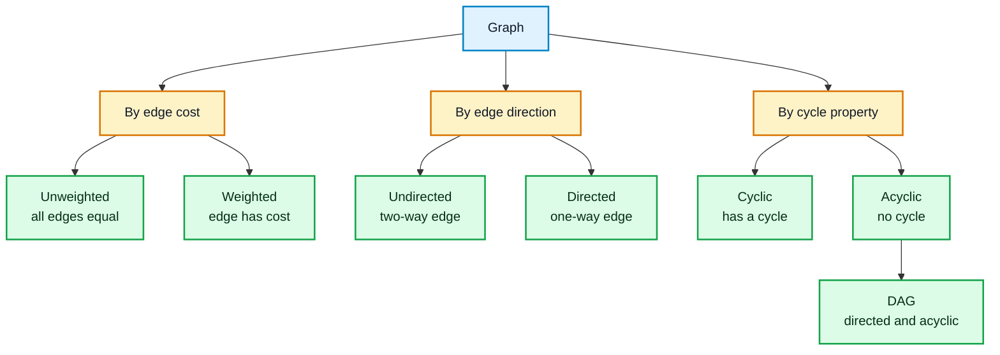

---

## 3. Graph Representation

Before running any graph algorithm, the graph must be stored in memory.

The two most common representations are:

1. Adjacency Matrix
2. Adjacency List

Use this example graph for both representations:

$$
V = \{A,B,C,D\}
$$

$$
E = \{(A,B),(A,C),(B,D),(C,D)\}
$$

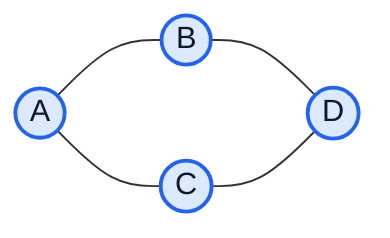

### Adjacency Matrix

An **adjacency matrix** uses a $|V| \times |V|$ table.

For an unweighted graph:

- Matrix value is `1` if an edge exists.
- Matrix value is `0` if no edge exists.

For a weighted graph:

- Matrix value stores the edge weight.
- A special value such as $\infty$ may be used when no edge exists.

For the example undirected graph:

| From / To | A | B | C | D |
| :---: | :---: | :---: | :---: | :---: |
| A | 0 | 1 | 1 | 0 |
| B | 1 | 0 | 0 | 1 |
| C | 1 | 0 | 0 | 1 |
| D | 0 | 1 | 1 | 0 |

Because the graph is undirected, the matrix is symmetric.

**Advantages:**

- Easy to check if an edge exists between two vertices.
- Edge lookup is $O(1)$.
- Good for dense graphs.

**Disadvantages:**

- Uses $\Theta(V^2)$ space.
- Wastes space for sparse graphs.
- To list all neighbors of one vertex, a full row must be scanned.

### Adjacency List

An **adjacency list** stores each vertex with the list of its neighbors.

For the same undirected graph:

| Vertex | Neighbor list |
| :---: | :--- |
| A | B, C |
| B | A, D |
| C | A, D |
| D | B, C |

For a weighted graph, each neighbor can be stored with its edge weight.

Example:

```text
A: (B, 4), (C, 2)
B: (D, 5)
C: (D, 1)
D: empty
```

**Advantages:**

- Uses $\Theta(V+E)$ space.
- Efficient for sparse graphs.
- Easy to iterate over neighbors.

**Disadvantages:**

- Checking whether a specific edge exists may take time proportional to the degree of the vertex.
- Slightly less direct than a matrix for edge lookup.

### Representation Comparison

| Operation / Feature | Adjacency Matrix | Adjacency List |
| :--- | :---: | :---: |
| Space | $\Theta(V^2)$ | $\Theta(V+E)$ |
| Check edge $(u,v)$ | $O(1)$ | $O(deg(u))$ |
| Iterate all neighbors of $u$ | $O(V)$ | $O(deg(u))$ |
| Best for | Dense graphs | Sparse graphs |
| Used often with | Simple edge lookup | BFS, DFS, components, topological sort |

### Visual Map: Matrix vs List

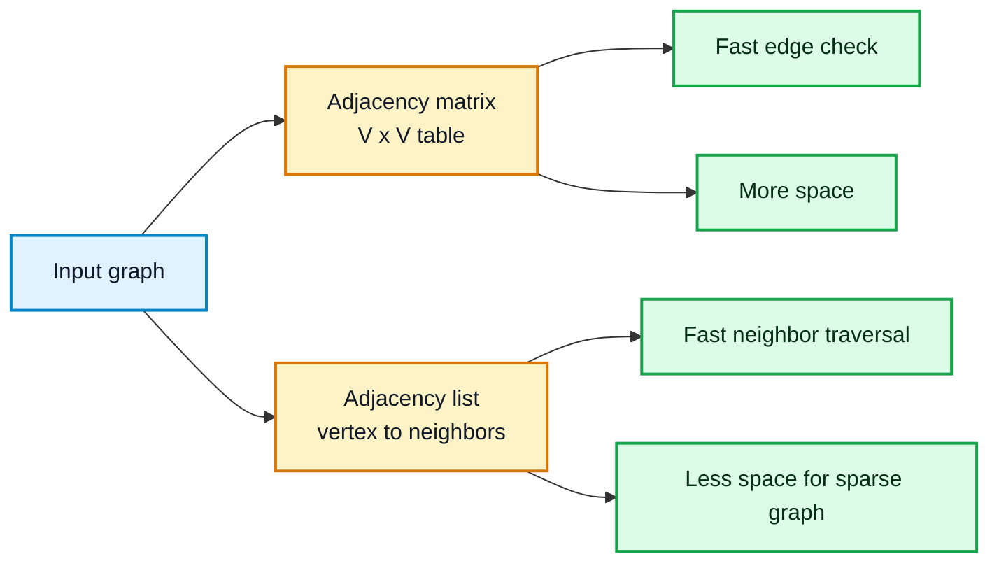

---

## 4. Shortest Path Problem Overview

A **path** is a sequence of vertices connected by edges.

A **shortest path** is a path with minimum total cost from one vertex to another.

The meaning of "minimum cost" depends on the graph:

- In an unweighted graph, cost means the number of edges.
- In a weighted graph, cost means the sum of edge weights.

### Main Shortest Path Types

| Problem type | Question | Algorithm in this chapter |
| :--- | :--- | :--- |
| Single pair shortest path | What is the shortest path from $s$ to $t$? | BFS for unweighted graph |
| Single source shortest path | What are the shortest paths from $s$ to all vertices? | BFS or Bellman-Ford |
| Weighted graph with negative edges | Can shortest paths still be found? | Bellman-Ford |

### Algorithm Selection in This Chapter

| Graph condition | Suitable algorithm here | Reason |
| :--- | :--- | :--- |
| Unweighted graph | BFS | BFS explores by distance layers |
| Weighted graph | Bellman-Ford | Relaxes weighted edges repeatedly |
| Weighted graph with negative edges | Bellman-Ford | Handles negative edges if there is no reachable negative cycle |
| Graph with reachable negative cycle | No finite shortest path | Distance can keep decreasing forever |

### Visual Map: Shortest Path Choice

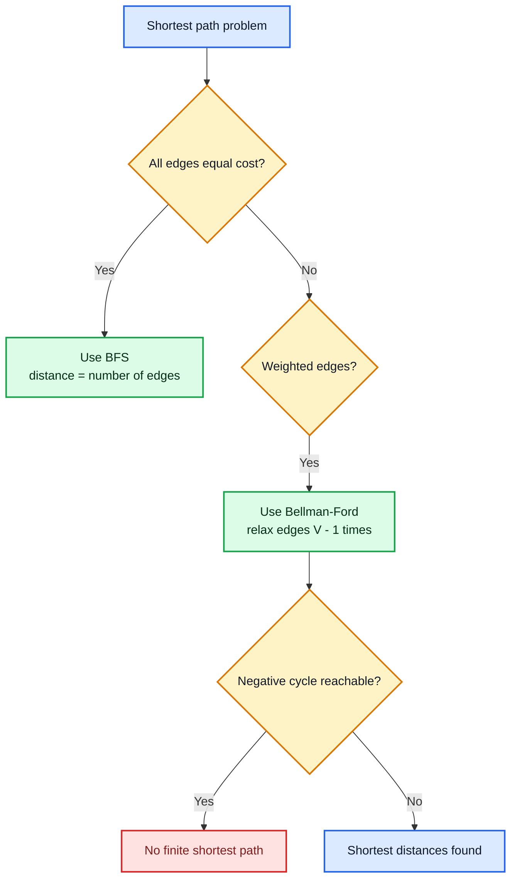

---

## 5. BFS for Unweighted Shortest Path

### Problem Statement

Given an unweighted graph and a source vertex $s$, find the shortest distance from $s$ to every reachable vertex.

Here, distance means the minimum number of edges.

### Inputs and Output

- **Input:** graph $G=(V,E)$ and source vertex $s$.
- **Output:** distance array `dist` and optional parent array `parent` for reconstructing shortest paths.

### Main Idea

BFS uses a queue and explores the graph level by level.

- Level 0: source vertex.
- Level 1: vertices reachable using 1 edge.
- Level 2: vertices reachable using 2 edges.
- Continue until no new vertex remains.

The first time BFS visits a vertex, it has found the shortest unweighted distance to that vertex.

### Worked Example

Find shortest paths from source $S$.

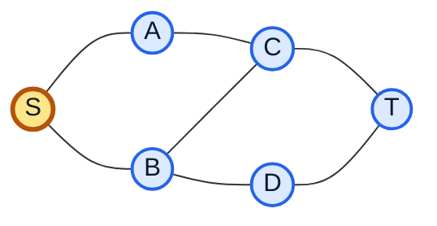

Assume neighbors are processed alphabetically.

| Step | Queue before pop | Popped vertex | Newly discovered vertices | Distance updates |
| :---: | :--- | :---: | :--- | :--- |
| 1 | S | S | A, B | $dist[A]=1$, $dist[B]=1$ |
| 2 | A, B | A | C | $dist[C]=2$ |
| 3 | B, C | B | D | $dist[D]=2$ |
| 4 | C, D | C | T | $dist[T]=3$ |
| 5 | D, T | D | None | No change |
| 6 | T | T | None | No change |

Final distances from $S$:

| Vertex | S | A | B | C | D | T |
| :---: | :---: | :---: | :---: | :---: | :---: | :---: |
| Distance | 0 | 1 | 1 | 2 | 2 | 3 |

One shortest path from $S$ to $T$ is:

$$
S \to A \to C \to T
$$

This path uses $3$ edges, so the shortest distance is $3$.

### Mermaid Diagram: BFS Layer Expansion

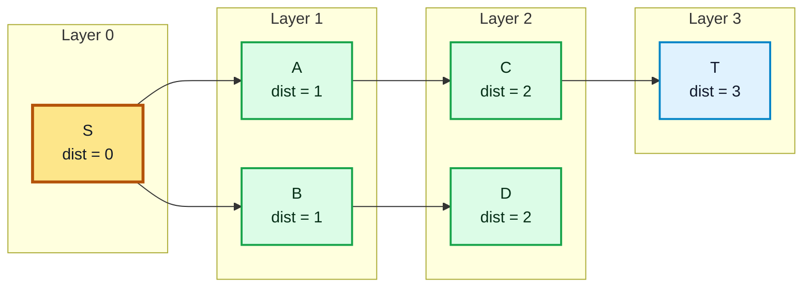

### Algorithm

```text
BFS-SHORTEST-PATH(G, s)
1. for each vertex v in G.V:
2.     dist[v] = infinity
3.     parent[v] = NIL
4. dist[s] = 0
5. create an empty queue Q
6. enqueue s into Q
7. while Q is not empty:
8.     u = dequeue Q
9.     for each neighbor v of u:
10.        if dist[v] == infinity:
11.            dist[v] = dist[u] + 1
12.            parent[v] = u
13.            enqueue v into Q
14. return dist, parent
```

### Complexity Analysis

| Representation | Time Complexity | Space Complexity | Reason |
| :--- | :---: | :---: | :--- |
| Adjacency list | $\Theta(V+E)$ | $\Theta(V)$ | Every vertex and edge is processed at most a constant number of times |
| Adjacency matrix | $\Theta(V^2)$ | $\Theta(V)$ | For every vertex, a full matrix row may be scanned |

---

## 6. Single Source Shortest Path - Bellman-Ford Algorithm

### Problem Statement

Given a weighted directed graph and a source vertex $s$, find the shortest distance from $s$ to every other vertex.

Bellman-Ford can handle negative edge weights, but it cannot produce finite shortest paths if a reachable negative cycle exists.

### Inputs and Output

- **Input:** weighted graph $G=(V,E)$, edge weight function $w(u,v)$, and source vertex $s$.
- **Output:** shortest distance array `dist`, parent array `parent`, and negative-cycle information.

### Main Idea: Edge Relaxation

To **relax** an edge $(u,v)$ means checking whether going through $u$ gives a shorter path to $v$.

If:

$$
dist[u] + w(u,v) < dist[v]
$$

Then update:

$$
dist[v] = dist[u] + w(u,v)
$$

Bellman-Ford relaxes every edge $|V|-1$ times.

Why $|V|-1$ times?

- A shortest simple path can contain at most $|V|-1$ edges.
- Each round allows shortest path information to move at least one edge farther.

After those rounds, one more relaxation pass is used to detect a negative cycle.

### Worked Example

Find shortest paths from $S$.

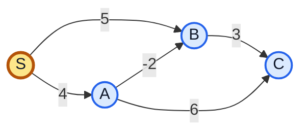

Use this edge order in every round:

1. $(B,C,3)$
2. $(A,B,-2)$
3. $(S,B,5)$
4. $(S,A,4)$
5. $(A,C,6)$

Initial distances:

| Vertex | S | A | B | C |
| :---: | :---: | :---: | :---: | :---: |
| Initial distance | 0 | $\infty$ | $\infty$ | $\infty$ |

Relax all edges $|V|-1 = 3$ times.

| Round | dist[S] | dist[A] | dist[B] | dist[C] | Important changes |
| :---: | :---: | :---: | :---: | :---: | :--- |
| 0 | 0 | $\infty$ | $\infty$ | $\infty$ | Initialization |
| 1 | 0 | 4 | 5 | 10 | $S \to B$, $S \to A$, $A \to C$ |
| 2 | 0 | 4 | 2 | 8 | $B \to C$, then $A \to B$ improves B |
| 3 | 0 | 4 | 2 | 5 | $B \to C$ improves C using new B |

Final shortest distances:

| Vertex | S | A | B | C |
| :---: | :---: | :---: | :---: | :---: |
| Distance from S | 0 | 4 | 2 | 5 |

The shortest path to $C$ is:

$$
S \to A \to B \to C
$$

Total cost:

$$
4 + (-2) + 3 = 5
$$

### Mermaid Diagram: Bellman-Ford Relaxation Flow

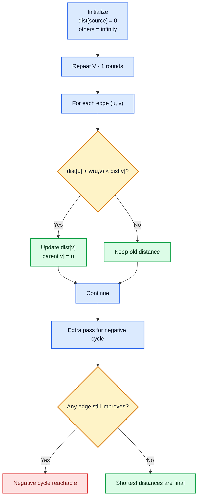

### Algorithm

```text
BELLMAN-FORD(G, w, s)
1. for each vertex v in G.V:
2.     dist[v] = infinity
3.     parent[v] = NIL
4. dist[s] = 0

5. for i = 1 to |V| - 1:
6.     for each edge (u, v) in G.E:
7.         if dist[u] != infinity and dist[u] + w(u, v) < dist[v]:
8.             dist[v] = dist[u] + w(u, v)
9.             parent[v] = u

10. for each edge (u, v) in G.E:
11.     if dist[u] != infinity and dist[u] + w(u, v) < dist[v]:
12.         return "negative cycle exists"

13. return dist, parent
```

### Complexity Analysis

| Part | Complexity |
| :--- | :---: |
| Initialization | $\Theta(V)$ |
| Relaxation rounds | $\Theta(VE)$ |
| Negative cycle check | $\Theta(E)$ |
| Total time | $\Theta(VE)$ |
| Space | $\Theta(V)$ |

---

## 7. Topological Sorting

Topological sorting is used when some tasks must happen before other tasks.

### Definition

A **topological ordering** of a directed graph is a linear ordering of vertices such that for every directed edge:

$$
u \to v
$$

Vertex $u$ appears before vertex $v$ in the ordering.

Topological sorting is possible only for a DAG.

### DAG

A **DAG** is a **Directed Acyclic Graph**.

- Directed: edges have direction.
- Acyclic: no directed cycle exists.

If a directed graph has a cycle, topological sorting is impossible because the cycle creates circular dependency.

Example of impossible dependency:

$$
A \to B, \quad B \to C, \quad C \to A
$$

This says $A$ before $B$, $B$ before $C$, and $C$ before $A$, which cannot all be true.

### Worked Example

Suppose tasks have these dependencies:

| Edge | Meaning |
| :---: | :--- |
| A -> C | A must be completed before C |
| B -> C | B must be completed before C |
| C -> D | C must be completed before D |
| C -> E | C must be completed before E |
| D -> F | D must be completed before F |
| E -> F | E must be completed before F |

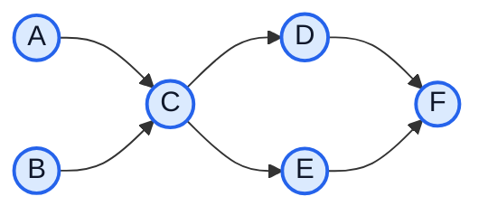

One valid topological order is:

$$
A, B, C, D, E, F
$$

Another valid order is:

$$
B, A, C, E, D, F
$$

Topological order is not always unique.

### DFS-Based Topological Sort

DFS-based topological sort uses one simple rule:

After finishing all outgoing neighbors of a vertex, push that vertex onto a stack.

At the end, reverse the stack or pop from the stack to get the topological order.

#### DFS Walkthrough

Use the same graph and visit vertices alphabetically.

| Step | DFS action | Stack after finishing |
| :---: | :--- | :--- |
| 1 | Start DFS at A, go to C, then D, then F | F, D |
| 2 | Backtrack to C, visit E | F, D, E |
| 3 | Finish C | F, D, E, C |
| 4 | Finish A | F, D, E, C, A |
| 5 | Start DFS at B, C already visited | F, D, E, C, A, B |

Pop stack from right to left:

$$
B, A, C, E, D, F
$$

This is a valid topological order.

### Mermaid Diagram: DFS Finish-Time Idea

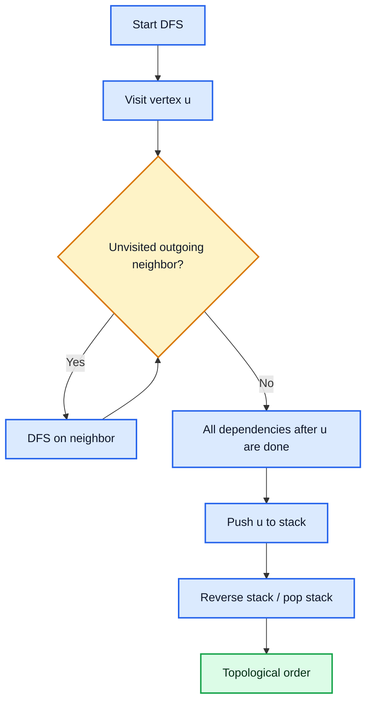

#### Algorithm

```text
TOPOLOGICAL-SORT-DFS(G)
1. create empty stack S
2. mark every vertex as unvisited
3. for each vertex u in G.V:
4.     if u is unvisited:
5.         DFS-VISIT(u)
6. return vertices popped from S

DFS-VISIT(u)
1. mark u as visited
2. for each vertex v in Adj[u]:
3.     if v is unvisited:
4.         DFS-VISIT(v)
5. push u onto S
```

### Kahn's Algorithm - Optional/Self-Study

Kahn's Algorithm solves topological sorting using indegree.

The **indegree** of a vertex is the number of incoming edges.

Main idea:

1. Compute indegree of every vertex.
2. Put all vertices with indegree $0$ into a queue.
3. Repeatedly remove a vertex from the queue and append it to the answer.
4. For each outgoing neighbor, decrease its indegree.
5. If a neighbor's indegree becomes $0$, put it into the queue.
6. If all vertices are output, a topological order exists.
7. If some vertices remain, the graph has a cycle.

```text
KAHN-TOPOLOGICAL-SORT(G)
1. compute indegree[v] for every vertex v
2. create queue Q with all vertices having indegree 0
3. create empty list order
4. while Q is not empty:
5.     u = dequeue Q
6.     append u to order
7.     for each v in Adj[u]:
8.         indegree[v] = indegree[v] - 1
9.         if indegree[v] == 0:
10.            enqueue v into Q
11. if length(order) != |V|:
12.     return "cycle exists, no topological order"
13. return order
```

### Time Complexity

| Algorithm | Time Complexity | Space Complexity | Notes |
| :--- | :---: | :---: | :--- |
| DFS-based topological sort | $\Theta(V+E)$ | $\Theta(V)$ | Uses visited array and stack |
| Kahn's Algorithm | $\Theta(V+E)$ | $\Theta(V)$ | Uses indegree array and queue |

### Applications

Topological sorting is useful when order matters because of dependencies.

| Application | Meaning |
| :--- | :--- |
| Task scheduling | A task can start only after its prerequisite tasks are completed |
| Course prerequisite ordering | A course can be taken only after required previous courses |
| Dependency resolution | A package or module must be installed after its dependencies |

---

## 8. Connected Components

Connected components are used for undirected graphs.

### Connected Graph Definition

An undirected graph is **connected** if every vertex can reach every other vertex.

If at least one pair of vertices cannot reach each other, the graph is disconnected.

### Connected Components in Undirected Graph

A **connected component** is a maximal group of vertices where every vertex can reach every other vertex in that group.

"Maximal" means the group cannot be expanded by adding another reachable vertex.

### Worked Example

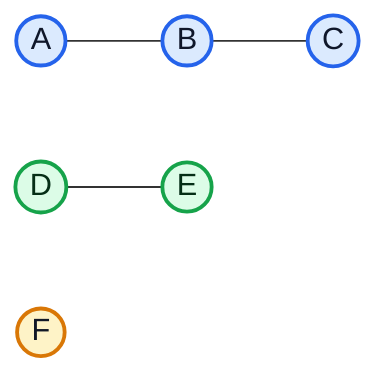

This graph has 3 connected components:

| Component number | Vertices |
| :---: | :--- |
| 1 | A, B, C |
| 2 | D, E |
| 3 | F |

Vertex $F$ is isolated, so it forms a component by itself.

### Finding Connected Components Using DFS/BFS

Main idea:

1. Mark every vertex as unvisited.
2. Start DFS or BFS from an unvisited vertex.
3. All vertices reached in that search belong to the same component.
4. Repeat from the next unvisited vertex.
5. Stop when every vertex has been visited.

### Walkthrough Table

| Step | Start vertex | Search reaches | New component found |
| :---: | :---: | :--- | :--- |
| 1 | A | A, B, C | Component 1 |
| 2 | D | D, E | Component 2 |
| 3 | F | F | Component 3 |

### Algorithm Using DFS

```text
CONNECTED-COMPONENTS(G)
1. mark every vertex as unvisited
2. component_id = 0
3. for each vertex u in G.V:
4.     if u is unvisited:
5.         component_id = component_id + 1
6.         DFS-COMPONENT(u, component_id)

DFS-COMPONENT(u, component_id)
1. mark u as visited
2. assign u to component_id
3. for each neighbor v in Adj[u]:
4.     if v is unvisited:
5.         DFS-COMPONENT(v, component_id)
```

### Algorithm Using BFS

```text
CONNECTED-COMPONENTS-BFS(G)
1. mark every vertex as unvisited
2. component_id = 0
3. for each vertex u in G.V:
4.     if u is unvisited:
5.         component_id = component_id + 1
6.         create queue Q
7.         mark u as visited and enqueue u
8.         while Q is not empty:
9.             x = dequeue Q
10.            assign x to component_id
11.            for each neighbor v in Adj[x]:
12.                if v is unvisited:
13.                    mark v as visited
14.                    enqueue v
```

### Mermaid Diagram: Component Discovery

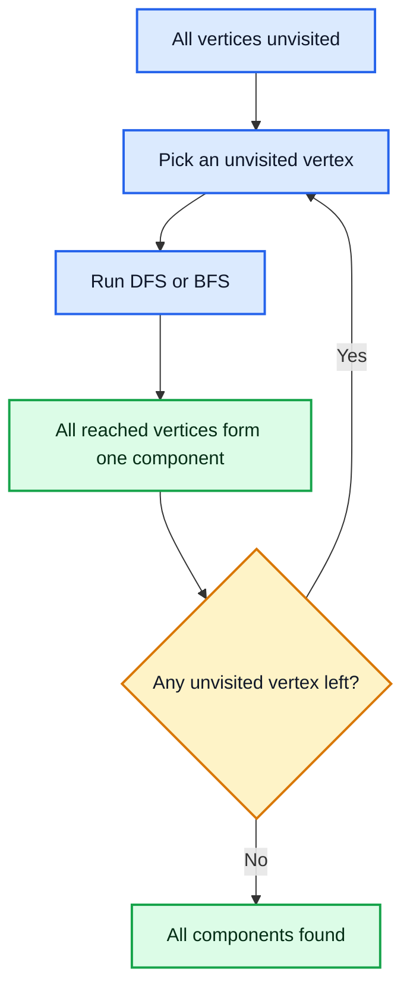

### Complexity Analysis

| Representation | Time Complexity | Space Complexity |
| :--- | :---: | :---: |
| Adjacency list | $\Theta(V+E)$ | $\Theta(V)$ |
| Adjacency matrix | $\Theta(V^2)$ | $\Theta(V)$ |

---

## 9. Strongly Connected Components

Strongly connected components are used for directed graphs.

### Definition

In a directed graph, vertices $u$ and $v$ are **strongly connected** if:

- $u$ can reach $v$.
- $v$ can reach $u$.

A **strongly connected component** or **SCC** is a maximal group of vertices where every vertex can reach every other vertex in the same group.

### Visual Example

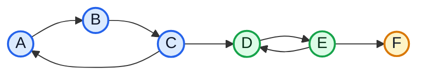

The SCCs are:

| SCC | Vertices | Reason |
| :---: | :--- | :--- |
| 1 | A, B, C | They can reach each other through the cycle $A \to B \to C \to A$ |
| 2 | D, E | $D \to E$ and $E \to D$ |
| 3 | F | No path from F back to other vertices |

### Kosaraju's Algorithm

Kosaraju's Algorithm finds SCCs using two DFS passes.

Main idea:

1. Run DFS on the original graph and push vertices by finish time.
2. Reverse every edge to create the transpose graph $G^T$.
3. Process vertices in decreasing finish time order.
4. Each DFS in the transpose graph gives one SCC.

### Why Reversing Edges Works

Inside one SCC, every vertex can reach every other vertex. Reversing all edges does not break this property inside the SCC.

The finish-time order helps start the second DFS from a source-like component in the transpose graph, so each second-pass DFS stays inside one SCC.

### Kosaraju Walkthrough

Use the visual example above.

If DFS starts at $A$, one possible finish order is:

| Finish sequence | Vertex |
| :---: | :---: |
| 1 | F |
| 2 | E |
| 3 | D |
| 4 | C |
| 5 | B |
| 6 | A |

So the decreasing finish order is:

$$
A, B, C, D, E, F
$$

Now run DFS on the transpose graph in that order.

| Second-pass start | Vertices reached in transpose graph | SCC found |
| :---: | :--- | :--- |
| A | A, C, B | A, B, C |
| D | D, E | D, E |
| F | F | F |

### Mermaid Diagram: Kosaraju Two-Pass Flow

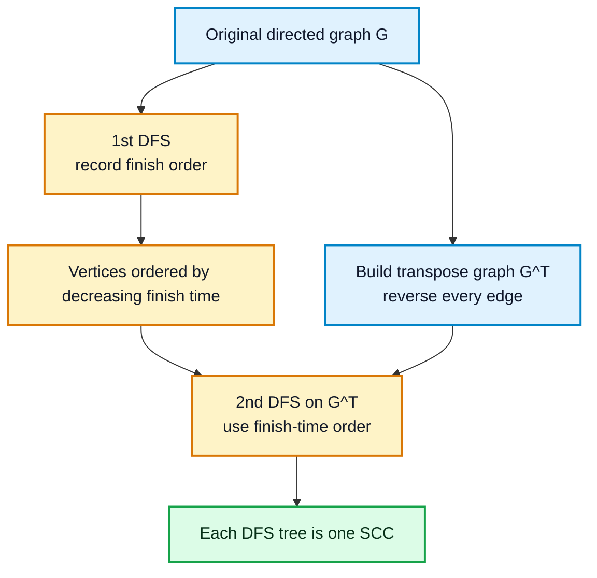

### Algorithm

```text
KOSARAJU-SCC(G)
1. create empty stack S
2. mark every vertex as unvisited
3. for each vertex u in G.V:
4.     if u is unvisited:
5.         DFS-FINISH(u, S)

6. create transpose graph GT by reversing every edge of G
7. mark every vertex as unvisited again
8. while S is not empty:
9.     u = pop S
10.    if u is unvisited:
11.        start a new SCC
12.        DFS-COLLECT(GT, u)
13.        output the SCC

DFS-FINISH(u, S)
1. mark u as visited
2. for each v in Adj[u]:
3.     if v is unvisited:
4.         DFS-FINISH(v, S)
5. push u onto S

DFS-COLLECT(GT, u)
1. mark u as visited
2. add u to the current SCC
3. for each v in AdjT[u]:
4.     if v is unvisited:
5.         DFS-COLLECT(GT, v)
```

### Complexity Analysis

| Part | Complexity |
| :--- | :---: |
| First DFS | $\Theta(V+E)$ |
| Building transpose graph | $\Theta(V+E)$ |
| Second DFS | $\Theta(V+E)$ |
| Total time | $\Theta(V+E)$ |
| Space | $\Theta(V+E)$ |

### Tarjan's Algorithm - Optional/Self-Study

Tarjan's Algorithm also finds SCCs, but it uses only one DFS pass.

It tracks:

- Discovery time of each vertex.
- Low-link value of each vertex.
- A stack of active vertices in the current DFS path.

High-level idea:

1. Run DFS and assign each vertex a discovery number.
2. Maintain `low[u]`, the smallest discovery number reachable from $u$ using DFS tree edges and back edges.
3. Keep active vertices on a stack.
4. If `low[u] == discovery[u]`, then $u$ is the root of an SCC.
5. Pop from the stack until $u$ is popped. Those popped vertices form one SCC.

| Algorithm | DFS passes | Time Complexity | Space Complexity | Study status |
| :--- | :---: | :---: | :---: | :--- |
| Kosaraju | 2 | $\Theta(V+E)$ | $\Theta(V+E)$ | Main topic |
| Tarjan | 1 | $\Theta(V+E)$ | $\Theta(V)$ | Optional/self-study |

---

## 10. Union-Find / Disjoint Set Union for Kruskal Support

Union-Find, also called **Disjoint Set Union** or **DSU**, is a data structure for maintaining groups of elements.

In this chapter, DSU is included only as support for Kruskal's algorithm.

Kruskal's algorithm considers edges in increasing weight order. DSU helps answer this question quickly:

> Are the two endpoints of this edge already in the same component?

If yes, adding the edge creates a cycle, so Kruskal skips it.

If no, adding the edge is safe for connecting two different components, so Kruskal accepts it and unions the two sets.

### DSU Operations

| Operation | Meaning |
| :--- | :--- |
| `MAKE-SET(x)` | Create a new set containing only $x$ |
| `FIND(x)` | Return the representative/root of the set containing $x$ |
| `UNION(x, y)` | Merge the sets containing $x$ and $y$ |

### Two Important Optimizations

| Optimization | Idea | Benefit |
| :--- | :--- | :--- |
| Path compression | During `FIND`, make each visited node point directly to the root | Makes future finds faster |
| Union by rank/size | Attach the smaller or shallower tree under the larger or deeper tree | Keeps the tree height small |

### Worked Example for Kruskal Support

Suppose Kruskal considers these undirected weighted edges in sorted order:

| Order | Edge | Weight | DSU decision |
| :---: | :---: | :---: | :--- |
| 1 | A-B | 1 | Different sets, accept and union A,B |
| 2 | C-D | 2 | Different sets, accept and union C,D |
| 3 | B-C | 3 | Different sets, accept and union B,C |
| 4 | A-C | 4 | Same set, reject because it creates a cycle |
| 5 | D-E | 5 | Different sets, accept and union D,E |

Set changes:

| Step | Accepted edge? | Current sets |
| :---: | :---: | :--- |
| Initial | - | {A}, {B}, {C}, {D}, {E} |
| 1 | A-B | {A,B}, {C}, {D}, {E} |
| 2 | C-D | {A,B}, {C,D}, {E} |
| 3 | B-C | {A,B,C,D}, {E} |
| 4 | A-C rejected | {A,B,C,D}, {E} |
| 5 | D-E | {A,B,C,D,E} |

### Mermaid Diagram: DSU Cycle Check

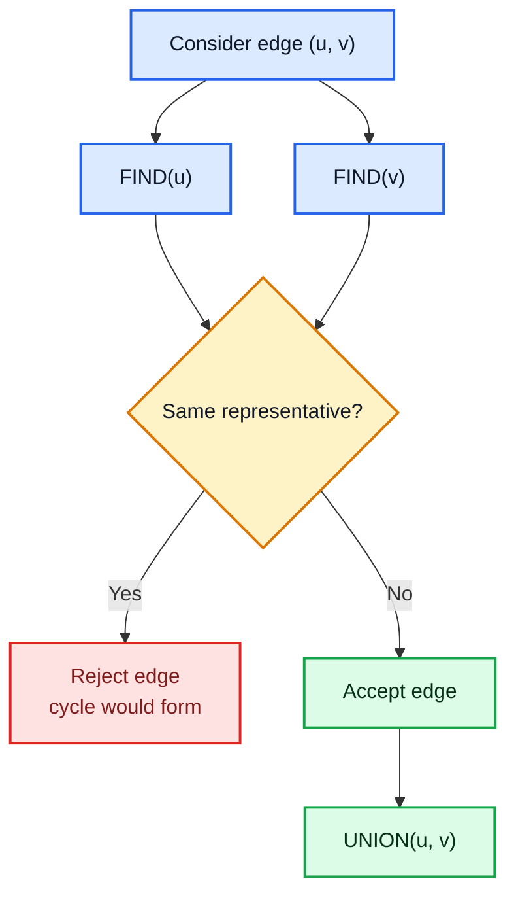

### Algorithm

```text
MAKE-SET(x)
1. parent[x] = x
2. rank[x] = 0

FIND(x)
1. if parent[x] != x:
2.     parent[x] = FIND(parent[x])
3. return parent[x]

UNION(x, y)
1. rootX = FIND(x)
2. rootY = FIND(y)
3. if rootX == rootY:
4.     return
5. if rank[rootX] < rank[rootY]:
6.     parent[rootX] = rootY
7. else if rank[rootX] > rank[rootY]:
8.     parent[rootY] = rootX
9. else:
10.    parent[rootY] = rootX
11.    rank[rootX] = rank[rootX] + 1
```

### Complexity Analysis

With path compression and union by rank/size:

| Operation | Amortized Complexity |
| :--- | :---: |
| `MAKE-SET` | $\Theta(1)$ |
| `FIND` | $O(\alpha(V))$ |
| `UNION` | $O(\alpha(V))$ |

$\alpha(V)$ is the inverse Ackermann function. For practical input sizes, it behaves almost like a constant.

For Kruskal support:

| Part | Complexity |
| :--- | :---: |
| Sorting edges | $\Theta(E \log E)$ |
| DSU operations | $O(E\alpha(V))$ |
| Overall Kruskal support cost | $\Theta(E \log E)$ dominated by sorting |

---

## Analyze Time Complexity of Above Topics

The following table summarizes the major complexity results from this chapter.

| Topic / Algorithm | Graph type | Time Complexity | Space Complexity | Main reason |
| :--- | :--- | :---: | :---: | :--- |
| Adjacency matrix | Any graph | Build: $\Theta(V^2)$ | $\Theta(V^2)$ | Stores every possible vertex pair |
| Adjacency list | Any graph | Build: $\Theta(V+E)$ | $\Theta(V+E)$ | Stores actual vertices and edges |
| BFS shortest path | Unweighted graph | $\Theta(V+E)$ | $\Theta(V)$ | Visits each vertex and edge once |
| Bellman-Ford | Weighted directed graph | $\Theta(VE)$ | $\Theta(V)$ | Relaxes all edges for $V-1$ rounds |
| DFS topological sort | DAG | $\Theta(V+E)$ | $\Theta(V)$ | DFS visits each vertex and edge once |
| Kahn's Algorithm | DAG | $\Theta(V+E)$ | $\Theta(V)$ | Processes each vertex and edge once |
| Connected components | Undirected graph | $\Theta(V+E)$ | $\Theta(V)$ | Repeated DFS/BFS still visits each edge once |
| Kosaraju SCC | Directed graph | $\Theta(V+E)$ | $\Theta(V+E)$ | Two DFS passes plus transpose graph |
| Tarjan SCC | Directed graph | $\Theta(V+E)$ | $\Theta(V)$ | One DFS pass with stack and low-link values |
| Union-Find / DSU | Disjoint sets | $O(\alpha(V))$ per operation | $\Theta(V)$ | Path compression and union by rank/size |

### Final Revision Checklist

Before moving to the next chapter, make sure you can explain:

- Why every tree is a graph but every graph is not a tree.
- The difference between weighted and unweighted graphs.
- The difference between directed and undirected graphs.
- Why a DAG is needed for topological sorting.
- How adjacency matrix and adjacency list store the same graph differently.
- Why BFS gives shortest paths only for unweighted graphs.
- How Bellman-Ford uses edge relaxation.
- Why Bellman-Ford needs $|V|-1$ relaxation rounds.
- How DFS-based topological sort uses finish time.
- How connected components are found in an undirected graph.
- How Kosaraju's Algorithm finds SCCs using two DFS passes.
- How DSU helps Kruskal reject cycle-forming edges.

---

[Previous: Chapter 10 - Branch and Bound](../Chapter%2010%20-%20Branch%20and%20Bound/README.md) | [Home](../README.md) | [Next: Chapter 12 - Flow Algorithms](../Chapter%2012%20-%20Flow%20Algorithms/README.md)
