# Chapter 11: Graph Algorithms

[Previous: Chapter 10 - Branch and Bound](../Chapter%2010%20-%20Branch%20and%20Bound/README.md) | [Home](../README.md) | [Next: Chapter 12 - Flow Algorithms](../Chapter%2012%20-%20Flow%20Algorithms/README.md)

---

Graph Algorithms study how to model relationships and solve problems on connected objects. A graph can represent cities connected by roads, courses connected by prerequisites, computers connected in a network, or tasks connected by dependencies.

This chapter keeps only the requested graph theory and graph algorithm topics. Each topic is explained in a simple sequence with definitions, diagrams, walkthrough tables, algorithm sketches, and complexity analysis.

---

## Table of Contents

1. [Graph Algorithms](#graph-algorithms)
   - [Classroom Problem-Solving Sequence](#classroom-problem-solving-sequence)
2. [Tree vs Graph](#1-tree-vs-graph)
3. [Graph Categories](#2-graph-categories)
   - [Weighted vs Unweighted](#weighted-vs-unweighted)
   - [Directed vs Undirected](#directed-vs-undirected)
   - [Cyclic vs Acyclic](#cyclic-vs-acyclic)
4. [Graph Representation](#3-graph-representation)
   - [Adjacency Matrix](#adjacency-matrix)
   - [Adjacency List](#adjacency-list)
5. [Shortest Path Problem Overview](#4-shortest-path-problem-overview)
6. [BFS for Unweighted Shortest Path](#5-bfs-for-unweighted-shortest-path)
7. [Single Source Shortest Path - Dijkstra's Algorithm](#6-single-source-shortest-path---dijkstras-algorithm)
   - [Relaxation Condition](#relaxation-condition)
   - [Worked Example 1: Undirected Graph](#worked-example-1-undirected-graph)
   - [Worked Example 2: Directed Graph](#worked-example-2-directed-graph)
8. [Single Source Shortest Path - Bellman-Ford Algorithm](#7-single-source-shortest-path---bellman-ford-algorithm)
9. [Shortest Path (All Pairs) - Floyd-Warshall Algorithm](#8-shortest-path-all-pairs---floyd-warshall-algorithm)
   - [Working with Negative Edge Weights](#working-with-negative-edge-weights)
   - [Classroom Problem: Four-Vertex Graph with Negative Edges](#classroom-problem-four-vertex-graph-with-negative-edges)
10. [Topological Sorting](#9-topological-sorting)
   - [Definition](#definition)
   - [DAG](#dag)
   - [DFS-Based Topological Sort](#dfs-based-topological-sort)
   - [Kahn's Algorithm - Optional/Self-Study](#kahns-algorithm---optionalself-study)
   - [Time Complexity](#time-complexity)
   - [Applications](#applications)
11. [Connected Components](#10-connected-components)
12. [Strongly Connected Components](#11-strongly-connected-components)
	- [Kosaraju's Algorithm](#kosarajus-algorithm)
	- [Tarjan's Algorithm - Optional/Self-Study](#tarjans-algorithm---optionalself-study)
13. [Union-Find / Disjoint Set Union for Kruskal Support](#12-union-find--disjoint-set-union-for-kruskal-support)
14. [Analyze Time Complexity of Above Topics](#analyze-time-complexity-of-above-topics)

---

## Graph Algorithms

A **graph** is a mathematical structure used to represent relationships.

A graph is written as:

$$
G=(V,E)
$$

Where:

- $V$ is the set of **vertices** or **nodes**.
- $E$ is the set of **edges** or **connections** between vertices.

Example:

- Vertices: $V = \{A,B,C,D\}$
- Edges: $E = \{(A,B),(A,C),(B,D),(C,D)\}$

Graph algorithms usually answer questions like:

- Can one vertex reach another vertex?
- What is the shortest path from a source vertex?
- Does the graph contain a cycle?
- In what order should dependent tasks be completed?
- Which vertices belong to the same connected group?
- Can adding an edge create a cycle?

### Classroom Problem-Solving Sequence

For the worked graph questions in class, the answer is written as a trace rather than only giving the final result. Use this order for the matching topics in this chapter:

1. **Read the graph:** state whether it is directed or undirected, weighted or unweighted, and list the relevant source or starting vertex.
2. **Write the representation:** record the adjacency list first; construct an adjacency matrix only when the question asks for it or when matrix updates are required.
3. **Initialize the working record:** use a queue and `visited`/`dist` values for BFS, a DFS stack or finish order for DFS-based problems, component labels for components, or disjoint sets for Kruskal support.
4. **Trace one decision at a time:** after each dequeue, DFS finish, edge relaxation, or accepted/rejected edge, write the updated queue, stack, table, component, or set.
5. **State the final answer:** give the traversal/order, distances, components, or selected edges, then give the applicable time complexity.

This sequence is intentional: it mirrors the board and notebook method used for the examples, makes each decision checkable, and avoids skipping directly to an answer.

### Recommended Study Sequence

Study this chapter in the following order:

1. Understand what graphs are and how they differ from trees.
2. Learn graph categories: weighted, unweighted, directed, undirected, cyclic, and acyclic.
3. Learn how to store graphs using adjacency matrix and adjacency list.
4. Use BFS to solve shortest path in an unweighted graph.
5. Learn the general shortest path idea, then Dijkstra's Algorithm for weighted graphs with nonnegative edges.
6. Learn Bellman-Ford for weighted graphs that may contain negative edges.
7. Learn Floyd-Warshall to find shortest paths between all pairs of vertices at once.
8. Learn topological sorting for dependency ordering in a DAG.
9. Learn connected components in undirected graphs.
10. Learn strongly connected components in directed graphs.
11. Learn Union-Find / DSU as support for Kruskal's algorithm.

### Visual Map: Graph Algorithm Roadmap


```mermaid
flowchart TB
	Graph["Graph G = (V, E)"] --> Types["Graph categories"]
	Graph --> Store["Graph representation"]
	Graph --> Traverse["Traversal-based algorithms"]
	Graph --> Weighted["Weighted path algorithms"]
	Graph --> Sets["Set-based structure"]

	Types --> T1["Weighted or unweighted"]
	Types --> T2["Directed or undirected"]
	Types --> T3["Cyclic or acyclic"]

	Store --> Matrix["Adjacency matrix"]
	Store --> List["Adjacency list"]

	Traverse --> BFS["BFS shortest path<br/>unweighted graph"]
	Traverse --> Topo["Topological sorting<br/>DAG only"]
	Traverse --> CC["Connected components<br/>undirected graph"]
	Traverse --> SCC["Strongly connected components<br/>directed graph"]

	Weighted --> Dijkstra["Dijkstra's Algorithm<br/>nonnegative edge weights"]
	Weighted --> BF["Bellman-Ford<br/>handles negative edges"]
	Weighted --> FW["Floyd-Warshall<br/>all-pairs shortest paths"]
	Sets --> DSU["Union-Find / DSU<br/>cycle support for Kruskal"]

	classDef root fill:#e0f2fe,stroke:#0284c7,stroke-width:2px,color:#0f172a;
	classDef group fill:#fef3c7,stroke:#d97706,stroke-width:2px,color:#111827;
	classDef algo fill:#dcfce7,stroke:#16a34a,stroke-width:2px,color:#052e16;
	classDef detail fill:#f1f5f9,stroke:#64748b,stroke-dasharray: 5 5,color:#0f172a;
	class Graph root;
	class Types,Store,Traverse,Weighted,Sets group;
	class BFS,Topo,CC,SCC,Dijkstra,BF,FW,DSU algo;
	class T1,T2,T3,Matrix,List detail;
```

---

## 1. Tree vs Graph

A **tree** is a special type of graph. Every tree is a graph, but every graph is not a tree.

The easiest way to remember this:

- A tree is connected and has no cycle.
- A general graph may be disconnected and may contain cycles.

| Feature | Tree | Graph |
| :--- | :--- | :--- |
| Meaning | A connected acyclic structure | A general node-edge structure |
| Cycle allowed? | No | May or may not have cycles |
| Connected? | Always connected | May be connected or disconnected |
| Number of edges | Exactly $|V|-1$ for $|V|$ vertices | Can be from $0$ up to many edges |
| Path between two vertices | Exactly one simple path | May have zero, one, or many paths |
| Root needed? | Often rooted in applications | Usually no root unless defined |

### Example

For $4$ vertices:

- A tree must have $4-1=3$ edges and no cycle.
- A graph may have $0$, $1$, $2$, $3$, or more edges depending on the category.

### Visual Map: Tree Is a Special Graph

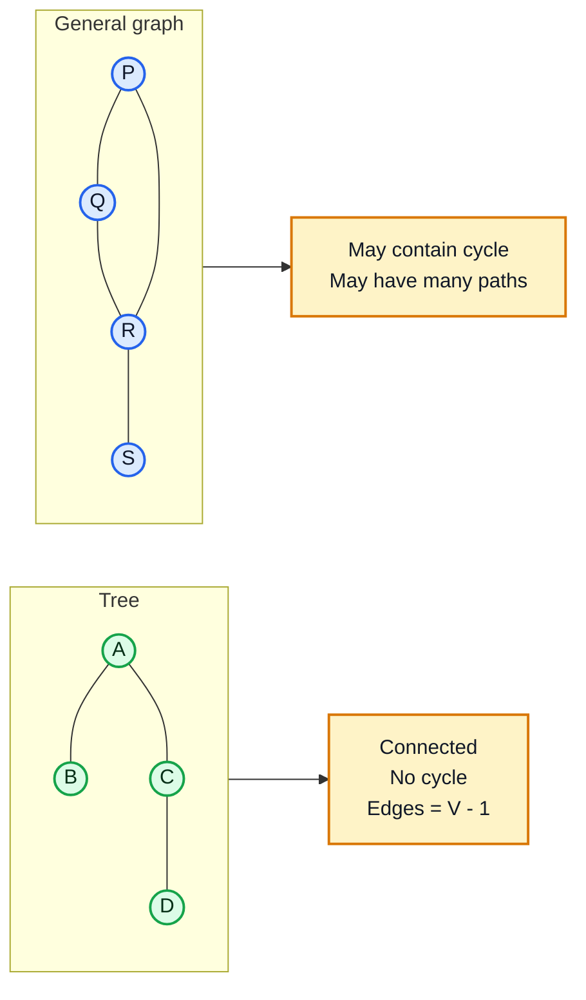
```mermaid
flowchart LR
	subgraph Tree[Tree]
		A((A)) --- B((B))
		A --- C((C))
		C --- D((D))
	end

	subgraph General[General graph]
		P((P)) --- Q((Q))
		Q --- R((R))
		R --- P
		R --- S((S))
	end

	Tree --> Note1["Connected<br/>No cycle<br/>Edges = V - 1"]
	General --> Note2["May contain cycle<br/>May have many paths"]

	classDef tree fill:#dcfce7,stroke:#16a34a,stroke-width:2px,color:#052e16;
	classDef graphNode fill:#dbeafe,stroke:#2563eb,stroke-width:2px,color:#0f172a;
	classDef note fill:#fef3c7,stroke:#d97706,stroke-width:2px,color:#111827;
	class A,B,C,D tree;
	class P,Q,R,S graphNode;
	class Note1,Note2 note;
```

---

## 2. Graph Categories

Graph categories describe what type of edges the graph has and what kind of algorithms are suitable for it.

### Weighted vs Unweighted

An **unweighted graph** treats every edge as having the same cost.

Example: friendship connection.

A **weighted graph** gives a value or cost to each edge.

Example: road distance, flight price, network delay.

| Type | Edge meaning | Example | Common shortest path idea |
| :--- | :--- | :--- | :--- |
| Unweighted graph | Every edge has equal cost | Social network | BFS |
| Weighted graph | Each edge has a weight/cost | Road map | Bellman-Ford for this chapter |

### Directed vs Undirected

An **undirected graph** has edges that work both ways.

If $A-B$ exists, then $A$ can reach $B$ and $B$ can reach $A$ through that edge.

A **directed graph** has edges with direction.

If $A \to B$ exists, then $A$ can go to $B$, but $B$ cannot automatically go to $A$.

| Type | Edge notation | Meaning | Example |
| :--- | :--- | :--- | :--- |
| Undirected | $(A,B)$ | Two-way connection | Roads with two-way movement |
| Directed | $A \to B$ | One-way connection | Course prerequisite, one-way road |

### Cyclic vs Acyclic

A **cycle** is a path that starts and ends at the same vertex without repeating other vertices.

A **cyclic graph** contains at least one cycle.

An **acyclic graph** contains no cycle.

A **DAG** means **Directed Acyclic Graph**. DAGs are very important for topological sorting.

| Type | Cycle present? | Example use |
| :--- | :---: | :--- |
| Cyclic graph | Yes | Routes with loops, mutual dependencies |
| Acyclic graph | No | Trees, dependency chains |
| DAG | No directed cycle | Course prerequisite ordering, task scheduling |

### Visual Map: Main Graph Categories

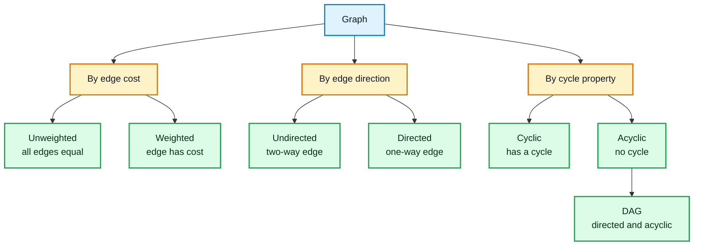
```mermaid
flowchart TB
	G["Graph"] --> Weight["By edge cost"]
	G --> Direction["By edge direction"]
	G --> Cycle["By cycle property"]

	Weight --> UW["Unweighted<br/>all edges equal"]
	Weight --> W["Weighted<br/>edge has cost"]

	Direction --> UD["Undirected<br/>two-way edge"]
	Direction --> D["Directed<br/>one-way edge"]

	Cycle --> CY["Cyclic<br/>has a cycle"]
	Cycle --> AC["Acyclic<br/>no cycle"]
	AC --> DAG["DAG<br/>directed and acyclic"]

	classDef root fill:#e0f2fe,stroke:#0284c7,stroke-width:2px,color:#0f172a;
	classDef category fill:#fef3c7,stroke:#d97706,stroke-width:2px,color:#111827;
	classDef type fill:#dcfce7,stroke:#16a34a,stroke-width:2px,color:#052e16;
	class G root;
	class Weight,Direction,Cycle category;
	class UW,W,UD,D,CY,AC,DAG type;
```

---

## 3. Graph Representation

Before running any graph algorithm, the graph must be stored in memory.

The two most common representations are:

1. Adjacency Matrix
2. Adjacency List

Use this example graph for both representations:

$$
V = \{A,B,C,D\}
$$

$$
E = \{(A,B),(A,C),(B,D),(C,D)\}
$$

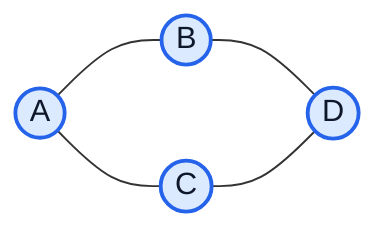
```mermaid
graph LR
	A((A)) --- B((B))
	A --- C((C))
	B --- D((D))
	C --- D

	classDef node fill:#dbeafe,stroke:#2563eb,stroke-width:2px,color:#0f172a;
	class A,B,C,D node;
```

### Adjacency Matrix

For a classroom matrix question, first fix the row/column order and then fill one source vertex per row. For an unweighted graph, put `1` exactly where the corresponding adjacency-list edge exists; for an undirected graph, the matching entry on the other side of the diagonal must be the same.

An **adjacency matrix** uses a $|V| \times |V|$ table.

For an unweighted graph:

- Matrix value is `1` if an edge exists.
- Matrix value is `0` if no edge exists.

For a weighted graph:

- Matrix value stores the edge weight.
- A special value such as $\infty$ may be used when no edge exists.

For the example undirected graph:

| From / To | A | B | C | D |
| :---: | :---: | :---: | :---: | :---: |
| A | 0 | 1 | 1 | 0 |
| B | 1 | 0 | 0 | 1 |
| C | 1 | 0 | 0 | 1 |
| D | 0 | 1 | 1 | 0 |

Because the graph is undirected, the matrix is symmetric.

**Advantages:**

- Easy to check if an edge exists between two vertices.
- Edge lookup is $O(1)$.
- Good for dense graphs.

**Disadvantages:**

- Uses $\Theta(V^2)$ space.
- Wastes space for sparse graphs.
- To list all neighbors of one vertex, a full row must be scanned.

### Adjacency List

An **adjacency list** stores each vertex with the list of its neighbors.

For the same undirected graph:

| Vertex | Neighbor list |
| :---: | :--- |
| A | B, C |
| B | A, D |
| C | A, D |
| D | B, C |

For a weighted graph, each neighbor can be stored with its edge weight.

Example:

```text
A: (B, 4), (C, 2)
B: (D, 5)
C: (D, 1)
D: empty
```

**Advantages:**

- Uses $\Theta(V+E)$ space.
- Efficient for sparse graphs.
- Easy to iterate over neighbors.

**Disadvantages:**

- Checking whether a specific edge exists may take time proportional to the degree of the vertex.
- Slightly less direct than a matrix for edge lookup.

### Representation Comparison

| Operation / Feature | Adjacency Matrix | Adjacency List |
| :--- | :---: | :---: |
| Space | $\Theta(V^2)$ | $\Theta(V+E)$ |
| Check edge $(u,v)$ | $O(1)$ | $O(deg(u))$ |
| Iterate all neighbors of $u$ | $O(V)$ | $O(deg(u))$ |
| Best for | Dense graphs | Sparse graphs |
| Used often with | Simple edge lookup | BFS, DFS, components, topological sort |

### Visual Map: Matrix vs List

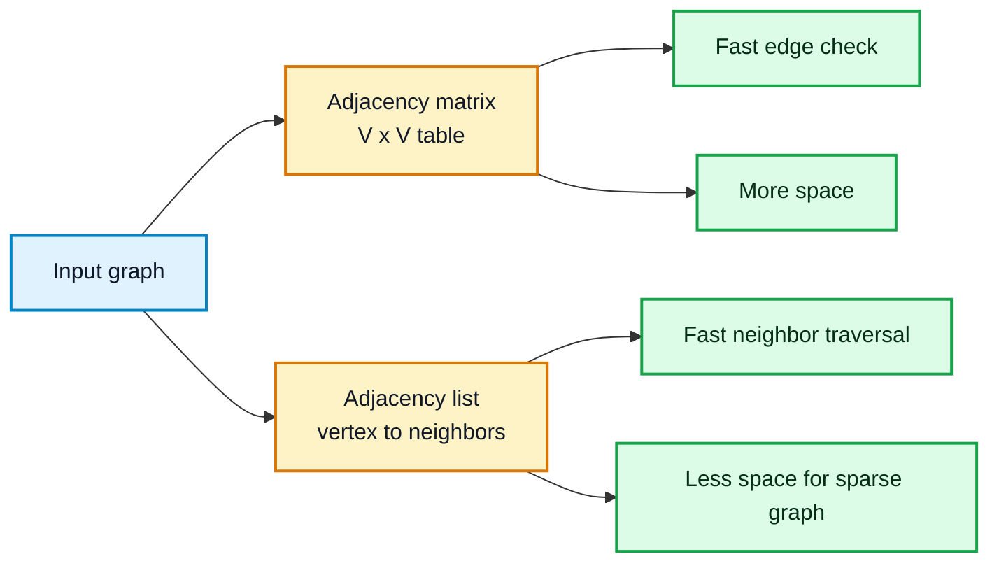
```mermaid
flowchart LR
	GraphInput["Input graph"] --> Matrix["Adjacency matrix<br/>V x V table"]
	GraphInput --> List["Adjacency list<br/>vertex to neighbors"]

	Matrix --> M1["Fast edge check"]
	Matrix --> M2["More space"]
	List --> L1["Fast neighbor traversal"]
	List --> L2["Less space for sparse graph"]

	classDef input fill:#e0f2fe,stroke:#0284c7,stroke-width:2px,color:#0f172a;
	classDef rep fill:#fef3c7,stroke:#d97706,stroke-width:2px,color:#111827;
	classDef note fill:#dcfce7,stroke:#16a34a,stroke-width:2px,color:#052e16;
	class GraphInput input;
	class Matrix,List rep;
	class M1,M2,L1,L2 note;
```

---

## 4. Shortest Path Problem Overview

A **path** is a sequence of vertices connected by edges.

A **shortest path** is a path with minimum total cost from one vertex to another.

The meaning of "minimum cost" depends on the graph:

- In an unweighted graph, cost means the number of edges.
- In a weighted graph, cost means the sum of edge weights.

### Main Shortest Path Types

| Problem type | Question | Algorithm in this chapter |
| :--- | :--- | :--- |
| Single pair shortest path | What is the shortest path from $s$ to $t$? | BFS for unweighted graph |
| Single source shortest path | What are the shortest paths from $s$ to all vertices? | BFS, Dijkstra's Algorithm, or Bellman-Ford |
| All-pairs shortest path | What are the shortest paths between every pair of vertices? | Floyd-Warshall |
| Weighted graph with only nonnegative edges | Which algorithm is fastest? | Dijkstra's Algorithm |
| Weighted graph with negative edges | Can shortest paths still be found? | Bellman-Ford (single source) or Floyd-Warshall (all pairs) |

### Algorithm Selection in This Chapter

| Graph condition | Suitable algorithm here | Reason |
| :--- | :--- | :--- |
| Unweighted graph | BFS | BFS explores by distance layers |
| Weighted graph with only nonnegative edges | Dijkstra's Algorithm | Greedily finalizes the nearest unvisited vertex first |
| Weighted graph with negative edges, single source | Bellman-Ford | Handles negative edges if there is no reachable negative cycle |
| Weighted graph with negative edges, all pairs needed | Floyd-Warshall | Computes every pair's shortest path in one $\Theta(n^3)$ pass |
| Graph with reachable negative cycle | No finite shortest path | Distance can keep decreasing forever |

### Visual Map: Shortest Path Choice

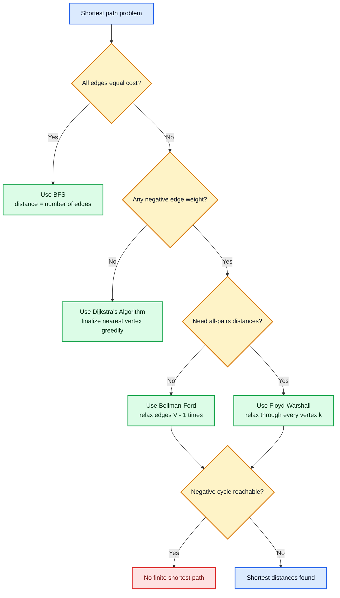
```mermaid
flowchart TD
	Start["Shortest path problem"] --> Unweighted{"All edges equal cost?"}
	Unweighted -->|Yes| BFS["Use BFS<br/>distance = number of edges"]
	Unweighted -->|No| Negative{"Any negative edge weight?"}
	Negative -->|No| Dijkstra["Use Dijkstra's Algorithm<br/>finalize nearest vertex greedily"]
	Negative -->|Yes| AllPairs{"Need all-pairs distances?"}
	AllPairs -->|Yes| FW["Use Floyd-Warshall<br/>relax through every vertex k"]
	AllPairs -->|No| BF["Use Bellman-Ford<br/>relax edges V - 1 times"]
	BF --> Cycle{"Negative cycle reachable?"}
	FW --> Cycle
	Cycle -->|Yes| Bad["No finite shortest path"]
	Cycle -->|No| Dist["Shortest distances found"]

	classDef decision fill:#fef3c7,stroke:#d97706,stroke-width:2px,color:#111827;
	classDef algo fill:#dcfce7,stroke:#16a34a,stroke-width:2px,color:#052e16;
	classDef warn fill:#fee2e2,stroke:#dc2626,stroke-width:2px,color:#7f1d1d;
	classDef result fill:#dbeafe,stroke:#2563eb,stroke-width:2px,color:#0f172a;
	class Start,Dist result;
	class Unweighted,Negative,Cycle,AllPairs decision;
	class BFS,Dijkstra,BF,FW algo;
	class Bad warn;
```

---

## 5. BFS for Unweighted Shortest Path

### Problem Statement

Given an unweighted graph and a source vertex $s$, find the shortest distance from $s$ to every reachable vertex.

Here, distance means the minimum number of edges.

### Inputs and Output

- **Input:** graph $G=(V,E)$ and source vertex $s$.
- **Output:** distance array `dist` and optional parent array `parent` for reconstructing shortest paths.

### Main Idea

BFS uses a queue and explores the graph level by level.

- Level 0: source vertex.
- Level 1: vertices reachable using 1 edge.
- Level 2: vertices reachable using 2 edges.
- Continue until no new vertex remains.

The first time BFS visits a vertex, it has found the shortest unweighted distance to that vertex.

### Worked Example

Find shortest paths from source $S$.

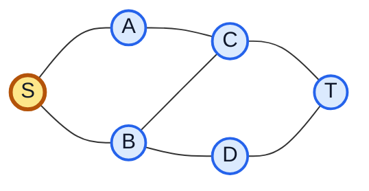
```mermaid
graph LR
	S((S)) --- A((A))
	S --- B((B))
	A --- C((C))
	B --- C
	B --- D((D))
	C --- T((T))
	D --- T

	classDef source fill:#fde68a,stroke:#b45309,stroke-width:3px,color:#111827;
	classDef node fill:#dbeafe,stroke:#2563eb,stroke-width:2px,color:#0f172a;
	class S source;
	class A,B,C,D,T node;
```

Assume neighbors are processed alphabetically. Mark a vertex when it is enqueued so that it is not added a second time. The table uses the same queue-trace format as the BFS traversal section: the queue is shown after the current vertex is processed, with the front in bold.

| Vertices visited | Vertices in queue (front first) | Vertex traversal done |
| :--- | :--- | :---: |
| S, A, B | **A**, B | S |
| S, A, B, C | **B**, C | A |
| S, A, B, C, D | **C**, D | B |
| S, A, B, C, D, T | **D**, T | C |
| — | **T** | D |
| — | empty | T |

The distance is assigned when a vertex first enters the queue: $dist[A]=dist[B]=1$, $dist[C]=dist[D]=2$, and $dist[T]=3$.

Final distances from $S$:

| Vertex | S | A | B | C | D | T |
| :---: | :---: | :---: | :---: | :---: | :---: | :---: |
| Distance | 0 | 1 | 1 | 2 | 2 | 3 |

One shortest path from $S$ to $T$ is:

$$
S \to A \to C \to T
$$

This path uses $3$ edges, so the shortest distance is $3$.

### Mermaid Diagram: BFS Layer Expansion

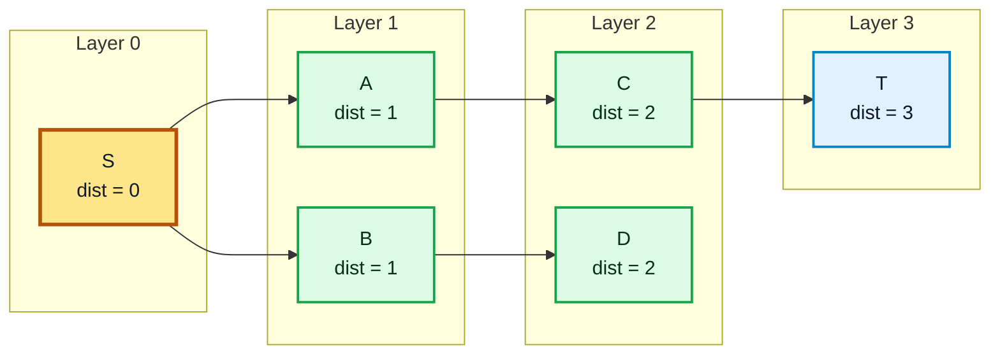
```mermaid
flowchart LR
	subgraph L0["Layer 0"]
		S["S<br/>dist = 0"]
	end

	subgraph L1["Layer 1"]
		A["A<br/>dist = 1"]
		B["B<br/>dist = 1"]
	end

	subgraph L2["Layer 2"]
		C["C<br/>dist = 2"]
		D["D<br/>dist = 2"]
	end

	subgraph L3["Layer 3"]
		T["T<br/>dist = 3"]
	end

	S --> A
	S --> B
	A --> C
	B --> D
	C --> T

	classDef source fill:#fde68a,stroke:#b45309,stroke-width:3px,color:#111827;
	classDef layer fill:#dcfce7,stroke:#16a34a,stroke-width:2px,color:#052e16;
	classDef target fill:#e0f2fe,stroke:#0284c7,stroke-width:2px,color:#0f172a;
	class S source;
	class A,B,C,D layer;
	class T target;
```

### Algorithm

```text
BFS-SHORTEST-PATH(G, s)
1. for each vertex v in G.V:
2.     dist[v] = infinity
3.     parent[v] = NIL
4. dist[s] = 0
5. create an empty queue Q
6. enqueue s into Q
7. while Q is not empty:
8.     u = dequeue Q
9.     for each neighbor v of u:
10.        if dist[v] == infinity:
11.            dist[v] = dist[u] + 1
12.            parent[v] = u
13.            enqueue v into Q
14. return dist, parent
```

### Complexity Analysis

| Representation | Time Complexity | Space Complexity | Reason |
| :--- | :---: | :---: | :--- |
| Adjacency list | $\Theta(V+E)$ | $\Theta(V)$ | Every vertex and edge is processed at most a constant number of times |
| Adjacency matrix | $\Theta(V^2)$ | $\Theta(V)$ | For every vertex, a full matrix row may be scanned |

---

## 6. Single Source Shortest Path - Dijkstra's Algorithm

### Problem Statement

Given a weighted graph (directed or undirected) with **nonnegative** edge weights and a source vertex $s$, find the shortest distance from $s$ to every other reachable vertex.

**Dijkstra's Algorithm** is a greedy single-source shortest path algorithm: at every step it finalizes the unvisited vertex with the smallest tentative distance, and that distance is never revisited or improved later.

### Inputs and Output

- **Input:** weighted graph $G=(V,E)$ with edge cost function $c(u,v) \ge 0$, and source vertex $s$.
- **Output:** shortest distance $d(v)$ for every vertex $v$, plus a parent array to reconstruct the shortest paths.

### Greedy Rule

```text
Always finalize the unvisited vertex with the smallest tentative distance.
```

The algorithm is correct because with nonnegative edge weights, no later path can make a finalized vertex cheaper.

### Relaxation Condition

Every time a vertex $u$ is finalized, every edge $(u, v)$ leaving $u$ is **relaxed** using this test:

$$
\text{if } \big(d(u) + c(u,v) < d(v)\big) \implies d(v) = d(u) + c(u,v)
$$

In words: if going through $u$ gives a cheaper way to reach $v$ than the current best known distance $d(v)$, replace $d(v)$ with that cheaper value (and remember $u$ as the new parent of $v$). If the new total is **not** smaller, $d(v)$ is left unchanged.

For example, relaxing the source's own first edge $A \to B$ with weight $14$ when $d(A)=0$ and $d(B)=\infty$ gives:

$$
0 + 14 = 14 \quad < \infty \quad \Rightarrow \quad d(B) = 14
$$

### Important Condition

Dijkstra's Algorithm requires all edge weights to be nonnegative.

If negative edges exist, the greedy choice may be wrong because a vertex finalized early could later receive a cheaper path through a negative edge. Bellman-Ford (next section) removes this restriction.

### Worked Example 1: Undirected Graph

Source vertex: $A$. This example finalizes one vertex per step, always picking the **unvisited vertex with the smallest tentative distance**, then relaxing all of its edges.

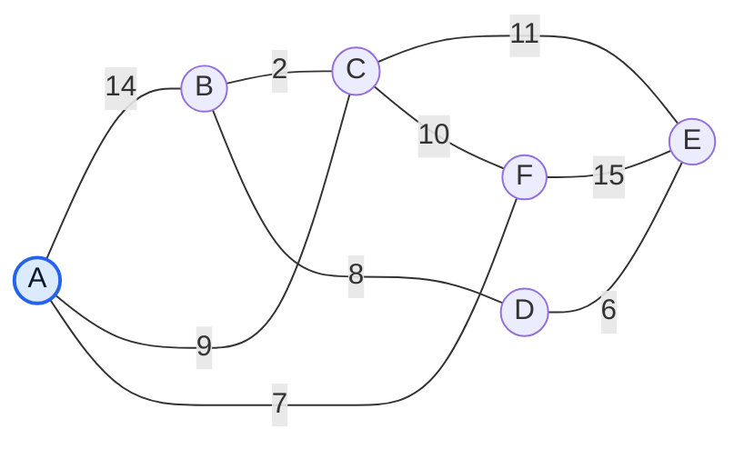
```mermaid
flowchart LR
	A((A)) ---|14| B((B))
	A ---|9| C((C))
	A ---|7| F((F))
	B ---|2| C
	B ---|8| D((D))
	C ---|11| E((E))
	C ---|10| F
	D ---|6| E
	F ---|15| E

	classDef src fill:#dbeafe,stroke:#2563eb,stroke-width:2px,color:#0f172a;
	class A src;
```

**Step 0 - Initialize.** $d(A) = 0$, every other vertex starts at $\infty$.

**Step 1 - Finalize $A$ (distance 0).** Relax all edges out of $A$:

- $0 + 14 = 14 < \infty \Rightarrow d(B) = 14$
- $0 + 9 = 9 < \infty \Rightarrow d(C) = 9$
- $0 + 7 = 7 < \infty \Rightarrow d(F) = 7$

**Step 2 - Smallest tentative distance is $F = 7$, so finalize $F$.** Relax edges out of $F$ (to $C$ and $E$):

- $7 + 10 = 17$, compare with $d(C) = 9$. Since $17 \not< 9$, $C$ stays $9$.
- $7 + 15 = 22 < \infty \Rightarrow d(E) = 22$

**Step 3 - Smallest remaining is $C = 9$, so finalize $C$.** Relax edges out of $C$ (to $B$ and $E$):

- $9 + 2 = 11 < 14 \Rightarrow d(B) = 11$
- $9 + 11 = 20 < 22 \Rightarrow d(E) = 20$

**Step 4 - Smallest remaining is $B = 11$, so finalize $B$.** Relax edges out of $B$ (to $D$):

- $11 + 8 = 19 < \infty \Rightarrow d(D) = 19$

**Step 5 - Smallest remaining is $D = 19$, so finalize $D$.** Relax edges out of $D$ (to $E$):

- $19 + 6 = 25$, compare with $d(E) = 20$. Since $25 \not< 20$, $E$ stays $20$.

**Step 6 - Only $E = 20$ remains, so finalize $E$.** All vertices are now visited.

Distance table, one row per finalized (visited) vertex, in the exact order they were finalized:

| Visited $\downarrow$ | A | B | C | D | E | F |
| :---: | :---: | :---: | :---: | :---: | :---: | :---: |
| **A** | **0** | $\infty$ | $\infty$ | $\infty$ | $\infty$ | $\infty$ |
| **F** | | 14 | 9 | $\infty$ | $\infty$ | **7** |
| **C** | | 14 | **9** | $\infty$ | 22 | - |
| **B** | | **11** | - | $\infty$ | 20 | |
| **D** | | - | | **19** | 20 | |
| **E** | | | | - | **20** | |

Bold values are the distances finalized (boxed) in that step; a dash `-` marks a vertex already finalized in an earlier step (its column is closed off, matching the vertical line drawn through it on the board).

Final shortest distances from $A$: $A=0$, $F=7$, $C=9$, $B=11$, $D=19$, $E=20$.

Reconstructing paths by walking parent pointers backward from the destination:

- **Path to $E$:** $E$ was last updated by $C$ ($9+11=20$), and $C$ was reached from $A$. Reading backward: $E, C, A$, so forward the path is $A \to C \to E$ with total cost $9 + 11 = 20$.
- **Path to $D$:** $D$ was last updated by $B$ ($11+8=19$), $B$ was updated by $C$ ($9+2=11$), and $C$ was reached from $A$. Reading backward: $D, B, C, A$, so forward the path is $A \to C \to B \to D$ with total cost $9 + 2 + 8 = 19$.

### Worked Example 2: Directed Graph

The same relaxation rule applies to a **directed** graph; a vertex can only relax edges that point *out* of it.

Source vertex: $A$.

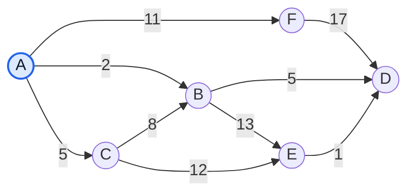
```mermaid
flowchart LR
	A((A)) -->|11| F((F))
	A -->|2| B((B))
	A -->|5| C((C))
	F -->|17| D((D))
	B -->|5| D
	B -->|13| E((E))
	C -->|8| B
	C -->|12| E
	E -->|1| D

	classDef src fill:#dbeafe,stroke:#2563eb,stroke-width:2px,color:#0f172a;
	class A src;
```

**Step 0 - Initialize.** $d(A) = 0$, every other vertex starts at $\infty$.

**Step 1 - Finalize $A$ (distance 0).** Relax all edges out of $A$:

- $0 + 11 = 11 < \infty \Rightarrow d(F) = 11$
- $0 + 2 = 2 < \infty \Rightarrow d(B) = 2$
- $0 + 5 = 5 < \infty \Rightarrow d(C) = 5$

**Step 2 - Smallest tentative distance is $B = 2$, so finalize $B$.** Relax edges out of $B$ (to $D$, $E$, and $C$):

- $2 + 5 = 7 < \infty \Rightarrow d(D) = 7$
- $2 + 13 = 15 < \infty \Rightarrow d(E) = 15$
- $B$ has no outgoing edge to $C$ in this graph, so $C$ is untouched here.

**Step 3 - Smallest remaining is $C = 5$, so finalize $C$.** Relax edges out of $C$ (to $B$ and $E$):

- $C \to B$: $B$ is already finalized, so this edge is not used again.
- $5 + 12 = 17$, compare with $d(E) = 15$. Since $17 \not< 15$, $E$ stays $15$.

**Step 4 - Smallest remaining is $D = 7$, so finalize $D$.** $D$ has no outgoing edges in this graph, so nothing is relaxed.

**Step 5 - Smallest remaining is $F = 11$, so finalize $F$.** Relax edges out of $F$ (to $D$):

- $11 + 17 = 28$, compare with $d(D) = 7$. Since $28 \not< 7$, $D$ stays $7$ (it is also already finalized).

**Step 6 - Only $E = 15$ remains, so finalize $E$.** Relax edges out of $E$ (to $D$):

- $15 + 1 = 16$, compare with $d(D) = 7$. Since $16 \not< 7$, $D$ stays $7$.

Distance table, one row per finalized (visited) vertex, in the exact order they were finalized:

| Visited $\downarrow$ | A | B | C | D | E | F |
| :---: | :---: | :---: | :---: | :---: | :---: | :---: |
| **A** | **0** | $\infty$ | $\infty$ | $\infty$ | $\infty$ | $\infty$ |
| **B** | | **2** | 5 | $\infty$ | $\infty$ | 11 |
| **C** | | - | **5** | 7 | 15 | 11 |
| **D** | | | - | **7** | 15 | 11 |
| **F** | | | | - | 15 | **11** |
| **E** | | | | | **15** | - |

Bold values are the distances finalized (boxed) in that step; a dash `-` marks a vertex already finalized in an earlier step.

Final shortest distances from $A$: $A=0$, $B=2$, $C=5$, $D=7$, $F=11$, $E=15$.

Reconstructing the path to $E$: $E$ was last updated by $B$ ($2+13=15$), and $B$ was reached directly from $A$. Reading backward: $E, B, A$, so forward the path is $A \to B \to E$ with total cost $2 + 13 = 15$.

### Mermaid Diagram: Dijkstra's Greedy Finalization

The diagram below visualizes the finalization order from **Worked Example 1**: $A \to F \to C \to B \to D \to E$.

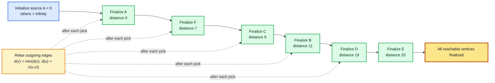
```mermaid
flowchart LR
	Init["Initialize source A = 0<br/>others = infinity"] --> PickA["Finalize A<br/>distance 0"]
	PickA --> PickF["Finalize F<br/>distance 7"]
	PickF --> PickC["Finalize C<br/>distance 9"]
	PickC --> PickB["Finalize B<br/>distance 11"]
	PickB --> PickD["Finalize D<br/>distance 19"]
	PickD --> PickE["Finalize E<br/>distance 20"]
	PickE --> Done["All reachable vertices finalized"]

	Relax["Relax outgoing edges<br/>d(v) = min(d(v), d(u) + c(u,v))"] -. after each pick .-> PickA
	Relax -. after each pick .-> PickF
	Relax -. after each pick .-> PickC
	Relax -. after each pick .-> PickB
	Relax -. after each pick .-> PickD

	classDef init fill:#dbeafe,stroke:#2563eb,stroke-width:2px,color:#0f172a;
	classDef step fill:#dcfce7,stroke:#16a34a,stroke-width:2px,color:#052e16;
	classDef helper fill:#fef3c7,stroke:#d97706,stroke-width:2px,color:#111827;
	classDef answer fill:#fde68a,stroke:#b45309,stroke-width:3px,color:#111827;
	class Init init;
	class PickA,PickF,PickC,PickB,PickD,PickE step;
	class Relax helper;
	class Done answer;
```

### Algorithm

```text
DIJKSTRA(G, source)
1. for each vertex v in G:
2.     dist[v] = infinity
3.     parent[v] = NIL
4. dist[source] = 0
5. put all vertices in a min-priority queue by dist value
6. while the queue is not empty:
7.     u = extract vertex with minimum dist
8.     for each edge (u, v):
9.         if dist[u] + weight(u, v) < dist[v]:
10.            dist[v] = dist[u] + weight(u, v)
11.            parent[v] = u
12.            update v in the priority queue
13. return dist and parent
```

### Complexity Analysis

- Using adjacency matrix: $\Theta(V^2)$
- Using adjacency list and binary heap: $\Theta((V+E)\log V)$
- Space Complexity: $\Theta(V+E)$

---

## 7. Single Source Shortest Path - Bellman-Ford Algorithm

### Problem Statement

Given a weighted directed graph and a source vertex $s$, find the shortest distance from $s$ to every other vertex.

Bellman-Ford can handle negative edge weights, but it cannot produce finite shortest paths if a reachable negative cycle exists.

### Inputs and Output

- **Input:** weighted graph $G=(V,E)$, edge weight function $w(u,v)$, and source vertex $s$.
- **Output:** shortest distance array `dist`, parent array `parent`, and negative-cycle information.

### Main Idea: Edge Relaxation

To **relax** an edge $(u,v)$ means checking whether going through $u$ gives a shorter path to $v$.

If:

$$
dist[u] + w(u,v) < dist[v]
$$

Then update:

$$
dist[v] = dist[u] + w(u,v)
$$

Bellman-Ford relaxes every edge $|V|-1$ times.

Why $|V|-1$ times?

- A shortest simple path can contain at most $|V|-1$ edges.
- Each round allows shortest path information to move at least one edge farther.

After those rounds, one more relaxation pass is used to detect a negative cycle.

### Worked Example: Six-Vertex Graph (Selected-Vertex Relaxation Table)

This walkthrough traces Bellman-Ford the way it is often done by hand: edges are grouped by their source vertex, and vertices are relaxed in a fixed order — $A, B, C, D, E, F$ — instead of scanning a flat edge list. This still relaxes every edge exactly once per round; only the bookkeeping changes. One table is built per round. Inside a table, each row is labeled by the vertex whose *outgoing* edges were just relaxed, and the row shows the whole distance array immediately afterward. The **bold** cell simply marks which vertex was just processed, as a visual anchor — it is not necessarily that vertex's final answer.

Graph and source vertex $A$:

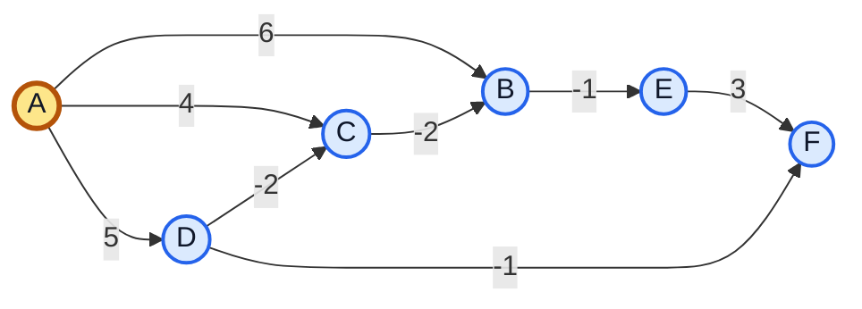
```mermaid
flowchart LR
	A((A)) -->|6| B((B))
	A -->|4| C((C))
	A -->|5| D((D))
	B -->|-1| E((E))
	C -->|-2| B
	D -->|-2| C
	D -->|-1| F((F))
	E -->|3| F((F))

	classDef source fill:#fde68a,stroke:#b45309,stroke-width:3px,color:#111827;
	classDef node fill:#dbeafe,stroke:#2563eb,stroke-width:2px,color:#0f172a;
	class A source;
	class B,C,D,E,F node;
```

With $|V| = 6$, Bellman-Ford needs $|V|-1 = 5$ relaxation rounds.

**Round 1** — start from $dist[A]=0$, all other vertices at $\infty$:

| Selected vertex | A | B | C | D | E | F |
| :---: | :---: | :---: | :---: | :---: | :---: | :---: |
| A | **0** | $\infty$ | $\infty$ | $\infty$ | $\infty$ | $\infty$ |
| B | 0 | **6** | 4 | 5 | $\infty$ | $\infty$ |
| C | 0 | 6 | **4** | 5 | 5 | $\infty$ |
| D | 0 | 2 | 4 | **5** | 5 | $\infty$ |
| E | 0 | 2 | 3 | 5 | **5** | 4 |
| F | 0 | 2 | 3 | 5 | 5 | **4** |

- Row B: relax $A \to B$ ($0+6=6$), $A \to C$ ($0+4=4$), $A \to D$ ($0+5=5$).
- Row C: relax $B \to E$ ($6-1=5$).
- Row D: relax $C \to B$ ($4-2=2$, improves $B$ from 6 to 2).
- Row E: relax $D \to C$ ($5-2=3$, improves $C$) and $D \to F$ ($5-1=4$).
- Row F: relax $E \to F$ ($5+3=8$), which does **not** improve $F=4$.

**Round 2** — carried over from $[0,2,3,5,5,4]$:

| Selected vertex | A | B | C | D | E | F |
| :---: | :---: | :---: | :---: | :---: | :---: | :---: |
| A | **0** | 2 | 3 | 5 | 5 | 4 |
| B | 0 | **2** | 3 | 5 | 5 | 4 |
| C | 0 | 2 | **3** | 5 | 1 | 4 |
| D | 0 | 1 | 3 | **5** | 1 | 4 |
| E | 0 | 1 | 3 | 5 | **1** | 4 |
| F | 0 | 1 | 3 | 5 | 1 | **4** |

$B \to E$ improves $E$ to 1 ($2-1$), then $C \to B$ improves $B$ to 1 ($3-2$).

**Round 3** — carried over from $[0,1,3,5,1,4]$:

| Selected vertex | A | B | C | D | E | F |
| :---: | :---: | :---: | :---: | :---: | :---: | :---: |
| A | **0** | 1 | 3 | 5 | 1 | 4 |
| B | 0 | **1** | 3 | 5 | 1 | 4 |
| C | 0 | 1 | **3** | 5 | 0 | 4 |
| D | 0 | 1 | 3 | **5** | 0 | 4 |
| E | 0 | 1 | 3 | 5 | **0** | 4 |
| F | 0 | 1 | 3 | 5 | 0 | **3** |

$B \to E$ improves $E$ to 0 ($1-1$); later $E \to F$ improves $F$ to 3 ($0+3$).

**Round 4** — carried over from $[0,1,3,5,0,3]$:

| Selected vertex | A | B | C | D | E | F |
| :---: | :---: | :---: | :---: | :---: | :---: | :---: |
| A | **0** | 1 | 3 | 5 | 0 | 3 |
| B | 0 | **1** | 3 | 5 | 0 | 3 |
| C | 0 | 1 | **3** | 5 | 0 | 3 |
| D | 0 | 1 | 3 | **5** | 0 | 3 |
| E | 0 | 1 | 3 | 5 | **0** | 3 |
| F | 0 | 1 | 3 | 5 | 0 | **3** |

Nothing changed in Round 4, so the values have already converged. Round 5 (still required by the $|V|-1$ bound) and the negative-cycle check pass both leave the table unchanged, confirming there is no reachable negative cycle.

Final shortest distances from $A$:

| Vertex | A | B | C | D | E | F |
| :---: | :---: | :---: | :---: | :---: | :---: | :---: |
| Distance | 0 | 1 | 3 | 5 | 0 | 3 |

---

### Drawback: A Negative Cycle Prevents Convergence

The extra check pass in Bellman-Ford exists because a **reachable negative cycle** stops the distances from ever settling. Every trip around the cycle keeps lowering the distance, so no finite shortest path exists. This example uses the same selected-vertex table to see it happen directly.

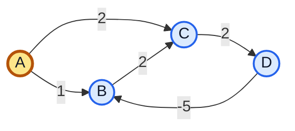
```mermaid
flowchart LR
	A((A)) -->|1| B((B))
	A -->|2| C((C))
	B -->|2| C
	C -->|2| D((D))
	D -->|-5| B

	classDef source fill:#fde68a,stroke:#b45309,stroke-width:3px,color:#111827;
	classDef node fill:#dbeafe,stroke:#2563eb,stroke-width:2px,color:#0f172a;
	class A source;
	class B,C,D node;
```

The cycle $B \to C \to D \to B$ has total weight $2 + 2 + (-5) = -1$. With $|V|=4$, only $|V|-1 = 3$ rounds are theoretically required — watch what the 4th round (the check pass) still does.

**Round 1** — start from $dist[A]=0$, all others $\infty$. A row is added for the wraparound edge $D \to B$, since it belongs to the same relaxation order and closes the cycle:

| Selected vertex | A | B | C | D |
| :---: | :---: | :---: | :---: | :---: |
| A | **0** | $\infty$ | $\infty$ | $\infty$ |
| B | 0 | **1** | 2 | $\infty$ |
| C | 0 | 1 | **2** | $\infty$ |
| D | 0 | 1 | 2 | **4** |
| D → B (wrap) | 0 | **-1** | 2 | 4 |

**Round 2:**

| Selected vertex | A | B | C | D |
| :---: | :---: | :---: | :---: | :---: |
| A | **0** | -1 | 2 | 4 |
| B | 0 | **-1** | 2 | 4 |
| C | 0 | -1 | **1** | 4 |
| D | 0 | -1 | 1 | **3** |
| D → B (wrap) | 0 | **-2** | 1 | 3 |

**Round 3** (the last round the $|V|-1$ bound calls for):

| Selected vertex | A | B | C | D |
| :---: | :---: | :---: | :---: | :---: |
| A | **0** | -2 | 1 | 3 |
| B | 0 | **-2** | 1 | 3 |
| C | 0 | -2 | **0** | 3 |
| D | 0 | -2 | 0 | **2** |
| D → B (wrap) | 0 | **-3** | 0 | 2 |

**Round 4** (this plays the role of the negative-cycle check pass):

| Selected vertex | A | B | C | D |
| :---: | :---: | :---: | :---: | :---: |
| A | **0** | -3 | 0 | 2 |
| B | 0 | **-3** | 0 | 2 |
| C | 0 | -3 | **-1** | 2 |
| D | 0 | -3 | -1 | **1** |
| D → B (wrap) | 0 | **-4** | -1 | 1 |

$dist(B)$ keeps falling by exactly 1 every round ($1 \to -1 \to -2 \to -3 \to -4 \to \dots$), matching the cycle weight of $-1$. Because an edge relaxation still succeeds after the required $|V|-1=3$ rounds, Bellman-Ford's check pass (algorithm lines 10–12) reports **a negative cycle is reachable from the source** instead of returning finite distances.

### Mermaid Diagram: Bellman-Ford Relaxation Flow

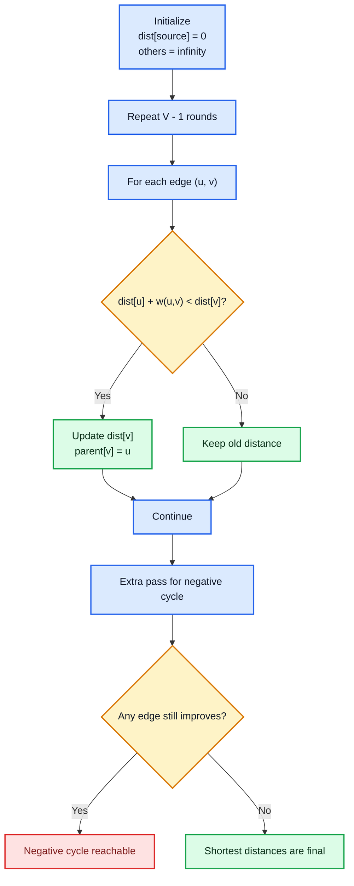
```mermaid
flowchart TB
	Init["Initialize<br/>dist[source] = 0<br/>others = infinity"] --> Rounds["Repeat V - 1 rounds"]
	Rounds --> Edge["For each edge (u, v)"]
	Edge --> Check{"dist[u] + w(u,v) &lt; dist[v]?"}
	Check -->|Yes| Update["Update dist[v]<br/>parent[v] = u"]
	Check -->|No| Keep["Keep old distance"]
	Update --> NextEdge["Continue"]
	Keep --> NextEdge
	NextEdge --> Detect["Extra pass for negative cycle"]
	Detect --> Cycle{"Any edge still improves?"}
	Cycle -->|Yes| Bad["Negative cycle reachable"]
	Cycle -->|No| Good["Shortest distances are final"]

	classDef process fill:#dbeafe,stroke:#2563eb,stroke-width:2px,color:#0f172a;
	classDef decision fill:#fef3c7,stroke:#d97706,stroke-width:2px,color:#111827;
	classDef update fill:#dcfce7,stroke:#16a34a,stroke-width:2px,color:#052e16;
	classDef warn fill:#fee2e2,stroke:#dc2626,stroke-width:2px,color:#7f1d1d;
	class Init,Rounds,Edge,NextEdge,Detect process;
	class Check,Cycle decision;
	class Update,Keep,Good update;
	class Bad warn;
```

### Algorithm

```text
BELLMAN-FORD(G, w, s)
1. for each vertex v in G.V:
2.     dist[v] = infinity
3.     parent[v] = NIL
4. dist[s] = 0

5. for i = 1 to |V| - 1:
6.     for each edge (u, v) in G.E:
7.         if dist[u] != infinity and dist[u] + w(u, v) < dist[v]:
8.             dist[v] = dist[u] + w(u, v)
9.             parent[v] = u

10. for each edge (u, v) in G.E:
11.     if dist[u] != infinity and dist[u] + w(u, v) < dist[v]:
12.         return "negative cycle exists"

13. return dist, parent
```

### Complexity Analysis

| Part | Complexity |
| :--- | :---: |
| Initialization | $\Theta(V)$ |
| Relaxation rounds | $\Theta(VE)$ |
| Negative cycle check | $\Theta(E)$ |
| Total time | $\Theta(VE)$ |
| Space | $\Theta(V)$ |

---

## 8. Shortest Path (All Pairs) - Floyd-Warshall Algorithm

### Problem Statement

Given a weighted directed graph, find the shortest path distance between **every pair** of vertices. Bellman-Ford (Section 7) answers this from a single source; Floyd-Warshall answers it for all sources at once.

Floyd-Warshall allows each vertex to become an intermediate point one by one and updates the distance matrix accordingly.

### Working with Negative Edge Weights

Floyd-Warshall works correctly with a mix of negative and positive edge weights, **provided the graph has no negative-weight cycle** — the same restriction Bellman-Ford has (see [Section 7](#7-single-source-shortest-path---bellman-ford-algorithm)).

**Detecting a negative cycle after the fact:** once the final matrix $D^{(n)}$ is computed, check its diagonal. Normally $D[i,i] = 0$ for every vertex $i$ (the shortest path from a vertex to itself). If any $D[i,i] < 0$, vertex $i$ lies on a negative cycle, and the computed distances can no longer be trusted as shortest paths.

### Inputs and Output

- **Input:** adjacency weight matrix $W$ of size $n \times n$.
- **Output:** matrix $D$ where $D[i,j]$ is the shortest distance from vertex $i$ to vertex $j$.

### Subproblem Decomposition

Let $D^{(k)}[i,j]$ be the shortest distance from $i$ to $j$ using only vertices $1$ through $k$ as intermediate vertices.

When vertex $k$ is allowed:

- Do not use $k$: distance remains $D^{(k-1)}[i,j]$.
- Use $k$: distance becomes $D^{(k-1)}[i,k] + D^{(k-1)}[k,j]$.

$$
D^{(k)}[i,j] = \min(D^{(k-1)}[i,j],\ D^{(k-1)}[i,k] + D^{(k-1)}[k,j])
$$

### Tabulation Walkthrough

For a 3-vertex graph:

- Edge $1 \to 2$ has weight 3.
- Edge $2 \to 3$ has weight 1.
- Edge $1 \to 3$ has weight 6.

Initial matrix:

$$
D^{(0)} =
\begin{pmatrix}
0 & 3 & 6 \\
\infty & 0 & 1 \\
\infty & \infty & 0
\end{pmatrix}
$$

Allow vertex 1 as intermediate:

$$
D^{(1)} = D^{(0)}
$$

Allow vertex 2 as intermediate:

$$
D[1,3] = \min(6, D[1,2] + D[2,3]) = \min(6,3+1)=4
$$

Updated matrix:

$$
D^{(2)} =
\begin{pmatrix}
0 & 3 & 4 \\
\infty & 0 & 1 \\
\infty & \infty & 0
\end{pmatrix}
$$

Arrow-guided update for intermediate vertex $k=2$:

| Cell | Keep direct path | Try detour through $2$ | Chosen arrow | Stored value |
| :---: | :---: | :---: | :---: | :---: |
| $D[1,2]$ | 3 | $D[1,2]+D[2,2]=3+0=3$ | $\uparrow$ keep | 3 |
| $D[1,3]$ | 6 | $D[1,2]+D[2,3]=3+1=4$ | $1 \rightarrow 2 \rightarrow 3$ | **4** |
| $D[2,3]$ | 1 | $D[2,2]+D[2,3]=0+1=1$ | $\uparrow$ keep | 1 |

The shortest path from 1 to 3 is updated from **6** to **4** through vertex 2.

### Mermaid Diagram: Floyd-Warshall Detour Update

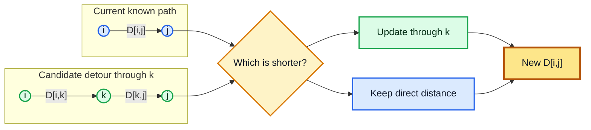
```mermaid
flowchart LR
	subgraph DirectPath[Current known path]
		I1((i)) -->|"D[i,j]"| J1((j))
	end

	subgraph DetourPath[Candidate detour through k]
		I2((i)) -->|"D[i,k]"| K((k))
		K -->|"D[k,j]"| J2((j))
	end

	J1 --> Compare{"Which is shorter?"}
	J2 --> Compare
	Compare --> Keep["Keep direct distance"]
	Compare --> Update["Update through k"]
	Update --> Cell["New D[i,j]"]
	Keep --> Cell

	classDef direct fill:#dbeafe,stroke:#2563eb,stroke-width:2px,color:#0f172a;
	classDef detour fill:#dcfce7,stroke:#16a34a,stroke-width:2px,color:#052e16;
	classDef decision fill:#fef3c7,stroke:#d97706,stroke-width:2px,color:#111827;
	classDef answer fill:#fde68a,stroke:#b45309,stroke-width:3px,color:#111827;
	class I1,J1,Keep direct;
	class I2,K,J2,Update detour;
	class Compare decision;
	class Cell answer;
```

### Algorithm

```text
FLOYD-WARSHALL(W, n)
1. D = W
2. for k = 1 to n:
3.     for i = 1 to n:
4.         for j = 1 to n:
5.             if D[i][k] + D[k][j] < D[i][j]:
6.                 D[i][j] = D[i][k] + D[k][j]
7. return D
```

### Complexity Analysis

- Time Complexity: $\Theta(n^3)$
- Space Complexity: $\Theta(n^2)$

### Classroom Problem: Four-Vertex Graph with Negative Edges

**Problem.** Find all-pairs shortest paths for the following 4-vertex directed graph, which mixes positive and negative edge weights but contains **no negative cycle**:

| Edge | Weight |
| :---: | :---: |
| $1 \to 2$ | 1 |
| $1 \to 3$ | -2 |
| $2 \to 1$ | 4 |
| $2 \to 3$ | 3 |
| $3 \to 4$ | 2 |
| $4 \to 1$ | 5 |

All other pairs have no direct edge ($\infty$).

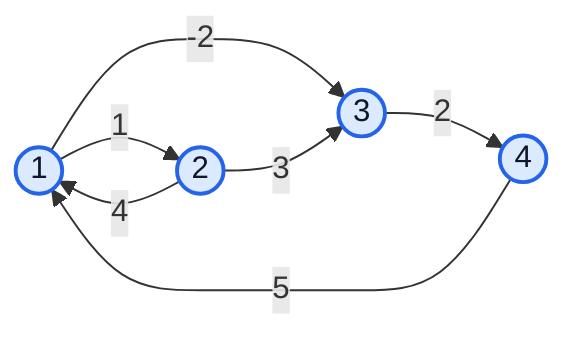
```mermaid
flowchart LR
	V1((1)) -->|"1"| V2((2))
	V2 -->|"4"| V1
	V1 -->|"-2"| V3((3))
	V2 -->|"3"| V3
	V3 -->|"2"| V4((4))
	V4 -->|"5"| V1

	classDef node fill:#dbeafe,stroke:#2563eb,stroke-width:2px,color:#0f172a;
	class V1,V2,V3,V4 node;
```

#### Initial Matrix $D^{(0)}$

$$
D^{(0)} =
\begin{pmatrix}
0 & 1 & -2 & \infty \\
4 & 0 & 3 & \infty \\
\infty & \infty & 0 & 2 \\
5 & \infty & \infty & 0
\end{pmatrix}
$$

#### $D^{(1)}$: Allow Vertex 1 as Intermediate

Row 1 and column 1 never change at $k=1$, since a path cannot get shorter by detouring through its own endpoint. Every other cell is checked against a detour through vertex 1:

$$
D[2,3] = \min(3,\ D[2,1]+D[1,3]) = \min(3,\ 4+(-2)) = \min(3,\ 2) = 2
$$

$$
D[2,4] = \min(\infty,\ D[2,1]+D[1,4]) = \min(\infty,\ 4+\infty) = \infty
$$

$$
D[3,2] = \min(\infty,\ D[3,1]+D[1,2]) = \min(\infty,\ \infty+1) = \infty
$$

$$
D[3,4] = \min(2,\ D[3,1]+D[1,4]) = \min(2,\ \infty) = 2
$$

$$
D[4,2] = \min(\infty,\ D[4,1]+D[1,2]) = \min(\infty,\ 5+1) = 6
$$

$$
D[4,3] = \min(\infty,\ D[4,1]+D[1,3]) = \min(\infty,\ 5+(-2)) = 3
$$

The negative edge already pays off here: the direct edge $2 \to 3$ costs 3, but detouring $2 \to 1 \to 3$ costs $4+(-2)=2$, so $D[2,3]$ drops to **2**.

$$
D^{(1)} =
\begin{pmatrix}
0 & 1 & -2 & \infty \\
4 & 0 & 2 & \infty \\
\infty & \infty & 0 & 2 \\
5 & 6 & 3 & 0
\end{pmatrix}
$$

#### $D^{(2)}$: Allow Vertices 1 and 2 as Intermediate

Row 2 and column 2 stay fixed at $k=2$. Checking the remaining cells against a detour through vertex 2:

$$
D[1,3] = \min(-2,\ D[1,2]+D[2,3]) = \min(-2,\ 1+2) = -2
$$

$$
D[1,4] = \min(\infty,\ D[1,2]+D[2,4]) = \min(\infty,\ 1+\infty) = \infty
$$

$$
D[3,1] = \min(\infty,\ D[3,2]+D[2,1]) = \min(\infty,\ \infty+4) = \infty
$$

$$
D[3,4] = \min(2,\ D[3,2]+D[2,4]) = \min(2,\ \infty) = 2
$$

$$
D[4,1] = \min(5,\ D[4,2]+D[2,1]) = \min(5,\ 6+4) = 5
$$

$$
D[4,3] = \min(3,\ D[4,2]+D[2,3]) = \min(3,\ 6+2) = 3
$$

No cell improves, so:

$$
D^{(2)} = D^{(1)} =
\begin{pmatrix}
0 & 1 & -2 & \infty \\
4 & 0 & 2 & \infty \\
\infty & \infty & 0 & 2 \\
5 & 6 & 3 & 0
\end{pmatrix}
$$

#### $D^{(3)}$: Allow Vertices 1, 2, and 3 as Intermediate

Row 3 and column 3 stay fixed at $k=3$. Checking the remaining cells against a detour through vertex 3:

$$
D[1,2] = \min(1,\ D[1,3]+D[3,2]) = \min(1,\ -2+\infty) = 1
$$

$$
D[1,4] = \min(\infty,\ D[1,3]+D[3,4]) = \min(\infty,\ -2+2) = 0
$$

$$
D[2,1] = \min(4,\ D[2,3]+D[3,1]) = \min(4,\ 2+\infty) = 4
$$

$$
D[2,4] = \min(\infty,\ D[2,3]+D[3,4]) = \min(\infty,\ 2+2) = 4
$$

$$
D[4,1] = \min(5,\ D[4,3]+D[3,1]) = \min(5,\ 3+\infty) = 5
$$

$$
D[4,2] = \min(6,\ D[4,3]+D[3,2]) = \min(6,\ 3+\infty) = 6
$$

Two cells improve here: $D[1,4]$ drops from $\infty$ to **0** via $1 \to 3 \to 4$ (cost $-2+2$), and $D[2,4]$ drops from $\infty$ to **4** via $2 \to 3 \to 4$.

$$
D^{(3)} =
\begin{pmatrix}
0 & 1 & -2 & 0 \\
4 & 0 & 2 & 4 \\
\infty & \infty & 0 & 2 \\
5 & 6 & 3 & 0
\end{pmatrix}
$$

#### $D^{(4)}$: Allow All Vertices as Intermediate (Final Matrix)

Row 4 and column 4 stay fixed at $k=4$. Checking the remaining cells against a detour through vertex 4:

$$
D[1,2] = \min(1,\ D[1,4]+D[4,2]) = \min(1,\ 0+6) = 1
$$

$$
D[1,3] = \min(-2,\ D[1,4]+D[4,3]) = \min(-2,\ 0+3) = -2
$$

$$
D[2,1] = \min(4,\ D[2,4]+D[4,1]) = \min(4,\ 4+5) = 4
$$

$$
D[2,3] = \min(2,\ D[2,4]+D[4,3]) = \min(2,\ 4+3) = 2
$$

$$
D[3,1] = \min(\infty,\ D[3,4]+D[4,1]) = \min(\infty,\ 2+5) = 7
$$

$$
D[3,2] = \min(\infty,\ D[3,4]+D[4,2]) = \min(\infty,\ 2+6) = 8
$$

Vertex 3 finally reaches vertices 1 and 2 by routing through vertex 4: $3 \to 4 \to 1$ costs $2+5=7$, and $3 \to 4 \to 2$ costs $2+6=8$.

$$
D^{(4)} =
\begin{pmatrix}
0 & 1 & -2 & 0 \\
4 & 0 & 2 & 4 \\
7 & 8 & 0 & 2 \\
5 & 6 & 3 & 0
\end{pmatrix}
$$

**Negative-cycle check:** every diagonal entry of $D^{(4)}$ is still $0$, confirming there is no negative cycle in this graph and all shortest distances above are valid.

---

## 9. Topological Sorting

Topological sorting is used when some tasks must happen before other tasks.

### Definition

A **topological ordering** of a directed graph is a linear ordering of vertices such that, for every directed edge:

$$
u \to v
$$

vertex $u$ appears **before** vertex $v$ in the ordering. In dependency language, $u$ must be completed before $v$ can begin.

Topological sorting is possible only for a DAG. The order need not be unique: whenever two vertices have no dependency path forcing one before the other, either may appear first.

### DAG

A **DAG** is a **Directed Acyclic Graph**.

- Directed: edges have direction.
- Acyclic: no directed cycle exists.

If a directed graph has a cycle, topological sorting is impossible because the cycle creates circular dependency.

Example of impossible dependency:

$$
A \to B, \quad B \to C, \quad C \to A
$$

This says $A$ before $B$, $B$ before $C$, and $C$ before $A$, which cannot all be true.

For the DFS method, a DAG has one especially useful property: when DFS finishes a vertex $u$, every vertex reachable from $u$ has already finished. Therefore, putting $u$ **after** its neighbours in a finish stack and then reading that stack backwards puts $u$ before every dependent vertex in the final order.

### Worked Example

Suppose tasks have these dependencies:

| Edge | Meaning |
| :---: | :--- |
| A -> C | A must be completed before C |
| B -> C | B must be completed before C |
| C -> D | C must be completed before D |
| C -> E | C must be completed before E |
| D -> F | D must be completed before F |
| E -> F | E must be completed before F |

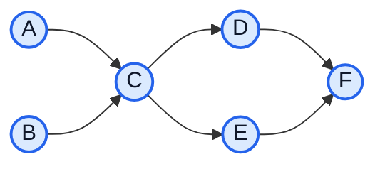
```mermaid
flowchart LR
	A((A)) --> C((C))
	B((B)) --> C
	C --> D((D))
	C --> E((E))
	D --> F((F))
	E --> F

	classDef node fill:#dbeafe,stroke:#2563eb,stroke-width:2px,color:#0f172a;
	class A,B,C,D,E,F node;
```

One valid topological order is:

$$
A, B, C, D, E, F
$$

Another valid order is:

$$
B, A, C, E, D, F
$$

Topological order is not always unique.

### DFS-Based Topological Sort

DFS-based topological sort follows the recursive, **postorder** process demonstrated in the provided video, [*Topological Sorting with examples | Topological Sorting using DFS*](https://youtu.be/3tkcfvCNtM8?si=iY2xpQd3mwXs-3xs):

1. Start DFS from an unvisited vertex.
2. Visit each unvisited outgoing neighbour recursively.
3. Do **not** output the current vertex when it is first visited.
4. Push the current vertex onto a stack only when all of its outgoing neighbours have been completely processed.
5. Repeat from every still-unvisited vertex; this matters when the DAG is disconnected.
6. Pop the stack to obtain the topological order.

The stack records **finish order**. Because a prerequisite finishes after the DFS exploration of its dependents, it is pushed later and is popped earlier. Thus, popping the stack reverses finish order into a prerequisite-before-dependent order.

#### DFS Walkthrough

Use the same graph, scan start vertices alphabetically ($A,B,C,D,E,F$), and scan each adjacency list alphabetically:

| Vertex | Outgoing neighbours |
| :---: | :--- |
| A | C |
| B | C |
| C | D, E |
| D | F |
| E | F |
| F | — |

The left-to-right stack below is the **push/finish order**; its rightmost item is the next item popped.

| Step | DFS call / return action | Why it happens | Finish stack |
| :---: | :--- | :--- | :--- |
| 1 | `DFS(A) → DFS(C) → DFS(D) → DFS(F)` | Follow the first unvisited outgoing neighbour at each vertex. | empty |
| 2 | Finish `F`; push `F` | $F$ has no outgoing neighbour. | F |
| 3 | Return to and finish `D`; push `D` | $D$'s only neighbour, $F$, is complete. | F, D |
| 4 | Return to `C`; call `DFS(E)` | $C$ still has unvisited neighbour $E$. | F, D |
| 5 | Finish `E`; push `E` | $E \to F$, but $F$ is already visited and finished. | F, D, E |
| 6 | Finish `C`; push `C` | Both $D$ and $E$ are complete. | F, D, E, C |
| 7 | Finish `A`; push `A` | $A$'s only neighbour, $C$, is complete. | F, D, E, C, A |
| 8 | Start and finish `DFS(B)`; push `B` | $B \to C$, and $C$ is already visited. | F, D, E, C, A, B |

Now pop from the right of the stack:

$$
B, A, C, E, D, F
$$

Every edge points left-to-right in this result: $A$ and $B$ occur before $C$; $C$ occurs before $D$ and $E$; and both $D$ and $E$ occur before $F$. Since $D$ and $E$ are independent after $C$, exchanging them gives another valid order, such as $B,A,C,D,E,F$.

### Mermaid Diagram: DFS Finish-Time Idea

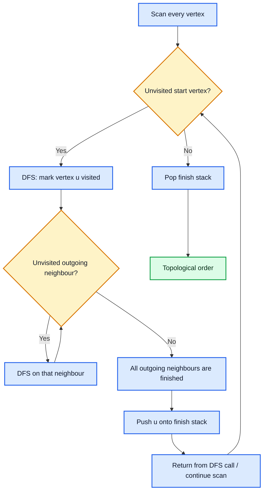
```mermaid
flowchart TB
	Start["Scan every vertex"] --> Root{"Unvisited start vertex?"}
	Root -->|Yes| Visit["DFS: mark vertex u visited"]
	Root -->|No| Reverse["Pop finish stack"]
	Visit --> Neigh{"Unvisited outgoing neighbour?"}
	Neigh -->|Yes| Recurse["DFS on that neighbour"]
	Recurse --> Neigh
	Neigh -->|No| Finish["All outgoing neighbours are finished"]
	Finish --> Push["Push u onto finish stack"]
	Push --> Return["Return from DFS call / continue scan"]
	Return --> Root
	Reverse --> Order["Topological order"]

	classDef process fill:#dbeafe,stroke:#2563eb,stroke-width:2px,color:#0f172a;
	classDef decision fill:#fef3c7,stroke:#d97706,stroke-width:2px,color:#111827;
	classDef result fill:#dcfce7,stroke:#16a34a,stroke-width:2px,color:#052e16;
	class Start,Visit,Recurse,Finish,Push,Return,Reverse process;
	class Root,Neigh decision;
	class Order result;
```

#### Algorithm

```text
TOPOLOGICAL-SORT-DFS(G)
1. create empty stack S
2. mark every vertex as unvisited
3. for each vertex u in G.V:
4.     if u is unvisited:
5.         DFS-VISIT(u)
6. return vertices popped from S

DFS-VISIT(u)
1. mark u as visited
2. for each vertex v in Adj[u]:
3.     if v is unvisited:
4.         DFS-VISIT(v)
5. push u onto S     // push only after all neighbours finish
```

### Kahn's Algorithm - Optional/Self-Study

Kahn's Algorithm solves topological sorting using indegree.

The **indegree** of a vertex is the number of incoming edges.

Main idea:

1. Compute indegree of every vertex.
2. Put all vertices with indegree $0$ into a queue.
3. Repeatedly remove a vertex from the queue and append it to the answer.
4. For each outgoing neighbor, decrease its indegree.
5. If a neighbor's indegree becomes $0$, put it into the queue.
6. If all vertices are output, a topological order exists.
7. If some vertices remain, the graph has a cycle.

```text
KAHN-TOPOLOGICAL-SORT(G)
1. compute indegree[v] for every vertex v
2. create queue Q with all vertices having indegree 0
3. create empty list order
4. while Q is not empty:
5.     u = dequeue Q
6.     append u to order
7.     for each v in Adj[u]:
8.         indegree[v] = indegree[v] - 1
9.         if indegree[v] == 0:
10.            enqueue v into Q
11. if length(order) != |V|:
12.     return "cycle exists, no topological order"
13. return order
```

### Time Complexity

| Algorithm | Time Complexity | Space Complexity | Notes |
| :--- | :---: | :---: | :--- |
| DFS-based topological sort | $\Theta(V+E)$ | $\Theta(V)$ | Uses visited array and stack |
| Kahn's Algorithm | $\Theta(V+E)$ | $\Theta(V)$ | Uses indegree array and queue |

### Applications

Topological sorting is useful when order matters because of dependencies.

| Application | Meaning |
| :--- | :--- |
| Task scheduling | A task can start only after its prerequisite tasks are completed |
| Course prerequisite ordering | A course can be taken only after required previous courses |
| Dependency resolution | A package or module must be installed after its dependencies |

---

## 10. Connected Components

Connected components are used for undirected graphs.

### Connected Graph Definition

An undirected graph is **connected** if every vertex can reach every other vertex.

If at least one pair of vertices cannot reach each other, the graph is disconnected.

### Connected Components in Undirected Graph

A **connected component** is a maximal group of vertices where every vertex can reach every other vertex in that group.

"Maximal" means the group cannot be expanded by adding another reachable vertex.

### Worked Example

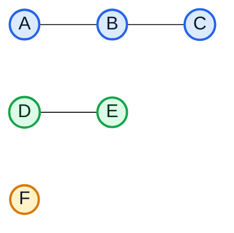
```mermaid
graph LR
	A((A)) --- B((B))
	B --- C((C))

	D((D)) --- E((E))


	F((F))


	classDef comp1 fill:#dbeafe,stroke:#2563eb,stroke-width:2px,color:#0f172a;
	classDef comp2 fill:#dcfce7,stroke:#16a34a,stroke-width:2px,color:#052e16;
	classDef comp3 fill:#fef3c7,stroke:#d97706,stroke-width:2px,color:#111827;
	class A,B,C comp1;
	class D,E comp2;
	class F comp3;
```

This graph has 3 connected components:

| Component number | Vertices |
| :---: | :--- |
| 1 | A, B, C |
| 2 | D, E |
| 3 | F |

Vertex $F$ is isolated, so it forms a component by itself.

### Finding Connected Components Using DFS/BFS

Main idea:

1. Mark every vertex as unvisited.
2. Start DFS or BFS from an unvisited vertex.
3. All vertices reached in that search belong to the same component.
4. Repeat from the next unvisited vertex.
5. Stop when every vertex has been visited.

### Walkthrough Table

Scan the vertices in order. Each time an unvisited vertex is encountered, run one complete BFS or DFS before returning to the scan; the vertices reached in that one run are exactly one component.

| Step | Start vertex | Search reaches | New component found |
| :---: | :---: | :--- | :--- |
| 1 | A | A, B, C | Component 1 |
| 2 | D | D, E | Component 2 |
| 3 | F | F | Component 3 |

### Algorithm Using DFS

```text
CONNECTED-COMPONENTS(G)
1. mark every vertex as unvisited
2. component_id = 0
3. for each vertex u in G.V:
4.     if u is unvisited:
5.         component_id = component_id + 1
6.         DFS-COMPONENT(u, component_id)

DFS-COMPONENT(u, component_id)
1. mark u as visited
2. assign u to component_id
3. for each neighbor v in Adj[u]:
4.     if v is unvisited:
5.         DFS-COMPONENT(v, component_id)
```

### Algorithm Using BFS

```text
CONNECTED-COMPONENTS-BFS(G)
1. mark every vertex as unvisited
2. component_id = 0
3. for each vertex u in G.V:
4.     if u is unvisited:
5.         component_id = component_id + 1
6.         create queue Q
7.         mark u as visited and enqueue u
8.         while Q is not empty:
9.             x = dequeue Q
10.            assign x to component_id
11.            for each neighbor v in Adj[x]:
12.                if v is unvisited:
13.                    mark v as visited
14.                    enqueue v
```

### Mermaid Diagram: Component Discovery

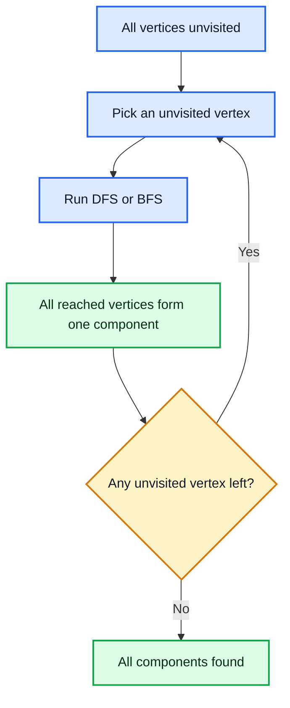
```mermaid
flowchart TB
	Start["All vertices unvisited"] --> Pick["Pick an unvisited vertex"]
	Pick --> Search["Run DFS or BFS"]
	Search --> Group["All reached vertices form one component"]
	Group --> More{"Any unvisited vertex left?"}
	More -->|Yes| Pick
	More -->|No| Done["All components found"]

	classDef process fill:#dbeafe,stroke:#2563eb,stroke-width:2px,color:#0f172a;
	classDef decision fill:#fef3c7,stroke:#d97706,stroke-width:2px,color:#111827;
	classDef result fill:#dcfce7,stroke:#16a34a,stroke-width:2px,color:#052e16;
	class Start,Pick,Search process;
	class More decision;
	class Group,Done result;
```

### Complexity Analysis

| Representation | Time Complexity | Space Complexity |
| :--- | :---: | :---: |
| Adjacency list | $\Theta(V+E)$ | $\Theta(V)$ |
| Adjacency matrix | $\Theta(V^2)$ | $\Theta(V)$ |

---

## 11. Strongly Connected Components

Strongly connected components are used for directed graphs.

### Definition

In a directed graph, vertices $u$ and $v$ are **strongly connected** if:

- $u$ can reach $v$.
- $v$ can reach $u$.

A **strongly connected component** or **SCC** is a maximal group of vertices where every vertex can reach every other vertex in the same group.

### Video Walkthrough Example

The following graph and DFS order reproduce the worked example from the supplied video. Its edges are:

$$
\begin{aligned}
&0 \to 1,\quad 1 \to 2,\quad 2 \to 0,\quad 2 \to 3,\quad 3 \to 4,\\
&4 \to 5,\quad 5 \to 6,\quad 6 \to 4,\quad 4 \to 7,\quad 6 \to 7.
\end{aligned}
$$

```mermaid
flowchart LR
    zero((0)) --> one((1))
    one --> two((2))
    two --> zero
    two --> three((3))
    three --> four((4))
    four --> five((5))
    five --> six((6))
    six --> four
    four --> seven((7))
    six --> seven
```

The SCCs in this graph are $\{0, 1, 2\}$, $\{3\}$, $\{4, 5, 6\}$, and $\{7\}$. Kosaraju's Algorithm obtains these groups in three steps.

### Kosaraju's Algorithm

1. Run DFS on the original graph. **Push a vertex onto a stack only when its DFS finishes.**
2. Reverse every edge to form the transpose graph $G^T$.
3. Reset `visited`. Pop vertices from the stack; whenever the popped vertex is unvisited, run DFS from it in $G^T$. The vertices reached by that DFS form one SCC.

### Why Reversing Edges Works

Reversing all edges preserves reachability inside an SCC: if every vertex can reach every other vertex in the original graph, the same is true in its transpose.

The first DFS stack puts a component with the latest finishing time on top. Starting the second DFS from that vertex in $G^T$ isolates exactly one SCC; continue popping until the stack is empty.

### Kosaraju Walkthrough

#### Step 1: DFS on the original graph and fill the stack

Start at vertex `0` and visit adjacent vertices in the order shown in the diagram. The DFS path is:

$$
0 \to 1 \to 2 \to 3 \to 4 \to 5 \to 6 \to 7
$$

A vertex is pushed after all of its outgoing neighbours have been processed. Therefore the **finish/push sequence** is:

$$
7, 6, 5, 4, 3, 2, 1, 0
$$

The final stack, displayed as in the video with the top first, is:

| Stack position | Vertex |
| :--- | :---: |
| Top | 0 |
|  | 1 |
|  | 2 |
|  | 3 |
|  | 4 |
|  | 5 |
|  | 6 |
| Bottom | 7 |

Equivalently, popping the stack produces `0, 1, 2, 3, 4, 5, 6, 7`; vertices already visited during the second DFS are skipped.

#### Step 2: Reverse the original graph

Construct $G^T$ by reversing every arrow of the original graph, then reset every `visited` value to `false`.

```mermaid
flowchart LR
    zero((0)) --> two((2))
    two --> one((1))
    one --> zero
    three((3)) --> two
    four((4)) --> three
    five((5)) --> four
    six((6)) --> five
    four --> six
    seven((7)) --> four
    seven --> six
```

For example, the original edge $2 \to 3$ becomes $3 \to 2$, and the original edge $6 \to 4$ becomes $4 \to 6$.

#### Step 3: DFS on $G^T$ in stack-pop order

Pop the stack and start a new DFS only at an unvisited vertex:

| Stack action | DFS reached in $G^T$ | SCC produced |
| :--- | :--- | :--- |
| Pop `0`; unvisited, so start DFS | `0, 2, 1` | $\{0, 2, 1\}$ |
| Pop `1`, `2`; already visited, so skip | — | — |
| Pop `3`; unvisited, so start DFS | `3` | $\{3\}$ |
| Pop `4`; unvisited, so start DFS | `4, 6, 5` | $\{4, 6, 5\}$ |
| Pop `5`, `6`; already visited, so skip | — | — |
| Pop `7`; unvisited, so start DFS | `7` | $\{7\}$ |

Thus the strongly connected components, in the order found by this walkthrough, are:

$$
\boxed{\{0, 2, 1\},\ \{3\},\ \{4, 6, 5\},\ \{7\}}
$$

### Mermaid Diagram: Kosaraju Three-Step Flow

```mermaid
flowchart TB
    G["Original directed graph G"] --> DFS1["Step 1: DFS and push on finish"]
    DFS1 --> Stack["Stack: top 0, 1, 2, 3, 4, 5, 6, 7 bottom"]
    G --> Transpose["Step 2: create G^T by reversing edges"]
    Stack --> DFS2["Step 3: pop and DFS in G^T"]
    Transpose --> DFS2
    DFS2 --> SCC["One DFS tree = one SCC"]
```

### Algorithm

```text
KOSARAJU-SCC(G)
1. create empty stack S
2. mark every vertex as unvisited
3. for each vertex u in G.V:
4.     if u is unvisited:
5.         DFS-FINISH(u, S)

6. create transpose graph GT by reversing every edge of G
7. mark every vertex as unvisited again
8. while S is not empty:
9.     u = pop S
10.    if u is unvisited:
11.        start a new SCC
12.        DFS-COLLECT(GT, u)
13.        output the SCC

DFS-FINISH(u, S)
1. mark u as visited
2. for each v in Adj[u]:
3.     if v is unvisited:
4.         DFS-FINISH(v, S)
5. push u onto S

DFS-COLLECT(GT, u)
1. mark u as visited
2. add u to the current SCC
3. for each v in AdjT[u]:
4.     if v is unvisited:
5.         DFS-COLLECT(GT, v)
```

### Complexity Analysis

| Part | Complexity |
| :--- | :---: |
| First DFS | $\Theta(V+E)$ |
| Building transpose graph | $\Theta(V+E)$ |
| Second DFS | $\Theta(V+E)$ |
| Total time | $\Theta(V+E)$ |
| Space | $\Theta(V+E)$ |

### Tarjan's Algorithm - Optional/Self-Study

Tarjan's Algorithm also finds SCCs, but it uses only one DFS pass.

It tracks:

- Discovery time of each vertex.
- Low-link value of each vertex.
- A stack of active vertices in the current DFS path.

High-level idea:

1. Run DFS and assign each vertex a discovery number.
2. Maintain `low[u]`, the smallest discovery number reachable from $u$ using DFS tree edges and back edges.
3. Keep active vertices on a stack.
4. If `low[u] == discovery[u]`, then $u$ is the root of an SCC.
5. Pop from the stack until $u$ is popped. Those popped vertices form one SCC.

| Algorithm | DFS passes | Time Complexity | Space Complexity | Study status |
| :--- | :---: | :---: | :---: | :--- |
| Kosaraju | 2 | $\Theta(V+E)$ | $\Theta(V+E)$ | Main topic |
| Tarjan | 1 | $\Theta(V+E)$ | $\Theta(V)$ | Optional/self-study |

---

## 12. Union-Find / Disjoint Set Union for Kruskal Support

Union-Find, also called **Disjoint Set Union** or **DSU**, is a data structure for maintaining groups of elements.

In this chapter, DSU is included only as support for Kruskal's algorithm.

Kruskal's algorithm considers edges in increasing weight order. DSU helps answer this question quickly:

> Are the two endpoints of this edge already in the same component?

If yes, adding the edge creates a cycle, so Kruskal skips it.

If no, adding the edge is safe for connecting two different components, so Kruskal accepts it and unions the two sets.

### DSU Operations

| Operation | Meaning |
| :--- | :--- |
| `MAKE-SET(x)` | Create a new set containing only $x$ |
| `FIND(x)` | Return the representative/root of the set containing $x$ |
| `UNION(x, y)` | Merge the sets containing $x$ and $y$ |

### Two Important Optimizations

| Optimization | Idea | Benefit |
| :--- | :--- | :--- |
| Path compression | During `FIND`, make each visited node point directly to the root | Makes future finds faster |
| Union by rank/size | Attach the smaller or shallower tree under the larger or deeper tree | Keeps the tree height small |

### Worked Example for Kruskal Support

Use the class-note sequence: sort the edges, inspect one edge at a time, compare the representatives of its endpoints, and immediately write whether the edge is accepted or rejected and how the component sets change.

Suppose Kruskal considers these undirected weighted edges in sorted order:

| Order | Edge | Weight | DSU decision |
| :---: | :---: | :---: | :--- |
| 1 | A-B | 1 | Different sets, accept and union A,B |
| 2 | C-D | 2 | Different sets, accept and union C,D |
| 3 | B-C | 3 | Different sets, accept and union B,C |
| 4 | A-C | 4 | Same set, reject because it creates a cycle |
| 5 | D-E | 5 | Different sets, accept and union D,E |

Set changes:

| Step | Accepted edge? | Current sets |
| :---: | :---: | :--- |
| Initial | - | {A}, {B}, {C}, {D}, {E} |
| 1 | A-B | {A,B}, {C}, {D}, {E} |
| 2 | C-D | {A,B}, {C,D}, {E} |
| 3 | B-C | {A,B,C,D}, {E} |
| 4 | A-C rejected | {A,B,C,D}, {E} |
| 5 | D-E | {A,B,C,D,E} |

### Mermaid Diagram: DSU Cycle Check

```mermaid
flowchart TB
	Edge["Consider edge (u, v)"] --> FindU["FIND(u)"]
	Edge --> FindV["FIND(v)"]
	FindU --> Same{"Same representative?"}
	FindV --> Same
	Same -->|Yes| Reject["Reject edge<br/>cycle would form"]
	Same -->|No| Accept["Accept edge"]
	Accept --> Union["UNION(u, v)"]

	classDef process fill:#dbeafe,stroke:#2563eb,stroke-width:2px,color:#0f172a;
	classDef decision fill:#fef3c7,stroke:#d97706,stroke-width:2px,color:#111827;
	classDef accept fill:#dcfce7,stroke:#16a34a,stroke-width:2px,color:#052e16;
	classDef reject fill:#fee2e2,stroke:#dc2626,stroke-width:2px,color:#7f1d1d;
	class Edge,FindU,FindV process;
	class Same decision;
	class Accept,Union accept;
	class Reject reject;
```

### Algorithm

```text
MAKE-SET(x)
1. parent[x] = x
2. rank[x] = 0

FIND(x)
1. if parent[x] != x:
2.     parent[x] = FIND(parent[x])
3. return parent[x]

UNION(x, y)
1. rootX = FIND(x)
2. rootY = FIND(y)
3. if rootX == rootY:
4.     return
5. if rank[rootX] < rank[rootY]:
6.     parent[rootX] = rootY
7. else if rank[rootX] > rank[rootY]:
8.     parent[rootY] = rootX
9. else:
10.    parent[rootY] = rootX
11.    rank[rootX] = rank[rootX] + 1
```

### Complexity Analysis

With path compression and union by rank/size:

| Operation | Amortized Complexity |
| :--- | :---: |
| `MAKE-SET` | $\Theta(1)$ |
| `FIND` | $O(\alpha(V))$ |
| `UNION` | $O(\alpha(V))$ |

$\alpha(V)$ is the inverse Ackermann function. For practical input sizes, it behaves almost like a constant.

For Kruskal support:

| Part | Complexity |
| :--- | :---: |
| Sorting edges | $\Theta(E \log E)$ |
| DSU operations | $O(E\alpha(V))$ |
| Overall Kruskal support cost | $\Theta(E \log E)$ dominated by sorting |

---

## Analyze Time Complexity of Above Topics

The following table summarizes the major complexity results from this chapter.

| Topic / Algorithm | Graph type | Time Complexity | Space Complexity | Main reason |
| :--- | :--- | :---: | :---: | :--- |
| Adjacency matrix | Any graph | Build: $\Theta(V^2)$ | $\Theta(V^2)$ | Stores every possible vertex pair |
| Adjacency list | Any graph | Build: $\Theta(V+E)$ | $\Theta(V+E)$ | Stores actual vertices and edges |
| BFS shortest path | Unweighted graph | $\Theta(V+E)$ | $\Theta(V)$ | Visits each vertex and edge once |
| Dijkstra's Algorithm | Weighted graph, nonnegative edges | $\Theta(V^2)$ with matrix, $\Theta((V+E)\log V)$ with binary heap | $\Theta(V+E)$ | Greedily finalizes the nearest unvisited vertex |
| Bellman-Ford | Weighted directed graph | $\Theta(VE)$ | $\Theta(V)$ | Relaxes all edges for $V-1$ rounds |
| Floyd-Warshall | Weighted directed graph, all pairs | $\Theta(V^3)$ | $\Theta(V^2)$ | Tries every vertex as an intermediate point for every pair |
| DFS topological sort | DAG | $\Theta(V+E)$ | $\Theta(V)$ | DFS visits each vertex and edge once |
| Kahn's Algorithm | DAG | $\Theta(V+E)$ | $\Theta(V)$ | Processes each vertex and edge once |
| Connected components | Undirected graph | $\Theta(V+E)$ | $\Theta(V)$ | Repeated DFS/BFS still visits each edge once |
| Kosaraju SCC | Directed graph | $\Theta(V+E)$ | $\Theta(V+E)$ | Two DFS passes plus transpose graph |
| Tarjan SCC | Directed graph | $\Theta(V+E)$ | $\Theta(V)$ | One DFS pass with stack and low-link values |
| Union-Find / DSU | Disjoint sets | $O(\alpha(V))$ per operation | $\Theta(V)$ | Path compression and union by rank/size |

### Final Revision Checklist

Before moving to the next chapter, make sure you can explain:

- Why every tree is a graph but every graph is not a tree.
- The difference between weighted and unweighted graphs.
- The difference between directed and undirected graphs.
- Why a DAG is needed for topological sorting.
- How adjacency matrix and adjacency list store the same graph differently.
- Why BFS gives shortest paths only for unweighted graphs.
- How Dijkstra's Algorithm relaxes edges and finalizes vertices greedily.
- Why Dijkstra's Algorithm requires nonnegative edge weights.
- How Bellman-Ford uses edge relaxation.
- Why Bellman-Ford needs $|V|-1$ relaxation rounds.
- Why Bellman-Ford is still needed even though Dijkstra's Algorithm exists.
- How Floyd-Warshall's $D^{(k)}[i,j] = \min(D^{(k-1)}[i,j],\ D^{(k-1)}[i,k]+D^{(k-1)}[k,j])$ recurrence checks every vertex as an intermediate point.
- Why Floyd-Warshall and Bellman-Ford share the same no-negative-cycle requirement, and how to spot a negative cycle from Floyd-Warshall's final diagonal.
- How DFS-based topological sort uses finish time.
- How connected components are found in an undirected graph.
- How Kosaraju's Algorithm finds SCCs using two DFS passes.
- How DSU helps Kruskal reject cycle-forming edges.

---

[Previous: Chapter 10 - Branch and Bound](../Chapter%2010%20-%20Branch%20and%20Bound/README.md) | [Home](../README.md) | [Next: Chapter 12 - Flow Algorithms](../Chapter%2012%20-%20Flow%20Algorithms/README.md)
