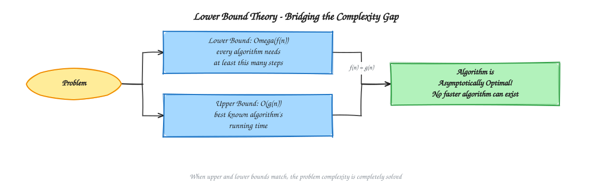
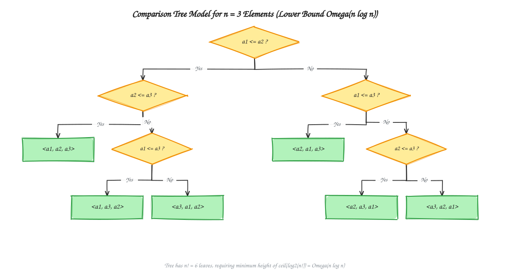
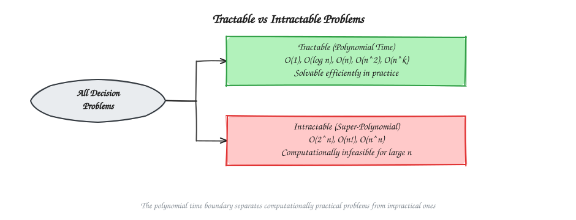
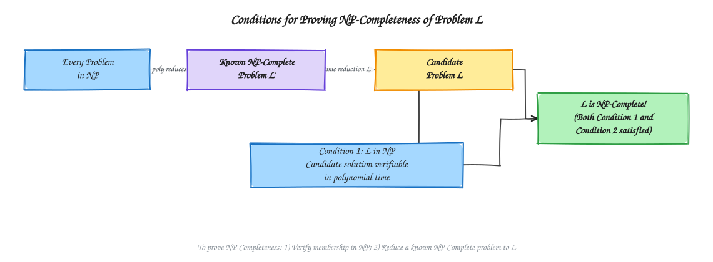
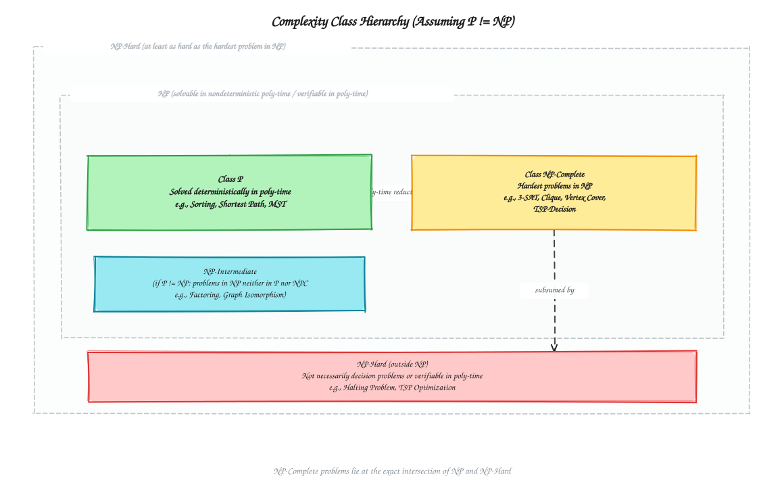

# Chapter 15: Lower Bound Theory and NP Completeness

[Previous: Chapter 14 - Randomized and Parallel Algorithms](../Chapter%2014%20-%20Randomized%20and%20Parallel%20Algorithms/README.md) | [Home](../README.md) | [Next: References](../References/README.md)

---

Lower bound theory asks how many operations *any* algorithm must perform to solve a problem, giving a yardstick against which real algorithms can be judged. Complexity classes then group decision problems by how hard they are to solve and to verify, separating problems that admit efficient algorithms from problems that (so far) do not.

---

## Table of Contents

1. [Lower Bound Theory](#1-lower-bound-theory)
   - [Lower Bound Concept](#lower-bound-concept)
   - [Comparison Sorting Lower Bound](#comparison-sorting-lower-bound)
   - [Decision Tree Model](#decision-tree-model)
   - [Algorithm Optimality](#algorithm-optimality)
2. [Complexity Classes](#2-complexity-classes)
   - [Tractable and Intractable Problems](#tractable-and-intractable-problems)
   - [Complexity Class P (Polynomial Time)](#complexity-class-p-polynomial-time)
   - [Complexity Class NP (Nondeterministic Polynomial Time)](#complexity-class-np-nondeterministic-polynomial-time)
   - [NP-Complete (NPC)](#np-complete-npc)
   - [NP-Hard](#np-hard)
3. [Analyze Time Complexity of Above Topics](#analyze-time-complexity-of-above-topics)

---

## 1. Lower Bound Theory

A **lower bound** tells us the best possible performance any algorithm could ever achieve for a problem, under a stated model of computation. It is a property of the *problem*, not of any single algorithm.

### Lower Bound Concept

For a problem, a lower bound of $\Omega(f(n))$ means:

> No algorithm solving this problem (within the given model of computation) can run faster than $\Omega(f(n))$ in the worst case.

- An **upper bound** comes from a specific algorithm: "this algorithm runs in $O(f(n))$."
- A **lower bound** comes from an argument about the problem itself: "every possible algorithm needs at least $\Omega(f(n))$ steps."
- When the upper bound of the best known algorithm matches the proven lower bound, the algorithm is called **asymptotically optimal**.

### Comparison Sorting Lower Bound

A **comparison sort** determines the output order only by comparing pairs of elements ($a_i \le a_j$?), never by inspecting the internal structure of the keys (Merge Sort, Heap Sort, Quicksort, Insertion Sort).

**Claim:** Any comparison-based sorting algorithm requires $\Omega(n\log n)$ comparisons in the worst case.

**Why:**

- There are $n!$ possible orderings of $n$ distinct elements, and the algorithm must be able to distinguish every one of them.
- Each comparison has only two outcomes, so the sequence of comparisons an algorithm makes on an input can be modeled as a binary tree with $n!$ leaves (see [Decision Tree Model](#decision-tree-model)).
- A binary tree with $n!$ leaves must have height at least $\lceil \log_2(n!) \rceil$.
- By Stirling's approximation, $\log_2(n!) = \Theta(n\log n)$.

$$
\text{Worst-case comparisons} \ge \log_2(n!) = \Omega(n\log n)
$$

So **no comparison sort can beat $\Omega(n\log n)$ in the worst case**, no matter how cleverly it is designed.

### Decision Tree Model

A **decision tree** models every possible execution of a comparison-based algorithm:

- Each **internal node** represents one comparison, e.g. $a_i \le a_j$?
- Each **edge** represents the outcome of that comparison (yes/no, or $\le$ / $>$).
- Each **leaf** represents one final answer (for sorting, one permutation of the input that the algorithm would output).
- The **height of the tree** equals the worst-case number of comparisons, because it is the longest root-to-leaf path.

For $n=3$ elements there are $3!=6$ possible orderings, so the tree needs at least $6$ leaves, and its height is at least $\lceil\log_2 6\rceil = 3$ comparisons in the worst case &mdash; matching the tree shown above.

A tree with $n!$ leaves and branching factor $2$ needs height $h$ such that $2^h \ge n!$, giving $h \ge \log_2(n!) = \Omega(n\log n)$.

### Algorithm Optimality

An algorithm is **asymptotically optimal** for a problem when its worst-case running time matches the problem's proven lower bound, up to constant factors.

| Algorithm | Worst-case time | Matches $\Omega(n\log n)$ lower bound? | Optimal comparison sort? |
| :--- | :---: | :---: | :---: |
| Merge Sort | $O(n\log n)$ | Yes | Yes |
| Heap Sort | $O(n\log n)$ | Yes | Yes |
| Quicksort | $O(n^2)$ worst case, $\Theta(n\log n)$ average | Only on average | No (worst case) |
| Insertion Sort | $O(n^2)$ | No | No |
| Counting Sort | $O(n+k)$ | Beats it, but not a comparison sort | Not comparable (different model) |
| Radix Sort | $O(d(n+k))$ | Beats it, but not a comparison sort | Not comparable (different model) |

Counting Sort and Radix Sort appear to "beat" the $\Omega(n\log n)$ bound only because they do not compare keys pairwise; they exploit extra structure of the keys (bounded integers, fixed-width digits). The lower bound applies strictly to the **comparison model**, so it is not violated.

## 2. Complexity Classes

In computational complexity, we care not only about *whether* a problem can be solved, but also *how efficiently* it can be solved and *how efficiently a proposed solution can be checked*. This section classifies decision problems by exactly those two questions.

### Tractable and Intractable Problems

Based on computational efficiency, problems are broadly classified into two categories.

#### Tractable Problems

A problem is called **tractable** if it can be solved efficiently by an algorithm whose running time is bounded by a polynomial function of the input size.

Common polynomial-time complexities, all considered tractable:

$$
O(1),\ O(\log n),\ O(n),\ O(n\log n),\ O(n^2),\ O(n^3),\ O(n^5)
$$

| Problem | Time Complexity |
| :--- | :---: |
| Binary Search | $O(\log n)$ |
| Merge Sort | $O(n\log n)$ |
| Breadth First Search (BFS) | $O(V+E)$ |
| Depth First Search (DFS) | $O(V+E)$ |
| Dijkstra's Algorithm | $O((V+E)\log V)$ |

Since every one of these algorithms runs in polynomial time, these problems are tractable.

#### Intractable Problems

A problem is called **intractable** if no polynomial-time algorithm is known to solve it. These problems generally require super-polynomial or exponential running time. Typical running times include:

$$
O(2^n),\ O(3^n),\ O(n!),\ O(n^n)
$$

Such algorithms become impractical even for moderately large inputs.

| Feature | Tractable | Intractable |
| :--- | :--- | :--- |
| Running time | Polynomial | Super-polynomial / exponential |
| Efficiency | Efficient | Inefficient |
| Practical for large inputs | Yes | No |
| Examples | Sorting, searching, BFS | TSP (brute force), Subset Sum (brute force) |

### Complexity Class P (Polynomial Time)

#### Definition

The complexity class **P** (Polynomial Time) is the set of all decision problems that can be solved by a **Deterministic Turing Machine (DTM)** in polynomial time.

A polynomial-time algorithm has a running time bounded by a polynomial function of the input size $n$, i.e. $O(n^k)$ for some constant $k$.

#### Why Is P Important?

Problems in class P are considered **tractable** (efficiently solvable) because their running time grows reasonably as the input size increases. In complexity theory, polynomial time is regarded as the practical notion of efficient computation.

#### Characteristics of Class P

- Decision problems only (the output is YES or NO).
- Solved by a Deterministic Turing Machine (DTM).
- Running time is polynomial.
- Considered computationally feasible.
- Every problem in $P$ is also in $NP$: $P \subseteq NP$.

| Problem | Best Known Time Complexity |
| :--- | :---: |
| Binary Search | $O(\log n)$ |
| Merge Sort | $O(n\log n)$ |
| Heap Sort | $O(n\log n)$ |
| Breadth First Search (BFS) | $O(V+E)$ |
| Depth First Search (DFS) | $O(V+E)$ |
| Dijkstra's Algorithm | $O((V+E)\log V)$ |
| Minimum Spanning Tree (Kruskal/Prim) | Polynomial |
| Matrix Multiplication | Polynomial |

This is the standard definition used in textbooks such as Sipser's *Introduction to the Theory of Computation* and Garey & Johnson's *Computers and Intractability*.

### Complexity Class NP (Nondeterministic Polynomial Time)

#### Definition

The complexity class **NP** (Nondeterministic Polynomial Time) is the set of all decision problems whose solutions can be **verified in polynomial time** by a Deterministic Turing Machine (DTM). Equivalently, NP is the set of decision problems that can be **solved** in polynomial time by a **Nondeterministic Turing Machine (NTM)**.

#### Alternative Definition (Verification View)

A language $L$ belongs to NP if there exists a polynomial-time deterministic algorithm that can verify a given certificate (candidate solution). Formally, $L \in NP$ if there exist:

- a polynomial $p(n)$, and
- a deterministic polynomial-time verifier $V$,

such that for every input $x$:

$$
x \in L \iff \exists\, c,\ |c| \le p(|x|),\ V(x, c) = \text{YES}
$$

where $c$ is the certificate (candidate solution / proof).

> **NP does not mean "Not Polynomial."** A problem in NP may be difficult to *solve*, but once a candidate solution is given, its correctness can be *checked* efficiently, in polynomial time.

#### Why Is NP Important?

Many important real-world problems belong to NP. Although finding the solution may require exploring a huge search space, verifying a proposed solution is relatively easy. Examples include:

- Sudoku
- Hamiltonian Cycle
- Boolean Satisfiability (SAT)
- Vertex Cover
- Traveling Salesman Problem (decision version)

#### Characteristics of NP

- Consists of decision problems.
- Solvable by a Nondeterministic Turing Machine (NTM) in polynomial time.
- Equivalently, solutions can be verified by a Deterministic Turing Machine (DTM) in polynomial time.
- Every problem in $P$ is also in $NP$, so $P \subseteq NP$.

#### Solving vs. Verifying

| | Solving | Verifying |
| :--- | :--- | :--- |
| Task | Find the solution from scratch | Check a proposed solution |
| Typical cost | May require exponential search | Polynomial-time checking |
| Difficulty | Usually difficult | Usually easy |

#### Relationship with P

Since every efficiently *solvable* problem can also be efficiently *verified* (just solve it and compare), we have:

$$
P \subseteq NP
$$

> **Remember:** $P$ = solve quickly. $NP$ = verify quickly.

Whether $P = NP$ or $P \subsetneq NP$ is the most famous open problem in computer science.

### NP-Complete (NPC)

#### Definition

A decision problem $L$ is **NP-Complete** if it satisfies both of the following conditions:

1. $L$ belongs to NP.
2. $L$ is NP-Hard.

An NP-Complete problem is one that can be verified in polynomial time **and** is at least as hard as every other problem in NP. These are considered the hardest decision problems inside NP.

#### Conditions for NP-Completeness

To prove that a problem $L$ is NP-Complete, two conditions must be satisfied.

**Condition 1 &mdash; Membership in NP:**

$$
L \in NP
$$

That is, a proposed solution (certificate) for $L$ can be verified in polynomial time.

**Condition 2 &mdash; NP-Hardness via reduction:**

$$
L' \le_p L \quad \text{for some already known NP-Complete problem } L'
$$

where $\le_p$ denotes **polynomial-time reduction**. If some already-known NP-Complete problem $L'$ can be transformed into $L$ in polynomial time, then $L$ is at least as hard as every problem in NP (because every NP problem already reduces to $L'$, and $L'$ reduces to $L$).

#### Characteristics of NP-Complete Problems

- Decision problems only.
- Belong to NP.
- Polynomial-time verifiable.
- NP-Hard.
- The hardest problems inside NP.

### NP-Hard

#### Definition

A problem is **NP-Hard** if every problem in NP can be reduced to it in polynomial time. An NP-Hard problem is at least as difficult as every problem in NP.

Unlike NP-Complete problems, an NP-Hard problem:

- may **not** belong to NP, and
- may **not** even be a decision problem.

Therefore, NP-Hard problems do not need to have a polynomial-time verification algorithm.

#### Characteristics of NP-Hard Problems

- At least as hard as every NP problem.
- May be a decision problem or an optimization problem.
- May even be undecidable.
- Does not have to belong to NP.

| Problem | Category |
| :--- | :--- |
| Traveling Salesman Problem (optimization version) | NP-Hard |
| Job Scheduling (optimization version) | NP-Hard |
| Knapsack (optimization version) | NP-Hard |
| Halting Problem | NP-Hard (and undecidable) |

#### Comparison: NP-Complete vs. NP-Hard

| Feature | NP-Complete | NP-Hard |
| :--- | :---: | :---: |
| Decision problem | Yes | Not necessarily |
| Belongs to NP | Yes | Not required |
| Polynomial-time verification | Yes | Not required |
| At least as hard as every NP problem | Yes | Yes |
| May be an optimization problem | Usually no | Yes |
| May be undecidable | No | Yes |

The diagram assumes the common conjecture $P \ne NP$; if $P = NP$ were ever proven, the $P$ and $NP$ regions above would coincide.

---

## Analyze Time Complexity of Above Topics

| Topic | Key idea | Relevant complexity |
| :--- | :--- | :---: |
| Comparison sort lower bound | Decision tree with $n!$ leaves | $\Omega(n\log n)$ worst-case comparisons |
| Merge Sort / Heap Sort | Matches the comparison-sort lower bound | $O(n\log n)$, asymptotically optimal |
| Class P | Solvable by a DTM in polynomial time | $O(n^k)$ for some constant $k$ |
| Class NP | Verifiable by a DTM in polynomial time | Verifier runs in $O(n^k)$ |
| NP-Complete | In NP and NP-Hard | Verification $O(n^k)$; reduction from any NP-Complete problem |
| NP-Hard | Every NP problem reduces to it | No verification-time guarantee required |

### Final Revision Checklist

Before moving to the next chapter, make sure you can explain:

- The difference between an upper bound (from an algorithm) and a lower bound (from the problem itself).
- Why the decision tree model proves $\Omega(n\log n)$ for comparison sorts.
- Why Counting Sort and Radix Sort do not violate the comparison-sort lower bound.
- What it means for an algorithm to be asymptotically optimal.
- The difference between tractable and intractable problems.
- The definition of class P and why it is considered "efficiently solvable."
- The definition of class NP through both the NTM view and the polynomial-time verifier view.
- Why "NP" does not stand for "Not Polynomial."
- Why $P \subseteq NP$, and why $P = NP$ is still an open problem.
- The two conditions required to prove a problem is NP-Complete.
- Why every NP-Hard problem is at least as hard as every NP problem, even if it is not in NP itself.
- How NP-Complete and NP-Hard differ (decision problem vs. optimization/undecidable problem, verifiability, membership in NP).
- How the greedy MST algorithms in [Chapter 11: Spanning Trees](../Chapter%2011%20-%20Graph%20Algorithms/README.md#12-spanning-trees) and the [Chapter 7: Greedy Algorithms](../Chapter%207%20-%20Greedy%20Algorithms/README.md#3-greedy-graph-optimization) cut property both stay inside class P, unlike the NP-Hard problems discussed here.

---

[Previous: Chapter 14 - Randomized and Parallel Algorithms](../Chapter%2014%20-%20Randomized%20and%20Parallel%20Algorithms/README.md) | [Home](../README.md) | [Next: References](../References/README.md)
