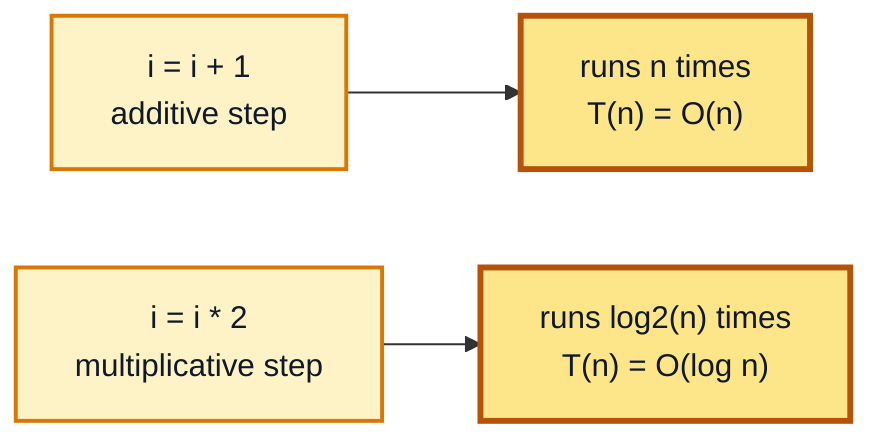
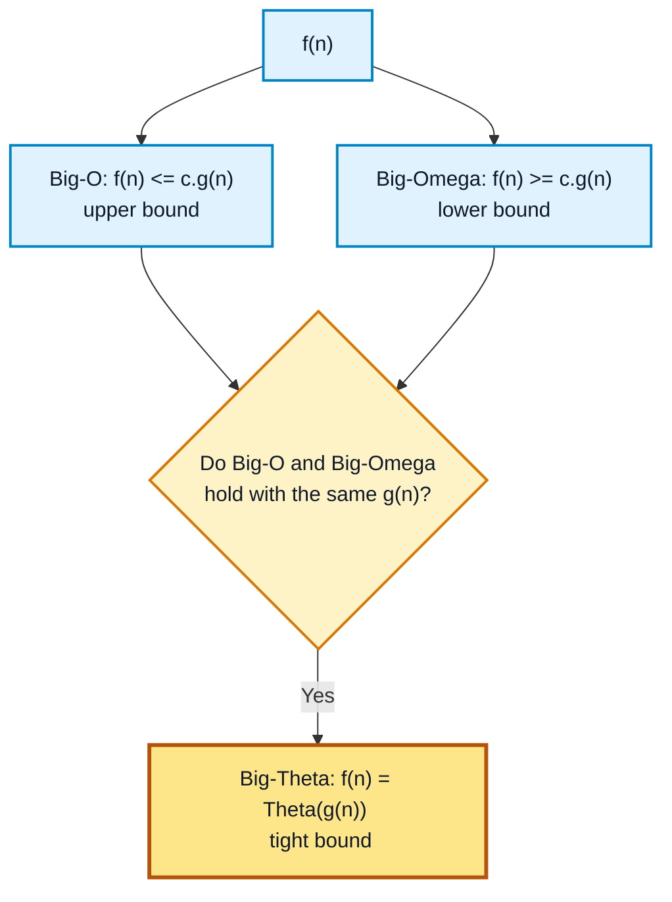

# Chapter 2 - Complexity Analysis and Asymptotic Notation

[Previous: Chapter 1 - Introduction and Algorithm Foundations](../Chapter%201%20-%20Introduction%20and%20Algorithm%20Foundations/README.md) | [Home](../README.md) | [Next: Chapter 3 - Recurrences Correctness and Loop Invariants](../Chapter%203%20-%20Recurrences%20Correctness%20and%20Loop%20Invariants/README.md)

---

Complexity analysis measures how the running time (or space) of an algorithm grows as the input size $n$ grows. Asymptotic notation gives a precise mathematical language for describing that growth while ignoring machine-dependent constants and low-order terms.

This chapter covers how to read time complexity directly from loop structure, and how to state that complexity formally using Big-O, Big-Omega, and Big-Theta notation.

---

## Table of Contents

1. [Time Complexity of Loops](#1-time-complexity-of-loops)
   - [Linear Loops](#linear-loops)
   - [Logarithmic Loops](#logarithmic-loops)
2. [Asymptotic Notation](#2-asymptotic-notation)
   - [Big-O Notation - Upper Bound](#big-o-notation---upper-bound)
   - [Big-Omega Notation - Lower Bound](#big-omega-notation---lower-bound)
   - [Big-Theta Notation - Tight Bound](#big-theta-notation---tight-bound)
3. [Comparing the Three Notations](#3-comparing-the-three-notations)
4. [Analyze Time Complexity of Above Loop Patterns](#analyze-time-complexity-of-above-loop-patterns)

---

## 1. Time Complexity of Loops

The fastest way to estimate an algorithm's running time is to count how many times its loop body executes as a function of $n$.

### Linear Loops

```c
for (i = 1; i <= n; i++) {
    // constant work
}
```

The counter $i$ increases by 1 every iteration, so the loop body runs exactly $n$ times.

$$
T(n) = n \implies T(n) = O(n)
$$

The same conclusion holds for any loop whose counter moves by a fixed step over a range of size $n$, regardless of the starting index or the comparison operator:

```c
for (j = 0; j < n; j++) {
    // constant work
}
```

This loop also runs $n$ times, so $T(n) = O(n)$.

### Logarithmic Loops

```c
for (i = 1; i <= n; i *= 2) {
    // constant work
}
```

Here $i$ does not increase by a fixed amount, it **doubles** every iteration:

$$
1, 2, 4, 8, 16, \dots, n
$$

After $k$ iterations, $i = 2^k$. The loop stops once:

$$
2^k = n \implies k = \log_2 n
$$

So the loop body runs $\log_2 n$ times:

$$
T(n) = O(\log n)
$$

The same idea applies when the counter is divided instead of multiplied each time (for example `i /= 2`): halving or doubling a value down to/up from 1, $n$ times, both take $\log_2 n$ steps.

### Visual Map: Loop Growth Rate



---

## 2. Asymptotic Notation

Asymptotic notation describes how a function grows for large $n$, ignoring constant factors and lower-order terms. It answers three different questions about a running-time function $f(n)$: what is its **upper bound**, its **lower bound**, and its **exact bound**.

### Big-O Notation - Upper Bound

$$
f(n) = O(g(n))
$$

if there exist positive constants $c$ and $n_0$ such that:

$$
f(n) \le c \cdot g(n), \qquad \text{for all } n \ge n_0
$$

Big-O gives the **worst-case growth rate** — $g(n)$ grows at least as fast as $f(n)$ once $n$ is large enough.

**Example:** $3n + 5 = O(n)$, because for large $n$ the term $n$ dominates the constant terms. Choosing $c = 8$ and $n_0 = 1$ satisfies $3n + 5 \le 8n$ for all $n \ge 1$.

### Big-Omega Notation - Lower Bound

$$
f(n) = \Omega(g(n))
$$

if there exist positive constants $c$ and $n_0$ such that:

$$
f(n) \ge c \cdot g(n), \qquad \text{for all } n \ge n_0
$$

Big-Omega gives the **best-case (minimum) growth rate** — $f(n)$ never grows slower than $g(n)$ beyond $n_0$.

### Big-Theta Notation - Tight Bound

$$
f(n) = \Theta(g(n))
$$

if and only if both of the following hold:

$$
f(n) = O(g(n)) \qquad \text{and} \qquad f(n) = \Omega(g(n))
$$

Big-Theta means $g(n)$ sandwiches $f(n)$ from both above and below, so it gives the **exact asymptotic growth rate**, not just a bound.

### Visual Map: Upper vs Lower vs Tight Bound



---

## 3. Comparing the Three Notations

| Notation | Bound Type | Condition | Reads As |
| :---: | :--- | :--- | :--- |
| $O(g(n))$ | Upper bound | $f(n) \le c \cdot g(n)$ | $f$ grows **no faster than** $g$ |
| $\Omega(g(n))$ | Lower bound | $f(n) \ge c \cdot g(n)$ | $f$ grows **no slower than** $g$ |
| $\Theta(g(n))$ | Tight bound | $O(g(n))$ and $\Omega(g(n))$ both hold | $f$ grows **exactly as fast as** $g$ |

---

## Analyze Time Complexity of Above Loop Patterns

| Loop Pattern | Counter Update | Iterations | Time Complexity |
| :--- | :--- | :--- | :--- |
| `for (i = 1; i <= n; i++)` | additive (+1) | $n$ | $O(n)$ |
| `for (j = 0; j < n; j++)` | additive (+1) | $n$ | $O(n)$ |
| `for (i = 1; i <= n; i *= 2)` | multiplicative (×2) | $\log_2 n$ | $O(\log n)$ |

The recurrence-based way of proving the logarithmic result for divide-style recursive algorithms (rather than loops) is covered next, in [Chapter 3 - Recurrences Correctness and Loop Invariants](../Chapter%203%20-%20Recurrences%20Correctness%20and%20Loop%20Invariants/README.md).

---

[Previous: Chapter 1 - Introduction and Algorithm Foundations](../Chapter%201%20-%20Introduction%20and%20Algorithm%20Foundations/README.md) | [Home](../README.md) | [Next: Chapter 3 - Recurrences Correctness and Loop Invariants](../Chapter%203%20-%20Recurrences%20Correctness%20and%20Loop%20Invariants/README.md)
