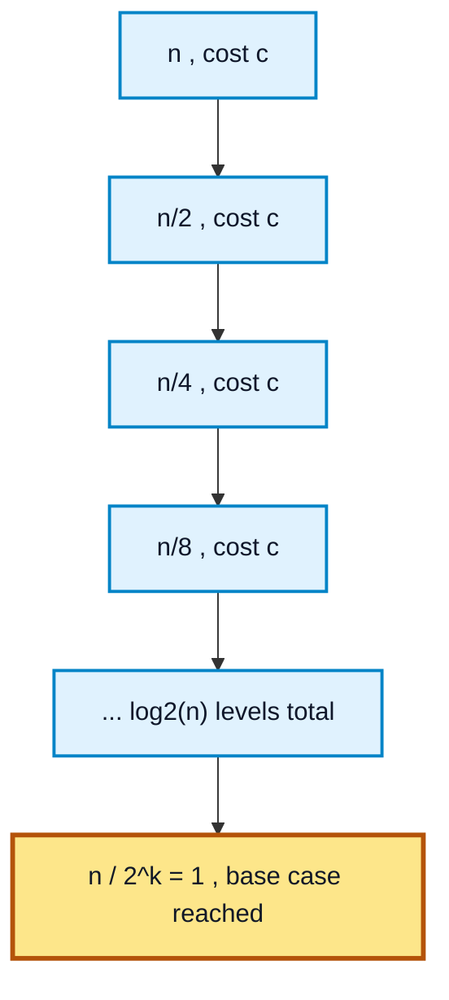
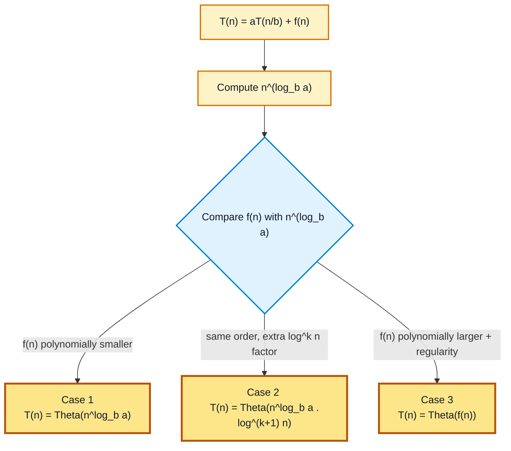

# Chapter 3 - Recurrences Correctness and Loop Invariants

[Previous: Chapter 2 - Complexity Analysis and Asymptotic Notation](../Chapter%202%20-%20Complexity%20Analysis%20and%20Asymptotic%20Notation/README.md) | [Home](../README.md) | [Next: Chapter 4 - Searching and Basic Traversal](../Chapter%204%20-%20Searching%20and%20Basic%20Traversal/README.md)

---

A recurrence relation expresses the running time of a recursive algorithm in terms of the running time on smaller inputs, plus a base case. This chapter shows how to build a recurrence directly from a recursive algorithm, how to solve it by manual expansion (the recursion-tree/substitution idea), and how to solve general divide-and-conquer recurrences quickly using the Master Theorem.

---

## Table of Contents

1. [What Is a Recurrence Relation?](#1-what-is-a-recurrence-relation)
2. [Case Study: Binary Search Recurrence](#2-case-study-binary-search-recurrence)
   - [Solving by Expansion](#solving-by-expansion-recursion-treesubstitution)
3. [General Divide-and-Conquer Recurrence](#3-general-divide-and-conquer-recurrence)
4. [Master Theorem](#4-master-theorem)
5. [Worked Examples Using the Master Theorem](#5-worked-examples-using-the-master-theorem)
   - [Example 1: T(n) = 8T(n/2) + n^2](#example-1-tn--8tn2--n2)
   - [Example 2: T(n) = T(n/2) + c](#example-2-tn--tn2--c)
6. [Analyze Time Complexity of Above Recurrences](#analyze-time-complexity-of-above-recurrences)

---

## 1. What Is a Recurrence Relation?

A recurrence relation defines a function's value in terms of its value on smaller inputs, together with a base case for the smallest input. For a recursive algorithm, the recurrence directly mirrors the recursive calls made by the algorithm:

$$
T(n) = \text{(cost of the recursive subproblem(s))} + \text{(cost of dividing and combining)}
$$

Solving the recurrence means reducing it to a closed-form asymptotic bound such as $O(\log n)$, $O(n)$, or $O(n \log n)$.

---

## 2. Case Study: Binary Search Recurrence

Binary search discards half of the remaining search space using only $O(1)$ extra work (one comparison) per call, so its recurrence is:

$$
T(n) = T(n/2) + c, \qquad T(1) = 1
$$

### Solving by Expansion (Recursion-Tree/Substitution)

Expand the recurrence one level at a time:

$$
T(n) = T(n/2) + c
$$

$$
T(n/2) = T(n/4) + c \implies T(n) = T(n/4) + 2c
$$

$$
T(n/4) = T(n/8) + c \implies T(n) = T(n/8) + 3c
$$

After $k$ expansions, the pattern is:

$$
T(n) = T(n/2^k) + kc
$$

The recursion bottoms out at the base case, i.e., when:

$$
\frac{n}{2^k} = 1 \implies n = 2^k \implies k = \log_2 n
$$

Substituting back with $T(1) = 1$:

$$
T(n) = T(1) + c\log_2 n = 1 + c\log_2 n
$$

Dropping the constant factor and the lower-order additive term:

$$
T(n) = \Theta(\log n)
$$

So **binary search runs in $O(\log n)$ time**, matching the iterative analysis in [Chapter 4 - Searching and Basic Traversal](../Chapter%204%20-%20Searching%20and%20Basic%20Traversal/README.md).

### Visual Map: Recursion Tree for T(n) = T(n/2) + c

---

## 3. General Divide-and-Conquer Recurrence

Most divide-and-conquer algorithms produce a recurrence of the form:

$$
T(n) = aT(n/b) + f(n)
$$

| Symbol | Meaning |
| :---: | :--- |
| $a$ | Number of subproblems the problem is divided into ($a \ge 1$) |
| $n/b$ | Size of each subproblem ($b > 1$) |
| $f(n)$ | Cost of dividing the problem and combining the subproblem results |

---

## 4. Master Theorem

The Master Theorem gives the asymptotic solution to $T(n) = aT(n/b) + f(n)$ directly, by comparing $f(n)$ against the **watershed function** $n^{\log_b a}$.

| Case | Condition on $f(n)$ | Result |
| :---: | :--- | :--- |
| 1 | $f(n) = O(n^{\log_b a - \epsilon})$ for some $\epsilon > 0$ ($f(n)$ grows polynomially **slower**) | $T(n) = \Theta(n^{\log_b a})$ |
| 2 | $f(n) = \Theta(n^{\log_b a} \log^k n)$ for some $k \ge 0$ ($f(n)$ grows at the **same** rate) | $T(n) = \Theta(n^{\log_b a} \log^{k+1} n)$ |
| 3 | $f(n) = \Omega(n^{\log_b a + \epsilon})$ for some $\epsilon > 0$, and the regularity condition $a \cdot f(n/b) \le c \cdot f(n)$ holds for some $c < 1$ and all large $n$ ($f(n)$ grows polynomially **faster**) | $T(n) = \Theta(f(n))$ |

### Visual Map: Choosing the Right Case

---

## 5. Worked Examples Using the Master Theorem

### Example 1: T(n) = 8T(n/2) + n^2

Here $a = 8$, $b = 2$, $f(n) = n^2$.

$$
n^{\log_b a} = n^{\log_2 8} = n^3
$$

Compare $f(n) = n^2$ with $n^{\log_b a} = n^3$:

$$
n^2 = O(n^{3 - \epsilon}) \quad \text{for } \epsilon = 1
$$

This satisfies **Case 1**, so:

$$
T(n) = \Theta(n^3)
$$

### Example 2: T(n) = T(n/2) + c

Here $a = 1$, $b = 2$, $f(n) = c$ (a constant, i.e., $\Theta(1)$).

$$
n^{\log_b a} = n^{\log_2 1} = n^0 = 1
$$

Compare $f(n) = c = \Theta(n^0 \log^0 n)$ with $n^{\log_b a} = n^0$: they match with $k = 0$.

This satisfies **Case 2**, so:

$$
T(n) = \Theta(n^0 \log^{0+1} n) = \Theta(\log n)
$$

This confirms the same result found earlier by direct expansion of the binary search recurrence.

---

## Analyze Time Complexity of Above Recurrences

| Recurrence | $a$ | $b$ | $f(n)$ | $n^{\log_b a}$ | Master Theorem Case | Result |
| :--- | :---: | :---: | :---: | :---: | :---: | :--- |
| $T(n) = T(n/2) + c$ (Binary Search) | 1 | 2 | $\Theta(1)$ | $1$ | Case 2 ($k=0$) | $\Theta(\log n)$ |
| $T(n) = 8T(n/2) + n^2$ | 8 | 2 | $n^2$ | $n^3$ | Case 1 | $\Theta(n^3)$ |

---

[Previous: Chapter 2 - Complexity Analysis and Asymptotic Notation](../Chapter%202%20-%20Complexity%20Analysis%20and%20Asymptotic%20Notation/README.md) | [Home](../README.md) | [Next: Chapter 4 - Searching and Basic Traversal](../Chapter%204%20-%20Searching%20and%20Basic%20Traversal/README.md)
