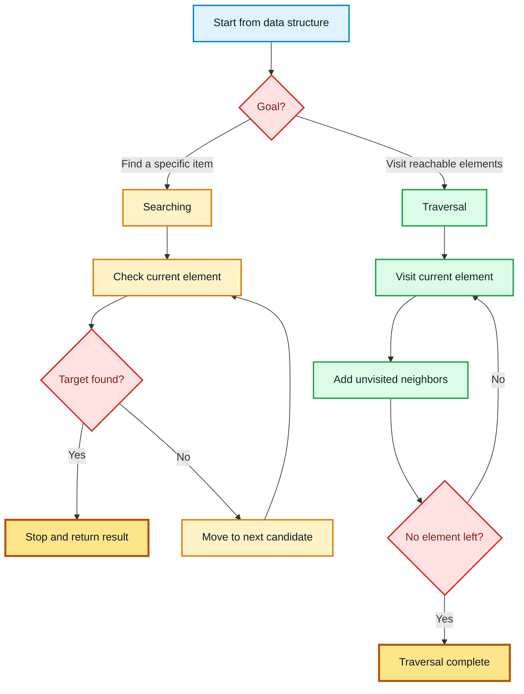
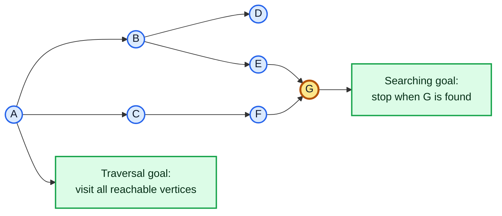
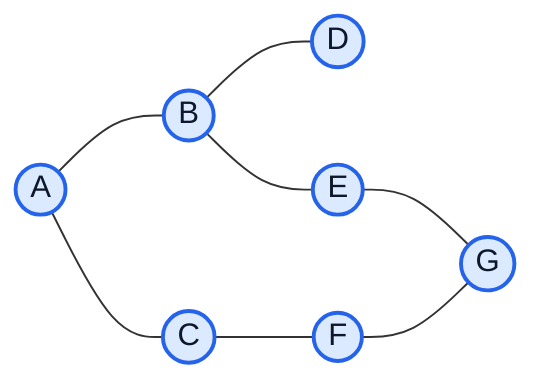
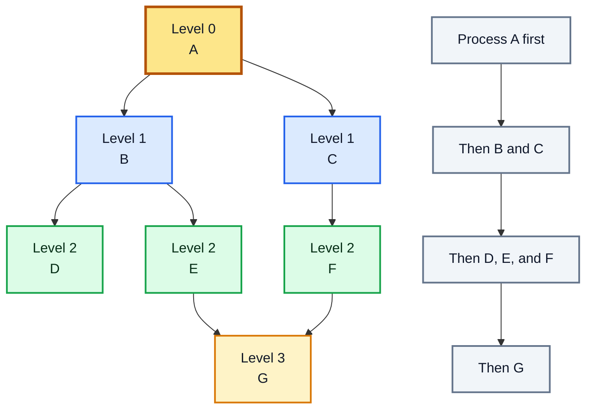
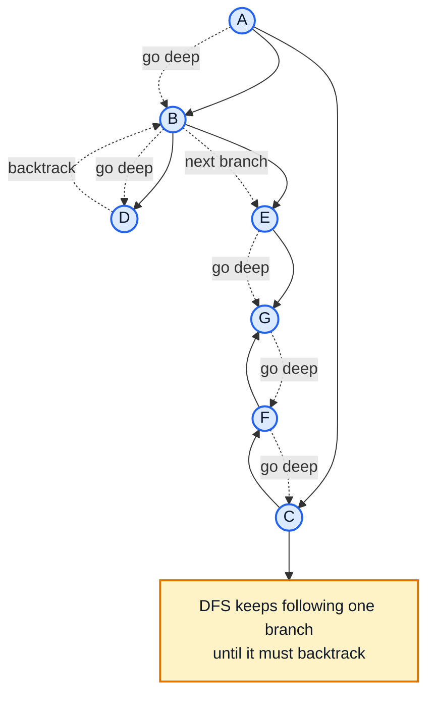
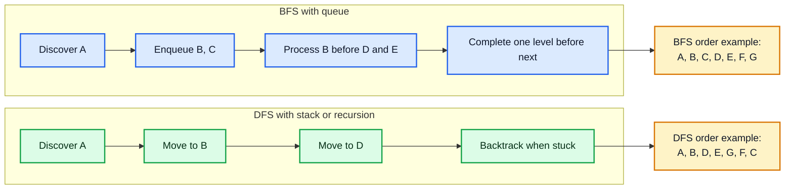

# Chapter 4: Searching and Basic Traversal

[Previous: Chapter 3 - Recurrences Correctness and Loop Invariants](../Chapter%203%20-%20Recurrences%20Correctness%20and%20Loop%20Invariants/README.md) | [Home](../README.md) | [Next: Chapter 5 - Sorting Algorithms](../Chapter%205%20-%20Sorting%20Algorithms/README.md)

---

Searching and traversal are basic techniques for moving through data. Searching tries to find a required item or answer. Traversal visits elements in a planned order so that each reachable element is processed.

This chapter keeps only the requested Searching and Basic Traversal topics. The main focus is introductory graph traversal using Breadth-First Search (BFS) and Depth-First Search (DFS), with simple explanations, algorithms, queue and stack behavior, examples, applications, and time complexity.

---

## Table of Contents

1. [Searching and Basic Traversal](#searching-and-basic-traversal)
2. [Basic Search and Traversal Techniques](#1-basic-search-and-traversal-techniques)
3. [Searching vs Traversal](#2-searching-vs-traversal)
4. [Introductory Graph Traversal](#3-introductory-graph-traversal)
5. [Breadth-First Search (BFS)](#4-breadth-first-search-bfs)
   - [BFS Idea](#bfs-idea)
   - [BFS Algorithm](#bfs-algorithm)
   - [Queue Implementation](#queue-implementation)
   - [BFS Traversal Walkthrough](#bfs-traversal-walkthrough)
   - [BFS Complexity Analysis](#bfs-complexity-analysis)
   - [Basic Applications of BFS](#basic-applications-of-bfs)
6. [Depth-First Search (DFS)](#5-depth-first-search-dfs)
   - [DFS Idea](#dfs-idea)
   - [Recursive Version](#recursive-version)
   - [Stack-Based Version](#stack-based-version)
   - [DFS Traversal Walkthrough](#dfs-traversal-walkthrough)
   - [DFS Complexity Analysis](#dfs-complexity-analysis)
   - [Basic Applications of DFS](#basic-applications-of-dfs)
7. [BFS vs DFS Quick Comparison](#6-bfs-vs-dfs-quick-comparison)
8. [Recommended Study Sequence](#7-recommended-study-sequence)
9. [Analyze Time Complexity of BFS and DFS](#8-analyze-time-complexity-of-bfs-and-dfs)

---

## Searching and Basic Traversal

Searching and traversal both move through data, but their goals are different.

- **Searching** asks: "Where is the required item?"
- **Traversal** asks: "How can we visit every required element?"

In graph problems, traversal is often the foundation for searching. If we know how to visit vertices correctly, we can also search for a target vertex, a path, a connected component, or another property.

The two most important basic graph traversal techniques are:

- **Breadth-First Search (BFS):** visits vertices level by level using a queue.
- **Depth-First Search (DFS):** goes as deep as possible before backtracking, using recursion or a stack.

### Visual Map: Search and Traversal Flow



---

## 1. Basic Search and Traversal Techniques

A **search technique** checks elements until it finds the required target or proves that the target is not reachable.

A **traversal technique** visits elements in a controlled order. In a graph, this usually means starting from one vertex and visiting all vertices reachable from it.

Most basic searching and traversal methods use four common ideas:

| Idea | Meaning |
| :--- | :--- |
| Current element | The element being checked or processed now |
| Frontier | The waiting collection of elements to visit next |
| Visited set | A record of elements already discovered |
| Processing step | The work done when an element is visited |

The **frontier** controls the traversal order.

| Frontier type | Technique | Behavior |
| :--- | :--- | :--- |
| Queue | BFS | First discovered vertex is processed first |
| Stack | DFS | Most recently discovered vertex is processed first |
| Recursion call stack | DFS | Function calls naturally go deep before returning |

Generic graph traversal pattern:

```text
TRAVERSE(G, start)
1. create an empty frontier
2. mark start as visited
3. add start to the frontier
4. while the frontier is not empty:
5.     remove one vertex u from the frontier
6.     process u
7.     for each neighbor v of u:
8.         if v is not visited:
9.             mark v as visited
10.            add v to the frontier
```

If the frontier is a **queue**, this pattern becomes BFS. If the frontier is a **stack**, this pattern becomes DFS.

---

## 2. Searching vs Traversal

Searching and traversal are closely related, but they are not the same.

| Feature | Searching | Traversal |
| :--- | :--- | :--- |
| Main goal | Find a target or answer | Visit all reachable elements |
| Stopping condition | Usually stops when the target is found | Usually stops when all reachable elements are visited |
| Output | Target position, true/false, path, or value | Visiting order, component, tree, or processed data |
| Example question | "Is vertex G reachable from A?" | "Visit every vertex reachable from A." |
| Common tools | BFS, DFS, linear search, binary search | BFS, DFS, tree traversal |

Example:

- If we use BFS from vertex $A$ and stop when vertex $G$ is found, it is a **search**.
- If we use BFS from vertex $A$ and continue until no reachable vertex remains, it is a **traversal**.

### Visual Map: Same Movement, Different Purpose



---

## 3. Introductory Graph Traversal

A **graph** is a collection of vertices and edges.

- A **vertex** is a point or node.
- An **edge** is a connection between two vertices.
- An **undirected graph** has edges that can be used in both directions.
- A **directed graph** has edges with a fixed direction.
- A **connected graph** has a path between every pair of vertices.
- A **disconnected graph** has at least one vertex that cannot be reached from another part of the graph.

Graph traversal means visiting vertices by following edges.

The most common graph representation for BFS and DFS is an **adjacency list**.

Example graph:



Adjacency list for the graph:

| Vertex | Neighbors |
| :---: | :--- |
| A | B, C |
| B | A, D, E |
| C | A, F |
| D | B |
| E | B, G |
| F | C, G |
| G | E, F |

For a graph traversal, we normally maintain:

| Data | Purpose |
| :--- | :--- |
| `visited[v]` | Tells whether vertex `v` has already been discovered |
| `parent[v]` | Stores the vertex from which `v` was first reached |
| `distance[v]` | In BFS, stores the number of edges from the source |
| frontier | Queue for BFS or stack for DFS |

### Traversing a Disconnected Graph

If a graph is disconnected, starting from one vertex may not visit every vertex. To traverse the whole graph, run BFS or DFS from every unvisited vertex.

```text
TRAVERSE-ALL(G)
1. for each vertex u in G:
2.     visited[u] = false
3. for each vertex u in G:
4.     if visited[u] == false:
5.         run BFS or DFS starting from u
```

This outer loop makes sure every connected part of the graph is covered.

---

## 4. Breadth-First Search (BFS)

**Breadth-First Search (BFS)** visits vertices level by level. It first visits the starting vertex, then all vertices at distance 1, then all vertices at distance 2, and so on.

BFS uses a **queue**, so the first discovered vertex is processed first.

### BFS Idea

The main idea of BFS is simple:

1. Start from a source vertex.
2. Visit all immediate neighbors first.
3. Then visit neighbors of those neighbors.
4. Continue level by level until no reachable vertex remains.

Because BFS expands in layers, it finds the shortest path in an unweighted graph.

### Visual Map: BFS Level Movement



### BFS Algorithm

```text
BFS(G, s)
1. for each vertex u in G:
2.     visited[u] = false
3.     parent[u] = NIL
4.     distance[u] = infinity
5. create an empty queue Q
6. visited[s] = true
7. distance[s] = 0
8. ENQUEUE(Q, s)
9. while Q is not empty:
10.    u = DEQUEUE(Q)
11.    process u
12.    for each vertex v in Adj[u]:
13.        if visited[v] == false:
14.            visited[v] = true
15.            parent[v] = u
16.            distance[v] = distance[u] + 1
17.            ENQUEUE(Q, v)
```

Important note: in BFS, a vertex is usually marked as visited when it is **enqueued**, not when it is dequeued. This prevents the same vertex from being inserted into the queue many times.

### Queue Implementation

A queue follows **FIFO** order: first in, first out.

| Queue operation | Meaning |
| :--- | :--- |
| `ENQUEUE(Q, x)` | Add `x` to the back of the queue |
| `DEQUEUE(Q)` | Remove and return the front element |
| `isEmpty(Q)` | Check whether the queue has no element |

BFS queue pattern:

```text
create empty queue Q
mark source as visited
ENQUEUE(Q, source)

while Q is not empty:
	u = DEQUEUE(Q)
	process u
	for each unvisited neighbor v of u:
		mark v as visited
		ENQUEUE(Q, v)
```

### BFS Traversal Walkthrough

Use the example graph from the introductory section and start BFS from vertex $A$. Neighbors are considered in alphabetical order.

| Step | Queue before dequeue | Dequeued vertex | Newly enqueued vertices | Queue after step | Traversal order |
| :---: | :--- | :---: | :--- | :--- | :--- |
| 0 | `A` | - | - | `A` | - |
| 1 | `A` | A | B, C | `B, C` | A |
| 2 | `B, C` | B | D, E | `C, D, E` | A, B |
| 3 | `C, D, E` | C | F | `D, E, F` | A, B, C |
| 4 | `D, E, F` | D | - | `E, F` | A, B, C, D |
| 5 | `E, F` | E | G | `F, G` | A, B, C, D, E |
| 6 | `F, G` | F | - | `G` | A, B, C, D, E, F |
| 7 | `G` | G | - | empty | A, B, C, D, E, F, G |

BFS traversal order from $A$:

```text
A, B, C, D, E, F, G
```

BFS distance values:

| Vertex | Distance from A | Meaning |
| :---: | :---: | :--- |
| A | 0 | Source vertex |
| B | 1 | One edge away from A |
| C | 1 | One edge away from A |
| D | 2 | A -> B -> D |
| E | 2 | A -> B -> E |
| F | 2 | A -> C -> F |
| G | 3 | A -> B -> E -> G |

### BFS Complexity Analysis

For an adjacency list representation:

| Part | Cost |
| :--- | :--- |
| Initialize all vertices | $O(V)$ |
| Enqueue and dequeue each vertex at most once | $O(V)$ |
| Scan all adjacency lists | $O(E)$ |
| Total time complexity | `O(V + E)` |
| Space complexity | $O(V)$ |

Here, $V$ is the number of vertices and $E$ is the number of edges.

BFS has time complexity `O(V + E)` because every vertex is processed once and every edge is checked through the adjacency lists.

### Basic Applications of BFS

| Application | How BFS helps |
| :--- | :--- |
| Reachability | Checks whether one vertex can be reached from another |
| Shortest path in an unweighted graph | Finds the minimum number of edges from the source |
| Level order traversal | Visits vertices by distance level |
| Connected components | Repeated BFS can find all connected parts of a graph |
| Minimum moves problems | Models each state as a vertex and each move as an edge |

BFS is usually preferred when the problem asks for the nearest answer, the smallest number of steps, or level-by-level exploration.

---

## 5. Depth-First Search (DFS)

**Depth-First Search (DFS)** explores one path as far as possible before returning to try another path.

DFS can be implemented in two common ways:

- **Recursive DFS:** uses the function call stack.
- **Stack-based DFS:** uses an explicit stack data structure.

### DFS Idea

The main idea of DFS is:

1. Start from a vertex.
2. Visit one unvisited neighbor.
3. Continue going deeper from that neighbor.
4. When there is no unvisited neighbor, backtrack.
5. Try another unvisited branch.

DFS is useful when we need to explore complete paths, detect structure, or process graph components.

### Visual Map: DFS Deep Movement and Backtracking



### Recursive Version

Recursive DFS is the simplest version to understand. The recursion automatically remembers where to return after a deep path finishes.

```text
DFS-RECURSIVE(G, u)
1. visited[u] = true
2. process u
3. for each vertex v in Adj[u]:
4.     if visited[v] == false:
5.         parent[v] = u
6.         DFS-RECURSIVE(G, v)
```

To start DFS from source vertex `s`:

```text
for each vertex u in G:
	visited[u] = false
	parent[u] = NIL

DFS-RECURSIVE(G, s)
```

For a disconnected graph, call `DFS-RECURSIVE` for every unvisited vertex.

```text
DFS-ALL(G)
1. for each vertex u in G:
2.     visited[u] = false
3.     parent[u] = NIL
4. for each vertex u in G:
5.     if visited[u] == false:
6.         DFS-RECURSIVE(G, u)
```

### Stack-Based Version

Stack-based DFS replaces recursion with an explicit stack.

A stack follows **LIFO** order: last in, first out.

| Stack operation | Meaning |
| :--- | :--- |
| `PUSH(S, x)` | Add `x` to the top of the stack |
| `POP(S)` | Remove and return the top element |
| `isEmpty(S)` | Check whether the stack has no element |

Iterative DFS pattern:

```text
DFS-STACK(G, s)
1. for each vertex u in G:
2.     visited[u] = false
3.     parent[u] = NIL
4. create an empty stack S
5. PUSH(S, s)
6. while S is not empty:
7.     u = POP(S)
8.     if visited[u] == true:
9.         continue
10.    visited[u] = true
11.    process u
12.    for each vertex v in Adj[u] in reverse order:
13.        if visited[v] == false:
14.            parent[v] = u
15.            PUSH(S, v)
```

The reverse order is used only to make the stack version produce a similar visiting order to the recursive version when neighbors are listed alphabetically. Different valid DFS orders are possible if neighbors are considered in a different order.

### DFS Traversal Walkthrough

Use the same example graph and start DFS from vertex $A$. Neighbors are considered in alphabetical order.

Recursive DFS movement:

| Step | Current vertex | Action | Traversal order so far |
| :---: | :---: | :--- | :--- |
| 1 | A | Visit A, go to B | A |
| 2 | B | Visit B, go to D | A, B |
| 3 | D | Visit D, no new neighbor, backtrack | A, B, D |
| 4 | B | Go to E | A, B, D |
| 5 | E | Visit E, go to G | A, B, D, E |
| 6 | G | Visit G, go to F | A, B, D, E, G |
| 7 | F | Visit F, go to C | A, B, D, E, G, F |
| 8 | C | Visit C, no new neighbor, backtrack | A, B, D, E, G, F, C |

DFS traversal order from $A$:

```text
A, B, D, E, G, F, C
```

The exact DFS order can change if the adjacency list order changes. The important rule is that DFS keeps going deeper whenever an unvisited neighbor exists.

### DFS Complexity Analysis

For an adjacency list representation:

| Part | Cost |
| :--- | :--- |
| Initialize all vertices | $O(V)$ |
| Visit each vertex once | $O(V)$ |
| Scan all adjacency lists | $O(E)$ |
| Total time complexity | `O(V + E)` |
| Space complexity | $O(V)$ |

DFS has time complexity `O(V + E)` because each vertex is visited once and each edge is examined through the adjacency lists.

Space complexity is $O(V)$ because of the visited array and either the recursion call stack or the explicit stack.

### Basic Applications of DFS

| Application | How DFS helps |
| :--- | :--- |
| Reachability | Checks whether one vertex can be reached from another |
| Connected components | Repeated DFS can identify separate graph parts |
| Path finding | Explores possible paths from a source vertex |
| Cycle detection | Finds whether backtracking reaches an already active vertex |
| Topological ordering | Orders tasks in a directed acyclic graph |

DFS is usually preferred when the problem needs deep exploration, backtracking, or structural information about a graph.

---

## 6. BFS vs DFS Quick Comparison

| Feature | BFS | DFS |
| :--- | :--- | :--- |
| Full form | Breadth-First Search | Depth-First Search |
| Main behavior | Visits level by level | Goes deep, then backtracks |
| Data structure | Queue | Recursion stack or explicit stack |
| First vertices visited after source | All immediate neighbors | One full branch first |
| Shortest path in unweighted graph | Yes | Not guaranteed |
| Time complexity | `O(V + E)` | `O(V + E)` |
| Space complexity | $O(V)$ | $O(V)$ |
| Best for | Nearest answer, minimum edges, level order | Deep exploration, components, backtracking |

### Visual Map: BFS Queue vs DFS Stack



---

## 7. Recommended Study Sequence

Study this chapter in the following order:

1. Understand the difference between searching and traversal.
2. Learn the basic graph terms: vertex, edge, neighbor, path, connected graph, and disconnected graph.
3. Learn why `visited` is necessary in graph traversal.
4. Study BFS and its queue-based level movement.
5. Trace BFS manually on a small graph.
6. Study DFS recursively.
7. Trace DFS manually with backtracking.
8. Convert recursive DFS into stack-based DFS.
9. Compare BFS and DFS applications.
10. Practice calculating `O(V + E)` time complexity.

---

## 8. Analyze Time Complexity of BFS and DFS

BFS and DFS have the same asymptotic time complexity when the graph is stored using an adjacency list.

Let:

- $V$ = number of vertices.
- $E$ = number of edges.

Why the time complexity is `O(V + E)`:

| Reason | Explanation |
| :--- | :--- |
| Every vertex is initialized | This costs $O(V)$ |
| Every vertex is visited at most once | This costs $O(V)$ |
| Every adjacency list is scanned | Across the whole graph, this costs $O(E)$ |
| Total | $O(V) + O(E) = O(V + E)$ |

For an undirected graph, each edge appears in two adjacency lists, but this is still $O(E)$ because constant factors are ignored in asymptotic notation.

Final complexity summary:

| Algorithm | Data structure | Time Complexity | Space Complexity |
| :--- | :--- | :--- | :--- |
| BFS | Queue | `O(V + E)` | $O(V)$ |
| DFS recursive | Recursion call stack | `O(V + E)` | $O(V)$ |
| DFS stack-based | Explicit stack | `O(V + E)` | $O(V)$ |

---

## Final Notes

BFS and DFS are the foundation of many graph algorithms. For this chapter, the most important points are:

- BFS uses a queue and explores level by level.
- DFS uses recursion or a stack and explores deeply before backtracking.
- Both BFS and DFS need a `visited` record to avoid repeated visits.
- Both BFS and DFS run in `O(V + E)` time with an adjacency list.
- BFS is better for nearest or shortest unweighted paths.
- DFS is better for deep exploration and backtracking-based structure.

---

[Previous: Chapter 3 - Recurrences Correctness and Loop Invariants](../Chapter%203%20-%20Recurrences%20Correctness%20and%20Loop%20Invariants/README.md) | [Home](../README.md) | [Next: Chapter 5 - Sorting Algorithms](../Chapter%205%20-%20Sorting%20Algorithms/README.md)
