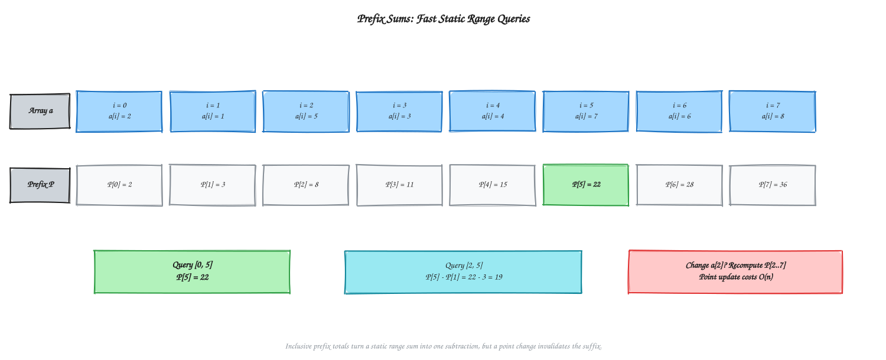
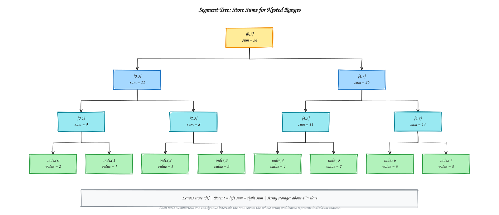
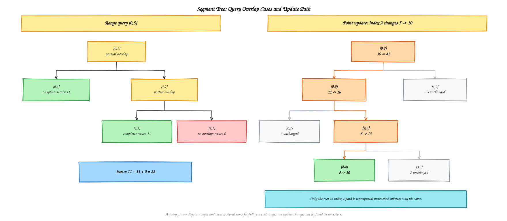

# Chapter 6 - Divide and Conquer

[Previous: Chapter 5 - Sorting Algorithms](../Chapter%205%20-%20Sorting%20Algorithms/README.md) | [Home](../README.md) | [Next: Chapter 7 - Greedy Algorithms](../Chapter%207%20-%20Greedy%20Algorithms/README.md)

---

This chapter's range-query lesson follows a divide-and-conquer idea: first use prefix sums for a static array, then replace that one-dimensional summary with a hierarchy of smaller ranges when point updates are needed. The examples follow the supplied C++ lecture sheet; the main repository otherwise uses Python.

## Table of Contents

1. [Problem: Range Sum and Point Update](#1-problem-range-sum-and-point-update)
2. [Part 1: Prefix Sum](#2-part-1-prefix-sum)
   - [Build and Query](#build-and-query)
   - [Dry Run](#prefix-sum-dry-run)
   - [The Update Weakness](#the-update-weakness)
3. [Part 2: Segment Tree](#3-part-2-segment-tree)
   - [Tree Structure](#tree-structure)
   - [Build, Query, and Update](#build-query-and-update)
   - [Dry Run](#segment-tree-dry-run)
4. [Runnable C++17 Implementation](#4-runnable-c17-implementation)
5. [Choosing an Approach](#5-choosing-an-approach)
6. [Complexity Analysis](#6-complexity-analysis)
7. [Applications](#7-applications)
8. [Course Guidance and Common Mistakes](#8-course-guidance-and-common-mistakes)
9. [Practice and Next Steps](#9-practice-and-next-steps)
10. [Quick Recap](#10-quick-recap)

---

## 1. Problem: Range Sum and Point Update

Given an array, support these operations in any order:

- **Range sum query** `sum(l, r)`: return the sum of elements at indices `l` through `r`, inclusive.
- **Point update** `update(i, value)`: replace the element at index `i` with `value`.

All examples use **zero-based indices** and inclusive ranges. For the array
`{2, 1, 5, 3, 4, 7, 6, 8}`, the sum of `[0, 5]` is `22`. After changing index `2`
from `5` to `10`, that same query returns `27`.

The two data structures below always produce the same correct sums; they differ
in the time they spend supporting queries and changes.

---

## 2. Part 1: Prefix Sum

### Core idea

Let $P_i$ be the running total from the start of the array through position $i$:
$P_i = a_0 + a_1 + \cdots + a_i$.

For a valid inclusive range `[l, r]`, subtract the part before `l`:

| Case | Range sum |
| :--- | :--- |
| `l == 0` | $P_r$ |
| `l > 0` | $P_r - P_{l-1}$ |

The unwanted prefix cancels, leaving exactly the values in the requested range.

### Build and query

1. Allocate a prefix array of size `n`.
2. Initialize its first entry with the first array value.
3. For each later position, add that array value to the previous running total.
4. Answer each valid query with the subtraction above.

Building takes one pass, `O(n)`. Each range query takes `O(1)` time.

### Prefix-sum dry run

For `a = {2, 1, 5, 3, 4, 7, 6, 8}`:

| Index `i` | `a[i]` | `prefix[i]` |
| :---: | :---: | :---: |
| 0 | 2 | 2 |
| 1 | 1 | 3 |
| 2 | 5 | 8 |
| 3 | 3 | 11 |
| 4 | 4 | 15 |
| 5 | 7 | 22 |
| 6 | 6 | 28 |
| 7 | 8 | 36 |

- `sum(0, 5) = prefix[5] = 22`.
- `sum(2, 5) = prefix[5] - prefix[1] = 22 - 3 = 19`.

### The update weakness

Changing one array value by its difference from the previous value changes every
prefix total from that position to the right. A correct prefix update applies that
difference to each affected total, so one point update can take `O(n)` time.
Rebuilding the whole prefix array also costs `O(n)`.

Prefix sums are ideal when the array is static. They become costly when many
updates are mixed with queries: `m` updates can require `O(nm)` update work.

---

## 3. Part 2: Segment Tree

### Core idea

A segment tree stores a summary for each interval in a binary hierarchy:

- A **leaf** represents one array index and stores that value.
- An **internal node** represents a larger interval and combines its two children.
- The **root** represents the whole array.

For range sums, each parent stores `leftChildSum + rightChildSum`. Splitting an
interval at its midpoint is the divide step; building both children is the conquer
step; adding their summaries is the combine step. Unlike a one-off recursive
calculation, the tree is kept so later queries and updates can reuse those
summaries.

An array representation avoids pointer-based nodes. With zero-based storage,
node `v` has children `2*v + 1` and `2*v + 2`. A vector of `4*n` entries is a
convenient safe allocation for the tree, including when `n` is not a power of two.

### Build, query, and update

**Build**

1. If the interval is a single index (`l == r`), store `a[l]` in the leaf.
2. Otherwise, split at `mid = l + (r - l) / 2`.
3. Recursively build `[l, mid]` and `[mid + 1, r]`.
4. Store the sum of the two child nodes.

**Range query**

At each node, compare its interval `[l, r]` with the requested `[ql, qr]`:

1. **No overlap** (`r < ql` or `qr < l`): return `0`, the identity for addition.
2. **Complete overlap** (`ql <= l` and `r <= qr`): return this node's stored sum.
3. **Partial overlap**: query both children and add their returned sums.

The complete-overlap case lets the query use a precomputed range total without
visiting its leaves; the no-overlap case prunes irrelevant subtrees.

**Point update**

1. Follow the child interval containing the target index until its leaf is reached.
2. Replace the leaf value.
3. On the recursive return, recompute each ancestor as the sum of its children.

Only one root-to-leaf path is visited, so a point update takes `O(log n)` time.

### Segment-tree dry run

For the eight-element example, query `[0, 5]` is covered by the stored ranges
`[0, 3]` (sum `11`) and `[4, 5]` (sum `11`). The unrelated `[6, 7]` subtree
has no overlap and contributes `0`: the answer is `11 + 11 + 0 = 22`.

Now update index `2` from `5` to `10`. Only this path changes:

| Interval | Before | After |
| :---: | :---: | :---: |
| `[2, 2]` leaf | 5 | 10 |
| `[2, 3]` | 8 | 13 |
| `[0, 3]` | 11 | 16 |
| `[0, 7]` root | 36 | 41 |

The sibling ranges retain their sums. Query `[0, 5]` now combines `[0, 3] = 16`
and `[4, 5] = 11`, giving `27`.

---

## 4. Runnable C++17 Implementation

To keep these notes focused on the concepts, the implementation is stored
separately in [`examples/prefix_sum_segment_tree.cpp`](examples/prefix_sum_segment_tree.cpp).
It demonstrates prefix construction, querying, and updating alongside segment-tree
construction, querying, and updating. It uses `long long` for sums; tree construction
assumes a non-empty array, and queries and updates assume valid indices.

For the sample array, both approaches return the same answers:

| Operation | Prefix sum | Segment tree |
| :--- | :---: | :---: |
| Query `[0, 5]` before update | 22 | 22 |
| Query `[0, 5]` after setting index 2 to 10 | 27 | 27 |

---

## 5. Choosing an Approach

| Situation | Better fit | Reason |
| :--- | :--- | :--- |
| Array stays fixed and there are many range-sum queries | Prefix sum | `O(1)` query after an `O(n)` build |
| Point updates are mixed with queries | Segment tree | Both operations take `O(log n)` |
| Need a straightforward static range-sum implementation | Prefix sum | Less code and lower overhead |
| Need range minimum, maximum, or GCD with updates | Segment tree | Store and combine the appropriate interval summary |

There is no universally best structure. Choose based on the operations the
problem needs and how often values change.

---

## 6. Complexity Analysis

| Operation | Prefix sum | Segment tree |
| :--- | :---: | :---: |
| Build | `O(n)` | `O(n)` |
| Range sum query | `O(1)` | `O(log n)` |
| Point update | `O(n)` | `O(log n)` |
| Storage | `O(n)` | `O(n)` (commonly `4*n` slots) |

A segment-tree build processes a linear number of nodes. The tree height is
`O(log n)`; a query visits only the boundary paths and fully covered ranges, and
an update follows one root-to-leaf path.

---

## 7. Applications

Segment trees are useful when range aggregates must remain fast while values
change, including:

- Competitive-programming queries for sums, minima, maxima, or GCD with updates.
- Live dashboards and time-series systems that aggregate changing measurements
  over a time interval.
- Computational-geometry problems involving interval overlap and coverage (often
  with a segment-tree variant).
- Hierarchical range-aggregation workloads in data systems.

---

## 8. Course Guidance and Common Mistakes

- Start with prefix sums to understand the static-query baseline and why updates
  invalidate a suffix of the prefix array.
- Memorize the query cases by meaning: **no overlap**, **complete overlap**,
  **partial overlap**. For sums, `0` is the no-overlap identity; other aggregates
  need their own identity (for example, positive infinity for minimum).
- Draw the flat-tree indices for a small example: left child `2*v + 1`, right
  child `2*v + 2`. The formulas follow from a zero-based binary-heap layout.
- `4*n` is a safe allocation convention, not the exact number of nodes.
- Keep interval endpoints consistent. These examples use zero-based, inclusive
  ranges everywhere.
- Use `long long` when sums may exceed 32-bit `int`; no integer type prevents
  overflow if the total exceeds its range.

---

## 9. Practice and Next Steps

1. Implement `build_prefix`, `range_sum_prefix`, and `update_prefix`; count how
   many prefix entries an update at index `i` changes.
2. Draw the complete tree for `{2, 1, 5, 3, 4, 7, 6, 8}`, labeling each interval
   and sum.
3. Trace query `[0, 5]` and classify visited intervals as no, complete, or partial
   overlap.
4. Trace update `(2, 10)` and mark the root-to-leaf path and the recomputed
   ancestors.
5. Run the C++ example and verify that both approaches return `22` before the
   update and `27` afterward.
6. Extend the tree to another associative operation, such as minimum or GCD, and
   choose the correct no-overlap identity.

---

## 10. Quick Recap

| Concept | Key point |
| :--- | :--- |
| Prefix array | Running totals make static range sums `O(1)` |
| Prefix update | Changes every total from the updated index onward: `O(n)` |
| Segment-tree leaf | Stores one array element |
| Segment-tree internal node | Combines the summaries of its children |
| Build | Recursively split, build both halves, then combine: `O(n)` |
| Query | Prune no-overlap nodes; return fully covered summaries; split partial overlaps: `O(log n)` |
| Point update | Replace one leaf and recompute its ancestors: `O(log n)` |
| Selection rule | Static data: prefix sums; frequent point updates: segment tree |

[Chapter 6 diagram index](diagrams/README.md)
