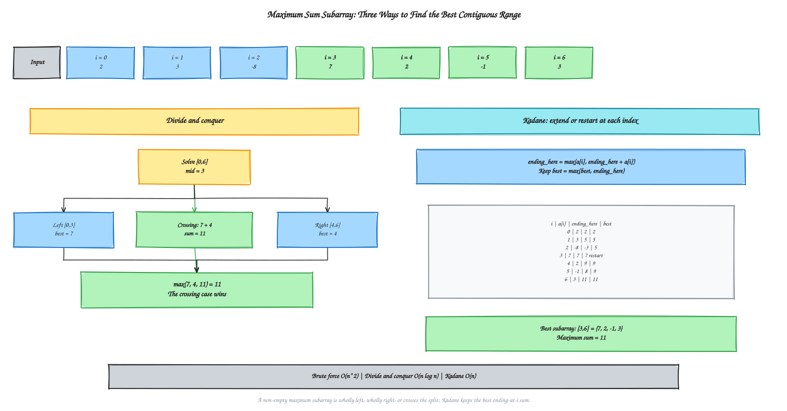

# Chapter 6 - Divide and Conquer

[Previous: Chapter 5 - Sorting Algorithms](../Chapter%205%20-%20Sorting%20Algorithms/README.md) | [Home](../README.md) | [Next: Chapter 7 - Greedy Algorithms](../Chapter%207%20-%20Greedy%20Algorithms/README.md)

---

This chapter develops divide-and-conquer through two applications: maximum-sum subarrays and range queries. For the subarray problem, compare brute force, divide and conquer, and Kadane's one-pass dynamic-programming recurrence. For range queries, start with prefix sums for a static array, then use a segment tree when point updates are needed. These examples follow the supplied C++ lecture sheets; the main repository otherwise uses Python.

## Table of Contents

1. [Problem: Range Sum and Point Update](#1-problem-range-sum-and-point-update)
2. [Part 1: Prefix Sum](#2-part-1-prefix-sum)
   - [Build and Query](#build-and-query)
   - [Dry Run](#prefix-sum-dry-run)
   - [The Update Weakness](#the-update-weakness)
3. [Part 2: Segment Tree](#3-part-2-segment-tree)
   - [Tree Structure](#tree-structure)
   - [Build, Query, and Update](#build-query-and-update)
   - [Dry Run](#segment-tree-dry-run)
4. [Runnable C++17 Implementation](#4-runnable-c17-implementation)
5. [Choosing an Approach](#5-choosing-an-approach)
6. [Complexity Analysis](#6-complexity-analysis)
7. [Applications](#7-applications)
8. [Course Guidance and Common Mistakes](#8-course-guidance-and-common-mistakes)
9. [Practice and Next Steps](#9-practice-and-next-steps)
10. [Quick Recap](#10-quick-recap)
11. [Maximum Sum Subarray](#11-maximum-sum-subarray)
    - [Problem and Three Approaches](#problem-and-three-approaches)
    - [Brute Force](#brute-force)
    - [Divide and Conquer](#divide-and-conquer)
    - [Kadane's Algorithm](#kadanes-algorithm)
    - [Worked Trace](#worked-trace)
    - [Edge Cases and Recovering the Subarray](#edge-cases-and-recovering-the-subarray)
    - [Complexity, Applications, and Practice](#complexity-applications-and-practice)

---

## 1. Problem: Range Sum and Point Update

Given an array, support these operations in any order:

- **Range sum query** `sum(l, r)`: return the sum of elements at indices `l` through `r`, inclusive.
- **Point update** `update(i, value)`: replace the element at index `i` with `value`.

All examples use **zero-based indices** and inclusive ranges. For the array
`{2, 1, 5, 3, 4, 7, 6, 8}`, the sum of `[0, 5]` is `22`. After changing index `2`
from `5` to `10`, that same query returns `27`.

The two data structures below always produce the same correct sums; they differ
in the time they spend supporting queries and changes.

---

## 2. Part 1: Prefix Sum

### Core idea

Let $P_i$ be the running total from the start of the array through position $i$:
$P_i = a_0 + a_1 + \cdots + a_i$.

For a valid inclusive range `[l, r]`, subtract the part before `l`:

| Case | Range sum |
| :--- | :--- |
| `l == 0` | $P_r$ |
| `l > 0` | $P_r - P_{l-1}$ |

The unwanted prefix cancels, leaving exactly the values in the requested range.

### Build and query

1. Allocate a prefix array of size `n`.
2. Initialize its first entry with the first array value.
3. For each later position, add that array value to the previous running total.
4. Answer each valid query with the subtraction above.

Building takes one pass, `O(n)`. Each range query takes `O(1)` time.

### Prefix-sum dry run

For `a = {2, 1, 5, 3, 4, 7, 6, 8}`:

| Index `i` | `a[i]` | `prefix[i]` |
| :---: | :---: | :---: |
| 0 | 2 | 2 |
| 1 | 1 | 3 |
| 2 | 5 | 8 |
| 3 | 3 | 11 |
| 4 | 4 | 15 |
| 5 | 7 | 22 |
| 6 | 6 | 28 |
| 7 | 8 | 36 |

- `sum(0, 5) = prefix[5] = 22`.
- `sum(2, 5) = prefix[5] - prefix[1] = 22 - 3 = 19`.


### The update weakness

Changing one array value by its difference from the previous value changes every
prefix total from that position to the right. A correct prefix update applies that
difference to each affected total, so one point update can take `O(n)` time.
Rebuilding the whole prefix array also costs `O(n)`.

Prefix sums are ideal when the array is static. They become costly when many
updates are mixed with queries: `m` updates can require `O(nm)` update work.

---

## 3. Part 2: Segment Tree

### Core idea

A segment tree stores a summary for each interval in a binary hierarchy:

- A **leaf** represents one array index and stores that value.
- An **internal node** represents a larger interval and combines its two children.
- The **root** represents the whole array.

For range sums, each parent stores `leftChildSum + rightChildSum`. Splitting an
interval at its midpoint is the divide step; building both children is the conquer
step; adding their summaries is the combine step. Unlike a one-off recursive
calculation, the tree is kept so later queries and updates can reuse those
summaries.


An array representation avoids pointer-based nodes. With zero-based storage,
node `v` has children `2*v + 1` and `2*v + 2`. A vector of `4*n` entries is a
convenient safe allocation for the tree, including when `n` is not a power of two.

### Build, query, and update

**Build**

1. If the interval is a single index (`l == r`), store `a[l]` in the leaf.
2. Otherwise, split at `mid = l + (r - l) / 2`.
3. Recursively build `[l, mid]` and `[mid + 1, r]`.
4. Store the sum of the two child nodes.

**Range query**

At each node, compare its interval `[l, r]` with the requested `[ql, qr]`:

1. **No overlap** (`r < ql` or `qr < l`): return `0`, the identity for addition.
2. **Complete overlap** (`ql <= l` and `r <= qr`): return this node's stored sum.
3. **Partial overlap**: query both children and add their returned sums.

The complete-overlap case lets the query use a precomputed range total without
visiting its leaves; the no-overlap case prunes irrelevant subtrees.

**Point update**

1. Follow the child interval containing the target index until its leaf is reached.
2. Replace the leaf value.
3. On the recursive return, recompute each ancestor as the sum of its children.

Only one root-to-leaf path is visited, so a point update takes `O(log n)` time.

### Segment-tree dry run

For the eight-element example, query `[0, 5]` is covered by the stored ranges
`[0, 3]` (sum `11`) and `[4, 5]` (sum `11`). The unrelated `[6, 7]` subtree
has no overlap and contributes `0`: the answer is `11 + 11 + 0 = 22`.

Now update index `2` from `5` to `10`. Only this path changes:

| Interval | Before | After |
| :---: | :---: | :---: |
| `[2, 2]` leaf | 5 | 10 |
| `[2, 3]` | 8 | 13 |
| `[0, 3]` | 11 | 16 |
| `[0, 7]` root | 36 | 41 |

The sibling ranges retain their sums. Query `[0, 5]` now combines `[0, 3] = 16`
and `[4, 5] = 11`, giving `27`.


---

## 4. Runnable C++17 Implementation

To keep these notes focused on the concepts, the implementation is stored
separately in [`examples/prefix_sum_segment_tree.cpp`](examples/prefix_sum_segment_tree.cpp).
It demonstrates prefix construction, querying, and updating alongside segment-tree
construction, querying, and updating. It uses `long long` for sums; tree construction
assumes a non-empty array, and queries and updates assume valid indices.

For the sample array, both approaches return the same answers:

| Operation | Prefix sum | Segment tree |
| :--- | :---: | :---: |
| Query `[0, 5]` before update | 22 | 22 |
| Query `[0, 5]` after setting index 2 to 10 | 27 | 27 |

---

## 5. Choosing an Approach

| Situation | Better fit | Reason |
| :--- | :--- | :--- |
| Array stays fixed and there are many range-sum queries | Prefix sum | `O(1)` query after an `O(n)` build |
| Point updates are mixed with queries | Segment tree | Both operations take `O(log n)` |
| Need a straightforward static range-sum implementation | Prefix sum | Less code and lower overhead |
| Need range minimum, maximum, or GCD with updates | Segment tree | Store and combine the appropriate interval summary |

There is no universally best structure. Choose based on the operations the
problem needs and how often values change.

---

## 6. Complexity Analysis

| Operation | Prefix sum | Segment tree |
| :--- | :---: | :---: |
| Build | `O(n)` | `O(n)` |
| Range sum query | `O(1)` | `O(log n)` |
| Point update | `O(n)` | `O(log n)` |
| Storage | `O(n)` | `O(n)` (commonly `4*n` slots) |

A segment-tree build processes a linear number of nodes. The tree height is
`O(log n)`; a query visits only the boundary paths and fully covered ranges, and
an update follows one root-to-leaf path.

---

## 7. Applications

Segment trees are useful when range aggregates must remain fast while values
change, including:

- Competitive-programming queries for sums, minima, maxima, or GCD with updates.
- Live dashboards and time-series systems that aggregate changing measurements
  over a time interval.
- Computational-geometry problems involving interval overlap and coverage (often
  with a segment-tree variant).
- Hierarchical range-aggregation workloads in data systems.

---

## 8. Course Guidance and Common Mistakes

- Start with prefix sums to understand the static-query baseline and why updates
  invalidate a suffix of the prefix array.
- Memorize the query cases by meaning: **no overlap**, **complete overlap**,
  **partial overlap**. For sums, `0` is the no-overlap identity; other aggregates
  need their own identity (for example, positive infinity for minimum).
- Draw the flat-tree indices for a small example: left child `2*v + 1`, right
  child `2*v + 2`. The formulas follow from a zero-based binary-heap layout.
- `4*n` is a safe allocation convention, not the exact number of nodes.
- Keep interval endpoints consistent. These examples use zero-based, inclusive
  ranges everywhere.
- Use `long long` when sums may exceed 32-bit `int`; no integer type prevents
  overflow if the total exceeds its range.

---

## 9. Practice and Next Steps

1. Implement `build_prefix`, `range_sum_prefix`, and `update_prefix`; count how
   many prefix entries an update at index `i` changes.
2. Draw the complete tree for `{2, 1, 5, 3, 4, 7, 6, 8}`, labeling each interval
   and sum.
3. Trace query `[0, 5]` and classify visited intervals as no, complete, or partial
   overlap.
4. Trace update `(2, 10)` and mark the root-to-leaf path and the recomputed
   ancestors.
5. Run the C++ example and verify that both approaches return `22` before the
   update and `27` afterward.
6. Extend the tree to another associative operation, such as minimum or GCD, and
   choose the correct no-overlap identity.

---

## 10. Quick Recap

| Concept | Key point |
| :--- | :--- |
| Prefix array | Running totals make static range sums `O(1)` |
| Prefix update | Changes every total from the updated index onward: `O(n)` |
| Segment-tree leaf | Stores one array element |
| Segment-tree internal node | Combines the summaries of its children |
| Build | Recursively split, build both halves, then combine: `O(n)` |
| Query | Prune no-overlap nodes; return fully covered summaries; split partial overlaps: `O(log n)` |
| Point update | Replace one leaf and recompute its ancestors: `O(log n)` |
| Selection rule | Static data: prefix sums; frequent point updates: segment tree |

---

## 11. Maximum Sum Subarray

This classic optimization problem asks for the largest sum over any **non-empty contiguous** part of an integer array. Contiguous means the selected elements occupy consecutive indices; choosing scattered elements is not allowed. The lecture progresses from the simple baseline to two faster ideas: brute force, divide and conquer, and Kadane's algorithm.

For `a = {2, 3, -8, 7, 2, -1, 3}`, the winning subarray is `{7, 2, -1, 3}` at inclusive indices `[3, 6]`, with sum `11`. All three methods find that same sum; their work and design ideas differ.



### Problem and Three Approaches

A maximum subarray must be non-empty and contiguous. For any range split into `[left, middle]` and `[middle + 1, right]`, an optimal answer has exactly one of three locations:

1. Entirely in the left half.
2. Entirely in the right half.
3. Crossing the split, with elements on both sides.

Brute force checks every candidate; divide and conquer combines those three cases recursively; Kadane's algorithm maintains the best subarray ending at each position while scanning once. The last is also a compact dynamic-programming recurrence because each state depends only on the previous state's value. It is included here alongside divide and conquer because the lecture compares all three solutions to this same problem.

### Brute Force

Choose each possible start index, extend the end index one step at a time, and maintain the running sum. Compare each sum with the best found so far. Maintaining the running sum is important: restarting the sum calculation for every pair of endpoints would add an unnecessary factor of `n`.

```text
best = a[0]
for start = 0 ... n-1:
    current = 0
    for end = start ... n-1:
        current += a[end]
        best = max(best, current)
return best
```

There are `n(n + 1) / 2` contiguous subarrays, so this implementation takes `O(n^2)` time and `O(1)` extra space. It is an easy correctness baseline, but quadratic work becomes expensive as the input grows.

### Divide and Conquer

For a range `[left, right]`:

1. **Base case:** if `left == right`, the only subarray is that single element; return it.
2. Compute `middle = left + (right - left) / 2`.
3. Recursively find the best result contained in each half.
4. Find the best crossing result: scan leftward from `middle` to find the largest suffix sum of the left half; scan rightward from `middle + 1` to find the largest prefix sum of the right half; add the two.
5. Return the maximum of the left, right, and crossing sums.

The crossing scan must include `a[middle]` and `a[middle + 1]`. A crossing subarray consists of a suffix ending at the split on the left and a prefix starting immediately after the split on the right. These three cases are exhaustive, which is why their maximum is the answer. Initializing each side's best sum from its first element also preserves correctness when all values are negative.

The two recursive calls create `T(n) = 2T(n/2) + O(n)`, so time is `O(n log n)`. The recursion stack uses `O(log n)` space. Use the overflow-safe midpoint expression above rather than `(left + right) / 2` in general-purpose code.

### Kadane's Algorithm

Let `ending_here` be the best sum of a non-empty subarray that ends exactly at the current index. At each value `a[i]`, either extend the previous subarray or start a new one:

$$
ending\_here_i = \max(a[i],\ ending\_here_{i-1} + a[i])
$$

Track the largest `ending_here` value seen anywhere as `best`. Initialize both values to `a[0]` and continue from index `1`; do **not** initialize `best` to zero, because the empty subarray is not permitted.

```text
ending_here = best = a[0]
for i = 1 ... n-1:
    ending_here = max(a[i], ending_here + a[i])
    best = max(best, ending_here)
return best
```

The max comparison is the precise restart rule. Extending is better exactly when the previous `ending_here` is positive; if it is negative, starting fresh wins, and if it is zero, both choices tie. A negative result after adding the current value is **not itself** a reason to restart: for example, extending `5` by `-8` gives `-3`, which is still better than starting at `-8`.

Kadane's algorithm runs in `O(n)` time and uses `O(1)` extra space. It is the fastest of these three methods for finding the sum.

### Worked Trace

At the top divide-and-conquer call for `{2, 3, -8, 7, 2, -1, 3}`, `middle = 3`. The best value fully in the left range `[0, 3]` is `7`; fully in the right range `[4, 6]` it is `4` (`2 - 1 + 3`). The crossing left suffix is `7`, the crossing right prefix is `4`, so the crossing sum is `11`. Therefore `max(7, 4, 11) = 11`.

Kadane's scan arrives at the same answer as follows:

| Index `i` | `a[i]` | `ending_here` calculation | `ending_here` | Best so far |
| :---: | :---: | :--- | :---: | :---: |
| 0 | 2 | Initialize | 2 | 2 |
| 1 | 3 | `max(3, 2 + 3)` | 5 | 5 |
| 2 | -8 | `max(-8, 5 - 8)` | -3 | 5 |
| 3 | 7 | `max(7, -3 + 7)`; restart | 7 | 7 |
| 4 | 2 | `max(2, 7 + 2)` | 9 | 9 |
| 5 | -1 | `max(-1, 9 - 1)` | 8 | 9 |
| 6 | 3 | `max(3, 8 + 3)` | 11 | **11** |

The restart happens at index `3`, not at index `2`: the sum at index `2` is negative, but it includes a helpful prior sum of `5`; at index `3`, the carried sum before adding `7` is negative, so starting fresh is better.

### Edge Cases and Recovering the Subarray

- **All negative:** `{-5, -2, -9}` has answer `-2`, the largest single element. Starting `best` at `0` or clamping `ending_here` to zero incorrectly invents an empty subarray.
- **One element:** `{7}` returns `7`; `{-7}` returns `-7`. Kadane's loop has no iterations, and divide and conquer reaches its single-element base case.
- **Empty input:** there is no non-empty subarray and therefore no numeric answer. The C++ functions in the example throw `std::invalid_argument`; callers should handle that explicitly.
- **Integer range:** the sample code uses `long long`; the caller must ensure individual values and every possible accumulated sum fit that type.

To return the subarray as well as its sum, retain `current_start` for the current Kadane candidate and update it only when the algorithm restarts. When a new global best is found, save `current_start` and the current index as the inclusive best endpoints. Updating the best endpoint only when the best sum improves avoids returning indices for a worse later candidate. The example's strict `>` comparisons keep the first best subarray found when sums tie.

For the sample, the index-aware result is sum `11`, start `3`, end `6`, selecting `{7, 2, -1, 3}`. The implementation, including sum-only versions of all three approaches and the index-returning Kadane variant, is in [`examples/maximum_sum_subarray.cpp`](examples/maximum_sum_subarray.cpp).

### Complexity, Applications, and Practice

| Approach | Time | Extra space | Main idea |
| :--- | :---: | :---: | :--- |
| Brute force | `O(n^2)` | `O(1)` | Extend every possible starting point |
| Divide and conquer | `O(n log n)` | `O(log n)` | Compare left, right, and crossing answers |
| Kadane | `O(n)` | `O(1)` | Keep the best subarray ending at the current position |

Maximum-subarray reasoning can identify the best contiguous period of gains/losses in stock-return data, a high-energy stretch in a signal, a high-scoring region in a sequence, or a team's strongest consecutive performance. In each case, values must represent additive scores over the interval; for stock-price changes, use gains/losses rather than raw prices.

**Course and exam guidance:** understand why the divide-and-conquer answer has three cases and why its crossing scan touches the midpoint before memorizing the code. If a question explicitly asks for recursion or the divide-and-conquer combine step, give that method rather than substituting Kadane's. Dry-run the recursive split and Kadane's `ending_here`/`best` values by hand.

**Practice:**

1. Implement all three sum-only methods without looking at the example file; verify each returns `11` for the sample.
2. Trace Kadane on `{-5, -2, -9}` and `{7}` to test initialization and the base case.
3. Draw the recursion tree for a short array and classify its winning subarray as left, right, or crossing at each merge.
4. Extend brute force and Kadane to return the winning inclusive indices, then test ties and all-negative input.
5. Compile and run the supplied C++ example; all three methods should report `11` and the index-aware version should report `[3, 6]`.

[Chapter 6 diagram index](diagrams/README.md)
