# Chapter 7: Greedy Algorithms

Greedy algorithms solve a problem step by step by always taking the best available choice according to a simple rule. A greedy solution is correct only when each local choice is safe and can still lead to a globally optimal answer.

This chapter keeps only the requested Greedy topics and the requested problem list. Each major topic includes a simple explanation, a visual map, a worked example or selection table, an algorithm sketch, and complexity analysis.

---

## Table of Contents

1. [Greedy Methods](#greedy-methods)
2. [Why Do We Call It Greedy Methods?](#1-why-do-we-call-it-greedy-methods)
3. [Elements of the Greedy Strategy and Greedy Choice Properties](#2-elements-of-the-greedy-strategy-and-greedy-choice-properties)
   - [Candidate Set](#candidate-set)
   - [Selection Function](#selection-function)
   - [Feasibility Function](#feasibility-function)
   - [Objective Function](#objective-function)
   - [Solution Function](#solution-function)
   - [Greedy-Choice Property](#greedy-choice-property)
   - [Optimal Substructure](#optimal-substructure)
4. [Greedy Graph Optimization](#3-greedy-graph-optimization)
   - [Spanning Trees](#spanning-trees)
   - [Minimum Spanning Tree - MST](#minimum-spanning-tree---mst)
   - [Prim's Algorithm](#prims-algorithm)
   - [Kruskal's Algorithm](#kruskals-algorithm)
   - [MST Time Complexity](#mst-time-complexity)
   - [MST Applications](#mst-applications)
   - [Dijkstra's Algorithm](#dijkstras-algorithm)
5. [Problems](#problems)
   - [Fractional Knapsack](#fractional-knapsack)
   - [Coin Change](#coin-change)
   - [Fibonacci Sequence](#fibonacci-sequence)
   - [Huffman Codes](#huffman-codes)
   - [Activity Selection Problem](#activity-selection-problem)
6. [Analyze Time Complexity of Above Problems](#analyze-time-complexity-of-above-problems)

---

## Greedy Methods

A **greedy method** builds a solution by repeatedly choosing the option that looks best at the current moment. Once a choice is made, the algorithm does not go back and change it.

The main idea is:

```text
At each step, choose the best available option that keeps the solution valid.
```

Greedy methods are often used for optimization problems where the goal is to minimize or maximize something, such as cost, distance, profit, number of activities, or code length.

A greedy algorithm usually has five working parts:

- **Candidate set:** the available items, edges, coins, activities, or symbols.
- **Selection rule:** how the next best candidate is chosen.
- **Feasibility test:** whether the chosen candidate keeps the partial solution valid.
- **Objective:** what the algorithm is trying to minimize or maximize.
- **Stopping condition:** when the solution is complete.

Greedy algorithms are usually simple and fast, but they must be proved correct. A local best choice does not automatically guarantee a global best solution.

### Visual Map: Greedy Decision Flow

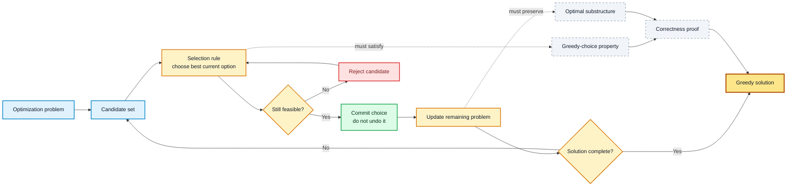

---

## 1. Why Do We Call It Greedy Methods?

We call it **greedy** because the algorithm takes the option that gives the best immediate benefit, just like choosing the biggest visible gain first.

For example:

- In **Fractional Knapsack**, take the item with the highest value per unit weight first.
- In **Activity Selection**, take the activity that finishes earliest first.
- In **Kruskal's Algorithm**, take the smallest edge that does not form a cycle.
- In **Dijkstra's Algorithm**, finalize the unvisited vertex with the smallest known distance.

The word greedy does not mean careless. It means the algorithm is designed around a local choice rule. The important question is whether that local choice is always safe.

| Question | Meaning |
| :--- | :--- |
| What is the best current choice? | The greedy selection rule |
| Is this choice allowed? | The feasibility test |
| Can this choice be part of an optimal answer? | The greedy-choice property |
| Does the remaining problem have the same structure? | Optimal substructure |

### Visual Map: Local Choice to Global Answer

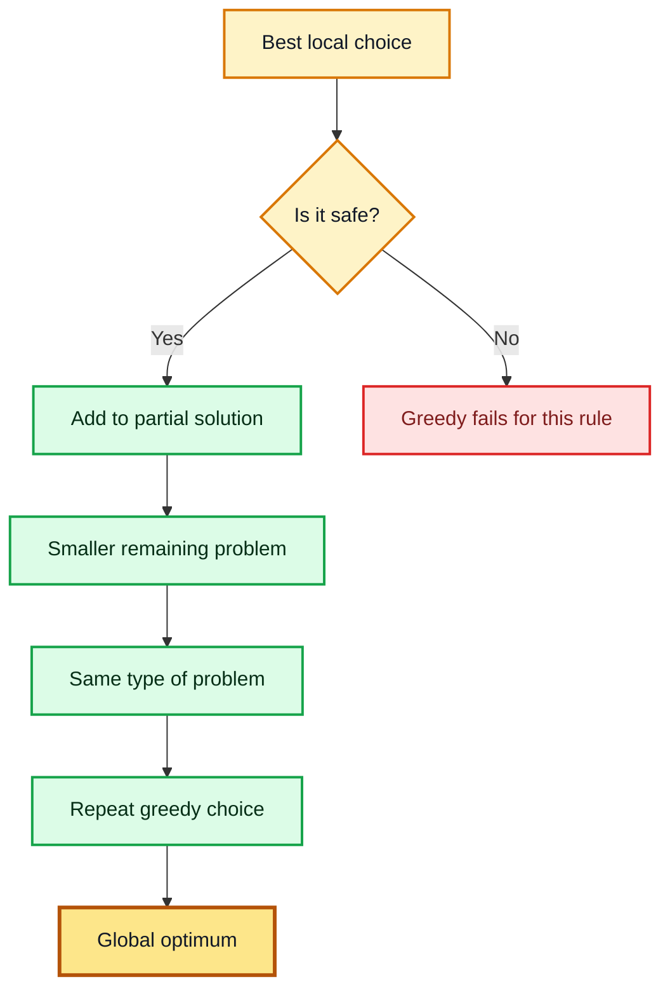

---

## 2. Elements of the Greedy Strategy and Greedy Choice Properties

A greedy algorithm is not only a loop that picks something. It needs a clear structure and a correctness argument.

### Candidate Set

The candidate set contains all possible objects that may be added to the solution.

Examples:

- Items in Fractional Knapsack
- Coins in Coin Change
- Edges in MST algorithms
- Activities in Activity Selection
- Characters or internal nodes in Huffman coding

### Selection Function

The selection function chooses the next most promising candidate.

| Problem | Greedy selection rule |
| :--- | :--- |
| Fractional Knapsack | Choose highest value/weight ratio |
| Coin Change | Choose largest coin not exceeding remaining amount |
| Activity Selection | Choose earliest finishing compatible activity |
| Kruskal's MST | Choose smallest edge that does not form a cycle |
| Prim's MST | Choose smallest edge crossing from tree to outside vertex |
| Dijkstra's Algorithm | Choose unsettled vertex with minimum tentative distance |
| Huffman Codes | Choose two lowest-frequency nodes to merge |

### Feasibility Function

The feasibility function checks whether adding the selected candidate keeps the partial solution valid.

Examples:

- A knapsack item fraction must not exceed remaining capacity.
- A coin must not exceed the remaining amount.
- An activity must not overlap the last chosen activity.
- A Kruskal edge must not create a cycle.
- A Dijkstra edge relaxation must use nonnegative edge weights for the correctness guarantee.

### Objective Function

The objective function defines what the algorithm wants to optimize.

Examples:

- Maximize total value in Fractional Knapsack.
- Minimize number of coins in Coin Change.
- Minimize total edge weight in MST.
- Minimize source-to-vertex distances in Dijkstra's Algorithm.
- Minimize weighted code length in Huffman coding.
- Maximize number of non-overlapping activities in Activity Selection.

### Solution Function

The solution function checks whether the current partial solution is complete.

Examples:

- Knapsack capacity is full or no item remains.
- Remaining amount becomes 0.
- MST has exactly $V-1$ edges.
- Dijkstra has finalized all reachable vertices.
- Huffman has one final tree root.
- No more compatible activities remain.

### Greedy-Choice Property

A problem has the **greedy-choice property** if a globally optimal solution can be reached by first making a locally optimal choice.

In simple words:

```text
If the first greedy choice is safe, then we can solve the remaining smaller problem in the same way.
```

Common proof ideas:

| Proof idea | Meaning | Common use |
| :--- | :--- | :--- |
| Exchange argument | Replace part of an optimal solution with the greedy choice without making it worse | Activity Selection, Fractional Knapsack |
| Cut property | The lightest edge crossing a cut is safe for an MST | Prim, Kruskal |
| Stays-ahead argument | Show the greedy solution is never behind another solution after each step | Activity Selection |
| Induction | Prove the greedy first choice plus optimal remaining solution is optimal | Many greedy algorithms |

### Optimal Substructure

A problem has **optimal substructure** if an optimal solution contains optimal solutions to smaller subproblems.

For greedy algorithms, after making a safe choice, the remaining unsolved part must still be the same type of problem.

Examples:

- After choosing an earliest finishing activity, the remaining problem is to select activities starting after it.
- After adding a safe MST edge, the remaining task is to complete the tree with more safe edges.
- After merging two lowest-frequency Huffman nodes, the remaining problem is a smaller Huffman coding problem.

### Visual Map: Greedy Correctness Checklist

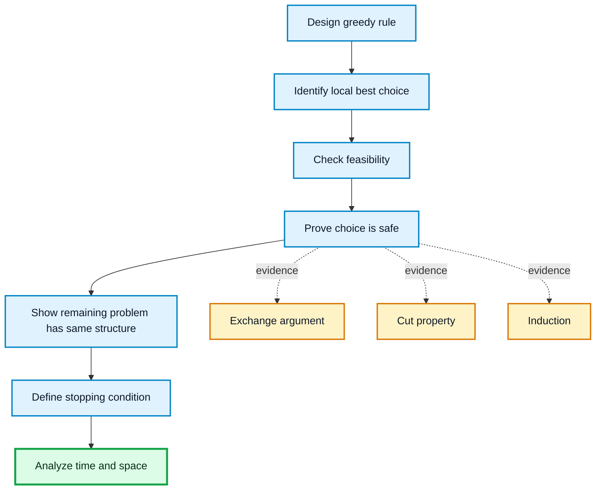

---

## 3. Greedy Graph Optimization

Greedy graph optimization solves graph problems by repeatedly selecting a locally best vertex or edge. The selected object must be safe for the final graph structure.

This section covers only the requested graph topics:

- Spanning trees
- Minimum Spanning Tree (MST)
- Prim's Algorithm
- Kruskal's Algorithm
- MST time complexity
- MST applications
- Dijkstra's Algorithm

### Spanning Trees

A **spanning tree** of a connected undirected graph is a subgraph that:

- Contains every vertex of the graph.
- Is connected.
- Has no cycle.
- Has exactly $V-1$ edges if the graph has $V$ vertices.

If the original graph has many edges, a spanning tree keeps only enough edges to connect all vertices.

#### Example

Suppose a graph has vertices $A,B,C,D$ and edges:

$$
AB, AC, BC, BD, CD
$$

One valid spanning tree is:

$$
AB, BC, CD
$$

It connects all 4 vertices using exactly 3 edges and contains no cycle.

#### Visual Map: Graph to Spanning Tree

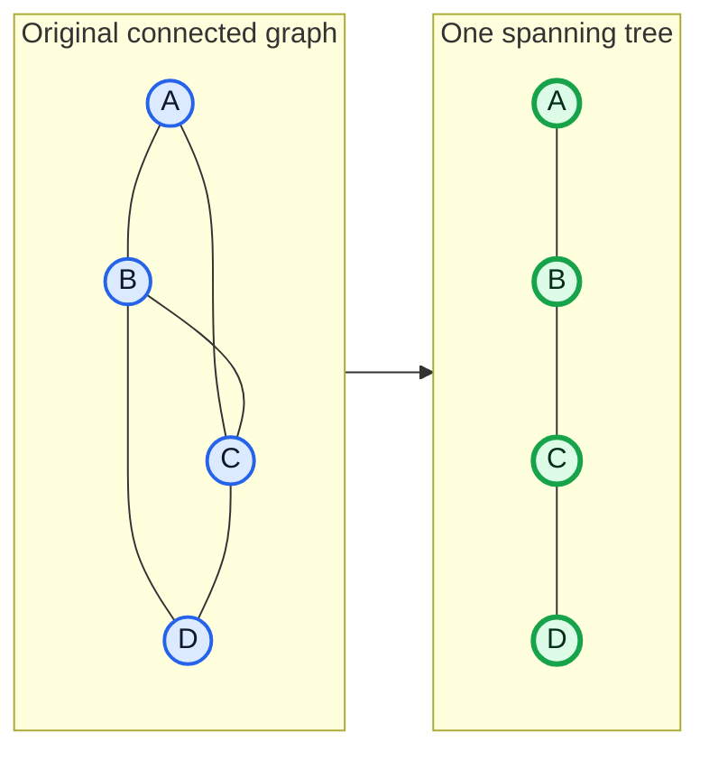

### Minimum Spanning Tree - MST

A **Minimum Spanning Tree (MST)** is a spanning tree with the minimum possible total edge weight.

For a weighted connected undirected graph $G=(V,E)$, the weight of a spanning tree $T$ is:

$$
w(T)=\sum_{e \in T} w(e)
$$

The MST problem asks for a spanning tree $T$ such that $w(T)$ is as small as possible.

Important properties:

- An MST has exactly $V-1$ edges.
- An MST never contains a cycle.
- More than one MST may exist if edge weights tie.
- MST algorithms use greedy choices based on safe edges.

#### Cut Property

A **cut** divides the vertices into two nonempty groups. An edge crosses the cut if it has one endpoint in each group.

The **cut property** says:

```text
For any cut, a lightest edge crossing that cut is safe to add to some MST.
```

This property is the main correctness idea behind Prim's and Kruskal's algorithms.

#### Cycle Property

The **cycle property** says:

```text
In any cycle, the heaviest edge on that cycle does not need to be in an MST.
```

Kruskal's Algorithm uses this idea when it skips an edge that would create a cycle.

#### Visual Map: MST Safe Edge by Cut Property

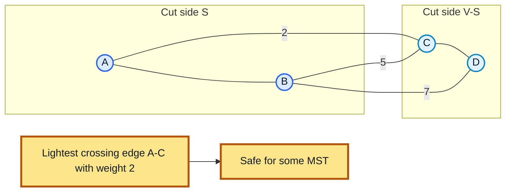

### Prim's Algorithm

**Prim's Algorithm** builds an MST by growing one tree. It starts from any vertex, then repeatedly adds the minimum-weight edge that connects the current tree to a vertex outside the tree.

Greedy rule:

```text
Choose the cheapest edge crossing from the current tree to an unvisited vertex.
```

Prim's Algorithm is useful when the graph is connected, undirected, and weighted.

#### Worked Example

Use this graph:

| Edge | Weight |
| :---: | :---: |
| $A-B$ | 2 |
| $A-C$ | 3 |
| $B-C$ | 1 |
| $B-D$ | 4 |
| $C-D$ | 5 |
| $C-E$ | 6 |
| $D-E$ | 7 |

Start from vertex $A$.

| Step | Current tree vertices | Candidate crossing edges | Chosen edge | Total weight |
| :---: | :--- | :--- | :---: | :---: |
| 1 | $\{A\}$ | $A-B:2$, $A-C:3$ | $A-B$ | 2 |
| 2 | $\{A,B\}$ | $B-C:1$, $A-C:3$, $B-D:4$ | $B-C$ | 3 |
| 3 | $\{A,B,C\}$ | $B-D:4$, $C-D:5$, $C-E:6$ | $B-D$ | 7 |
| 4 | $\{A,B,C,D\}$ | $C-E:6$, $D-E:7$ | $C-E$ | **13** |

MST edges:

$$
\{A-B, B-C, B-D, C-E\}
$$

Total MST weight:

$$
2+1+4+6=13
$$

#### Mermaid Diagram: Prim's Growth Process

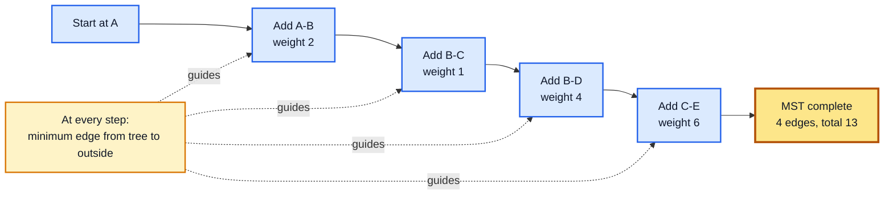

#### Algorithm

```text
PRIM(G, start)
1. for each vertex v in G:
2.     key[v] = infinity
3.     parent[v] = NIL
4. key[start] = 0
5. put all vertices in a min-priority queue using key values
6. while the queue is not empty:
7.     u = extract vertex with minimum key
8.     for each edge (u, v):
9.         if v is still in the queue and weight(u, v) < key[v]:
10.            key[v] = weight(u, v)
11.            parent[v] = u
12. return parent edges as the MST
```

#### Complexity Analysis

- Using adjacency matrix: $\Theta(V^2)$
- Using adjacency list and binary heap: $\Theta((V+E)\log V)$
- Space Complexity: $\Theta(V+E)$ for adjacency list representation

---

### Kruskal's Algorithm

**Kruskal's Algorithm** builds an MST by sorting all edges from smallest to largest. It scans the sorted edges and adds an edge only if it connects two different components.

Greedy rule:

```text
Choose the smallest remaining edge that does not create a cycle.
```

Kruskal's Algorithm naturally uses a **Disjoint Set Union (DSU)** structure to check whether two vertices are already in the same component.

#### Worked Example

Use the same graph as before.

Sorted edges:

| Order | Edge | Weight | Decision | Reason |
| :---: | :---: | :---: | :---: | :--- |
| 1 | $B-C$ | 1 | Take | No cycle |
| 2 | $A-B$ | 2 | Take | No cycle |
| 3 | $A-C$ | 3 | Skip | Would create cycle $A-B-C-A$ |
| 4 | $B-D$ | 4 | Take | Connects $D$ |
| 5 | $C-D$ | 5 | Skip | Would create cycle |
| 6 | $C-E$ | 6 | Take | Connects $E$ |
| 7 | $D-E$ | 7 | Stop or skip | MST already has $V-1=4$ edges |

MST edges:

$$
\{B-C, A-B, B-D, C-E\}
$$

Total MST weight:

$$
1+2+4+6=13
$$

#### Mermaid Diagram: Kruskal's Sorted Edge Scan

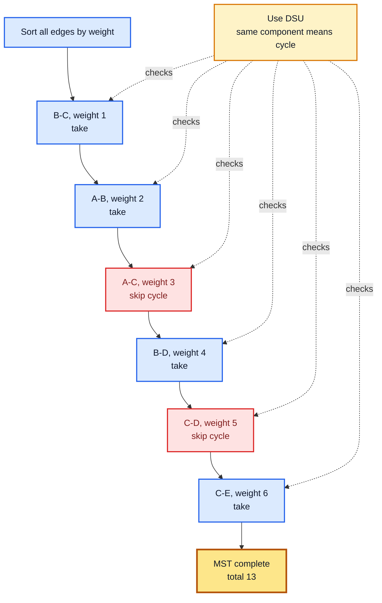

#### Algorithm

```text
KRUSKAL(G)
1. MST = empty set
2. sort all edges by nondecreasing weight
3. create one disjoint set for every vertex
4. for each edge (u, v) in sorted order:
5.     if FIND-SET(u) != FIND-SET(v):
6.         add (u, v) to MST
7.         UNION(u, v)
8.     if MST has V - 1 edges:
9.         break
10. return MST
```

#### Complexity Analysis

- Sorting edges costs $\Theta(E\log E)$.
- DSU operations are almost constant time with path compression and union by rank.
- Total Time Complexity: $\Theta(E\log E)$, commonly written as $\Theta(E\log V)$ because $E \le V^2$.
- Space Complexity: $\Theta(V+E)$.

---

### MST Time Complexity

| Algorithm | Data structure | Time Complexity | Space Complexity | Best for |
| :--- | :--- | :--- | :--- | :--- |
| Prim | Adjacency matrix | $\Theta(V^2)$ | $\Theta(V^2)$ | Dense graphs |
| Prim | Adjacency list + binary heap | $\Theta((V+E)\log V)$ | $\Theta(V+E)$ | Sparse graphs |
| Kruskal | Edge list + DSU | $\Theta(E\log E)$ | $\Theta(V+E)$ | Sparse graphs and edge-list input |

Important notes:

- If a graph is dense, $E$ is close to $V^2$, so matrix-based Prim can be practical.
- If a graph is sparse, adjacency-list Prim or Kruskal is usually better.
- Both Prim and Kruskal produce an MST, but they grow it differently.

### MST Applications

Minimum Spanning Trees are useful when the goal is to connect all required points with minimum total connection cost.

Common applications:

- Designing low-cost computer, telephone, or electrical networks.
- Connecting cities with minimum road, rail, or cable length.
- Clustering data by removing large MST edges after building the tree.
- Network approximation when a full graph has too many redundant links.
- Image segmentation and pattern recognition using graph connections.
- Designing pipelines, water supply networks, and communication backbones.

### Dijkstra's Algorithm

**Dijkstra's Algorithm** finds the shortest path from one source vertex to all other vertices in a weighted graph with nonnegative edge weights.

Greedy rule:

```text
Always finalize the unvisited vertex with the smallest tentative distance.
```

The algorithm is correct because with nonnegative edge weights, no later path can make a finalized vertex cheaper.

#### Important Condition

Dijkstra's Algorithm requires all edge weights to be nonnegative.

If negative edges exist, the greedy choice may be wrong because a vertex finalized early could later receive a cheaper path through a negative edge.

#### Worked Example

Source vertex: $A$

Edges:

| Edge | Weight |
| :---: | :---: |
| $A \to B$ | 4 |
| $A \to C$ | 1 |
| $C \to B$ | 2 |
| $C \to D$ | 4 |
| $B \to E$ | 4 |
| $D \to E$ | 1 |

Selection table:

| Step | Finalized vertex | Current shortest distance | Relaxation result |
| :---: | :---: | :---: | :--- |
| 0 | - | $dist(A)=0$ | All others are infinity |
| 1 | $A$ | 0 | $B=4$, $C=1$ |
| 2 | $C$ | 1 | $B=\min(4,1+2)=3$, $D=5$ |
| 3 | $B$ | 3 | $E=\min(\infty,3+4)=7$ |
| 4 | $D$ | 5 | $E=\min(7,5+1)=6$ |
| 5 | $E$ | 6 | Done |

Final shortest distances from $A$:

| Vertex | Distance | One shortest path |
| :---: | :---: | :--- |
| $A$ | 0 | $A$ |
| $B$ | 3 | $A \to C \to B$ |
| $C$ | 1 | $A \to C$ |
| $D$ | 5 | $A \to C \to D$ |
| $E$ | 6 | $A \to C \to D \to E$ |

#### Mermaid Diagram: Dijkstra's Greedy Finalization

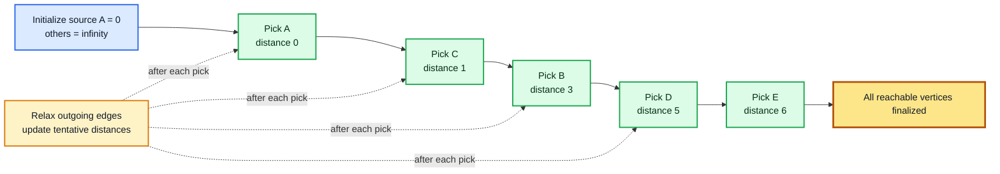

#### Algorithm

```text
DIJKSTRA(G, source)
1. for each vertex v in G:
2.     dist[v] = infinity
3.     parent[v] = NIL
4. dist[source] = 0
5. put all vertices in a min-priority queue by dist value
6. while the queue is not empty:
7.     u = extract vertex with minimum dist
8.     for each edge (u, v):
9.         if dist[u] + weight(u, v) < dist[v]:
10.            dist[v] = dist[u] + weight(u, v)
11.            parent[v] = u
12.            update v in the priority queue
13. return dist and parent
```

#### Complexity Analysis

- Using adjacency matrix: $\Theta(V^2)$
- Using adjacency list and binary heap: $\Theta((V+E)\log V)$
- Space Complexity: $\Theta(V+E)$

---

## Problems

The following sections include only the requested Greedy problems.

Each problem is organized as:

- Problem statement
- Greedy choice
- Worked example or selection table
- Mermaid diagram
- Algorithm
- Complexity analysis

---

### Fractional Knapsack

#### Problem Statement

Given a knapsack with capacity $W$ and $n$ items, each item has a weight and value. Unlike 0/1 knapsack, an item may be broken into fractions. The goal is to maximize total value inside the knapsack.

#### Inputs and Output

- **Input:** capacity $W$, item weights $w_i$, and item values $v_i$.
- **Output:** maximum value that can fit in the knapsack, allowing fractions of items.

#### Greedy Choice

Choose items in decreasing order of value per unit weight:

$$
ratio_i = \frac{v_i}{w_i}
$$

Why this works: if an item gives more value per unit weight, taking it earlier cannot reduce the best possible total value. Since fractions are allowed, we can fill the remaining capacity exactly with part of the next best item.

#### Worked Example

Capacity:

$$
W=50
$$

Items:

| Item | Weight | Value | Ratio $v/w$ |
| :---: | :---: | :---: | :---: |
| 1 | 10 | 60 | 6 |
| 2 | 20 | 100 | 5 |
| 3 | 30 | 120 | 4 |

Sorted by ratio: item 1, item 2, item 3.

| Step | Item chosen | Amount taken | Capacity used | Value gained | Remaining capacity |
| :---: | :---: | :---: | :---: | :---: | :---: |
| 1 | 1 | Full item | 10 | 60 | 40 |
| 2 | 2 | Full item | 20 | 100 | 20 |
| 3 | 3 | $20/30$ fraction | 20 | $120 \times 20/30 = 80$ | 0 |

Maximum value:

$$
60+100+80=240
$$

#### Mermaid Diagram: Fractional Knapsack Greedy Fill

```mermaid
flowchart LR
	Items["Items with value/weight ratio"] --> Sort["Sort by ratio descending"]
	Sort --> I1["Take item 1<br/>ratio 6"]
	I1 --> I2["Take item 2<br/>ratio 5"]
	I2 --> I3["Take fraction of item 3<br/>ratio 4"]
	I3 --> Full["Capacity full"]
	Full --> Answer["Maximum value 240"]

	classDef input fill:#e0f2fe,stroke:#0284c7,stroke-width:2px,color:#0f172a;
	classDef step fill:#dcfce7,stroke:#16a34a,stroke-width:2px,color:#052e16;
	classDef answer fill:#fde68a,stroke:#b45309,stroke-width:3px,color:#111827;
	class Items,Sort input;
	class I1,I2,I3,Full step;
	class Answer answer;
```

#### Algorithm

```text
FRACTIONAL-KNAPSACK(items, W)
1. for each item i:
2.     compute ratio[i] = value[i] / weight[i]
3. sort items by decreasing ratio
4. total_value = 0
5. remaining = W
6. for each item i in sorted order:
7.     if weight[i] <= remaining:
8.         take the full item
9.         total_value = total_value + value[i]
10.        remaining = remaining - weight[i]
11.    else:
12.        take fraction remaining / weight[i]
13.        total_value = total_value + value[i] * remaining / weight[i]
14.        remaining = 0
15.        break
16. return total_value
```

#### Complexity Analysis

- Sorting items: $\Theta(n\log n)$
- Greedy scan: $\Theta(n)$
- Total Time Complexity: $\Theta(n\log n)$
- Space Complexity: $\Theta(1)$ extra space if sorting is in-place, otherwise $\Theta(n)$

---

### Coin Change

#### Problem Statement

Given coin denominations and a target amount, find coins whose total value equals the target. In the greedy version, the goal is usually to use as few coins as possible.

#### Inputs and Output

- **Input:** coin denominations and amount $A$.
- **Output:** selected coins whose sum is $A$.

#### Greedy Choice

Choose the largest coin that does not exceed the remaining amount.

```text
Repeatedly take the largest usable coin.
```

This greedy rule is correct for many standard coin systems, such as denominations like $50,20,10,5,1$. However, it is not correct for every possible coin system.

#### Worked Example: Greedy Works

Denominations:

$$
50,20,10,5,1
$$

Target amount:

$$
A=87
$$

| Step | Remaining amount | Largest usable coin | New remaining amount |
| :---: | :---: | :---: | :---: |
| 1 | 87 | 50 | 37 |
| 2 | 37 | 20 | 17 |
| 3 | 17 | 10 | 7 |
| 4 | 7 | 5 | 2 |
| 5 | 2 | 1 | 1 |
| 6 | 1 | 1 | 0 |

Greedy answer:

$$
50+20+10+5+1+1=87
$$

Number of coins: **6**.

#### Important Warning: Greedy Can Fail

For arbitrary denominations, greedy may not give the minimum number of coins.

Denominations:

$$
4,3,1
$$

Target amount:

$$
A=6
$$

| Method | Chosen coins | Number of coins |
| :--- | :--- | :---: |
| Greedy | $4+1+1$ | 3 |
| Optimal | $3+3$ | 2 |

So the greedy rule must be used only when the coin system supports it, or when the problem specifically asks for the greedy method.

#### Mermaid Diagram: Coin Change Greedy Loop

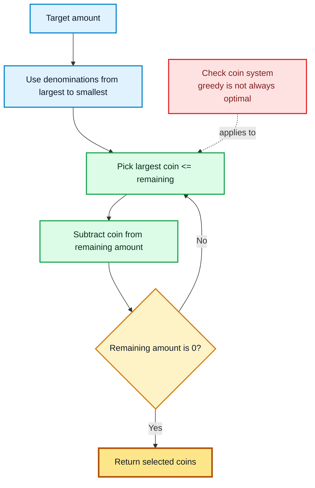

#### Algorithm

```text
GREEDY-COIN-CHANGE(coins, amount)
1. sort coins in decreasing order
2. result = empty list
3. remaining = amount
4. for each coin c in coins:
5.     while c <= remaining:
6.         add c to result
7.         remaining = remaining - c
8. if remaining == 0:
9.     return result
10. else:
11.    report that exact change is not possible with this greedy scan
```

#### Complexity Analysis

- Sorting denominations: $\Theta(k\log k)$, where $k$ is the number of denominations.
- If denominations are already sorted and counts are computed directly, the scan costs $\Theta(k)$.
- If coins are appended one by one, output size also matters.
- Space Complexity: $\Theta(k)$ for coin counts or $\Theta(q)$ for listing $q$ selected coins.

---

### Fibonacci Sequence

#### Problem Statement

The Fibonacci sequence is defined by:

$$
F(0)=0, \qquad F(1)=1
$$

and for $n \ge 2$:

$$
F(n)=F(n-1)+F(n-2)
$$

The task is to compute the $n$-th Fibonacci number or generate the sequence up to $n$.

#### Important Classification Note

Fibonacci sequence generation is **not a natural greedy optimization problem**. There is no candidate set where one local choice must be selected to optimize a global objective.

It is included here because it was requested in the problem list. The simplest efficient method is an iterative build using the previous two values.

#### Inputs and Output

- **Input:** an integer $n$.
- **Output:** $F(n)$ or all values from $F(0)$ to $F(n)$.

#### Iterative Build Idea

At each step, the next Fibonacci number is determined by the two previous numbers.

```text
next = previous + current
```

This is not a greedy choice; it is a direct recurrence calculation.

#### Worked Example

Find Fibonacci numbers up to $F(7)$.

| $i$ | Formula | $F(i)$ |
| :---: | :--- | :---: |
| 0 | Base case | 0 |
| 1 | Base case | 1 |
| 2 | $F(1)+F(0)=1+0$ | 1 |
| 3 | $F(2)+F(1)=1+1$ | 2 |
| 4 | $F(3)+F(2)=2+1$ | 3 |
| 5 | $F(4)+F(3)=3+2$ | 5 |
| 6 | $F(5)+F(4)=5+3$ | 8 |
| 7 | $F(6)+F(5)=8+5$ | 13 |

So:

$$
F(7)=13
$$

#### Mermaid Diagram: Fibonacci Iterative Flow

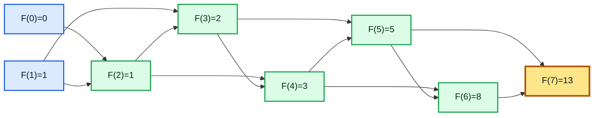

#### Algorithm

```text
FIBONACCI(n)
1. if n == 0:
2.     return 0
3. if n == 1:
4.     return 1
5. previous = 0
6. current = 1
7. for i = 2 to n:
8.     next_value = previous + current
9.     previous = current
10.    current = next_value
11. return current
```

#### Complexity Analysis

- Time Complexity: $\Theta(n)$
- Space Complexity: $\Theta(1)$ for computing only $F(n)$
- Space Complexity: $\Theta(n)$ if the full sequence is stored

---

### Huffman Codes

#### Problem Statement

Given characters and their frequencies, create a binary prefix code with minimum total encoded length. A prefix code means no codeword is the prefix of another codeword.

Huffman coding is used in compression because frequent characters receive shorter codes and rare characters receive longer codes.

#### Inputs and Output

- **Input:** characters and their frequencies.
- **Output:** a binary code for each character.

#### Greedy Choice

Repeatedly merge the two nodes with the smallest frequencies.

```text
The two least frequent symbols should be deepest siblings in an optimal Huffman tree.
```

After merging them, the problem becomes a smaller Huffman coding problem.

#### Worked Example

Frequencies:

| Character | Frequency |
| :---: | :---: |
| a | 5 |
| b | 9 |
| c | 12 |
| d | 13 |
| e | 16 |
| f | 45 |

Merge table:

| Step | Two smallest nodes | New merged node | Queue after merge |
| :---: | :--- | :---: | :--- |
| 1 | $a:5$, $b:9$ | 14 | 12, 13, 14, 16, 45 |
| 2 | $c:12$, $d:13$ | 25 | 14, 16, 25, 45 |
| 3 | 14, $e:16$ | 30 | 25, 30, 45 |
| 4 | 25, 30 | 55 | 45, 55 |
| 5 | $f:45$, 55 | 100 | 100 |

One valid Huffman code assignment:

| Character | Code |
| :---: | :---: |
| f | 0 |
| c | 100 |
| d | 101 |
| a | 1100 |
| b | 1101 |
| e | 111 |

The exact 0/1 labels may differ, but the total encoded length remains optimal.

#### Mermaid Diagram: Huffman Merge Tree

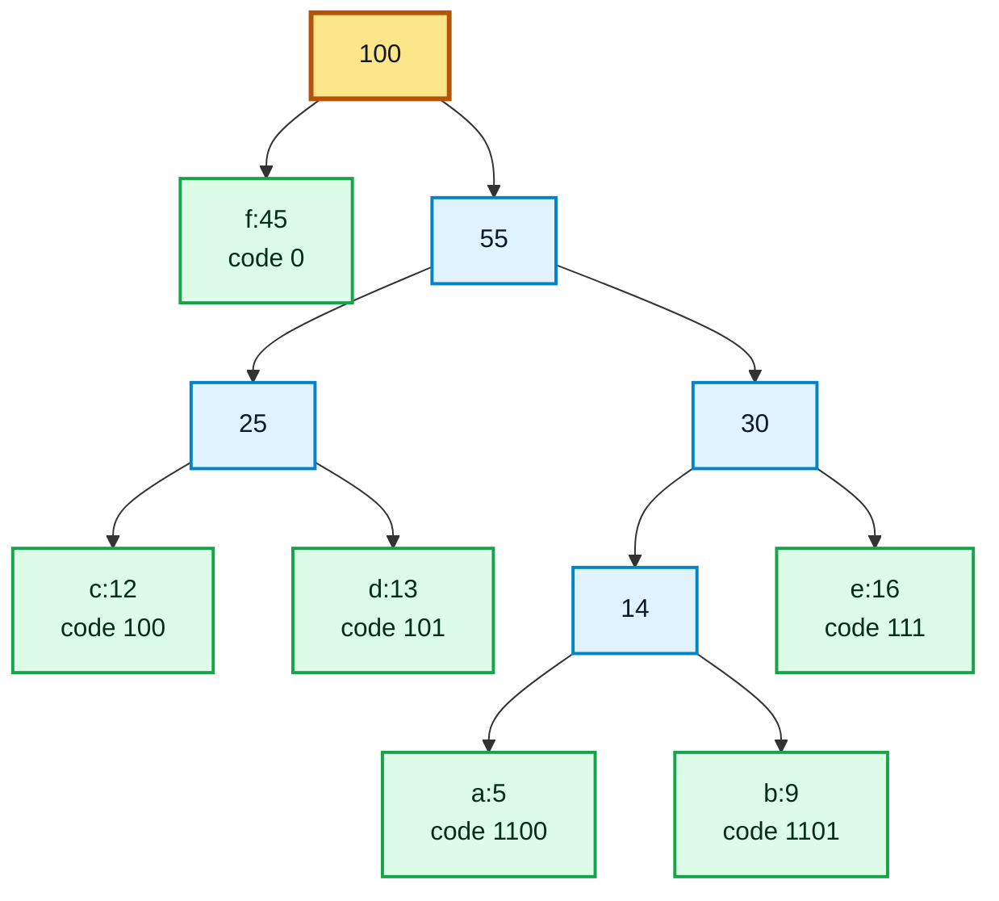

#### Algorithm

```text
HUFFMAN-CODES(characters, frequencies)
1. create a leaf node for each character
2. insert all nodes into a min-priority queue by frequency
3. while the queue has more than one node:
4.     left = extract-min(queue)
5.     right = extract-min(queue)
6.     parent = new node with frequency left.freq + right.freq
7.     parent.left = left
8.     parent.right = right
9.     insert parent into the queue
10. root = extract-min(queue)
11. assign 0 to each left edge and 1 to each right edge
12. return all character codes from root-to-leaf paths
```

#### Complexity Analysis

- Building the min-priority queue: $\Theta(n)$ if heapify is used.
- There are $n-1$ merge operations.
- Each merge performs two extract-min operations and one insert: $\Theta(\log n)$ each.
- Total Time Complexity: $\Theta(n\log n)$
- Space Complexity: $\Theta(n)$

---

### Activity Selection Problem

#### Problem Statement

Given a set of activities, each with a start time and finish time, select the maximum number of activities that do not overlap. Only one activity can be performed at a time.

#### Inputs and Output

- **Input:** activities with start times $s_i$ and finish times $f_i$.
- **Output:** largest possible set of mutually compatible activities.

#### Greedy Choice

Choose the activity that finishes earliest among the activities compatible with the already selected activities.

```text
Earliest finish time leaves the most remaining time for future activities.
```

#### Worked Example

Activities sorted by finish time:

| Activity | Start | Finish | Decision |
| :---: | :---: | :---: | :--- |
| $A_1$ | 1 | 4 | Select first activity |
| $A_2$ | 3 | 5 | Reject, overlaps $A_1$ |
| $A_3$ | 0 | 6 | Reject, overlaps $A_1$ |
| $A_4$ | 5 | 7 | Select, starts after 4 |
| $A_5$ | 3 | 9 | Reject, overlaps $A_4$ |
| $A_6$ | 5 | 9 | Reject, overlaps $A_4$ |
| $A_7$ | 6 | 10 | Reject, overlaps $A_4$ |
| $A_8$ | 8 | 11 | Select, starts after 7 |
| $A_9$ | 8 | 12 | Reject, overlaps $A_8$ |
| $A_{10}$ | 2 | 14 | Reject, overlaps selected activities |
| $A_{11}$ | 12 | 16 | Select, starts after 11 |

Selected activities:

$$
\{A_1, A_4, A_8, A_{11}\}
$$

Maximum number of selected activities: **4**.

#### Mermaid Diagram: Activity Selection Timeline

```mermaid
gantt
	title Activity Selection by Earliest Finish Time
	dateFormat  X
	axisFormat %s
	section Selected
	A1 :a1, 1, 3
	A4 :a4, 5, 2
	A8 :a8, 8, 3
	A11 :a11, 12, 4
	section Rejected Examples
	A2 :crit, a2, 3, 2
	A3 :crit, a3, 0, 6
	A6 :crit, a6, 5, 4
```

#### Correctness Idea

Let $A_m$ be the activity with the earliest finish time. There is always an optimal solution that includes $A_m$.

If another optimal solution starts with a different activity, replace that first activity with $A_m$. Since $A_m$ finishes no later, the replacement does not reduce the number of remaining compatible activities. Therefore, the greedy first choice is safe.

#### Algorithm

```text
ACTIVITY-SELECTION(activities)
1. sort activities by increasing finish time
2. selected = empty list
3. last_finish = -infinity
4. for each activity a in sorted order:
5.     if start[a] >= last_finish:
6.         add a to selected
7.         last_finish = finish[a]
8. return selected
```

#### Complexity Analysis

- Sorting activities: $\Theta(n\log n)$
- Greedy scan after sorting: $\Theta(n)$
- Total Time Complexity: $\Theta(n\log n)$
- If activities are already sorted by finish time: $\Theta(n)$
- Space Complexity: $\Theta(1)$ extra space, excluding the output list

---

## Analyze Time Complexity of Above Problems

| Topic or problem | Main greedy idea | Time Complexity | Space Complexity |
| :--- | :--- | :--- | :--- |
| Fractional Knapsack | Sort by value/weight ratio, then fill capacity | $\Theta(n\log n)$ | $\Theta(1)$ extra if sorted in-place |
| Coin Change | Repeatedly choose largest usable coin | $\Theta(k\log k)$ with sorting, $\Theta(k)$ if sorted and counts are used | $\Theta(k)$ for counts or $\Theta(q)$ for output coins |
| Fibonacci Sequence | Iteratively compute from previous two values | $\Theta(n)$ | $\Theta(1)$ for one value |
| Huffman Codes | Repeatedly merge two least frequent nodes | $\Theta(n\log n)$ | $\Theta(n)$ |
| Activity Selection | Sort by finish time, then select compatible activities | $\Theta(n\log n)$, or $\Theta(n)$ if already sorted | $\Theta(1)$ extra excluding output |
| Prim's MST | Grow one tree using cheapest crossing edge | $\Theta(V^2)$ with matrix, $\Theta((V+E)\log V)$ with binary heap | $\Theta(V+E)$ |
| Kruskal's MST | Sort edges and skip cycle-forming edges | $\Theta(E\log E)$ | $\Theta(V+E)$ |
| Dijkstra's Algorithm | Finalize nearest unsettled vertex | $\Theta(V^2)$ with matrix, $\Theta((V+E)\log V)$ with binary heap | $\Theta(V+E)$ |

Important notes:

- Greedy algorithms are usually fast because they avoid trying all possible solutions.
- A greedy solution must be justified by the greedy-choice property and optimal substructure.
- Fractional Knapsack is greedy, but 0/1 Knapsack is not solved correctly by the same greedy ratio rule.
- Coin Change is greedy only for suitable coin systems; arbitrary coin systems can break the greedy rule.
- Fibonacci sequence generation is included as requested, but it is not a greedy optimization problem.
- Dijkstra's Algorithm is greedy only under nonnegative edge weights.
