# Chapter 8: Dynamic Programming

[Previous: Chapter 7 - Greedy Algorithms](../Chapter%207%20-%20Greedy%20Algorithms/README.md) | [Home](../README.md) | [Next: Chapter 9 - Backtracking](../Chapter%209%20-%20Backtracking/README.md)

---

Dynamic Programming (DP) is an algorithm design technique for solving problems by breaking them into smaller related subproblems, storing their answers, and using those stored answers to build the final solution.

This chapter keeps only the requested Dynamic Programming topics and the requested problem list. Each problem includes a descriptive statement, subproblem design, tabulation method, worked example, algorithm sketch, and complexity analysis.

---

## Table of Contents

1. [Dynamic Programming](#dynamic-programming)
2. [Why Do We Need Dynamic Programming?](#1-why-do-we-need-dynamic-programming)
3. [Greedy Method vs Dynamic Programming](#2-greedy-method-vs-dynamic-programming)
4. [Principle of Optimality](#3-principle-of-optimality)
5. [Elements of Dynamic Programming](#4-elements-of-dynamic-programming)
   - [Optimal Substructure](#optimal-substructure)
   - [Overlapping Subproblems](#overlapping-subproblems)
6. [Memoization vs Tabulation (Top-Down vs Bottom-Up)](#5-memoization-vs-tabulation-top-down-vs-bottom-up)
7. [Problems](#problems)
   - [Climbing Stairs](#climbing-stairs)
   - [0/1 Knapsack](#01-knapsack)
   - [Rod Cutting](#rod-cutting)
   - [Longest Common Subsequence (LCS)](#longest-common-subsequence-lcs)
   - [Matrix Chain Multiplication](#matrix-chain-multiplication)
   - [Optimal Binary Search Tree (Optimal BST)](#optimal-binary-search-tree-optimal-bst)
   - [Multistage Graph](#multistage-graph)
   - [Travelling Salesman Problem (TSP)](#travelling-salesman-problem-tsp)
   - [Shortest Path (All Pairs) - Floyd-Warshall Algorithm](#shortest-path-all-pairs---floyd-warshall-algorithm)
   - [Shortest Path (Single Source) - Bellman-Ford Algorithm](#shortest-path-single-source---bellman-ford-algorithm)
   - [Reliability Design](#reliability-design)
8. [Analyze Time Complexity of Above Problems](#analyze-time-complexity-of-above-problems)

---

## Dynamic Programming

Dynamic Programming solves each distinct subproblem once and stores the answer. When the same subproblem is needed again, the stored answer is reused instead of recomputed.

A DP solution normally has five parts:

- **State:** the information that uniquely describes a subproblem.
- **Recurrence:** the formula that computes a state from smaller states.
- **Base case:** the smallest known answer.
- **Table order:** the order in which states must be filled.
- **Final answer:** the table cell or state that solves the original problem.

DP is commonly used for optimization, counting, and decision problems where many choices must be compared systematically.

### Visual Map: DP Design Flow

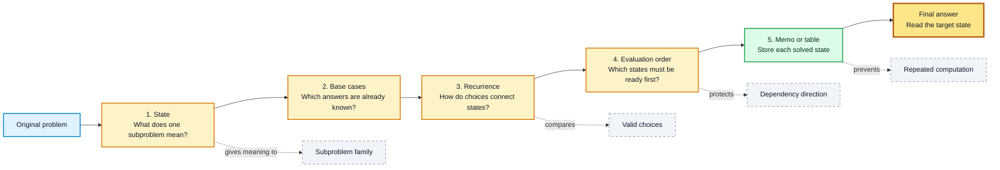

---

## 1. Why Do We Need Dynamic Programming?

Many recursive solutions repeatedly solve the same smaller problem. For small inputs this may look harmless, but for larger inputs it often causes exponential time.

Dynamic Programming is needed when:

- The problem can be divided into smaller subproblems.
- The same subproblems appear more than once.
- The answer to the full problem can be built from answers to smaller problems.
- Directly checking all possible solutions is too slow.

The main idea is simple: compute once, store once, reuse whenever needed.

| Approach | Main idea | Typical result |
| :--- | :--- | :--- |
| Brute force | Try every possible solution | Often exponential |
| Plain recursion | Break the problem down but recompute states | Often exponential |
| Dynamic Programming | Store each distinct state | Usually polynomial for suitable problems |

### Visual Map: Repeated Work Removed by DP

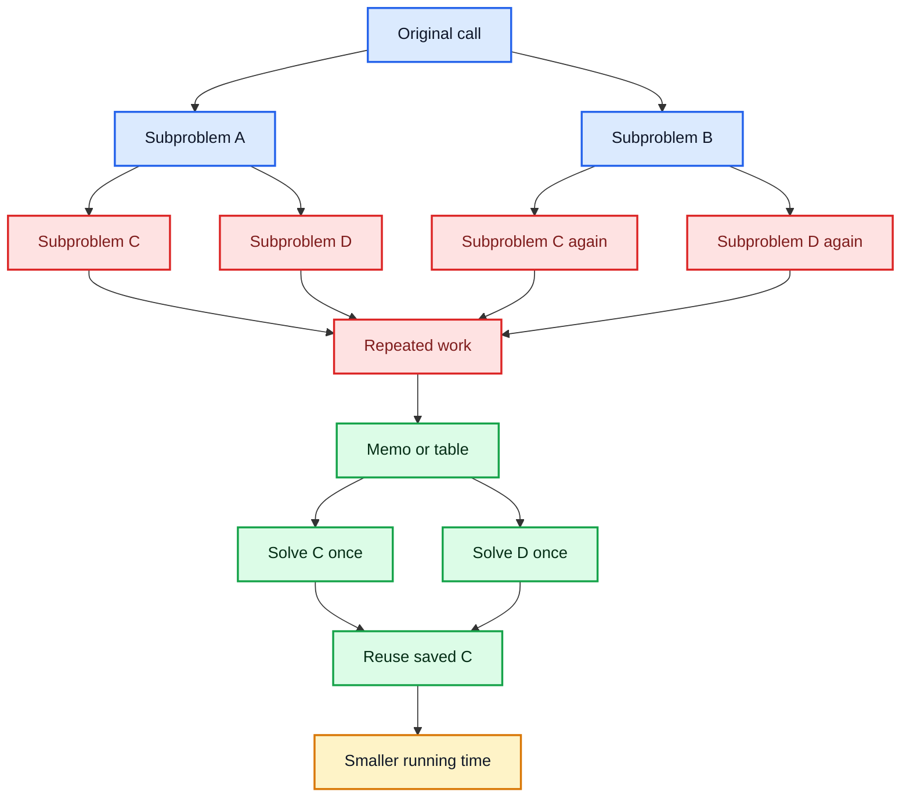

---

## 2. Greedy Method vs Dynamic Programming

Both Greedy Method and Dynamic Programming are used to solve optimization problems, but their decision-making styles are different.

| Feature | Greedy Method | Dynamic Programming |
| :--- | :--- | :--- |
| Decision style | Makes the best immediate choice | Compares choices through stored subproblems |
| View | Local decision first | Global optimum through recurrence |
| Reconsiders choices? | No | Yes, through table values |
| Required property | Greedy-choice property | Principle of optimality and overlapping subproblems |
| Space use | Usually small | Usually needs a table |
| Guarantee | Works only when the local choice is always globally safe | Works when the recurrence correctly represents all choices |

Greedy is usually faster, but DP is more appropriate when taking one choice can block a better combination of later choices. For example, 0/1 Knapsack needs DP because an item cannot be partially taken and every selected item changes the remaining capacity.

### Visual Map: Greedy Choice vs DP Choice

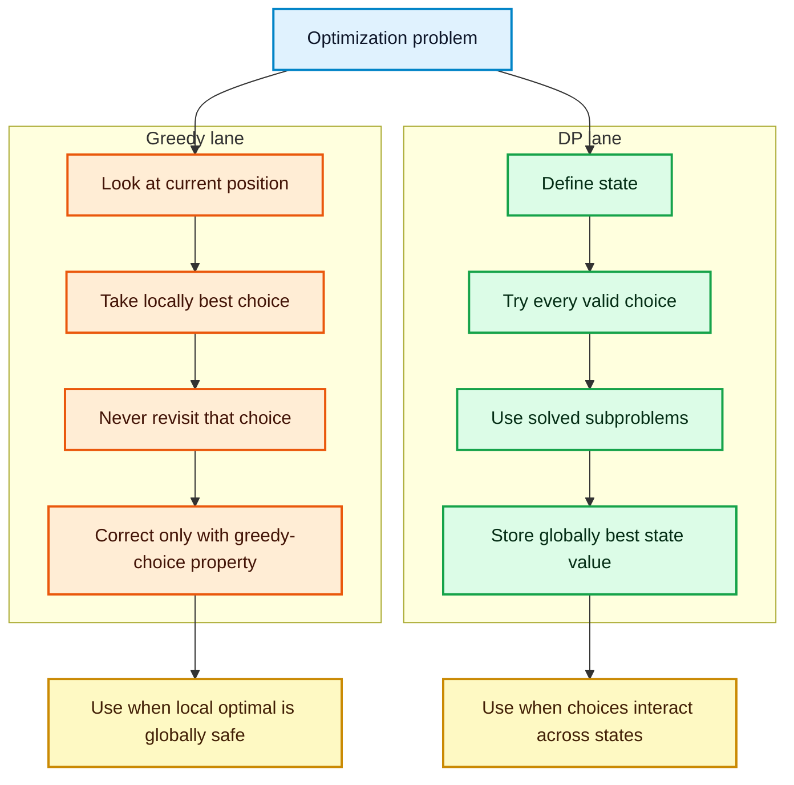

---

## 3. Principle of Optimality

The **Principle of Optimality** states that an optimal solution to a problem must contain optimal solutions to its subproblems.

If a chosen first decision leaves a smaller remaining problem, then the remaining part must also be solved optimally. Otherwise, replacing it with a better remaining solution would improve the full solution, contradicting the claim that the full solution was optimal.

For a shortest path problem, if the shortest path from $A$ to $D$ passes through $B$, then the portion from $B$ to $D$ must also be a shortest path from $B$ to $D$.

DP relies on this principle because it builds large optimal answers from smaller optimal answers.

### Visual Map: Optimal Path Contains Optimal Subpaths

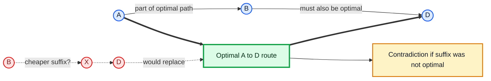

---

## 4. Elements of Dynamic Programming

### Optimal Substructure

A problem has **optimal substructure** if an optimal answer can be constructed from optimal answers to smaller subproblems.

To identify optimal substructure:

- Define the decision made at the current state.
- Determine what smaller problem remains after that decision.
- Express the answer as the best value among all valid decisions.

Generic recurrence form:

$$
DP[state] = \mathrm{best}_{choice}\{\text{value of choice} + DP[\text{next state}]\}
$$

Here, **best** may mean minimum cost, maximum profit, number of ways, or shortest distance depending on the problem.

### Overlapping Subproblems

A problem has **overlapping subproblems** if the same smaller states are needed multiple times.

DP is useful when the number of distinct states is much smaller than the number of recursive calls made by a naive solution. Instead of expanding a repeated recursion tree, DP stores every distinct state in a table.

### Visual Map: DP Elements Working Together

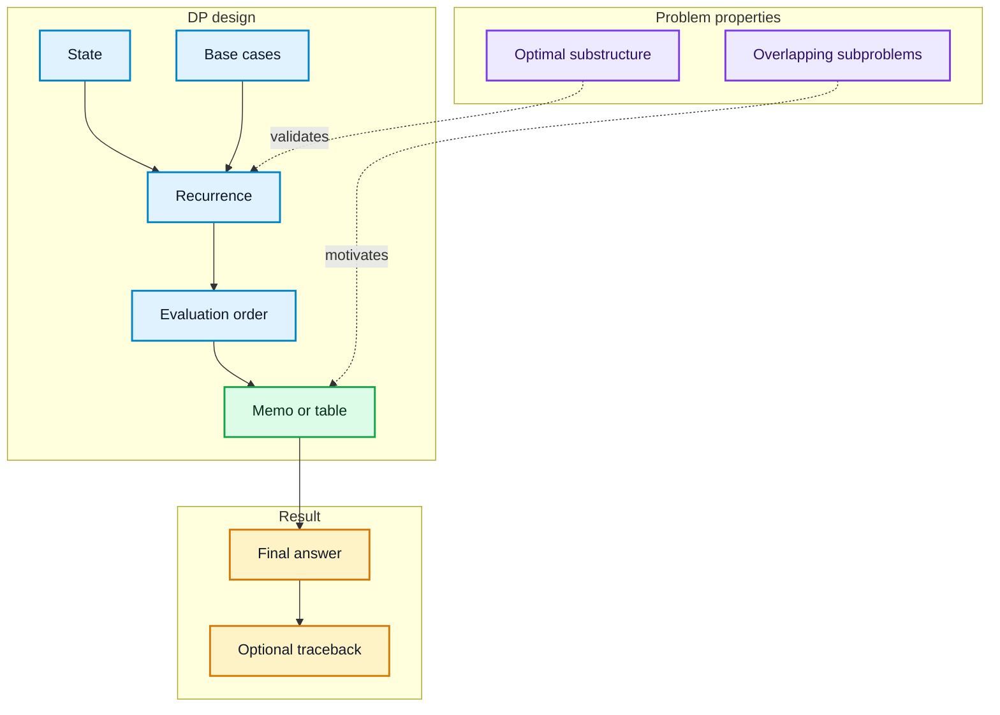

---

## 5. Memoization vs Tabulation (Top-Down vs Bottom-Up)

Dynamic Programming can be implemented using memoization or tabulation.

| Feature | Memoization (Top-Down) | Tabulation (Bottom-Up) |
| :--- | :--- | :--- |
| Starting point | Original problem | Base cases |
| Control style | Recursive | Iterative |
| Storage | Cache filled on demand | Table filled in planned order |
| Work done | Only states reached by recursion | Usually all table states |
| Risk | Deep recursion may overflow the call stack | Needs correct table order |
| Best use | Recurrence is naturally recursive | Dependencies have a clear loop order |

**Memoization pattern:**

```text
Solve(state):
    if state is a base case:
        return base value
    if state is already stored:
        return stored value
    compute answer from smaller states
    store answer
    return answer
```

**Tabulation pattern:**

```text
Create the DP table
Fill base cases
For each state in dependency order:
    compute table[state] from already-filled states
Return the required final state
```

### Visual Map: Top-Down vs Bottom-Up

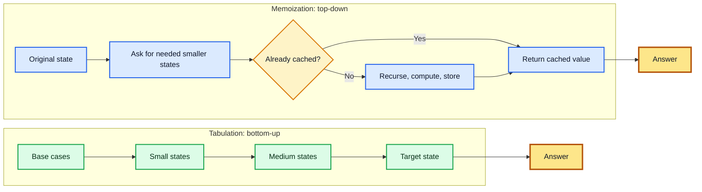

---

## Problems

The following sections include only the requested Dynamic Programming problems.

In the tabulation sections, arrows show **where the chosen value came from**. The exact meaning of an arrow depends on the recurrence of that problem, so each table includes its own arrow legend.

---

### Climbing Stairs

#### Problem Statement

Imagine you are climbing a staircase with $n$ steps. You can take either **1 step**, **2 steps**, or **3 steps** at a time. In how many distinct ways can you climb to the top?

#### Inputs and Output

- **Input:** an integer $n$, the number of stairs.
- **Output:** the number of unique ways to reach the $n$-th step.

#### Subproblem Decomposition

To reach step $n$, the last move can come from:

1. Step $n-1$ by taking a 1-step jump.
2. Step $n-2$ by taking a 2-step jump.
3. Step $n-3$ by taking a 3-step jump.

So the recurrence is:

$$
Ways(n) = Ways(n-1) + Ways(n-2) + Ways(n-3), \quad n \ge 3
$$

Base cases:

$$
Ways(0)=1, \qquad Ways(1)=1, \qquad Ways(2)=2
$$

#### Tabulation Walkthrough

Find the number of ways to climb $n=5$ steps.

| Step $i$ | Formula | $Ways(i)$ |
| :---: | :--- | :---: |
| 0 | Base case | 1 |
| 1 | Base case | 1 |
| 2 | Base case | 2 |
| 3 | $Ways(2)+Ways(1)+Ways(0)=2+1+1$ | 4 |
| 4 | $Ways(3)+Ways(2)+Ways(1)=4+2+1$ | 7 |
| 5 | $Ways(4)+Ways(3)+Ways(2)=7+4+2$ | 13 |

Arrow-guided fill order:

| Current state | Incoming arrows from previous states | Stored value |
| :---: | :--- | :---: |
| $Ways(3)$ | $Ways(2) \rightarrow Ways(3)$, $Ways(1) \rightarrow Ways(3)$, $Ways(0) \rightarrow Ways(3)$ | 4 |
| $Ways(4)$ | $Ways(3) \rightarrow Ways(4)$, $Ways(2) \rightarrow Ways(4)$, $Ways(1) \rightarrow Ways(4)$ | 7 |
| $Ways(5)$ | $Ways(4) \rightarrow Ways(5)$, $Ways(3) \rightarrow Ways(5)$, $Ways(2) \rightarrow Ways(5)$ | **13** |

Therefore, there are **13** distinct ways to climb 5 stairs.

#### Mermaid Diagram: Climbing Stairs State Dependencies

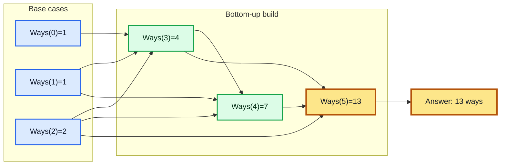

#### Algorithm

```text
CLIMBING-STAIRS(n)
1. if n == 0: return 1
2. if n == 1: return 1
3. if n == 2: return 2
4. create array dp[0...n]
5. dp[0] = 1, dp[1] = 1, dp[2] = 2
6. for i = 3 to n:
7.     dp[i] = dp[i - 1] + dp[i - 2] + dp[i - 3]
8. return dp[n]
```

#### Complexity Analysis

| Approach | Time Complexity | Space Complexity | Notes |
| :--- | :--- | :--- | :--- |
| Recursion | $O(3^n)$ | $O(n)$ | Recomputes overlapping states |
| Memoization | $\Theta(n)$ | $\Theta(n)$ | Each state is computed once |
| Tabulation | $\Theta(n)$ | $\Theta(n)$ | Fills one table from bottom to top |
| Space optimized | $\Theta(n)$ | $\Theta(1)$ | Keeps only the last three values |

---

#### Classroom Problem: Climbing Stairs (1 or 2 Steps)

**Problem.** A staircase has $n$ steps. On each move, a person may climb either 1 step or 2 steps. Find the number of distinct ways to reach exactly step $n$.

##### Theoretical Solution

Let $C(n)$ be the number of ways to reach step $n$.

Every valid way to reach step $n$ ends in exactly one of two disjoint cases:

1. A 1-step move from step $n-1$, giving $C(n-1)$ ways.
2. A 2-step move from step $n-2$, giving $C(n-2)$ ways.

Therefore,

$$
C(n) = C(n-1) + C(n-2), \qquad n \ge 2
$$

with base cases:

$$
C(0)=1, \qquad C(1)=1
$$

The two cases cover every possible final move and cannot overlap, so the recurrence counts every valid climbing sequence exactly once. It has overlapping subproblems because, for example, both $C(n-1)$ and $C(n-2)$ eventually need $C(n-3)$.

For $n=5$:

| Step $i$ | $C(i)$ | Calculation |
| :---: | :---: | :--- |
| 0 | 1 | Base case |
| 1 | 1 | Base case |
| 2 | 2 | $1+1$ |
| 3 | 3 | $2+1$ |
| 4 | 5 | $3+2$ |
| 5 | **8** | $5+3$ |

Thus, there are **8** ways to climb 5 steps when only 1-step and 2-step moves are allowed.

```text
CLIMBING-STAIRS-ONE-OR-TWO(n)
1. if n <= 1: return 1
2. previous = 1
3. current = 1
4. for step = 2 to n:
5.     next = previous + current
6.     previous = current
7.     current = next
8. return current
```

- Time Complexity: $\Theta(n)$
- Space Complexity: $\Theta(1)$

---

### 0/1 Knapsack

#### Problem Statement

Imagine a thief has a knapsack that can hold at most $W$ kg. There are $n$ items, each with a weight and value. For every item, the thief must either take it completely or leave it. No fractional part is allowed. The goal is to maximize total value without exceeding the capacity.

#### Inputs and Output

- **Input:** capacity $W$, weights $w_1,w_2,\dots,w_n$, values $v_1,v_2,\dots,v_n$, and number of items $n$.
- **Output:** the maximum total value that fits inside the knapsack.

#### Subproblem Decomposition

Let $V[i,j]$ be the maximum value obtainable using the first $i$ items and capacity $j$.

For item $i$:

- **Skip item $i$:** value is $V[i-1,j]$.
- **Take item $i$:** if $w_i \le j$, value is $v_i + V[i-1,j-w_i]$.

The recurrence is:

$$
V[i,j] =
\begin{cases}
V[i-1,j], & \text{if } w_i > j \\
\max(V[i-1,j],\ v_i + V[i-1,j-w_i]), & \text{if } w_i \le j
\end{cases}
$$

Base cases:

$$
V[0,j]=0, \qquad V[i,0]=0
$$

#### Tabulation Walkthrough

Find the maximum value for capacity $W=5$ with 4 items.

| Item | Weight | Value |
| :---: | :---: | :---: |
| 1 | 2 | 12 |
| 2 | 1 | 10 |
| 3 | 3 | 20 |
| 4 | 2 | 15 |

Table rows represent items considered. Columns represent capacity.

Arrow legend for 0/1 Knapsack tables:

- $\uparrow$ means the item is skipped and the value is copied from the upper row.
- $\nwarrow$ means the item is taken and the value comes from the previous row at reduced capacity.
- Base row and base column have no arrows because their values are fixed at 0.

| Item row | $W=0$ | $W=1$ | $W=2$ | $W=3$ | $W=4$ | $W=5$ |
| :---: | :---: | :---: | :---: | :---: | :---: | :---: |
| 0 | 0 | 0 | 0 | 0 | 0 | 0 |
| 1 | 0 | 0 ($\uparrow$) | 12 ($\nwarrow$) | 12 ($\nwarrow$) | 12 ($\nwarrow$) | 12 ($\nwarrow$) |
| 2 | 0 | 10 ($\nwarrow$) | 12 ($\uparrow$) | 22 ($\nwarrow$) | 22 ($\nwarrow$) | 22 ($\nwarrow$) |
| 3 | 0 | 10 ($\uparrow$) | 12 ($\uparrow$) | 22 ($\uparrow$) | 30 ($\nwarrow$) | 32 ($\nwarrow$) |
| 4 | 0 | 10 ($\uparrow$) | 15 ($\nwarrow$) | 25 ($\nwarrow$) | 30 ($\uparrow$) | **37** ($\nwarrow$) |

Key calculations:

- $V[2,3] = \max(V[1,3], 10 + V[1,2]) = \max(12,22)=22$.
- $V[3,5] = \max(V[2,5], 20 + V[2,2]) = \max(22,32)=32$.
- $V[4,5] = \max(V[3,5], 15 + V[3,3]) = \max(32,37)=37$.

The maximum value is **37**, obtained by selecting items 1, 2, and 4.

#### Classroom Problem A: Matrix Tabular Format

Given:

- Weights: $10,20,30$
- Values: $60,100,120$
- Capacity: $50$

| Item | Weight | Value | $W=0$ | $W=10$ | $W=20$ | $W=30$ | $W=40$ | $W=50$ |
| :---: | :---: | :---: | :---: | :---: | :---: | :---: | :---: | :---: |
| 0 | - | - | 0 | 0 | 0 | 0 | 0 | 0 |
| 1 | 10 | 60 | 0 | 60 ($\nwarrow$) | 60 ($\nwarrow$) | 60 ($\nwarrow$) | 60 ($\nwarrow$) | 60 ($\nwarrow$) |
| 2 | 20 | 100 | 0 | 60 ($\uparrow$) | 100 ($\nwarrow$) | 160 ($\nwarrow$) | 160 ($\nwarrow$) | 160 ($\nwarrow$) |
| 3 | 30 | 120 | 0 | 60 ($\uparrow$) | 100 ($\uparrow$) | 160 ($\uparrow$) | 180 ($\nwarrow$) | **220** ($\nwarrow$) |

Key calculations:

$$
V[2,30] = \max(V[1,30], 100 + V[1,10]) = \max(60,160)=160
$$

$$
V[3,50] = \max(V[2,50], 120 + V[2,20]) = \max(160,220)=220
$$

Traceback:

1. Start at $V[3,50]=220$. Since $V[3,50] \ne V[2,50]$, item 3 is selected.
2. Remaining capacity is $50-30=20$.
3. At $V[2,20]=100$. Since $V[2,20] \ne V[1,20]$, item 2 is selected.
4. Remaining capacity is $0$.

Optimal subset: **item 2 and item 3**. Maximum value: **220**.

#### Classroom Problem B: Matrix Tabular Format

Given:

- Weights: $1,3,5,7$
- Values: $2,4,7,10$
- Capacity: $8$

| Item | Weight | Value | $W=0$ | $W=1$ | $W=2$ | $W=3$ | $W=4$ | $W=5$ | $W=6$ | $W=7$ | $W=8$ |
| :---: | :---: | :---: | :---: | :---: | :---: | :---: | :---: | :---: | :---: | :---: | :---: |
| 0 | - | - | 0 | 0 | 0 | 0 | 0 | 0 | 0 | 0 | 0 |
| 1 | 1 | 2 | 0 | 2 ($\nwarrow$) | 2 ($\nwarrow$) | 2 ($\nwarrow$) | 2 ($\nwarrow$) | 2 ($\nwarrow$) | 2 ($\nwarrow$) | 2 ($\nwarrow$) | 2 ($\nwarrow$) |
| 2 | 3 | 4 | 0 | 2 ($\uparrow$) | 2 ($\uparrow$) | 4 ($\nwarrow$) | 6 ($\nwarrow$) | 6 ($\nwarrow$) | 6 ($\nwarrow$) | 6 ($\nwarrow$) | 6 ($\nwarrow$) |
| 3 | 5 | 7 | 0 | 2 ($\uparrow$) | 2 ($\uparrow$) | 4 ($\uparrow$) | 6 ($\uparrow$) | 7 ($\nwarrow$) | 9 ($\nwarrow$) | 9 ($\nwarrow$) | 11 ($\nwarrow$) |
| 4 | 7 | 10 | 0 | 2 ($\uparrow$) | 2 ($\uparrow$) | 4 ($\uparrow$) | 6 ($\uparrow$) | 7 ($\uparrow$) | 9 ($\uparrow$) | 10 ($\nwarrow$) | **12** ($\nwarrow$) |

Key calculations:

$$
V[2,4] = \max(V[1,4], 4 + V[1,1]) = \max(2,6)=6
$$

$$
V[4,8] = \max(V[3,8], 10 + V[3,1]) = \max(11,12)=12
$$

Traceback gives item 4 and item 1. Maximum value: **12**.

#### Mermaid Diagram: 0/1 Knapsack Decision and Traceback

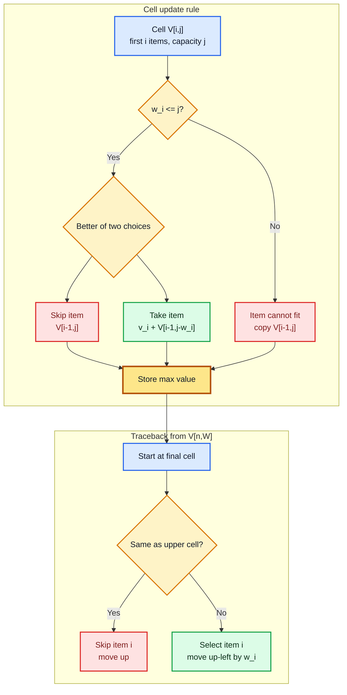

#### Algorithm

```text
KNAPSACK-01(w, v, n, W)
1. create table V[0...n][0...W]
2. for i = 0 to n:
3.     V[i][0] = 0
4. for j = 0 to W:
5.     V[0][j] = 0
6. for i = 1 to n:
7.     for j = 1 to W:
8.         if w[i] <= j:
9.             V[i][j] = max(V[i - 1][j], v[i] + V[i - 1][j - w[i]])
10.        else:
11.            V[i][j] = V[i - 1][j]
12. return V[n][W]
```

#### Complexity Analysis

- Time Complexity: $\Theta(nW)$
- Space Complexity: $\Theta(nW)$
- Space-optimized version: $\Theta(W)$ using one row updated from right to left

---

### Rod Cutting

#### Problem Statement

Imagine a steel mill has a rod of length $n$. Customers pay different prices for rods of different lengths. The mill may cut the rod into smaller pieces. The goal is to cut the rod so that the total selling price is maximum.

#### Inputs and Output

- **Input:** rod length $n$ and price table $p_i$ for each piece length $i$.
- **Output:** maximum obtainable revenue and the corresponding cuts.

#### Subproblem Decomposition

Rod Cutting can be solved like an unbounded selection problem because the same cut length can be used multiple times.

Let $T[i,j]$ be the maximum revenue using cut lengths up to $i$ for a rod of length $j$.

- **Exclude length $i$:** revenue is $T[i-1,j]$.
- **Include length $i$:** revenue is $p_i + T[i,j-i]$ if $j \ge i$.

$$
T[i,j] = \max(T[i-1,j],\ p_i + T[i,j-i]) \quad \text{for } j \ge i
$$

Base cases:

$$
T[0,j]=0, \qquad T[i,0]=0
$$

#### Tabulation Walkthrough

Given rod length $n=5$ and prices:

| Length | 1 | 2 | 3 | 4 | 5 |
| :---: | :---: | :---: | :---: | :---: | :---: |
| Price | 1 | 5 | 8 | 9 | 10 |

The DP table is:

Arrow legend for Rod Cutting:

- $\uparrow$ means the current cut length is skipped and the value comes from the row above.
- $\leftarrow_i$ means cut length $i$ is used and the value comes from the same row at remaining length $j-i$.

| Allowed pieces | 0 | 1 | 2 | 3 | 4 | 5 |
| :--- | :---: | :---: | :---: | :---: | :---: | :---: |
| None | 0 | 0 | 0 | 0 | 0 | 0 |
| {1} | 0 | 1 ($\leftarrow_1$) | 2 ($\leftarrow_1$) | 3 ($\leftarrow_1$) | 4 ($\leftarrow_1$) | 5 ($\leftarrow_1$) |
| {1,2} | 0 | 1 ($\uparrow$) | 5 ($\leftarrow_2$) | 6 ($\leftarrow_2$) | 10 ($\leftarrow_2$) | 11 ($\leftarrow_2$) |
| {1,2,3} | 0 | 1 ($\uparrow$) | 5 ($\uparrow$) | 8 ($\leftarrow_3$) | 10 ($\uparrow$) | **13** ($\leftarrow_3$) |
| {1,2,3,4} | 0 | 1 ($\uparrow$) | 5 ($\uparrow$) | 8 ($\uparrow$) | 10 ($\uparrow$) | 13 ($\uparrow$) |
| {1,2,3,4,5} | 0 | 1 ($\uparrow$) | 5 ($\uparrow$) | 8 ($\uparrow$) | 10 ($\uparrow$) | 13 ($\uparrow$) |

Key calculations:

- $T[2,4] = \max(T[1,4], p_2 + T[2,2]) = \max(4,5+5)=10$.
- $T[3,5] = \max(T[2,5], p_3 + T[3,2]) = \max(11,8+5)=13$.
- $T[5,5] = \max(T[4,5], p_5 + T[5,0]) = \max(13,10)=13$.

Traceback:

1. Start at $T[5,5]=13$.
2. Since $T[5,5]=T[4,5]$, length 5 is not used.
3. Since $T[4,5]=T[3,5]$, length 4 is not used.
4. Since $T[3,5] \ne T[2,5]$, length 3 is used. Remaining length is 2.
5. At $T[3,2]$, move up to $T[2,2]$.
6. Since $T[2,2] \ne T[1,2]$, length 2 is used.

Optimal cuts: **2 and 3**. Maximum revenue: **13**.

#### Mermaid Diagram: Rod Cutting as Unbounded Choices

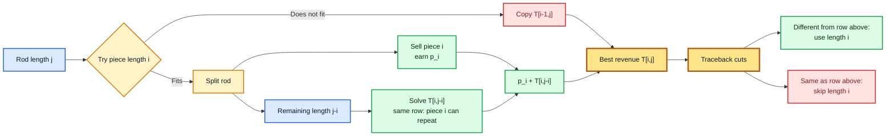

#### Algorithm

```text
ROD-CUTTING(price, n)
1. create table T[0...n][0...n]
2. for i = 0 to n:
3.     T[i][0] = 0
4. for j = 0 to n:
5.     T[0][j] = 0
6. for i = 1 to n:
7.     for j = 1 to n:
8.         if i <= j:
9.             T[i][j] = max(T[i - 1][j], price[i] + T[i][j - i])
10.        else:
11.            T[i][j] = T[i - 1][j]
12. return T[n][n]
```

#### Complexity Analysis

- Time Complexity: $\Theta(n^2)$
- Space Complexity: $\Theta(n^2)$ for the 2D table
- One-dimensional version: $\Theta(n)$ space

---

#### Classroom Problem: Maximum Revenue from a Rod

**Problem.** A rod of length 8 can be cut into integer lengths. Its selling prices are shown below. Find the maximum obtainable revenue and one optimal set of cuts.

| Length $i$ | 1 | 2 | 3 | 4 | 5 | 6 | 7 | 8 |
| :---: | :---: | :---: | :---: | :---: | :---: | :---: | :---: | :---: |
| Price $p_i$ | 1 | 5 | 8 | 9 | 10 | 17 | 17 | 20 |

##### Theoretical Solution

Let $R(j)$ be the maximum revenue obtainable from a rod of length $j$. Consider the first piece cut from the rod. If that piece has length $i$, it earns $p_i$ and leaves a rod of length $j-i$. The best revenue for the remainder is $R(j-i)$, so:

$$
R(0)=0
$$

$$
R(j) = \max_{1 \le i \le j}\{p_i + R(j-i)\}, \qquad 1 \le j \le 8
$$

This considers every possible first-cut length. By optimal substructure, the remaining rod must be cut for maximum revenue; otherwise replacing its cuts with a better solution would improve the whole solution.

| Rod length $j$ | 0 | 1 | 2 | 3 | 4 | 5 | 6 | 7 | 8 |
| :---: | :---: | :---: | :---: | :---: | :---: | :---: | :---: | :---: | :---: |
| Best revenue $R(j)$ | 0 | 1 | 5 | 8 | 10 | 13 | 17 | 18 | **22** |
| One first cut | - | 1 | 2 | 3 | 2 | 2 | 6 | 1 | 2 |

For the final entry:

$$
R(8) = \max(1+R(7),\ 5+R(6),\ 8+R(5),\ldots,\ 20+R(0)) = \max(19,22,21,\ldots,20)=22
$$

The first cut is length 2, leaving length 6. Since $R(6)=17$ is obtained by selling the length-6 piece, one optimal cutting is **2 and 6**, with maximum revenue **22**.

```text
ROD-CUTTING-REVENUE(price, n)
1. create array revenue[0...n]
2. revenue[0] = 0
3. for length = 1 to n:
4.     revenue[length] = 0
5.     for firstCut = 1 to length:
6.         revenue[length] = max(revenue[length], price[firstCut] + revenue[length - firstCut])
7. return revenue[n]
```

- Time Complexity: $\Theta(n^2)$
- Space Complexity: $\Theta(n)$

---

### Longest Common Subsequence (LCS)

#### Problem Statement

Given two sequences, find the longest sequence that appears in both of them in the same relative order. The characters do not need to be contiguous.

For example, in comparing biological sequences or text versions, we may want to know the longest ordered pattern shared by both strings.

#### Inputs and Output

- **Input:** two sequences $X=\langle x_1,\dots,x_m \rangle$ and $Y=\langle y_1,\dots,y_n \rangle$.
- **Output:** the length of the longest common subsequence and optionally the subsequence itself.

#### Subproblem Decomposition

Let $c[i,j]$ be the LCS length of prefixes $X[1...i]$ and $Y[1...j]$.

If the last characters match, they extend the LCS:

$$
c[i,j] = c[i-1,j-1] + 1
$$

If they do not match, remove one last character and take the better option:

$$
c[i,j] = \max(c[i-1,j], c[i,j-1])
$$

Complete recurrence:

$$
c[i,j] =
\begin{cases}
0, & i=0 \text{ or } j=0 \\
c[i-1,j-1]+1, & x_i = y_j \\
\max(c[i-1,j],c[i,j-1]), & x_i \ne y_j
\end{cases}
$$

#### Tabulation Walkthrough

Find the LCS of $X=\text{ABC}$ and $Y=\text{BDC}$.

Arrow legend for LCS tables:

- $\nwarrow$ means the characters match, so the value comes from the diagonal cell plus 1.
- $\uparrow$ means the characters do not match and the upper cell is chosen.
- $\leftarrow$ means the characters do not match and the left cell is chosen.

| $i \backslash j$ | - | B | D | C |
| :---: | :---: | :---: | :---: | :---: |
| - | 0 | 0 | 0 | 0 |
| A | 0 | 0 ($\uparrow$) | 0 ($\uparrow$) | 0 ($\uparrow$) |
| B | 0 | 1 ($\nwarrow$) | 1 ($\leftarrow$) | 1 ($\leftarrow$) |
| C | 0 | 1 ($\uparrow$) | 1 ($\uparrow$) | **2** ($\nwarrow$) |

Traceback starts at $c[3,3]=2$:

1. $C=C$, so include `C` and move diagonally to $c[2,2]$.
2. $B \ne D$, move to the larger neighboring cell $c[2,1]$.
3. $B=B$, so include `B` and move diagonally to $c[1,0]$.

The LCS is **BC**, with length **2**.

#### Classroom Problem: Matrix Tabular Format

Given:

- $X = \text{ab ac deb}$
- $Y = \text{a ab db}$

Spaces may be counted or ignored depending on the exam instruction. Both versions are shown.

##### Case A: Spaces Counted as Characters

$X = \langle a,b,\text{space},a,c,\text{space},d,e,b \rangle$, length 9.

$Y = \langle a,\text{space},a,b,\text{space},d,b \rangle$, length 7.

| $i \backslash j$ | - | a | space | a | b | space | d | b |
| :---: | :---: | :---: | :---: | :---: | :---: | :---: | :---: | :---: |
| - | 0 | 0 | 0 | 0 | 0 | 0 | 0 | 0 |
| a | 0 | 1 ($\nwarrow$) | 1 ($\leftarrow$) | 1 ($\nwarrow$) | 1 ($\leftarrow$) | 1 ($\leftarrow$) | 1 ($\leftarrow$) | 1 ($\leftarrow$) |
| b | 0 | 1 ($\uparrow$) | 1 ($\uparrow$) | 1 ($\uparrow$) | 2 ($\nwarrow$) | 2 ($\leftarrow$) | 2 ($\leftarrow$) | 2 ($\nwarrow$) |
| space | 0 | 1 ($\uparrow$) | 2 ($\nwarrow$) | 2 ($\leftarrow$) | 2 ($\uparrow$) | 3 ($\nwarrow$) | 3 ($\leftarrow$) | 3 ($\leftarrow$) |
| a | 0 | 1 ($\nwarrow$) | 2 ($\uparrow$) | 3 ($\nwarrow$) | 3 ($\leftarrow$) | 3 ($\uparrow$) | 3 ($\uparrow$) | 3 ($\uparrow$) |
| c | 0 | 1 ($\uparrow$) | 2 ($\uparrow$) | 3 ($\uparrow$) | 3 ($\uparrow$) | 3 ($\uparrow$) | 3 ($\uparrow$) | 3 ($\uparrow$) |
| space | 0 | 1 ($\uparrow$) | 2 ($\nwarrow$) | 3 ($\uparrow$) | 3 ($\uparrow$) | 4 ($\nwarrow$) | 4 ($\leftarrow$) | 4 ($\leftarrow$) |
| d | 0 | 1 ($\uparrow$) | 2 ($\uparrow$) | 3 ($\uparrow$) | 3 ($\uparrow$) | 4 ($\uparrow$) | 5 ($\nwarrow$) | 5 ($\leftarrow$) |
| e | 0 | 1 ($\uparrow$) | 2 ($\uparrow$) | 3 ($\uparrow$) | 3 ($\uparrow$) | 4 ($\uparrow$) | 5 ($\uparrow$) | 5 ($\uparrow$) |
| b | 0 | 1 ($\uparrow$) | 2 ($\uparrow$) | 3 ($\uparrow$) | 4 ($\nwarrow$) | 4 ($\uparrow$) | 5 ($\uparrow$) | **6** ($\nwarrow$) |

Traceback gives the LCS **a adb** with length **6**.

##### Case B: Spaces Ignored

$X = \text{abacdeb}$ and $Y = \text{aabdb}$.

| $i \backslash j$ | - | a | a | b | d | b |
| :---: | :---: | :---: | :---: | :---: | :---: | :---: |
| - | 0 | 0 | 0 | 0 | 0 | 0 |
| a | 0 | 1 ($\nwarrow$) | 1 ($\nwarrow$) | 1 ($\leftarrow$) | 1 ($\leftarrow$) | 1 ($\leftarrow$) |
| b | 0 | 1 ($\uparrow$) | 1 ($\uparrow$) | 2 ($\nwarrow$) | 2 ($\leftarrow$) | 2 ($\nwarrow$) |
| a | 0 | 1 ($\nwarrow$) | 2 ($\nwarrow$) | 2 ($\uparrow$) | 2 ($\uparrow$) | 2 ($\uparrow$) |
| c | 0 | 1 ($\uparrow$) | 2 ($\uparrow$) | 2 ($\uparrow$) | 2 ($\uparrow$) | 2 ($\uparrow$) |
| d | 0 | 1 ($\uparrow$) | 2 ($\uparrow$) | 2 ($\uparrow$) | 3 ($\nwarrow$) | 3 ($\leftarrow$) |
| e | 0 | 1 ($\uparrow$) | 2 ($\uparrow$) | 2 ($\uparrow$) | 3 ($\uparrow$) | 3 ($\uparrow$) |
| b | 0 | 1 ($\uparrow$) | 2 ($\uparrow$) | 3 ($\nwarrow$) | 3 ($\uparrow$) | **4** ($\nwarrow$) |

Traceback gives the LCS **aadb** with length **4**.

#### Mermaid Diagram: LCS Match, Mismatch, and Traceback

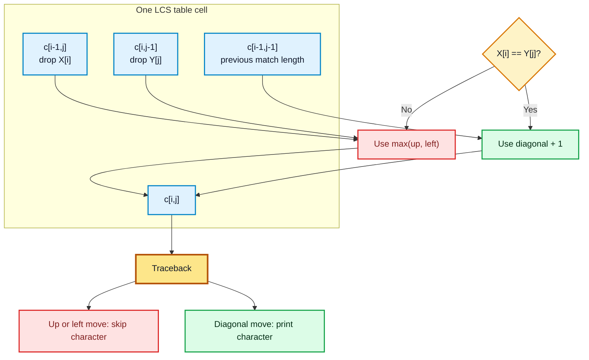

#### Algorithm

```text
LCS-LENGTH(X, Y, m, n)
1. create table c[0...m][0...n]
2. create table direction[1...m][1...n]
3. for i = 0 to m: c[i][0] = 0
4. for j = 0 to n: c[0][j] = 0
5. for i = 1 to m:
6.     for j = 1 to n:
7.         if X[i] == Y[j]:
8.             c[i][j] = c[i - 1][j - 1] + 1
9.             direction[i][j] = "diagonal"
10.        else if c[i - 1][j] >= c[i][j - 1]:
11.            c[i][j] = c[i - 1][j]
12.            direction[i][j] = "up"
13.        else:
14.            c[i][j] = c[i][j - 1]
15.            direction[i][j] = "left"
16. return c and direction
```

#### Complexity Analysis

- Time Complexity: $\Theta(mn)$
- Space Complexity: $\Theta(mn)$
- Space-optimized length-only version: $\Theta(\min(m,n))$ auxiliary space

---

### Matrix Chain Multiplication

#### Problem Statement

Given a sequence of matrices, find the parenthesization that minimizes the number of scalar multiplications. The order of matrices cannot be changed, but the multiplication grouping can be changed.

For matrices $A_1,A_2,\dots,A_n$, if $A_i$ has dimension $p_{i-1} \times p_i$, the dimension array is $p_0,p_1,\dots,p_n$.

#### Inputs and Output

- **Input:** dimension array $p[0...n]$.
- **Output:** minimum number of scalar multiplications and the optimal split positions.

#### Subproblem Decomposition

Let $M[i,j]$ be the minimum multiplication cost for matrices $A_i \dots A_j$.

If the final split is after $A_k$, then:

$$
M[i,j] = M[i,k] + M[k+1,j] + p_{i-1}p_kp_j
$$

Try all split points:

$$
M[i,j] = \min_{i \le k < j}\{M[i,k] + M[k+1,j] + p_{i-1}p_kp_j\}
$$

Base case:

$$
M[i,i]=0
$$

#### Tabulation Walkthrough

Given four matrices with dimensions:

- $A_1: 5 \times 10$
- $A_2: 10 \times 3$
- $A_3: 3 \times 12$
- $A_4: 12 \times 5$

So $p = [5,10,3,12,5]$.

Length 2 intervals:

- $M[1,2] = 5 \cdot 10 \cdot 3 = 150$
- $M[2,3] = 10 \cdot 3 \cdot 12 = 360$
- $M[3,4] = 3 \cdot 12 \cdot 5 = 180$

Length 3 intervals:

$$
M[1,3] = \min(0+360+5\cdot10\cdot12,\ 150+0+5\cdot3\cdot12)=\min(960,330)=330
$$

$$
M[2,4] = \min(0+180+10\cdot3\cdot5,\ 360+0+10\cdot12\cdot5)=\min(330,960)=330
$$

Length 4 interval:

$$
\begin{aligned}
M[1,4] = \min(&0+330+5\cdot10\cdot5,\\
&150+180+5\cdot3\cdot5,\\
&330+0+5\cdot12\cdot5) \\
= \min(580,405,630)=405
\end{aligned}
$$

Complete cost table:

Arrow legend for Matrix Chain Multiplication:

- $\downarrow k$ marks the split point that produced the minimum value in that interval.
- After choosing $k$, traceback recursively follows the left interval $M[i,k]$ and right interval $M[k+1,j]$.

| $M[i,j]$ | 1 | 2 | 3 | 4 |
| :---: | :---: | :---: | :---: | :---: |
| 1 | 0 | 150 ($\downarrow k=1$) | 330 ($\downarrow k=2$) | **405** ($\downarrow k=2$) |
| 2 | - | 0 | 360 ($\downarrow k=2$) | 330 ($\downarrow k=2$) |
| 3 | - | - | 0 | 180 ($\downarrow k=3$) |
| 4 | - | - | - | 0 |

Arrow-guided traceback for the final cell:

| Current cell | Follow split arrow | Subproblems created |
| :---: | :---: | :--- |
| $M[1,4]=405$ | $\downarrow k=2$ | $M[1,2]$ and $M[3,4]$ |
| $M[1,2]=150$ | $\downarrow k=1$ | $A_1$ and $A_2$ |
| $M[3,4]=180$ | $\downarrow k=3$ | $A_3$ and $A_4$ |

The minimum cost is **405**, obtained by splitting at $k=2$: $(A_1A_2)(A_3A_4)$.

#### Mermaid Diagram: Matrix Chain Interval Splits

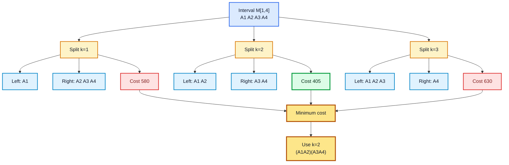

#### Algorithm

```text
MATRIX-CHAIN-ORDER(p, n)
1. create tables M[1...n][1...n] and split[1...n][1...n]
2. for i = 1 to n:
3.     M[i][i] = 0
4. for length = 2 to n:
5.     for i = 1 to n - length + 1:
6.         j = i + length - 1
7.         M[i][j] = infinity
8.         for k = i to j - 1:
9.             cost = M[i][k] + M[k + 1][j] + p[i - 1] * p[k] * p[j]
10.            if cost < M[i][j]:
11.                M[i][j] = cost
12.                split[i][j] = k
13. return M and split
```

#### Complexity Analysis

- Time Complexity: $\Theta(n^3)$
- Space Complexity: $\Theta(n^2)$

---

### Optimal Binary Search Tree (Optimal BST)

#### Problem Statement

Given sorted keys and their search probabilities, construct a binary search tree with the minimum expected search cost. Frequently searched keys should usually appear closer to the root, but the binary-search ordering must still be preserved.

#### Inputs and Output

- **Input:** sorted keys $k_1,\dots,k_n$, successful search probabilities $p_1,\dots,p_n$, and unsuccessful search probabilities $q_0,\dots,q_n$.
- **Output:** minimum expected search cost and the root choices for the optimal tree.

#### Subproblem Decomposition

Let $E[i,j]$ be the minimum expected cost for keys $i$ through $j$.

Let $W[i,j]$ be the total probability weight in that interval.

If key $r$ is chosen as root, then keys $i$ through $r-1$ form the left subtree and keys $r+1$ through $j$ form the right subtree.

$$
E[i,j] = \min_{i \le r \le j}\{E[i,r-1] + E[r+1,j] + W[i,j]\}
$$

Base case:

$$
E[i,i-1] = q_{i-1}
$$

#### Tabulation Walkthrough

Given three sorted keys with probabilities:

| Key | $k_1$ | $k_2$ | $k_3$ |
| :---: | :---: | :---: | :---: |
| $p_i$ | 0.15 | 0.10 | 0.05 |

Unsuccessful probabilities:

| Gap | $q_0$ | $q_1$ | $q_2$ | $q_3$ |
| :---: | :---: | :---: | :---: | :---: |
| Probability | 0.05 | 0.10 | 0.05 | 0.05 |

Initialization:

$$
E[1,0]=0.05,\ E[2,1]=0.10,\ E[3,2]=0.05,\ E[4,3]=0.05
$$

Length 1:

- $E[1,1]=0.05+0.10+0.30=0.45$
- $E[2,2]=0.10+0.05+0.25=0.40$
- $E[3,3]=0.05+0.05+0.15=0.25$

Length 2:

$$
E[1,2]=\min(0.05+0.40+0.45,\ 0.45+0.05+0.45)=\min(0.90,0.95)=0.90
$$

$$
E[2,3]=\min(0.10+0.25+0.35,\ 0.40+0.05+0.35)=\min(0.70,0.80)=0.70
$$

Length 3:

$$
E[1,3]=\min(0.05+0.70+0.55,\ 0.45+0.25+0.55,\ 0.90+0.05+0.55)
$$

$$
E[1,3]=\min(1.30,1.25,1.50)=1.25
$$

Expected cost table:

Arrow legend for Optimal BST:

- $\downarrow r=k_i$ means key $k_i$ is chosen as the root of that interval.
- Traceback follows the selected root, then recursively solves the left and right key intervals.

| $E[i,j]$ | 0 | 1 | 2 | 3 |
| :---: | :---: | :---: | :---: | :---: |
| 1 | 0.05 | 0.45 ($\downarrow r=k_1$) | 0.90 ($\downarrow r=k_1$) | **1.25** ($\downarrow r=k_2$) |
| 2 | - | 0.10 | 0.40 ($\downarrow r=k_2$) | 0.70 ($\downarrow r=k_2$) |
| 3 | - | - | 0.05 | 0.25 ($\downarrow r=k_3$) |
| 4 | - | - | - | 0.05 |

Arrow-guided root reconstruction:

| Interval | Root arrow | Left subtree | Right subtree |
| :---: | :---: | :---: | :---: |
| $E[1,3]$ | $\downarrow r=k_2$ | $E[1,1]$ | $E[3,3]$ |
| $E[1,1]$ | $\downarrow r=k_1$ | empty | empty |
| $E[3,3]$ | $\downarrow r=k_3$ | empty | empty |

The optimal root for keys 1 through 3 is $k_2$, because the minimum value for $E[1,3]$ occurs at $r=2$.

#### Mermaid Diagram: Optimal BST Root Choices

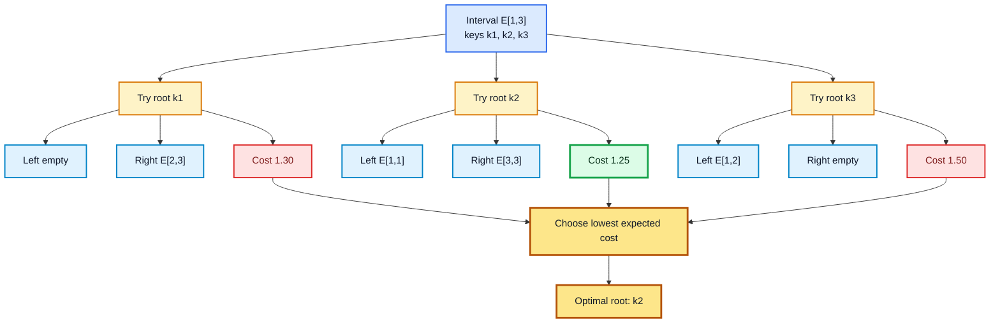

#### Algorithm

```text
OPTIMAL-BST(p, q, n)
1. create tables E[1...n+1][0...n], W[1...n+1][0...n], root[1...n][1...n]
2. for i = 1 to n + 1:
3.     E[i][i - 1] = q[i - 1]
4.     W[i][i - 1] = q[i - 1]
5. for length = 1 to n:
6.     for i = 1 to n - length + 1:
7.         j = i + length - 1
8.         E[i][j] = infinity
9.         W[i][j] = W[i][j - 1] + p[j] + q[j]
10.        for r = i to j:
11.            cost = E[i][r - 1] + E[r + 1][j] + W[i][j]
12.            if cost < E[i][j]:
13.                E[i][j] = cost
14.                root[i][j] = r
15. return E and root
```

#### Complexity Analysis

- Time Complexity: $\Theta(n^3)$
- Space Complexity: $\Theta(n^2)$

---

### Multistage Graph

#### Problem Statement

Given a directed weighted graph divided into stages, find the minimum-cost path from a source in the first stage to a sink in the last stage. Edges go only from one stage to a later stage, so the graph is acyclic.

#### Inputs and Output

- **Input:** staged directed graph, source $A$, sink $K$, and edge weights.
- **Output:** shortest path from $A$ to $K$ and its total cost.

#### Worked Graph

Use this 5-stage graph:

| From | To with costs |
| :---: | :--- |
| A | B:9, C:7, D:3 |
| B | E:4, F:2, G:1 |
| C | E:2, F:7, G:11 |
| D | E:5, F:11, G:8 |
| E | H:11, I:8, J:5 |
| F | H:4, I:3, J:7 |
| G | H:5, I:6, J:2 |
| H | K:4 |
| I | K:2 |
| J | K:5 |

#### Mermaid Diagram: Multistage Graph Layout

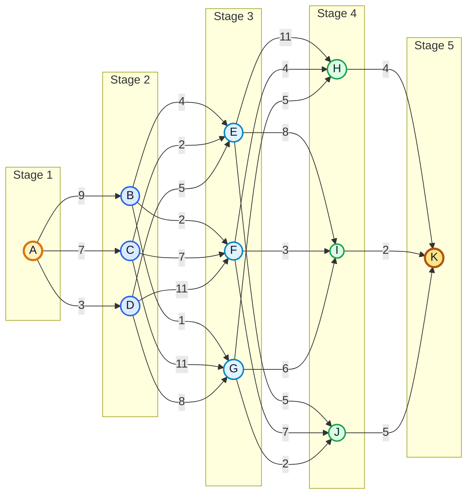

#### Subproblem Decomposition

Let $Cost(X)$ be the minimum cost from node $X$ to destination $K$.

$$
Cost(X) = \min_{(X,Y) \in E}\{w(X,Y) + Cost(Y)\}
$$

Base case:

$$
Cost(K)=0
$$

#### Tabulation Walkthrough: Backward Solution

Stage 5:

$$
Cost(K)=0
$$

Stage 4:

- $Cost(H)=4+0=4$
- $Cost(I)=2+0=2$
- $Cost(J)=5+0=5$

Stage 3:

$$
Cost(E)=\min(11+4,8+2,5+5)=\min(15,10,10)=10
$$

$$
Cost(F)=\min(4+4,3+2,7+5)=\min(8,5,12)=5
$$

$$
Cost(G)=\min(5+4,6+2,2+5)=\min(9,8,7)=7
$$

Stage 2:

$$
Cost(B)=\min(4+10,2+5,1+7)=\min(14,7,8)=7
$$

$$
Cost(C)=\min(2+10,7+5,11+7)=\min(12,12,18)=12
$$

$$
Cost(D)=\min(5+10,11+5,8+7)=\min(15,16,15)=15
$$

Stage 1:

$$
Cost(A)=\min(9+7,7+12,3+15)=\min(16,19,18)=16
$$

Arrow-guided backward table:

| Node | Candidate arrows | Chosen arrow | Stored cost |
| :---: | :--- | :---: | :---: |
| $H$ | $H \rightarrow K: 4+0$ | $H \rightarrow K$ | 4 |
| $I$ | $I \rightarrow K: 2+0$ | $I \rightarrow K$ | 2 |
| $J$ | $J \rightarrow K: 5+0$ | $J \rightarrow K$ | 5 |
| $E$ | $E \rightarrow H:15$, $E \rightarrow I:10$, $E \rightarrow J:10$ | $E \rightarrow I$ or $E \rightarrow J$ | 10 |
| $F$ | $F \rightarrow H:8$, $F \rightarrow I:5$, $F \rightarrow J:12$ | $F \rightarrow I$ | 5 |
| $G$ | $G \rightarrow H:9$, $G \rightarrow I:8$, $G \rightarrow J:7$ | $G \rightarrow J$ | 7 |
| $B$ | $B \rightarrow E:14$, $B \rightarrow F:7$, $B \rightarrow G:8$ | $B \rightarrow F$ | 7 |
| $C$ | $C \rightarrow E:12$, $C \rightarrow F:12$, $C \rightarrow G:18$ | $C \rightarrow E$ or $C \rightarrow F$ | 12 |
| $D$ | $D \rightarrow E:15$, $D \rightarrow F:16$, $D \rightarrow G:15$ | $D \rightarrow E$ or $D \rightarrow G$ | 15 |
| $A$ | $A \rightarrow B:16$, $A \rightarrow C:19$, $A \rightarrow D:18$ | $A \rightarrow B$ | **16** |

Path reconstruction:

- From $A$, choose $B$.
- From $B$, choose $F$.
- From $F$, choose $I$.
- From $I$, choose $K$.

Optimal path: **$A \to B \to F \to I \to K$**. Minimum cost: **16**.

#### Forward Tabulation Check

Let $Dist(X)$ be the minimum cost from source $A$ to node $X$.

- Stage 1: $Dist(A)=0$
- Stage 2: $Dist(B)=9$, $Dist(C)=7$, $Dist(D)=3$
- Stage 3: $Dist(E)=8$, $Dist(F)=11$, $Dist(G)=10$
- Stage 4: $Dist(H)=15$, $Dist(I)=14$, $Dist(J)=12$
- Stage 5: $Dist(K)=\min(15+4,14+2,12+5)=16$

This confirms the same minimum cost: **16**.

#### Mermaid Diagram: Backward DP Cost Flow

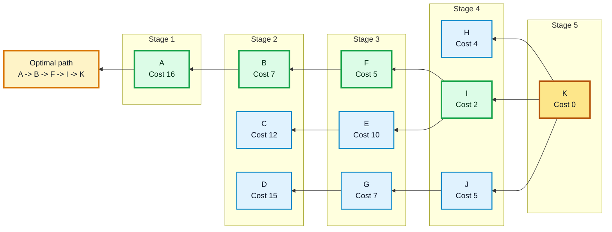

#### Algorithm

```text
MULTISTAGE-GRAPH(G, source, sink)
1. Cost[sink] = 0
2. for each vertex v in reverse stage order, excluding sink:
3.     Cost[v] = infinity
4.     for each outgoing edge (v, u):
5.         candidate = weight(v, u) + Cost[u]
6.         if candidate < Cost[v]:
7.             Cost[v] = candidate
8.             next[v] = u
9. return Cost[source] and next
```

#### Complexity Analysis

- Time Complexity: $\Theta(V+E)$ when vertices are already grouped by stage
- Space Complexity: $\Theta(V)$

---

### Travelling Salesman Problem (TSP)

#### Problem Statement

A salesperson starts from city 1, visits every other city exactly once, and returns to city 1. Given the travel cost between each pair of cities, find the minimum-cost tour.

#### Inputs and Output

- **Input:** distance matrix $C$ of size $n \times n$.
- **Output:** minimum tour cost and the tour order.

#### Subproblem Decomposition

Let $g(i,S)$ be the length of the shortest path starting at city $i$, visiting every city in subset $S$ exactly once, and then returning to city 1.

Base case:

$$
g(i,\emptyset)=C_{i1}
$$

Recursive case:

$$
g(i,S)=\min_{j \in S}\{C_{ij}+g(j,S-\{j\})\}
$$

Final answer:

$$
\min_{2 \le j \le n}\{C_{1j}+g(j,V-\{1,j\})\}
$$

#### Tabulation Walkthrough

For four cities, use:

$$
C =
\begin{pmatrix}
0 & 2 & 9 & 10 \\
1 & 0 & 6 & 4 \\
15 & 7 & 0 & 8 \\
6 & 3 & 12 & 0
\end{pmatrix}
$$

Subsets of size 0:

- $g(2,\emptyset)=C_{21}=1$
- $g(3,\emptyset)=C_{31}=15$
- $g(4,\emptyset)=C_{41}=6$

Subsets of size 1:

- $g(2,\{3\})=C_{23}+g(3,\emptyset)=6+15=21$
- $g(2,\{4\})=C_{24}+g(4,\emptyset)=4+6=10$
- $g(3,\{2\})=C_{32}+g(2,\emptyset)=7+1=8$
- $g(3,\{4\})=C_{34}+g(4,\emptyset)=8+6=14$
- $g(4,\{2\})=C_{42}+g(2,\emptyset)=3+1=4$
- $g(4,\{3\})=C_{43}+g(3,\emptyset)=12+15=27$

Subsets of size 2:

$$
g(2,\{3,4\})=\min(6+14,4+27)=20
$$

$$
g(3,\{2,4\})=\min(7+10,8+4)=12
$$

$$
g(4,\{2,3\})=\min(3+21,12+8)=20
$$

Final calculation:

$$
\min(2+20,9+12,10+20)=\min(22,21,30)=21
$$

Arrow-guided subset table:

| State | Candidate arrows | Chosen arrow | Stored cost |
| :---: | :--- | :---: | :---: |
| $g(2,\{3,4\})$ | $2 \rightarrow 3: 6+14=20$, $2 \rightarrow 4: 4+27=31$ | $2 \rightarrow 3$ | 20 |
| $g(3,\{2,4\})$ | $3 \rightarrow 2: 7+10=17$, $3 \rightarrow 4: 8+4=12$ | $3 \rightarrow 4$ | 12 |
| $g(4,\{2,3\})$ | $4 \rightarrow 2: 3+21=24$, $4 \rightarrow 3: 12+8=20$ | $4 \rightarrow 3$ | 20 |
| Final from city 1 | $1 \rightarrow 2: 22$, $1 \rightarrow 3: 21$, $1 \rightarrow 4: 30$ | $1 \rightarrow 3$ | **21** |

Minimum tour cost: **21**. One optimal tour is **$1 \to 3 \to 4 \to 2 \to 1$**.

#### Mermaid Diagram: TSP Subset DP Expansion

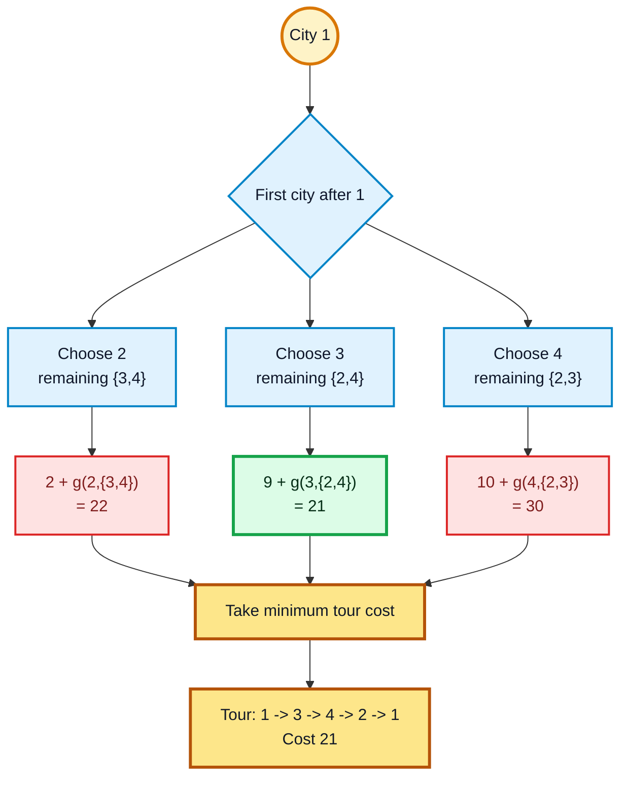

#### Algorithm

```text
TSP-HELD-KARP(C, n)
1. for i = 2 to n:
2.     g[i][empty set] = C[i][1]
3. for subset_size = 1 to n - 2:
4.     for each subset S of {2, 3, ..., n} with size subset_size:
5.         for each city i not in S and i != 1:
6.             g[i][S] = infinity
7.             for each city j in S:
8.                 g[i][S] = min(g[i][S], C[i][j] + g[j][S - {j}])
9. answer = infinity
10. for j = 2 to n:
11.     answer = min(answer, C[1][j] + g[j][{2, ..., n} - {j}])
12. return answer
```

#### Complexity Analysis

- Time Complexity: $\Theta(n^2 2^n)$
- Space Complexity: $\Theta(n2^n)$

---

### Shortest Path (All Pairs) - Floyd-Warshall Algorithm

#### Problem Statement

Given a weighted directed graph, find the shortest path distance between every pair of vertices.

Floyd-Warshall allows each vertex to become an intermediate point one by one and updates the distance matrix accordingly.

#### Inputs and Output

- **Input:** adjacency weight matrix $W$ of size $n \times n$.
- **Output:** matrix $D$ where $D[i,j]$ is the shortest distance from vertex $i$ to vertex $j$.

#### Subproblem Decomposition

Let $D^{(k)}[i,j]$ be the shortest distance from $i$ to $j$ using only vertices $1$ through $k$ as intermediate vertices.

When vertex $k$ is allowed:

- Do not use $k$: distance remains $D^{(k-1)}[i,j]$.
- Use $k$: distance becomes $D^{(k-1)}[i,k] + D^{(k-1)}[k,j]$.

$$
D^{(k)}[i,j] = \min(D^{(k-1)}[i,j],\ D^{(k-1)}[i,k] + D^{(k-1)}[k,j])
$$

#### Tabulation Walkthrough

For a 3-vertex graph:

- Edge $1 \to 2$ has weight 3.
- Edge $2 \to 3$ has weight 1.
- Edge $1 \to 3$ has weight 6.

Initial matrix:

$$
D^{(0)} =
\begin{pmatrix}
0 & 3 & 6 \\
\infty & 0 & 1 \\
\infty & \infty & 0
\end{pmatrix}
$$

Allow vertex 1 as intermediate:

$$
D^{(1)} = D^{(0)}
$$

Allow vertex 2 as intermediate:

$$
D[1,3] = \min(6, D[1,2] + D[2,3]) = \min(6,3+1)=4
$$

Updated matrix:

$$
D^{(2)} =
\begin{pmatrix}
0 & 3 & 4 \\
\infty & 0 & 1 \\
\infty & \infty & 0
\end{pmatrix}
$$

Arrow-guided update for intermediate vertex $k=2$:

| Cell | Keep direct path | Try detour through $2$ | Chosen arrow | Stored value |
| :---: | :---: | :---: | :---: | :---: |
| $D[1,2]$ | 3 | $D[1,2]+D[2,2]=3+0=3$ | $\uparrow$ keep | 3 |
| $D[1,3]$ | 6 | $D[1,2]+D[2,3]=3+1=4$ | $1 \rightarrow 2 \rightarrow 3$ | **4** |
| $D[2,3]$ | 1 | $D[2,2]+D[2,3]=0+1=1$ | $\uparrow$ keep | 1 |

The shortest path from 1 to 3 is updated from **6** to **4** through vertex 2.

#### Mermaid Diagram: Floyd-Warshall Detour Update

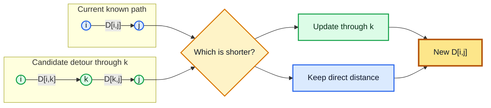

#### Algorithm

```text
FLOYD-WARSHALL(W, n)
1. D = W
2. for k = 1 to n:
3.     for i = 1 to n:
4.         for j = 1 to n:
5.             if D[i][k] + D[k][j] < D[i][j]:
6.                 D[i][j] = D[i][k] + D[k][j]
7. return D
```

#### Complexity Analysis

- Time Complexity: $\Theta(n^3)$
- Space Complexity: $\Theta(n^2)$

---

### Shortest Path (Single Source) - Bellman-Ford Algorithm

#### Problem Statement

Given a weighted graph and a source vertex, find the shortest path distance from the source to every other vertex. Bellman-Ford also detects whether a negative-weight cycle is reachable from the source.

#### Inputs and Output

- **Input:** graph $G=(V,E)$, edge weights $w(u,v)$, and source vertex $s$.
- **Output:** shortest distance from $s$ to every vertex, or a report that a negative-weight cycle exists.

#### Subproblem Decomposition

Let $dist_k[v]$ be the shortest distance from source $s$ to vertex $v$ using at most $k$ edges.

For each edge $(u,v)$:

$$
dist_k[v] = \min(dist_{k-1}[v],\ dist_{k-1}[u] + w(u,v))
$$

Base case:

$$
dist_0[s]=0, \qquad dist_0[v]=\infty \text{ for } v \ne s
$$

In the standard implementation, the table is compressed into one distance array and all edges are relaxed $|V|-1$ times.

#### Tabulation Walkthrough

Let the source be $A$ and the edges be:

| Edge | Weight |
| :---: | :---: |
| $A \to B$ | 4 |
| $A \to C$ | 5 |
| $B \to C$ | -2 |
| $B \to D$ | 6 |
| $C \to D$ | 1 |

Initial distances:

| Round | A | B | C | D |
| :---: | :---: | :---: | :---: | :---: |
| 0 | 0 | infinity | infinity | infinity |

After round 1:

- Relax $A \to B$: $B=4$.
- Relax $A \to C$: $C=5$.
- Relax $B \to C$: $C=\min(5,4-2)=2$.
- Relax $B \to D$: $D=10$.
- Relax $C \to D$: $D=\min(10,2+1)=3$.

| Round | A | B | C | D |
| :---: | :---: | :---: | :---: | :---: |
| 0 | 0 | infinity | infinity | infinity |
| 1 | 0 | 4 | 2 | 3 |
| 2 | 0 | 4 | 2 | 3 |
| 3 | 0 | 4 | 2 | 3 |

Arrow-guided relaxation table:

| Relaxed edge | Before | Candidate through arrow | After | Parent arrow |
| :---: | :---: | :---: | :---: | :---: |
| $A \rightarrow B$ | $\infty$ | $dist(A)+4=0+4$ | 4 | $A \rightarrow B$ |
| $A \rightarrow C$ | $\infty$ | $dist(A)+5=0+5$ | 5 | $A \rightarrow C$ |
| $B \rightarrow C$ | 5 | $dist(B)-2=4-2$ | **2** | $B \rightarrow C$ |
| $B \rightarrow D$ | $\infty$ | $dist(B)+6=4+6$ | 10 | $B \rightarrow D$ |
| $C \rightarrow D$ | 10 | $dist(C)+1=2+1$ | **3** | $C \rightarrow D$ |

Following the parent arrows gives shortest paths such as $A \rightarrow B \rightarrow C \rightarrow D$ for vertex $D$.

No value improves after round 1, so the final shortest distances are:

$$
dist(A)=0,\quad dist(B)=4,\quad dist(C)=2,\quad dist(D)=3
$$

One more pass over all edges checks for a negative-weight cycle. If any distance can still be improved, such a cycle exists.

#### Mermaid Diagram: Bellman-Ford Relaxation Rounds

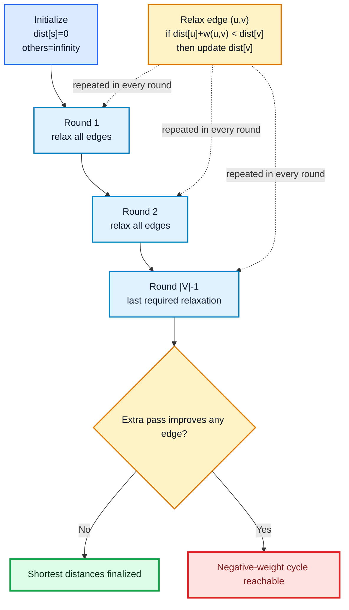

#### Algorithm

```text
BELLMAN-FORD(G, source)
1. for each vertex v in V:
2.     dist[v] = infinity
3.     parent[v] = NIL
4. dist[source] = 0
5. repeat |V| - 1 times:
6.     for each edge (u, v) in E:
7.         if dist[u] + weight(u, v) < dist[v]:
8.             dist[v] = dist[u] + weight(u, v)
9.             parent[v] = u
10. for each edge (u, v) in E:
11.     if dist[u] + weight(u, v) < dist[v]:
12.         report negative-weight cycle
13. return dist and parent
```

#### Complexity Analysis

- Time Complexity: $\Theta(VE)$
- Space Complexity: $\Theta(V)$ for the standard implementation
- Full DP table version: $\Theta(V^2)$ space if every round is stored

---

### Reliability Design

#### Problem Statement

A system has multiple stages connected in series. Each stage can be made more reliable by placing parallel copies of the same component. Given a limited budget, choose how many copies to use in each stage so that total system reliability is maximized.

For one component with reliability $r_i$, using $x_i$ parallel copies gives stage reliability:

$$
R_i(x_i) = 1 - (1-r_i)^{x_i}
$$

For stages in series, total reliability is the product of stage reliabilities.

#### Inputs and Output

- **Input:** number of stages $m$, budget $B$, component cost $c_i$, component reliability $r_i$, and valid copy choices $x_i$.
- **Output:** maximum system reliability under the budget.

#### Subproblem Decomposition

Let $DP[i,b]$ be the maximum reliability using the first $i$ stages with budget at most $b$.

For each valid number of copies $x$ in stage $i$:

$$
DP[i,b] = \max_x\{DP[i-1,b-cost_i(x)] \times R_i(x)\}
$$

Base case:

$$
DP[0,b]=1
$$

The empty system has reliability 1 because it does not reduce the product.

#### Tabulation Walkthrough

Suppose there are 3 stages and total budget $B=5$.

| Stage | Cost per copy | Single-copy reliability |
| :---: | :---: | :---: |
| 1 | 1 | 0.80 |
| 2 | 2 | 0.70 |
| 3 | 1 | 0.60 |

At least one copy is required for each stage. Parallel reliability values:

- Stage 1: $R_1(1)=0.80$, $R_1(2)=0.96$, $R_1(3)=0.992$.
- Stage 2: $R_2(1)=0.70$, $R_2(2)=0.91$.
- Stage 3: $R_3(1)=0.60$, $R_3(2)=0.84$.

DP table for budgets 0 through 5. A value of 0 means infeasible.

Arrow legend for Reliability Design:

- $\nwarrow x$ means the current stage chooses $x$ copies and points back to the previous stage with the remaining budget.
- A blank or 0 cell means the design is infeasible for that budget.

| Stages considered | $B=0$ | $B=1$ | $B=2$ | $B=3$ | $B=4$ | $B=5$ |
| :---: | :---: | :---: | :---: | :---: | :---: | :---: |
| 0 | 1 | 1 | 1 | 1 | 1 | 1 |
| 1 | 0 | 0.8000 | 0.9600 | 0.9920 | 0.9984 | 0.9997 |
| 2 | 0 | 0 | 0 | 0.5600 | 0.6720 | 0.7280 |
| 3 | 0 | 0 | 0 | 0 | 0.3360 | **0.4704** |

Arrow-guided predecessor table:

| Stages considered | $B=0$ | $B=1$ | $B=2$ | $B=3$ | $B=4$ | $B=5$ |
| :---: | :---: | :---: | :---: | :---: | :---: | :---: |
| 0 | 1 | 1 | 1 | 1 | 1 | 1 |
| 1 | 0 | 0.8000 ($\nwarrow x=1$) | 0.9600 ($\nwarrow x=2$) | 0.9920 ($\nwarrow x=3$) | 0.9984 ($\nwarrow x=4$) | 0.9997 ($\nwarrow x=5$) |
| 2 | 0 | 0 | 0 | 0.5600 ($\nwarrow x=1$) | 0.6720 ($\nwarrow x=1$) | 0.7280 ($\nwarrow x=2$) |
| 3 | 0 | 0 | 0 | 0 | 0.3360 ($\nwarrow x=1$) | **0.4704** ($\nwarrow x=2$) |

Key calculation for final cell:

$$
DP[3,5] = \max(DP[2,4]\times R_3(1),\ DP[2,3]\times R_3(2))
$$

$$
DP[3,5] = \max(0.6720\times 0.60,\ 0.5600\times 0.84)=\max(0.4032,0.4704)=0.4704
$$

The best design uses:

- Stage 1: 1 copy
- Stage 2: 1 copy
- Stage 3: 2 copies

Maximum reliability: **0.4704**.

#### Mermaid Diagram: Reliability Design Budget Choices

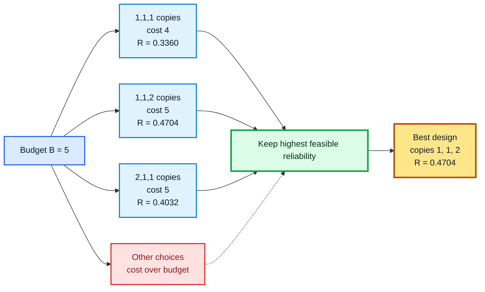

#### Algorithm

```text
RELIABILITY-DESIGN(stages, budget)
1. create table DP[0...m][0...budget]
2. for b = 0 to budget:
3.     DP[0][b] = 1
4. for i = 1 to m:
5.     for b = 0 to budget:
6.         DP[i][b] = 0
7.         for each valid copy count x for stage i:
8.             if cost_i(x) <= b:
9.                 candidate = DP[i - 1][b - cost_i(x)] * reliability_i(x)
10.                DP[i][b] = max(DP[i][b], candidate)
11. return DP[m][budget]
```

#### Complexity Analysis

- Let $m$ be the number of stages, $B$ be the budget, and $X$ be the maximum number of choices per stage.
- Time Complexity: $\Theta(mBX)$
- Space Complexity: $\Theta(mB)$
- Space-optimized version: $\Theta(B)$ if previous-stage values are preserved correctly

---

## Analyze Time Complexity of Above Problems

| Problem | Main state count | Work per state | Time Complexity | Space Complexity |
| :--- | :--- | :--- | :--- | :--- |
| Climbing Stairs | $n$ | $\Theta(1)$ | $\Theta(n)$ | $\Theta(n)$, optimized to $\Theta(1)$ |
| 0/1 Knapsack | $nW$ | $\Theta(1)$ | $\Theta(nW)$ | $\Theta(nW)$, optimized to $\Theta(W)$ |
| Rod Cutting | $n^2$ in 2D form | $\Theta(1)$ | $\Theta(n^2)$ | $\Theta(n^2)$, optimized to $\Theta(n)$ |
| Longest Common Subsequence (LCS) | $mn$ | $\Theta(1)$ | $\Theta(mn)$ | $\Theta(mn)$ |
| Matrix Chain Multiplication | $n^2$ intervals | Up to $n$ split points | $\Theta(n^3)$ | $\Theta(n^2)$ |
| Optimal Binary Search Tree (Optimal BST) | $n^2$ intervals | Up to $n$ root choices | $\Theta(n^3)$ | $\Theta(n^2)$ |
| Multistage Graph | $V$ vertices | Outgoing edges scanned once overall | $\Theta(V+E)$ | $\Theta(V)$ |
| Travelling Salesman Problem (TSP) | $n2^n$ subset states | Up to $n$ choices | $\Theta(n^2 2^n)$ | $\Theta(n2^n)$ |
| Floyd-Warshall Algorithm | $n^2$ pairs for each intermediate vertex | $\Theta(1)$ | $\Theta(n^3)$ | $\Theta(n^2)$ |
| Bellman-Ford Algorithm | $V$ relaxation rounds | Scan $E$ edges per round | $\Theta(VE)$ | $\Theta(V)$ |
| Reliability Design | $mB$ states | Up to $X$ choices | $\Theta(mBX)$ | $\Theta(mB)$, optimized to $\Theta(B)$ |

Important notes:

- $W$ and $B$ are numeric limits, so 0/1 Knapsack and Reliability Design are pseudo-polynomial in those values.
- TSP remains exponential even with DP because it stores subset states.
- Floyd-Warshall solves all-pairs shortest paths, while Bellman-Ford solves single-source shortest paths and detects reachable negative-weight cycles.

---

[Previous: Chapter 7 - Greedy Algorithms](../Chapter%207%20-%20Greedy%20Algorithms/README.md) | [Home](../README.md) | [Next: Chapter 9 - Backtracking](../Chapter%209%20-%20Backtracking/README.md)
