# Chapter 8: Dynamic Programming

Welcome to the sessional guide on **Dynamic Programming** for the [CSE 2201 Algorithm Design and Analysis](../SYLLABUS.md) sessional course. This chapter covers the core concepts, mathematical recurrences, and step-by-step table updates for the required syllabus topics.

---

## Table of Contents

1. [Introduction to Dynamic Programming](#introduction-to-dynamic-programming)
   - [Principle of Optimality](#-principle-of-optimality)
   - [Memoization (Top-Down) vs. Tabulation (Bottom-Up)](#-memoization-top-down-vs-tabulation-bottom-up)
   - [Greedy Algorithm vs. Dynamic Programming](#%EF%B8%8F-greedy-algorithm-vs-dynamic-programming)
    - [Worked Example: Precious Metals Fractional Knapsack (Greedy)](#-worked-example-precious-metals-fractional-knapsack-greedy)
2. [Fibonacci (Recursion and DP)](#1-fibonacci-recursion-and-dp)
3. [Coin-Row Problem](#2-coin-row-problem)
4. [Change-Making Problem (DP)](#3-change-making-problem-dp)
5. [Coin-Collecting Problem](#4-coin-collecting-problem)
6. [0/1 Knapsack Problem](#5-01-knapsack-problem)
   - [Classroom Problem A: Multiples of 10 Weights](#problem-a-multiples-of-10-weights)
   - [Classroom Problem B: Small Integer Weights](#problem-b-small-integer-weights)
7. [Longest Common Subsequence (LCS)](#6-longest-common-subsequence-lcs)
   - [Substring vs. Subsequence](#substring-vs-subsequence)
   - [Classroom Problem: LCS of two strings](#classroom-problem-lcs-of-two-strings)
8. [Multi-Stage Graph Problem](#7-multi-stage-graph-problem)
9. [Floyd-Warshall Algorithm](#8-floyd-warshall-algorithm)
10. [Traveling Salesperson Problem (TSP) using DP](#9-traveling-salesperson-problem-tsp-using-dp)
11. [Rod Cutting Problem](#10-rod-cutting-problem)
12. [Climbing Stairs Problem](#11-climbing-stairs-problem)
13. [Summary and Quick Reference](#summary-and-quick-reference)

---

## Introduction to Dynamic Programming

### 💡 The Easiest Explanation
Imagine you are walking up a flight of stairs and counting the steps. If someone stops you halfway and asks, "How many steps have you taken so far?" you do not go back to the bottom and start counting from 1. You remember that you are on step 10, and if you take 1 more step, you know you are on step 11.

**Dynamic Programming (DP)** is exactly that: it is the art of **remembering answers to smaller overlapping questions** so that when you face a larger question, you can build on top of your saved answers instead of starting from scratch. In this context, "Programming" does not mean writing computer code; it refers to a **tabular method** (solving problems by filling in a table of values).

### ⚔️ Divide-and-Conquer vs. Dynamic Programming
*   **Divide-and-Conquer** partitions a problem into **disjoint** (completely separate and independent) subproblems, solves them recursively, and then combines their solutions (e.g., [Merge Sort](../Chapter%205%20-%20Sorting%20Algorithms/README.md)).
*   **Dynamic Programming** is used when the subproblems **overlap**—that is, when subproblems share smaller sub-subproblems. In these cases, Divide-and-Conquer does redundant work, solving the same sub-subproblem repeatedly. DP avoids this by solving each subproblem exactly once and referencing its cached result in a table.

---

### 🌟 Principle of Optimality
The **Principle of Optimality** (originally formulated by Richard Bellman) states that:
> *"An optimal policy has the property that whatever the initial state and initial decision are, the remaining decisions must constitute an optimal policy with regard to the state resulting from the first decision."*

In simpler words: **An optimal solution to a larger problem always contains optimal solutions to its smaller subproblems.**

#### Why is this important?
If a problem does not satisfy the Principle of Optimality, we **cannot** use Dynamic Programming to solve it.

#### 💡 Real-Life Analogy (Shortest Path vs. Longest Path)
*   **Shortest Path (Satisfies the Principle of Optimality):**
    Imagine the shortest path from **City A** to **City C** goes through **City B** ($A \to B \to C$). If so, the portion $B \to C$ must also be the absolute shortest path from $B$ to $C$. 
    *Why?* If there was a shorter path from $B$ to $C$ (let's say via a detour $B \to X \to C$), we could substitute it to get a shorter path $A \to B \to X \to C$, which contradicts our starting assumption that $A \to B \to C$ was the shortest path.
*   **Longest Simple Path (Does NOT satisfy the Principle of Optimality):**
    Consider a graph with vertices $q, r, s, t$ and edges $(q, r), (r, s), (s, t), (t, q), (q, s)$. The longest simple path (no cycles) from $q$ to $t$ is $q \to r \to s \to t$. 
    However, the subpath from $q$ to $s$ in this path is $q \to r \to s$. But is $q \to r \to s$ the longest simple path from $q$ to $s$? No! The longest simple path from $q$ to $s$ is $q \to t \to s$. Since the subpath of the optimal path is not itself optimal, the Principle of Optimality does not hold, and we cannot use standard DP or greedy algorithms to find longest simple paths.

---

### 📊 Memoization (Top-Down) vs. Tabulation (Bottom-Up)
When implementing Dynamic Programming, we can solve and store subproblems in two ways: **Memoization** (Top-Down recursion) or **Tabulation** (Bottom-Up iteration).

| Feature | Memoization (Top-Down) | Tabulation (Bottom-Up) |
| :--- | :--- | :--- |
| **Approach** | Starts with the main problem and recursively breaks it down into smaller subproblems. | Starts with the smallest possible subproblems (base cases) and iteratively builds up to the main problem. |
| **Implementation** | Recursive (with a cache/lookup table). | Iterative (using standard for-loops and filling a table/matrix). |
| **Overhead** | High overhead due to repeated recursive function calls and call stack maintenance. | Very low overhead as it uses simple array access in loops. |
| **Subproblem Ordering**| Solves subproblems on-demand (only the ones needed to solve the main problem). | Solves all subproblems in a pre-determined order, filling the entire table. |
| **Memory Usage** | Can cause a **Stack Overflow** error if the recursion tree is too deep. | Safe from stack overflow, uses pre-allocated memory for the table. |

---

### ⚔️ Greedy Algorithm vs. Dynamic Programming

| Feature | Greedy (Radio) Algorithm | Dynamic Programming (DP) |
| :--- | :--- | :--- |
| **Decision Strategy** | Makes the locally optimal choice at each step (the "best" immediate choice) without looking back. | Evaluates all possible paths/subproblems and builds a globally optimal solution. |
| **Backtracking** | Never backtracks or changes previous choices once made. | Re-evaluates choices through table lookups, choosing the best option among all computed subproblems. |
| **Optimality** | Does not guarantee a globally optimal solution for all problems (works only on problems with the Greedy Choice Property). | Guaranteed to find the globally optimal solution (if the Principle of Optimality holds). |
| **Complexity** | Usually much faster (often $O(n \log n)$ due to sorting, or $O(n)$) and uses $O(1)$ auxiliary space. | More computationally expensive ($O(n \cdot W)$, $O(n^2)$, etc.) and requires auxiliary table space. |
| **Key Examples** | Fractional Knapsack, Kruskal's/Prim's MST, Huffman Coding, Dijkstra's Shortest Path. | 0/1 Knapsack, Longest Common Subsequence (LCS), Floyd-Warshall, Matrix Chain Multiplication. |

#### 💎 Worked Example: Precious Metals Fractional Knapsack (Greedy)
*   **The Problem:** You have a knapsack. You are offered the following precious metals with their total quantities and total prices:
    *   **Gold (G):** Quantity = $2\text{ kg}$, Price = $20$ (Density = $10/\text{kg}$)
    *   **Diamond (D):** Quantity = $0.5\text{ kg}$, Price = $40$ (Density = $80/\text{kg}$)
    *   **Platinum (P):** Quantity = $1\text{ kg}$, Price = $30$ (Density = $30/\text{kg}$)
    *   **Silver (S):** Quantity = $4\text{ kg}$, Price = $5$ (Density = $1.25/\text{kg}$)
*   **Bag Capacity ($W$):** $3\text{ kg}$
*   **Appropriate Algorithm:** Since these are bulk materials (metals/gems) where we can take **fractional parts** of any item, the **Greedy Algorithm** is the mathematically optimal and most efficient algorithm.

##### Step-by-Step Greedy Solution:
1.  **Calculate Value Density (Price per kg) for each item:**
    $$
   \text{Density} = \frac{\text{Price}}{\text{Quantity}}
    $$
    *   $\text{Diamond (D)}: 40 / 0.5 = 80/\text{kg}$
    *   $\text{Platinum (P)}: 30 / 1.0 = 30/\text{kg}$
    *   $\text{Gold (G)}: 20 / 2.0 = 10/\text{kg}$
    *   $\text{Silver (S)}: 5 / 4.0 = 1.25/\text{kg}$
2.  **Sort the items in descending order of Density:**
    1.  Diamond ($80/\text{kg}$)
    2.  Platinum ($30/\text{kg}$)
    3.  Gold ($10/\text{kg}$)
    4.  Silver ($1.25/\text{kg}$)
3.  **Fill the bag greedily starting with the highest density:**
    *   **Take Diamond:** Total available is $0.5\text{ kg}$. Take all of it.
        *   Remaining capacity: $3.0 - 0.5 = 2.5\text{ kg}$
        *   Total Value: $40$
    *   **Take Platinum:** Total available is $1.0\text{ kg}$. Take all of it.
        *   Remaining capacity: $2.5 - 1.0 = 1.5\text{ kg}$
        *   Total Value: $40 + 30 = 70$
    *   **Take Gold:** Total available is $2.0\text{ kg}$. We only have $1.5\text{ kg}$ capacity left. So we take a fraction of the Gold: $\frac{1.5}{2.0}$ of the Gold.
        *   Weight taken: $1.5\text{ kg}$
        *   Remaining capacity: $1.5 - 1.5 = 0\text{ kg}$ (Bag is full!)
        *   Value added: $1.5\text{ kg} \times 10/\text{kg} = 15$
        *   Total Value: $70 + 15 = 85$
4.  **Final Output:**
    *   **Items taken:** $0.5\text{ kg}$ Diamond, $1.0\text{ kg}$ Platinum, $1.5\text{ kg}$ Gold.
    *   **Max Price (Profit):** **$85$**

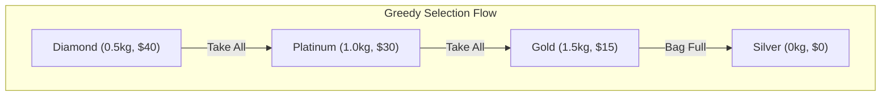

---

## 1. Fibonacci (Recursion and DP)

### 1. The Real-Life Analogy
Imagine counting rabbit pairs. Every month, a pair of rabbits produces a new pair, which itself starts producing after two months. The population size follows the Fibonacci sequence. If you calculate the population size for month 5 by drawing out the complete ancestry tree, you end up counting the descendants of month 2 and month 3 multiple times. Instead, you can write the values month-by-month in a logbook.

### 2. Inputs and Outputs
*   **Input:** An integer $n$ (the month or term index).
*   **Output:** The $n$-th Fibonacci number $F_n$.

### 3. The Core Struggle
The naive recursive relation is $F_n = F_{n-1} + F_{n-2}$. If we compute $F_5$ recursively:
*   We need $F_4$ and $F_3$.
*   To compute $F_4$, we need $F_3$ and $F_2$. (Notice $F_3$ is already computed twice).
*   This duplicates computations, leading to an exponential running time of $O(2^n)$. For $F_{50}$, the computer would perform over $1.1$ trillion additions!

### 4. The Subproblem Decomposition
The $n$-th term is computed by summing the two immediately preceding terms:
```math
F_n = F_{n-1} + F_{n-2} \quad \text{for } n \ge 2, \text{ with } F_0 = 0, F_1 = 1
```

### 5. The Memory Table
*   We use a 1D array $F[0 \dots n]$.
*   $F[i]$ stores the Fibonacci value of term $i$.
*   We fill the array from index 2 up to $n$ using basic addition.

### 6. Walkthrough with Small Numbers
Let's find the 5th Fibonacci number ($F_5$):
*   $F[0] = 0$ (Base case)
*   $F[1] = 1$ (Base case)
*   $F[2] = F[1] + F[0] = 1 + 0 = 1$
*   $F[3] = F[2] + F[1] = 1 + 1 = 2$
*   $F[4] = F[3] + F[2] = 2 + 1 = 3$
*   $F[5] = F[4] + F[3] = 3 + 2 = 5$
*   The final output is **5**.

### 7. Core Algorithm

#### 📘 Algorithm 8.1: Fibonacci DP

> **Purpose:** Calculate the $n$-th Fibonacci number in linear time by storing intermediate values in a table.

```
Algorithm 8.1: FIBONACCI-DP(n)
────────────────────────────────────────────
1. Let F[0...n] be a new array
2. Set F[0] := 0
3. Set F[1] := 1
4. Repeat Step 5 for i = 2 to n:
5.     Set F[i] := F[i-1] + F[i-2]
   [End of Step 4 loop]
6. Return F[n]
```

### 8. Visual State Transition (Mermaid)

Here are the two representations showing the redundant subproblem tree and how tabulation fills values linearly:

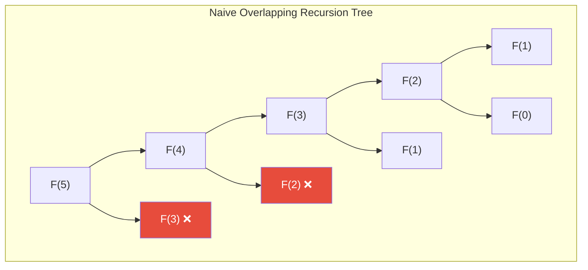

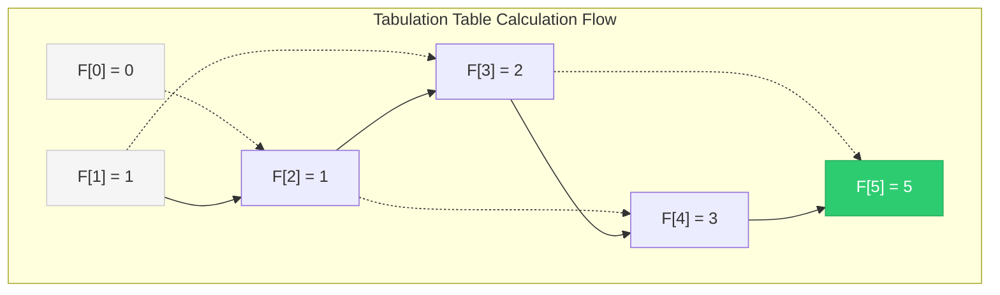

### 9. Complexity Analysis
*   **Time Complexity:** $\Theta(n)$ — Fills the table of size $n+1$ in a single pass.
*   **Space Complexity:** $\Theta(n)$ — Uses an array of size $n+1$. Can be optimized to $O(1)$ by keeping only the last two values.

---

## 2. Coin-Row Problem

### 1. The Real-Life Analogy
Imagine you have a row of coins of different values. You want to pick coins to get the maximum sum. The catch: you cannot pick any two adjacent coins. If you pick a coin, you must skip its immediate neighbors. How do you choose which coins to pick to maximize your total value?

### 2. Inputs and Outputs
*   **Input:** An array $C = \langle C_1, C_2, \dots, C_n \rangle$ containing the positive values of $n$ coins in a row.
*   **Output:** The maximum total value possible without picking adjacent coins.

### 3. The Core Struggle
For $n$ coins, each coin can either be picked or skipped. This means there are $2^n$ possible subsets. Checking all of them to make sure no two chosen coins are adjacent is too slow for large coin rows.

### 4. The Subproblem Decomposition
When considering the $i$-th coin in the row, we have two choices:
*   **Option A (Pick coin $i$):** We get the coin's value $C_i$, plus the optimal value we could get from the first $i-2$ coins (since we must skip coin $i-1$):
    ```math
    \text{Value} = C_i + F[i-2]
    ```
*   **Option B (Skip coin $i$):** The maximum value we can get is simply the optimal value from the first $i-1$ coins:
    ```math
    \text{Value} = F[i-1]
    ```
*   We choose the option that gives the maximum value:
    ```math
    F[i] = \max(C_i + F[i-2], F[i-1]) \quad \text{for } i \ge 2
    ```
    With base cases $F[0] = 0$ and $F[1] = C_1$.

### 5. The Memory Table
*   We use a 1D array $F[0 \dots n]$.
*   $F[i]$ stores the maximum value obtainable from the first $i$ coins in the row.
*   We fill the array from index 2 to $n$.

### 6. Walkthrough with Small Numbers
Let's find the optimal sum for coins: $C = \langle 5, 1, 2, 10, 6, 2 \rangle$ (size $n=6$).
*   $F[0] = 0$ (Base case)
*   $F[1] = C_1 = 5$ (Base case)
*   **For $i = 2$:** $\max(C_2 + F[0], F[1]) = \max(1 + 0, 5) = 5$
*   **For $i = 3$:** $\max(C_3 + F[1], F[2]) = \max(2 + 5, 5) = 7$
*   **For $i = 4$:** $\max(C_4 + F[2], F[3]) = \max(10 + 5, 7) = 15$
*   **For $i = 5$:** $\max(C_5 + F[3], F[4]) = \max(6 + 7, 15) = 15$
*   **For $i = 6$:** $\max(C_6 + F[4], F[5]) = \max(2 + 15, 15) = 17$
*   The maximum value is **17**. (Cuts selected: coins 1, 4, and 6: $5 + 10 + 2 = 17$).

### 7. Core Algorithm

#### 📘 Algorithm 8.2: Coin-Row Problem

> **Purpose:** Compute the maximum value obtainable from a row of $n$ coins with no two adjacent coins picked.

```
Algorithm 8.2: COIN-ROW(C, n)
────────────────────────────────────────────
C = Array of coin values
n = Number of coins

1. Let F[0...n] be a new array
2. Set F[0] := 0
3. Set F[1] := C[1]
4. Repeat Step 5 for i = 2 to n:
5.     Set F[i] := max(C[i] + F[i-2], F[i-1])
   [End of Step 4 loop]
6. Return F[n]
```

### 8. Visual State Transition (Mermaid)

The diagram below shows the binary decision tree and lookup requirements when evaluating coin $i$:

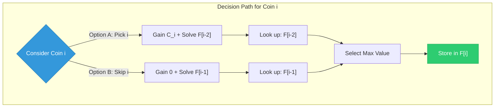

### 9. Complexity Analysis
*   **Time Complexity:** $\Theta(n)$ — Single loop from 2 to $n$.
*   **Space Complexity:** $\Theta(n)$ — Array $F$ of size $n+1$.

---

## 3. Change-Making Problem (DP)

### 1. The Real-Life Analogy
Imagine you are a cashier. A customer buys something and you need to give them exactly \$6 in change. You have coin denominations of \$1, \$3, and \$4. How can you make this change using the absolute fewest coins? 

A greedy approach would choose the largest coin first: one \$4 coin, leaving \$2, which requires two \$1 coins. This uses 3 coins total (\$4 + \$1 + \$1). However, the optimal solution is to use two \$3 coins (\$3 + \$3), which requires only 2 coins.

### 2. Inputs and Outputs
*   **Inputs:**
    *   A target change amount $n$.
    *   An array $D = \langle d_1, d_2, \dots, d_m \rangle$ of coin denominations, where $d_1 = 1$.
*   **Output:** The minimum number of coins needed to sum to $n$.

### 3. The Core Struggle
A greedy strategy does not always yield the minimum number of coins for arbitrary denominations. To find the optimal combinations, we must evaluate different choices, which grows exponentially if done recursively without caching.

### 4. The Subproblem Decomposition
To make change for amount $j$, we try using each coin denomination $d_i$ as the last coin:
*   If we use coin $d_i$, the problem reduces to finding the minimum coins needed for the remaining amount $j - d_i$.
*   The cost is 1 (for coin $d_i$) plus $F[j - d_i]$.
*   We try all denominations $d_i \le j$ and choose the minimum:
    ```math
    F[j] = \min_{d_i \le j} (1 + F[j - d_i]) \quad \text{for } j > 0, \text{ with } F[0] = 0
    ```

### 5. The Memory Table
*   We use a 1D array $F[0 \dots n]$.
*   $F[j]$ stores the minimum number of coins needed to make change for amount $j$.
*   We fill the table from index 1 to $n$.

### 6. Walkthrough with Small Numbers
Let's find the minimum coins for target $n = 6$ using denominations $D = \{1, 3, 4\}$.
*   $F[0] = 0$ (Base case)
*   **For $j = 1$:** $1 + F[1 - 1] = 1 + F[0] = 1 \implies F[1] = 1$.
*   **For $j = 2$:** $1 + F[2 - 1] = 1 + F[1] = 2 \implies F[2] = 2$.
*   **For $j = 3$:**
    *   Coin 1: $1 + F[3 - 1] = 1 + 2 = 3$.
    *   Coin 3: $1 + F[3 - 3] = 1 + 0 = 1$.
    *   $\min(3, 1) = 1 \implies F[3] = 1$.
*   **For $j = 4$:**
    *   Coin 1: $1 + F[4 - 1] = 1 + 1 = 2$.
    *   Coin 3: $1 + F[4 - 3] = 1 + 1 = 2$.
    *   Coin 4: $1 + F[4 - 4] = 1 + 0 = 1$.
    *   $\min(2, 2, 1) = 1 \implies F[4] = 1$.
*   **For $j = 5$:**
    *   Coin 1: $1 + F[5 - 1] = 1 + 1 = 2$.
    *   Coin 3: $1 + F[5 - 3] = 1 + 2 = 3$.
    *   Coin 4: $1 + F[5 - 4] = 1 + 1 = 2$.
    *   $\min(2, 3, 2) = 2 \implies F[5] = 2$.
*   **For $j = 6$:**
    *   Coin 1: $1 + F[6 - 1] = 1 + 2 = 3$.
    *   Coin 3: $1 + F[6 - 3] = 1 + 1 = 2$.
    *   Coin 4: $1 + F[6 - 4] = 1 + 2 = 3$.
    *   $\min(3, 2, 3) = 2 \implies F[6] = 2$.
*   The minimum number of coins is **2**.

### 7. Core Algorithm

#### 📘 Algorithm 8.3: Change-Making DP

> **Purpose:** Compute the minimum number of coins needed to make change for a target amount.

```
Algorithm 8.3: CHANGE-MAKING-DP(D, m, n)
────────────────────────────────────────────
D = Array of coin denominations (d_1 = 1)
m = Number of denominations
n = Target change amount

1. Let F[0...n] be a new array
2. Set F[0] := 0
3. Repeat Steps 4 through 8 for j = 1 to n:
4.     Set temp := ∞
5.     Repeat Steps 6 and 7 for i = 1 to m:
6.         If j ≥ D[i], then:
7.             Set temp := min(temp, 1 + F[j - D[i]])
           [End of If structure]
       [End of Step 5 loop]
8.     Set F[j] := temp
   [End of Step 3 loop]
9. Return F[n]
```

### 8. Visual State Transition (Mermaid)

The diagram below shows the state branching when calculating the minimum coins for amount $j$:

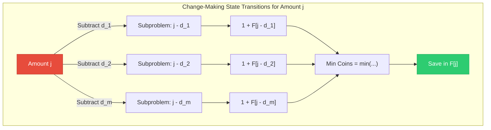

### 9. Complexity Analysis
*   **Time Complexity:** $\Theta(n \cdot m)$ — Nested loops (amount $n$ and denominations $m$).
*   **Space Complexity:** $\Theta(n)$ — Array $F$ of size $n+1$.

---

## 4. Coin-Collecting Problem

### 1. The Real-Life Analogy
Imagine you are playing a grid-based board game. Some cells on the board contain coins. You start at the top-left square $(1,1)$ and want to reach the bottom-right square $(m,n)$. The rules allow you to move only **right** or **down** at each step. How do you plan your moves to collect the maximum number of coins along the path?

### 2. Inputs and Outputs
*   **Input:** A 2D array $A[1 \dots m, 1 \dots n]$ representing the grid, where $A[i, j] = 1$ if cell $(i, j)$ contains a coin, and $0$ otherwise.
*   **Output:** The maximum number of coins collected from $(1, 1)$ to $(m, n)$.

### 3. The Core Struggle
The number of possible paths from top-left to bottom-right in an $m \times n$ grid is:
```math
\text{Paths} = \binom{m+n-2}{m-1}
```
For a $10 \times 10$ board, there are 48,620 paths. For larger boards, checking all paths is too slow.

### 4. The Subproblem Decomposition
To reach cell $(i, j)$, you can only arrive from the cell immediately to its left $(i, j-1)$ or the cell immediately above it $(i-1, j)$.
*   The max coins collected to $(i, j)$ is the coin at $(i, j)$ plus the maximum of the coins collected along the paths to those two neighbors:
    ```math
    F[i, j] = \max(F[i-1, j], F[i, j-1]) + A[i, j] \quad \text{for } i > 1, j > 1
    ```
*   **Boundary Cases:**
    *   $F[1, 1] = A[1, 1]$
    *   $F[1, j] = F[1, j-1] + A[1, j]$ (first row can only be reached from the left)
    *   $F[i, 1] = F[i-1, 1] + A[i, 1]$ (first column can only be reached from above)

### 5. The Memory Table
*   We use a 2D table $F[1 \dots m, 1 \dots n]$ of the same dimensions as the board.
*   $F[i, j]$ stores the maximum coins collected on a path from $(1, 1)$ to $(i, j)$.
*   We fill the table row by row, from left to right.

### 6. Walkthrough with Small Numbers
Let's find the max coins for a $3 \times 3$ grid $A$, where coins (1) are at $(1, 2)$, $(2, 2)$, $(3, 1)$, and $(3, 3)$:
```math
A = \begin{pmatrix} 0 & 1 & 0 \\ 0 & 1 & 0 \\ 1 & 0 & 1 \end{pmatrix}
```

*   **Initialize Row 1 and Col 1:**
    *   $F[1, 1] = A[1, 1] = 0$.
    *   $F[1, 2] = F[1, 1] + A[1, 2] = 0 + 1 = 1$.
    *   $F[1, 3] = F[1, 2] + A[1, 3] = 1 + 0 = 1$.
    *   $F[2, 1] = F[1, 1] + A[2, 1] = 0 + 0 = 0$.
    *   $F[3, 1] = F[2, 1] + A[3, 1] = 0 + 1 = 1$.
*   **Fill the remaining cells:**
    *   **Cell $(2, 2)$:** $\max(F[1, 2], F[2, 1]) + A[2, 2] = \max(1, 0) + 1 = 2$.
    *   **Cell $(2, 3)$:** $\max(F[1, 3], F[2, 2]) + A[2, 3] = \max(1, 2) + 0 = 2$.
    *   **Cell $(3, 2)$:** $\max(F[2, 2], F[3, 1]) + A[3, 2] = \max(2, 1) + 0 = 2$.
    *   **Cell $(3, 3)$:** $\max(F[2, 3], F[3, 2]) + A[3, 3] = \max(2, 2) + 1 = 3$.
*   The maximum coins collected is **3**.

### 7. Core Algorithm

#### 📘 Algorithm 8.4: Coin Collecting

> **Purpose:** Calculate the maximum coins collected on a path from top-left to bottom-right.

```
Algorithm 8.4: COIN-COLLECTING(A, m, n)
────────────────────────────────────────────
A = 2D binary grid (1 = coin, 0 = empty)
m, n = Dimensions of the grid

1. Let F[1...m, 1...n] be a new 2D array
2. Set F[1, 1] := A[1, 1]
3. Repeat Step 4 for j = 2 to n:
4.     Set F[1, j] := F[1, j-1] + A[1, j]
   [End of loop]
5. Repeat Steps 6 through 10 for i = 2 to m:
6.     Set F[i, 1] := F[i-1, 1] + A[i, 1]
7.     Repeat Steps 8 through 10 for j = 2 to n:
8.         Set F[i, j] := max(F[i-1, j], F[i, j-1]) + A[i, j]
       [End of Step 7 loop]
   [End of Step 5 loop]
9. Return F[m, n]
```

### 8. Visual State Transition (Mermaid)

The diagram below shows how the values from top and left neighbors feed into cell $(i, j)$:

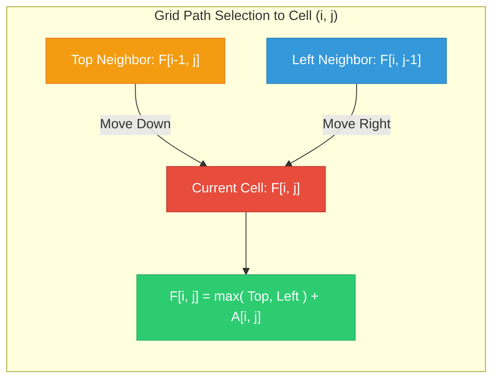

### 9. Complexity Analysis
*   **Time Complexity:** $\Theta(m \cdot n)$ — Traverses each cell of the grid exactly once.
*   **Space Complexity:** $\Theta(m \cdot n)$ — Uses a 2D table of size $m \times n$.

---

## 5. 0/1 Knapsack Problem

### 1. The Real-Life Analogy
Imagine a thief breaks into a warehouse with a knapsack that can hold at most 5 kg. The warehouse has items of different values and weights. The thief must decide for each item whether to take it (1) or leave it (0). They cannot take a fraction of an item. How do they fill the knapsack to get the highest total value?

### 2. Inputs and Outputs
*   **Inputs:**
    *   An integer capacity $W$ (maximum weight the knapsack can carry).
    *   An array $w = \langle w_1, \dots, w_n \rangle$ of item weights.
    *   An array $v = \langle v_1, \dots, v_n \rangle$ of item values.
    *   An integer $n$ representing the number of items.
*   **Output:** The maximum total value obtainable that fits within weight $W$.

### 3. The Core Struggle
For $n$ items, there are $2^n$ possible subsets. Checking all of them to see if their weight fits within $W$ takes exponential time and is too slow for large sets of items.

### 4. The Subproblem Decomposition
When deciding on the $i$-th item with remaining capacity $j$:
*   **Option A (Skip item $i$):** The value remains the same as using the first $i-1$ items with capacity $j$:
    ```math
    \text{Value} = V[i-1, j]
    ```
*   **Option B (Take item $i$):** If the item's weight $w_i \le j$, we can take it. The value is the item's value $v_i$ plus the optimal value using the first $i-1$ items with the remaining capacity $j - w_i$:
    ```math
    \text{Value} = v_i + V[i-1, j - w_i]
    ```
*   We choose the option that gives the maximum value:
    ```math
    V[i, j] = \begin{cases} \max(V[i-1, j], v_i + V[i-1, j - w_i]) & \text{if } w_i \le j \\ V[i-1, j] & \text{if } w_i > j \end{cases}
    ```
    With base cases $V[0, j] = 0$ and $V[i, 0] = 0$.

### 5. The Memory Table
*   We use a 2D table $V[0 \dots n, 0 \dots W]$.
*   $V[i, j]$ stores the maximum value obtainable using a subset of the first $i$ items within a weight limit of $j$.
*   We fill the table row-by-row, from left to right.

### 6. Walkthrough with Small Numbers
Let's find the max value for capacity $W = 5$ with 4 items:
1. Item 1: $w_1 = 2, v_1 = 12$
2. Item 2: $w_2 = 1, v_2 = 10$
3. Item 3: $w_3 = 3, v_3 = 20$
4. Item 4: $w_4 = 2, v_4 = 15$

*   **Initialize Row 0 and Col 0 to 0.**
*   **Row 1 (Item 1, $w_1=2, v_1=12$):**
    *   For $j < 2$: $V[1, j] = V[0, j] = 0$.
    *   For $j \ge 2$: $\max(V[0, j], 12 + V[0, j-2]) = 12$.
    *   $V[1] = \langle 0, 0, 12, 12, 12, 12 \rangle$.
*   **Row 2 (Item 2, $w_2=1, v_2=10$):**
    *   $j=1: \max(V[1, 1], 10 + V[1, 0]) = \max(0, 10) = 10$.
    *   $j=2: \max(V[1, 2], 10 + V[1, 1]) = \max(12, 10 + 0) = 12$.
    *   $j=3: \max(V[1, 3], 10 + V[1, 2]) = \max(12, 10 + 12) = 22$.
    *   $j=4: \max(V[1, 4], 10 + V[1, 3]) = \max(12, 10 + 12) = 22$.
    *   $j=5: \max(V[1, 5], 10 + V[1, 4]) = \max(12, 10 + 12) = 22$.
    *   $V[2] = \langle 0, 10, 12, 22, 22, 22 \rangle$.
*   **Row 3 (Item 3, $w_3=3, v_3=20$):**
    *   $j < 3$: $V[3, j] = V[2, j]$.
    *   $j=3: \max(V[2, 3], 20 + V[2, 0]) = \max(22, 20 + 0) = 22$.
    *   $j=4: \max(V[2, 4], 20 + V[2, 1]) = \max(22, 20 + 10) = 30$.
    *   $j=5: \max(V[2, 5], 20 + V[2, 2]) = \max(22, 20 + 12) = 32$.
    *   $V[3] = \langle 0, 10, 12, 22, 30, 32 \rangle$.
*   **Row 4 (Item 4, $w_4=2, v_4=15$):**
    *   $j < 2$: $V[4, j] = V[3, j]$.
    *   $j=2: \max(V[3, 2], 15 + V[3, 0]) = \max(12, 15) = 15$.
    *   $j=3: \max(V[3, 3], 15 + V[3, 1]) = \max(22, 15 + 10) = 25$.
    *   $j=4: \max(V[3, 4], 15 + V[3, 2]) = \max(30, 15 + 12) = 30$.
    *   $j=5: \max(V[3, 5], 15 + V[3, 3]) = \max(32, 15 + 22) = 37$.
    *   $V[4] = \langle 0, 10, 15, 25, 30, **37** \rangle$.
*   The maximum value is **37**. (Optimal subset is Items 1, 2, and 4: $2 + 1 + 2 = 5$ kg, value $12 + 10 + 15 = 37$).

### 7. Core Algorithm

#### 📘 Algorithm 8.5: 0/1 Knapsack

> **Purpose:** Calculate the maximum value obtainable within a weight limit $W$ using a 2D table.

```
Algorithm 8.5: KNAPSACK-01(w, v, n, W)
────────────────────────────────────────────
w = Array of item weights
v = Array of item values
n = Number of items
W = Knapsack capacity

1. Let V[0...n, 0...W] be a new 2D array
2. Repeat Step 3 for i = 0 to n:
3.     Set V[i, 0] := 0
   [End of loop]
4. Repeat Step 5 for j = 0 to W:
5.     Set V[0, j] := 0
   [End of loop]
6. Repeat Steps 7 through 11 for i = 1 to n:
7.     Repeat Steps 8 through 11 for j = 1 to W:
8.         If w[i] ≤ j, then:
9.             Set V[i, j] := max(V[i-1, j], v[i] + V[i-1, j - w[i]])
10.        Else:
11.            Set V[i, j] := V[i-1, j]
           [End of If structure]
       [End of Step 7 loop]
   [End of Step 6 loop]
12. Return V[n, W]
```

### 8. Visual State Transition (Mermaid)

The diagram below shows the item selection matrix and capacity check branching:

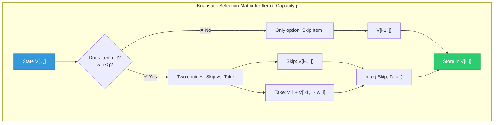

### 9. Complexity Analysis
*   **Time Complexity:** $\Theta(n \cdot W)$ — Fills a table of size $(n+1) \times (W+1)$.
*   **Space Complexity:** $\Theta(n \cdot W)$ — Uses a 2D array of size $(n+1) \times (W+1)$.

### 10. Classroom Problems Solved in Matrix Tabular Format

These are specific 0/1 Knapsack problems solved using the **Matrix Tabular Format** standard in university examinations.

#### 📝 Problem A (Multiples of 10 Weights)
*   **Given:**
    *   Weights ($w$): $10\text{ kg}, 20\text{ kg}, 30\text{ kg}$
    *   Prices ($v$): $60, 100, 120$
    *   Capacity ($W$): $50\text{ kg}$
*   **Goal:** Solve using a 2D DP matrix.

##### Complete DP Matrix:
| Item ($i$) | Weight ($w_i$) | Price ($v_i$) | $W=0$ | $W=10$ | $W=20$ | $W=30$ | $W=40$ | $W=50$ |
| :---: | :---: | :---: | :---: | :---: | :---: | :---: | :---: | :---: |
| **0** | - | - | 0 | 0 | 0 | 0 | 0 | 0 |
| **1** | 10 | 60 | 0 | 60 | 60 | 60 | 60 | 60 |
| **2** | 20 | 100 | 0 | 60 | 100 | 160 | 160 | 160 |
| **3** | 30 | 120 | 0 | 60 | 100 | 160 | 180 | **220** |

##### Detailed Calculations for Key Cells:
*   **Cell $V[2, 30]$:** Item 2 has weight $20$, price $100$.
    ```math
    V[2, 30] = \max(V[1, 30], 100 + V[1, 30-20]) = \max(60, 100 + 60) = 160
    ```
*   **Cell $V[3, 50]$:** Item 3 has weight $30$, price $120$.
    ```math
    V[3, 50] = \max(V[2, 50], 120 + V[2, 50-30]) = \max(160, 120 + 100) = 220
    ```

##### Traceback Path for Problem A:
1.  Start at $V[3, 50] = 220$. Since $V[3, 50] \ne V[2, 50]$ ($220 \ne 160$), **Item 3 is selected**.
2.  Subtract weight of Item 3: remaining capacity = $50 - 30 = 20$.
3.  Go to $V[2, 20] = 100$. Since $V[2, 20] \ne V[1, 20]$ ($100 \ne 60$), **Item 2 is selected**.
4.  Subtract weight of Item 2: remaining capacity = $20 - 20 = 0$.
5.  Go to $V[1, 0] = 0$. Since $V[1, 0] == V[0, 0]$ ($0 == 0$), Item 1 is **skipped**.
*   **Optimal Subset:** {Item 2, Item 3}
*   **Total Weight:** $20 + 30 = 50\text{ kg}$
*   **Maximum Value:** **220**

---

#### 📝 Problem B (Small Integer Weights)
*   **Given:**
    *   Weights ($w$): $1, 3, 5, 7$
    *   Prices ($v$): $2, 4, 7, 10$
    *   Capacity ($W$): $8$
*   **Goal:** Solve using a 2D DP matrix.

##### Complete DP Matrix:
| Item ($i$) | Weight ($w_i$) | Price ($v_i$) | $W=0$ | $W=1$ | $W=2$ | $W=3$ | $W=4$ | $W=5$ | $W=6$ | $W=7$ | $W=8$ |
| :---: | :---: | :---: | :---: | :---: | :---: | :---: | :---: | :---: | :---: | :---: | :---: |
| **0** | - | - | 0 | 0 | 0 | 0 | 0 | 0 | 0 | 0 | 0 |
| **1** | 1 | 2 | 0 | 2 | 2 | 2 | 2 | 2 | 2 | 2 | 2 |
| **2** | 3 | 4 | 0 | 2 | 2 | 4 | 6 | 6 | 6 | 6 | 6 |
| **3** | 5 | 7 | 0 | 2 | 2 | 4 | 6 | 7 | 9 | 9 | 11 |
| **4** | 7 | 10 | 0 | 2 | 2 | 4 | 6 | 7 | 9 | 10 | **12** |

##### Detailed Calculations for Key Cells:
*   **Cell $V[2, 4]$:** Item 2 has weight $3$, price $4$.
    ```math
    V[2, 4] = \max(V[1, 4], 4 + V[1, 4-3]) = \max(2, 4 + 2) = 6
    ```
*   **Cell $V[3, 8]$:** Item 3 has weight $5$, price $7$.
    ```math
    V[3, 8] = \max(V[2, 8], 7 + V[2, 8-5]) = \max(6, 7 + 4) = 11
    ```
*   **Cell $V[4, 8]$:** Item 4 has weight $7$, price $10$.
    ```math
    V[4, 8] = \max(V[3, 8], 10 + V[3, 8-7]) = \max(11, 10 + 2) = 12
    ```

##### Traceback Path for Problem B:
1.  Start at $V[4, 8] = 12$. Since $V[4, 8] \ne V[3, 8]$ ($12 \ne 11$), **Item 4 is selected**.
2.  Subtract weight of Item 4: remaining capacity = $8 - 7 = 1$.
3.  Go to $V[3, 1] = 2$. Since $V[3, 1] == V[2, 1]$ ($2 == 2$), Item 3 is **skipped**.
4.  Go to $V[2, 1] = 2$. Since $V[2, 1] == V[1, 1]$ ($2 == 2$), Item 2 is **skipped**.
5.  Go to $V[1, 1] = 2$. Since $V[1, 1] \ne V[0, 1]$ ($2 \ne 0$), **Item 1 is selected**.
6.  Subtract weight of Item 1: remaining capacity = $1 - 1 = 0$.
*   **Optimal Subset:** {Item 1, Item 4}
*   **Total Weight:** $1 + 7 = 8$
*   **Maximum Value:** **12**

---

## 6. Longest Common Subsequence (LCS)

### 1. The Real-Life Analogy
Imagine comparing two strands of DNA to see if they came from the same source. DNA strands are represented as strings of bases: `A`, `C`, `G`, and `T`. Because mutations insert or delete bases, they might not match exactly. Instead, we measure similarity by finding the **longest common subsequence**—a sequence where bases appear in the same order in both strands, but not necessarily next to each other.

### 2. Inputs and Outputs
*   **Inputs:** Two sequences (strings) $X = \langle x_1, \dots, x_m \rangle$ and $Y = \langle y_1, \dots, y_n \rangle$.
*   **Outputs:** 
    *   The length of the longest subsequence common to both strings.
    *   A traceback path to print the common elements in order.

### 3. The Core Struggle
To find the longest common subsequence of two strings of length $m$ and $n$, we could check all subsequences of string $X$. Since string $X$ has $2^m$ possible subsequences, checking all of them against $Y$ takes exponential time and is too slow for long strings.

### 4. The Subproblem Decomposition
Let's look at the final characters $x_m$ and $y_n$ of both strings:
*   **If $x_m == y_n$:** The final characters match. They must be part of the LCS. We solve the smaller problem of finding the LCS of $X_{m-1}$ and $Y_{n-1}$, then append this character:
    ```math
    c[i, j] = c[i-1, j-1] + 1
    ```
*   **If $x_m \neq y_n$:** The final characters do not match. The LCS could end with $x_m$ (excluding $y_n$) or end with $y_n$ (excluding $x_m$). We solve both cases and take the maximum:
    ```math
    c[i, j] = \max(c[i-1, j], c[i, j-1])
    ```

### 5. The Memory Table
*   We use a 2D grid $c[0 \dots m, 0 \dots n]$ to store lengths, where $c[i, j]$ is the LCS length of prefixes $X_i$ and $Y_j$.
*   We use a 2D table $b[1 \dots m, 1 \dots n]$ to store directions ($\nwarrow$, $\uparrow$, $\leftarrow$) representing matching choices.

### 6. Walkthrough with Small Numbers
Let's find the LCS of $X = \text{"ABC"}$ and $Y = \text{"BDC"}$.
*   **Initialize:** Set Row 0 and Column 0 of table $c$ to 0.
*   **Row 1 ($i=1, x_1=\text{'A'}$):**
    *   $j=1 (y_1=\text{'B'}): \text{'A'} \neq \text{'B'} \implies c[1, 1] = \max(c[0, 1], c[1, 0]) = 0$.
    *   $j=2 (y_2=\text{'D'}): \text{'A'} \neq \text{'D'} \implies c[1, 2] = \max(c[0, 2], c[1, 1]) = 0$.
    *   $j=3 (y_3=\text{'C'}): \text{'A'} \neq \text{'C'} \implies c[1, 3] = \max(c[0, 3], c[1, 2]) = 0$.
*   **Row 2 ($i=2, x_2=\text{'B'}$):**
    *   $j=1 (y_1=\text{'B'}): \text{'B'} == \text{'B'} \implies c[2, 1] = c[1, 0] + 1 = 1$.
    *   $j=2 (y_2=\text{'D'}): \text{'B'} \neq \text{'D'} \implies c[2, 2] = \max(c[1, 2], c[2, 1]) = 1$.
    *   $j=3 (y_3=\text{'C'}): \text{'B'} \neq \text{'C'} \implies c[2, 3] = \max(c[1, 3], c[2, 2]) = 1$.
*   **Row 3 ($i=3, x_3=\text{'C'}$):**
    *   $j=1 (y_1=\text{'B'}): \text{'C'} \neq \text{'B'} \implies c[3, 1] = \max(c[2, 1], c[3, 0]) = 1$.
    *   $j=2 (y_2=\text{'D'}): \text{'C'} \neq \text{'D'} \implies c[3, 2] = \max(c[2, 2], c[3, 1]) = 1$.
    *   $j=3 (y_3=\text{'C'}): \text{'C'} == \text{'C'} \implies c[3, 3] = c[2, 2] + 1 = 2$.
*   The final cell value is **2**, representing LCS length. Traceback path matches 'C' at (3,3) and 'B' at (2,1) $\implies$ LCS is "BC".

### 7. Core Algorithms

#### 📘 Algorithm 8.6: LCS Length

> **Purpose:** Calculate the length of the LCS of two sequences and populate the traceback tables.

```
Algorithm 8.6: LCS-LENGTH(X, Y, m, n)
────────────────────────────────────────────
X, Y = Input sequences
m, n = Lengths of X and Y
c = Table for LCS lengths
b = Table for traceback directions

1. Let b[1...m, 1...n] and c[0...m, 0...n] be new tables
2. Repeat Step 3 for i = 1 to m:
3.     Set c[i, 0] := 0
   [End of loop]
4. Repeat Step 5 for j = 0 to n:
5.     Set c[0, j] := 0
   [End of loop]
6. Repeat Steps 7 through 15 for i = 1 to m:
7.     Repeat Steps 8 through 15 for j = 1 to n:
8.         If x[i] == y[j], then:
9.             Set c[i, j] := c[i - 1, j - 1] + 1
10.            Set b[i, j] := "↖"
11.        Else if c[i - 1, j] ≥ c[i, j - 1], then:
12.            Set c[i, j] := c[i - 1, j]
13.            Set b[i, j] := "↑"
14.        Else:
15.            Set c[i, j] := c[i, j - 1]
16.            Set b[i, j] := "←"
           [End of If structure]
       [End of Step 7 loop]
   [End of Step 6 loop]
17. Return c and b
```

---

#### 📘 Procedure 8.7: Print LCS

> **Purpose:** Recursively print the characters of the LCS in the correct order.

```
Procedure: PRINT-LCS(b, X, i, j)
────────────────────────────────────────────
1. If i == 0 or j == 0, then:
       Return
   [End of If structure]
2. If b[i, j] == "↖", then:
       Call PRINT-LCS(b, X, i - 1, j - 1)
       Print x[i]
   Else if b[i, j] == "↑", then:
       Call PRINT-LCS(b, X, i - 1, j)
   Else:
       Call PRINT-LCS(b, X, i, j - 1)
   [End of If structure]
```

### 8. Visual State Transition (Mermaid)

The diagram below shows character matching decisions and table cell routing:

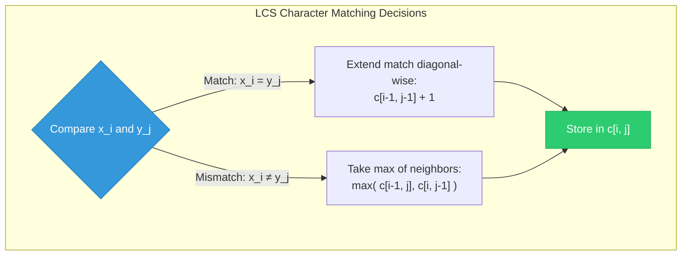

### 9. Complexity Analysis
*   **Time Complexity:** $\Theta(m \cdot n)$ — Fills a table of size $m \times n$ iteratively.
*   **Space Complexity:** $O(m \cdot n)$ — Storing direction and cost tables.

### 10. Substring vs. Subsequence

It is very common in exams to be asked about the difference between a **Substring** and a **Subsequence**.

| Feature | Substring | Subsequence |
| :--- | :--- | :--- |
| **Contiguity** | Must consist of **contiguous** (continuous) characters from the original string. | Can consist of characters that are **non-contiguous** (scattered), but their relative order must be preserved. |
| **Formula** | A string of length $n$ has $\frac{n(n+1)}{2}$ non-empty substrings. | A string of length $n$ has $2^n - 1$ non-empty subsequences. |
| **Example for `"abc"`**| `"a", "b", "c", "ab", "bc", "abc"` (and `""`) | `"a", "b", "c", "ab", "ac", "bc", "abc"` (and `""`) |
| **Is `"ac"` valid?** | **No** (it is not contiguous in `"abc"`). | **Yes** (it preserves the relative order: `a` comes before `c`). |

---

### 11. Classroom Problem: LCS of two strings
*   **String 1 ($X$):** `"ab ac deb"`
*   **String 2 ($Y$):** `"a ab db"`

Depending on how your teacher defines characters, they might either include or exclude the space character (` `). Below, both scenarios are fully computed so you can ace either version in the exam!

#### 📍 Scenario 1: Spaces are counted as characters (With Spaces)
*   $X = \langle \text{'a'}, \text{'b'}, \text{' '}, \text{'a'}, \text{'c'}, \text{' '}, \text{'d'}, \text{'e'}, \text{'b'} \rangle$ (Length = 9)
*   $Y = \langle \text{'a'}, \text{' '}, \text{'a'}, \text{'b'}, \text{' '}, \text{'d'}, \text{'b'} \rangle$ (Length = 7)

##### Rule of Matrix Tabular Format:
1.  **Initialize** Row 0 and Col 0 to 0.
2.  If characters **match** ($X[i] == Y[j]$):
    *   Take the **diagonal value plus 1**: $c[i, j] = c[i-1, j-1] + 1$.
    *   Place a diagonal arrow pointing up-left: $\nwarrow$.
3.  If characters **do not match** ($X[i] \neq Y[j]$):
    *   Take the **maximum** of the upper cell and the left cell: $c[i, j] = \max(c[i-1, j], c[i, j-1])$.
    *   Place an arrow pointing to the cell from which the maximum was taken (either $\uparrow$ or $\leftarrow$). If they are equal, standard convention is to point up ($\uparrow$).

##### Complete LCS Matrix (With Spaces):
| $i \setminus j$ | - (0) | **`a`** (1) | **` `** (2) | **`a`** (3) | **`b`** (4) | **` `** (5) | **`d`** (6) | **`b`** (7) |
| :---: | :---: | :---: | :---: | :---: | :---: | :---: | :---: | :---: |
| **- (0)** | 0 | 0 | 0 | 0 | 0 | 0 | 0 | 0 |
| **`a` (1)** | 0 | 1 ($\nwarrow$) | 1 ($\leftarrow$) | 1 ($\nwarrow$) | 1 ($\leftarrow$) | 1 ($\leftarrow$) | 1 ($\leftarrow$) | 1 ($\leftarrow$) |
| **`b` (2)** | 0 | 1 ($\uparrow$) | 1 ($\uparrow$) | 1 ($\uparrow$) | 2 ($\nwarrow$) | 2 ($\leftarrow$) | 2 ($\leftarrow$) | 2 ($\nwarrow$) |
| **` ` (3)** | 0 | 1 ($\uparrow$) | 2 ($\nwarrow$) | 2 ($\leftarrow$) | 2 ($\uparrow$) | 3 ($\nwarrow$) | 3 ($\leftarrow$) | 3 ($\leftarrow$) |
| **`a` (4)** | 0 | 1 ($\nwarrow$) | 2 ($\uparrow$) | 3 ($\nwarrow$) | 3 ($\leftarrow$) | 3 ($\uparrow$) | 3 ($\uparrow$) | 3 ($\uparrow$) |
| **`c` (5)** | 0 | 1 ($\uparrow$) | 2 ($\uparrow$) | 3 ($\uparrow$) | 3 ($\uparrow$) | 3 ($\uparrow$) | 3 ($\uparrow$) | 3 ($\uparrow$) |
| **` ` (6)** | 0 | 1 ($\uparrow$) | 2 ($\nwarrow$) | 3 ($\uparrow$) | 3 ($\uparrow$) | 4 ($\nwarrow$) | 4 ($\leftarrow$) | 4 ($\leftarrow$) |
| **`d` (7)** | 0 | 1 ($\uparrow$) | 2 ($\uparrow$) | 3 ($\uparrow$) | 3 ($\uparrow$) | 4 ($\uparrow$) | 5 ($\nwarrow$) | 5 ($\leftarrow$) |
| **`e` (8)** | 0 | 1 ($\uparrow$) | 2 ($\uparrow$) | 3 ($\uparrow$) | 3 ($\uparrow$) | 4 ($\uparrow$) | 5 ($\uparrow$) | 5 ($\uparrow$) |
| **`b` (9)** | 0 | 1 ($\uparrow$) | 2 ($\uparrow$) | 3 ($\uparrow$) | 4 ($\nwarrow$) | 4 ($\uparrow$) | 5 ($\uparrow$) | **6** ($\nwarrow$) |

*   **LCS Length:** **6**
*   **Traceback Path (Starting at bottom-right cell $(9,7)$):**
    *   $c[9,7] = 6$ ($\nwarrow$ Match! Character: **`b`**). Go to $c[8,6]$.
    *   $c[8,6] = 5$ ($\uparrow$ Mismatch). Go to $c[7,6]$.
    *   $c[7,6] = 5$ ($\nwarrow$ Match! Character: **`d`**). Go to $c[6,5]$.
    *   $c[6,5] = 4$ ($\nwarrow$ Match! Character: **` `** space). Go to $c[5,4]$.
    *   $c[5,4] = 3$ ($\uparrow$ Mismatch). Go to $c[4,4]$.
    *   $c[4,4] = 3$ ($\leftarrow$ Mismatch). Go to $c[4,3]$.
    *   $c[4,3] = 3$ ($\nwarrow$ Match! Character: **`a`**). Go to $c[3,2]$.
    *   $c[3,2] = 2$ ($\nwarrow$ Match! Character: **` `** space). Go to $c[2,1]$.
    *   $c[2,1] = 1$ ($\uparrow$ Mismatch). Go to $c[1,1]$.
    *   $c[1,1] = 1$ ($\nwarrow$ Match! Character: **`a`**). Go to $c[0,0]$.
*   **LCS Subsequence:** **`"a adb"`** (length 6)

---

#### 📍 Scenario 2: Spaces are ignored/stripped (Without Spaces)
*   $X = \langle \text{'a'}, \text{'b'}, \text{'a'}, \text{'c'}, \text{'d'}, \text{'e'}, \text{'b'} \rangle$ (Length = 7)
*   $Y = \langle \text{'a'}, \text{'a'}, \text{'b'}, \text{'d'}, \text{'b'} \rangle$ (Length = 5)

##### Complete LCS Matrix (Without Spaces):
| $i \setminus j$ | - (0) | **`a`** (1) | **`a`** (2) | **`b`** (3) | **`d`** (4) | **`b`** (5) |
| :---: | :---: | :---: | :---: | :---: | :---: | :---: |
| **- (0)** | 0 | 0 | 0 | 0 | 0 | 0 |
| **`a` (1)** | 0 | 1 ($\nwarrow$) | 1 ($\nwarrow$) | 1 ($\leftarrow$) | 1 ($\leftarrow$) | 1 ($\leftarrow$) |
| **`b` (2)** | 0 | 1 ($\uparrow$) | 1 ($\uparrow$) | 2 ($\nwarrow$) | 2 ($\leftarrow$) | 2 ($\nwarrow$) |
| **`a` (3)** | 0 | 1 ($\nwarrow$) | 2 ($\nwarrow$) | 2 ($\uparrow$) | 2 ($\uparrow$) | 2 ($\uparrow$) |
| **`c` (4)** | 0 | 1 ($\uparrow$) | 2 ($\uparrow$) | 2 ($\uparrow$) | 2 ($\uparrow$) | 2 ($\uparrow$) |
| **`d` (5)** | 0 | 1 ($\uparrow$) | 2 ($\uparrow$) | 2 ($\uparrow$) | 3 ($\nwarrow$) | 3 ($\leftarrow$) |
| **`e` (6)** | 0 | 1 ($\uparrow$) | 2 ($\uparrow$) | 2 ($\uparrow$) | 3 ($\uparrow$) | 3 ($\uparrow$) |
| **`b` (7)** | 0 | 1 ($\uparrow$) | 2 ($\uparrow$) | 3 ($\nwarrow$) | 3 ($\uparrow$) | **4** ($\nwarrow$) |

*   **LCS Length:** **4**
*   **Traceback Path (Starting at bottom-right cell $(7,5)$):**
    *   $c[7,5] = 4$ ($\nwarrow$ Match! Character: **`b`**). Go to $c[6,4]$.
    *   $c[6,4] = 3$ ($\uparrow$ Mismatch). Go to $c[5,4]$.
    *   $c[5,4] = 3$ ($\nwarrow$ Match! Character: **`d`**). Go to $c[4,3]$.
    *   $c[4,3] = 2$ ($\uparrow$ Mismatch). Go to $c[3,3]$.
    *   $c[3,3] = 2$ ($\leftarrow$ Mismatch). Go to $c[3,2]$.
    *   $c[3,2] = 2$ ($\nwarrow$ Match! Character: **`a`**). Go to $c[2,1]$.
    *   $c[2,1] = 1$ ($\uparrow$ Mismatch). Go to $c[1,1]$.
    *   $c[1,1] = 1$ ($\nwarrow$ Match! Character: **`a`**). Go to $c[0,0]$.
*   **LCS Subsequence:** **`"aadb"`** (length 4)

---

## 7. Multi-Stage Graph Problem

### 1. The Real-Life Analogy
Imagine you are planning a road trip from the East Coast (**City A**) to the West Coast (**City K**). The country is divided into vertical regions (stages) from East to West. You can only travel from one region directly to the next adjacent region. Each highway connecting two cities has a toll cost (weight). How do you choose your route to minimize the total toll cost?

### 2. Inputs and Outputs
*   **Input:** 
    *   A directed acyclic graph (DAG) where nodes are partitioned into $k$ disjoint stages.
    *   A unique source node $A$ in stage 1, and a unique destination node $K$ in stage $k$.
    *   Edges with weights, which only point from a node in stage $i$ to a node in stage $i+1$.
*   **Output:** The shortest (minimum cost) path from $A$ to $K$ and its total cost.

### 3. The Core Struggle
A greedy strategy of always taking the cheapest immediate road does not work because a cheap road at the beginning might lead to extremely expensive roads later. To find the optimal path, we must evaluate the options systematically. Dynamic programming is highly efficient here because paths share overlapping sub-paths.

### 4. Graph Structure (5 Stages, Nodes A to K)
Let's define a standard 5-stage graph with 11 nodes ($A$ through $K$):

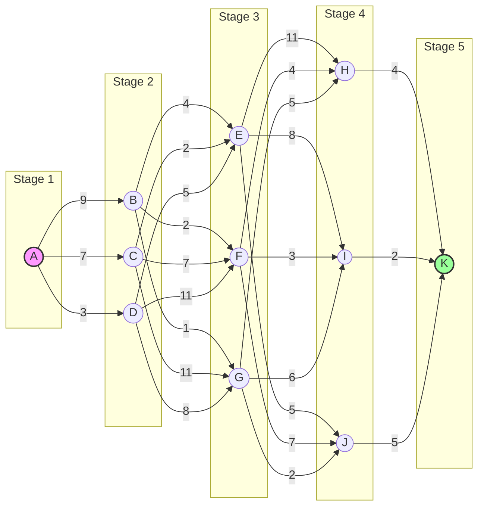

---

### 5. Solving via Dynamic Programming
We can solve this using either the **Backward Approach** (starting at the destination and working back to the source) or the **Forward Approach** (starting at the source and working toward the destination). Both are presented below step-by-step.

#### 📍 Approach A: Backward Method (Recommended for Exams)
Let $Cost(X)$ be the minimum cost of a path from node $X$ to the destination $K$.
We compute these values starting from Stage 5 and moving backward to Stage 1.

##### Stage 5 (Destination)
```math
Cost(K) = 0
```

##### Stage 4
*   $Cost(H) = weight(H, K) + Cost(K) = 4 + 0 = 4$
*   $Cost(I) = weight(I, K) + Cost(K) = 2 + 0 = 2$
*   $Cost(J) = weight(J, K) + Cost(K) = 5 + 0 = 5$

##### Stage 3
For each node in Stage 3, check all outgoing edges to Stage 4 and choose the minimum:

*   **Node E:**
    ```math
    \begin{aligned}
    Cost(E) &= \min\Big( c(E, H) + Cost(H),\; c(E, I) + Cost(I),\; c(E, J) + Cost(J) \Big) \\
    &= \min(11 + 4,\; 8 + 2,\; 5 + 5) \\
    &= \min(15,\; 10,\; 10) = 10 \quad \text{[via I or J]}
    \end{aligned}
    ```

*   **Node F:**
    ```math
    \begin{aligned}
    Cost(F) &= \min\Big( c(F, H) + Cost(H),\; c(F, I) + Cost(I),\; c(F, J) + Cost(J) \Big) \\
    &= \min(4 + 4,\; 3 + 2,\; 7 + 5) \\
    &= \min(8,\; 5,\; 12) = 5 \quad \text{[via I]}
    \end{aligned}
    ```

*   **Node G:**
    ```math
    \begin{aligned}
    Cost(G) &= \min\Big( c(G, H) + Cost(H),\; c(G, I) + Cost(I),\; c(G, J) + Cost(J) \Big) \\
    &= \min(5 + 4,\; 6 + 2,\; 2 + 5) \\
    &= \min(9,\; 8,\; 7) = 7 \quad \text{[via J]}
    \end{aligned}
    ```

##### Stage 2
For each node in Stage 2, check all outgoing edges to Stage 3 and choose the minimum:

*   **Node B:**
    ```math
    \begin{aligned}
    Cost(B) &= \min\Big( c(B, E) + Cost(E),\; c(B, F) + Cost(F),\; c(B, G) + Cost(G) \Big) \\
    &= \min(4 + 10,\; 2 + 5,\; 1 + 7) \\
    &= \min(14,\; 7,\; 8) = 7 \quad \text{[via F]}
    \end{aligned}
    ```

*   **Node C:**
    ```math
    \begin{aligned}
    Cost(C) &= \min\Big( c(C, E) + Cost(E),\; c(C, F) + Cost(F),\; c(C, G) + Cost(G) \Big) \\
    &= \min(2 + 10,\; 7 + 5,\; 11 + 7) \\
    &= \min(12,\; 12,\; 18) = 12 \quad \text{[via E or F]}
    \end{aligned}
    ```

*   **Node D:**
    ```math
    \begin{aligned}
    Cost(D) &= \min\Big( c(D, E) + Cost(E),\; c(D, F) + Cost(F),\; c(D, G) + Cost(G) \Big) \\
    &= \min(5 + 10,\; 11 + 5,\; 8 + 7) \\
    &= \min(15,\; 16,\; 15) = 15 \quad \text{[via E or G]}
    \end{aligned}
    ```

##### Stage 1 (Source)
```math
\begin{aligned}
Cost(A) &= \min\Big( c(A, B) + Cost(B),\; c(A, C) + Cost(C),\; c(A, D) + Cost(D) \Big) \\
&= \min(9 + 7,\; 7 + 12,\; 3 + 15) \\
&= \min(16,\; 19,\; 18) = 16 \quad \text{[via B]}
\end{aligned}
```

*   **Shortest Path Reconstruction:**
    *   From $A$, the minimum cost was achieved by moving to **$B$**.
    *   From $B$, the minimum cost was achieved by moving to **$F$**.
    *   From $F$, the minimum cost was achieved by moving to **$I$**.
    *   From $I$, the minimum cost was achieved by moving to **$K$**.
    *   **Optimal Path:** **$A \to B \to F \to I \to K$**
    *   **Total Minimum Cost:** **16**

---

#### 📍 Approach B: Forward Method
Let $Dist(X)$ be the minimum cost of a path from the source $A$ to node $X$. We compute these values starting from Stage 1 and moving forward to Stage 5.

##### Stage 1 (Source)
```math
Dist(A) = 0
```

##### Stage 2
*   $Dist(B) = Dist(A) + c(A, B) = 0 + 9 = 9$
*   $Dist(C) = Dist(A) + c(A, C) = 0 + 7 = 7$
*   $Dist(D) = Dist(A) + c(A, D) = 0 + 3 = 3$

##### Stage 3
For each node in Stage 3, check all incoming edges from Stage 2 and choose the minimum:

*   **Node E:**
    ```math
    \begin{aligned}
    Dist(E) &= \min\Big( Dist(B) + c(B, E),\; Dist(C) + c(C, E),\; Dist(D) + c(D, E) \Big) \\
    &= \min(9 + 4,\; 7 + 2,\; 3 + 5) \\
    &= \min(13,\; 9,\; 8) = 8 \quad \text{[from D]}
    \end{aligned}
    ```

*   **Node F:**
    ```math
    \begin{aligned}
    Dist(F) &= \min\Big( Dist(B) + c(B, F),\; Dist(C) + c(C, F),\; Dist(D) + c(D, F) \Big) \\
    &= \min(9 + 2,\; 7 + 7,\; 3 + 11) \\
    &= \min(11,\; 14,\; 14) = 11 \quad \text{[from B]}
    \end{aligned}
    ```

*   **Node G:**
    ```math
    \begin{aligned}
    Dist(G) &= \min\Big( Dist(B) + c(B, G),\; Dist(C) + c(C, G),\; Dist(D) + c(D, G) \Big) \\
    &= \min(9 + 1,\; 7 + 11,\; 3 + 8) \\
    &= \min(10,\; 18,\; 11) = 10 \quad \text{[from B]}
    \end{aligned}
    ```

##### Stage 4
For each node in Stage 4, check all incoming edges from Stage 3 and choose the minimum:

*   **Node H:**
    ```math
    \begin{aligned}
    Dist(H) &= \min\Big( Dist(E) + c(E, H),\; Dist(F) + c(F, H),\; Dist(G) + c(G, H) \Big) \\
    &= \min(8 + 11,\; 11 + 4,\; 10 + 5) \\
    &= \min(19,\; 15,\; 15) = 15 \quad \text{[from F or G]}
    \end{aligned}
    ```

*   **Node I:**
    ```math
    \begin{aligned}
    Dist(I) &= \min\Big( Dist(E) + c(E, I),\; Dist(F) + c(F, I),\; Dist(G) + c(G, I) \Big) \\
    &= \min(8 + 8,\; 11 + 3,\; 10 + 6) \\
    &= \min(16,\; 14,\; 16) = 14 \quad \text{[from F]}
    \end{aligned}
    ```

*   **Node J:**
    ```math
    \begin{aligned}
    Dist(J) &= \min\Big( Dist(E) + c(E, J),\; Dist(F) + c(F, J),\; Dist(G) + c(G, J) \Big) \\
    &= \min(8 + 5,\; 11 + 7,\; 10 + 2) \\
    &= \min(13,\; 18,\; 12) = 12 \quad \text{[from G]}
    \end{aligned}
    ```

##### Stage 5 (Destination)
```math
\begin{aligned}
Dist(K) &= \min\Big( Dist(H) + c(H, K),\; Dist(I) + c(I, K),\; Dist(J) + c(J, K) \Big) \\
&= \min(15 + 4,\; 14 + 2,\; 12 + 5) \\
&= \min(19,\; 16,\; 17) = 16 \quad \text{[from I]}
\end{aligned}
```

*   **Shortest Path Reconstruction:**
    *   From $K$, the minimum distance came from **$I$**.
    *   From $I$, the minimum distance came from **$F$**.
    *   From $F$, the minimum distance came from **$B$**.
    *   From $B$, the minimum distance came from **$A$**.
    *   **Optimal Path:** **$A \to B \to F \to I \to K$**
    *   **Total Minimum Cost:** **16**

---

## 8. Floyd-Warshall Algorithm


### 1. The Real-Life Analogy
Imagine you want to build a flight search engine. You want to show users the cheapest ticket between **every single pair of airports**. Instead of running a separate search for every pair of airports, the Floyd-Warshall algorithm updates the entire flight database step-by-step. It asks: "Is it cheaper to fly from Airport A to Airport B directly, or by taking a detour through Airport C?" We repeat this query for every airport, letting each one take a turn as a detour hub.

### 2. Inputs and Outputs
*   **Input:** An adjacency weight matrix $W$ of size $n \times n$, where $w_{ij}$ is the direct weight of edge $i \to j$.
*   **Output:** An $n \times n$ matrix $D$ containing the shortest path weights between all pairs of vertices.

### 3. The Core Struggle
We want to find all shortest paths in a graph. If we run Dijkstra's algorithm from every single vertex, it works but is complex to implement and fails if there are negative-weight edges. The Floyd-Warshall algorithm handles negative-weight edges efficiently using a clean matrix update.

### 4. The Subproblem Decomposition
Number the vertices of the graph from 1 to $n$. Let $d_{ij}^{(k)}$ be the weight of a shortest path from $i$ to $j$ using intermediate vertices only from the set $\{1, 2, \dots, k\}$.
When we allow vertex $k$ to be used as a detour:
*   **Case 1 (Skip $k$):** The path does not go through $k$. The shortest path remains $d_{ij}^{(k-1)}$.
*   **Case 2 (Detour through $k$):** The path goes through $k$. It splits into a path from $i \to k$ and a path from $k \to j$. The cost is $d_{ik}^{(k-1)} + d_{kj}^{(k-1)}$.
*   We choose the minimum of these two cases:
    ```math
    d_{ij}^{(k)} = \min \left( d_{ij}^{(k-1)}, d_{ik}^{(k-1)} + d_{kj}^{(k-1)} \right)
    ```

### 5. The Memory Table
*   A 3D grid of size $n \times n \times (n+1)$ is used, where index $k$ represents the maximum intermediate vertex allowed.
*   **Memory Optimization:** In practice, we only need a 2D matrix of size $n \times n$ and can update it in-place since the values at step $k$ only depend on the values at step $k-1$.

### 6. Walkthrough with Small Numbers
Let's solve for a 3-vertex graph:
*   Edge $1 \to 2$ has weight 3
*   Edge $2 \to 3$ has weight 1
*   Edge $1 \to 3$ has weight 6 (direct)

Initially ($k=0$):
```math
D^{(0)} = \begin{pmatrix} 0 & 3 & 6 \\ \infty & 0 & 1 \\ \infty & \infty & 0 \end{pmatrix}
```

Detour through vertex 1 ($k=1$):
*   No paths are shortened by detouring through vertex 1. $D^{(1)} = D^{(0)}$.

Detour through vertex 2 ($k=2$):
*   Check path $1 \to 3$: $\min(d_{13}^{(1)}, d_{12}^{(1)} + d_{23}^{(1)}) = \min(6, 3 + 1) = 4$.
```math
D^{(2)} = \begin{pmatrix} 0 & 3 & 4 \\ \infty & 0 & 1 \\ \infty & \infty & 0 \end{pmatrix}
```

The shortest path from $1 \to 3$ is updated to **4** by detouring through vertex 2.

### 7. Core Algorithms

#### 📘 Algorithm 8.9: Floyd-Warshall

> **Purpose:** Calculate all-pairs shortest path weights in a graph with no negative-weight cycles.

```
Algorithm 8.9: FLOYD-WARSHALL(W, n)
────────────────────────────────────────────
W = Adjacency weight matrix of size n x n
D = Distance matrix of shortest path weights

1. Set D^(0) := W
2. Repeat Steps 3 through 6 for k = 1 to n:      [k is the detour vertex]
3.     Let D^(k) be a new n x n matrix
4.     Repeat Steps 5 and 6 for i = 1 to n:
5.         Repeat Step 6 for j = 1 to n:
6.             Set d^(k)[i, j] := min(d^(k-1)[i, j], d^(k-1)[i, k] + d^(k-1)[k, j])
           [End of Step 5 loop]
       [End of Step 4 loop]
   [End of Step 2 loop]
7. Return D^(n)
```

---

#### 📘 Algorithm 8.10: Transitive Closure

> **Purpose:** Find if there is a path from vertex $i$ to vertex $j$ for all pairs of vertices.

```
Algorithm 8.10: TRANSITIVE-CLOSURE(G, n)
────────────────────────────────────────────
1. Let T^(0) be a new n x n matrix
2. Repeat Steps 3 through 6 for i = 1 to n:
3.     Repeat Steps 4 through 6 for j = 1 to n:
4.         If i == j or (i, j) is an edge in G.E, then:
5.             Set t^(0)[i, j] := 1
6.         Else:
7.             Set t^(0)[i, j] := 0
           [End of If structure]
       [End of Step 3 loop]
   [End of Step 2 loop]
8. Repeat Steps 9 through 12 for k = 1 to n:
9.     Let T^(k) be a new n x n matrix
10.    Repeat Steps 11 and 12 for i = 1 to n:
11.        Repeat Step 12 for j = 1 to n:
12.            Set t^(k)[i, j] := t^(k-1)[i, j] OR (t^(k-1)[i, k] AND t^(k-1)[k, j])
           [End of Step 11 loop]
       [End of Step 10 loop]
   [End of Step 8 loop]
13. Return T^(n)
```

### 8. Visual State Transition (Mermaid)

The diagram below shows the routing detour comparison through hub $k$:

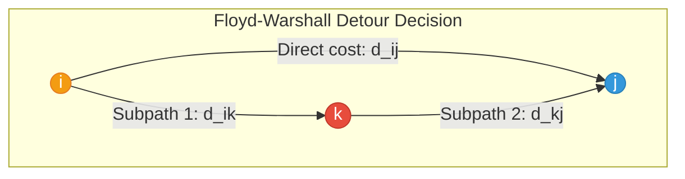

### 9. Complexity Analysis
*   **Time Complexity:** $\Theta(n^3)$ — Fills distance tables over $n$ iterations with $n^2$ cells each.
*   **Space Complexity:** $\Theta(n^2)$ — Can be done in-place to use a single $n \times n$ matrix.

---

## 9. Traveling Salesperson Problem (Standard DP)


### 1. The Real-Life Analogy
Imagine you are a delivery driver who needs to start at your depot (City 1), visit a set of customers in other cities, and return back to City 1. You want to find the route that minimizes your total driving distance. Instead of randomly guessing routes, you can build paths subset-by-subset: "What is the shortest path to City 4, visiting City 2 and City 3 along the way?" Once you have these optimal sub-routes, finding the final tour is just a simple lookup.

### 2. Inputs and Outputs
*   **Input:** An adjacency distance matrix $C$ of size $n \times n$, where $C_{ij}$ is the distance from city $i$ to city $j$.
*   **Output:** The minimum total distance required to visit every city exactly once and return to City 1.

### 3. The Core Struggle
To find the optimal route for $n$ cities, we could evaluate all permutations of the cities. Since there are $(n-1)!$ possible routes, this brute-force approach is extremely slow. For 20 cities, there are $19! \approx 1.2 \times 10^{17}$ routes. Even a supercomputer would take decades to check them all!

### 4. The Subproblem Decomposition
Let $V = \{1, 2, \dots, n\}$ be the set of all cities.
*   Let $g(i, S)$ be the length of the shortest path starting at city $i$, visiting all cities in subset $S$ exactly once, and ending at City 1.
*   **Base Case (S is empty):** We must go directly from $i$ to 1:
    ```math
    g(i, \emptyset) = C_{i1}
    ```
*   **Recursive Step (S is not empty):** We choose a next city $j \in S$ that minimizes the distance from $i \to j$ plus the shortest path from $j$ visiting the remaining cities in $S$:
    ```math
    g(i, S) = \min_{j \in S} \left( C_{ij} + g(j, S - \{j\}) \right)
    ```
*   The final optimal tour cost starting at City 1 is:
    ```math
    \text{Optimal Tour} = \min_{2 \le j \le n} \left( C_{1j} + g(j, V - \{1, j\}) \right)
    ```

### 5. The Memory Table
*   We use a table $g[i, S]$ where the row $i$ is the current city and column $S$ represents the subset of remaining cities.
*   Since there are $n$ cities and $2^{n-1}$ subsets of cities, the table size is $n \cdot 2^{n-1}$.
*   We fill the table starting with subsets of size 0, then size 1, up to size $n-2$.

### 6. Walkthrough with Small Numbers
Let's find the optimal tour for 4 cities ($V = \{1, 2, 3, 4\}$) with distance matrix:
```math
C = \begin{pmatrix} 0 & 2 & 9 & 10 \\ 1 & 0 & 6 & 4 \\ 15 & 7 & 0 & 8 \\ 6 & 3 & 12 & 0 \end{pmatrix}
```

*   **Subsets of size 0 ($S = \emptyset$):**
    *   $g(2, \emptyset) = C_{21} = 1$.
    *   $g(3, \emptyset) = C_{31} = 15$.
    *   $g(4, \emptyset) = C_{41} = 6$.
*   **Subsets of size 1 ($S = \{j\}$):**
    *   $g(2, \{3\}) = C_{23} + g(3, \emptyset) = 6 + 15 = 21$.
    *   $g(2, \{4\}) = C_{24} + g(4, \emptyset) = 4 + 6 = 10$.
    *   $g(3, \{2\}) = C_{32} + g(2, \emptyset) = 7 + 1 = 8$.
    *   $g(3, \{4\}) = C_{34} + g(4, \emptyset) = 8 + 6 = 14$.
    *   $g(4, \{2\}) = C_{42} + g(2, \emptyset) = 3 + 1 = 4$.
    *   $g(4, \{3\}) = C_{43} + g(3, \emptyset) = 12 + 15 = 27$.
*   **Subsets of size 2 ($S = \{j, k\}$):**
    *   $g(2, \{3, 4\}) = \min\left( C_{23} + g(3, \{4\}), C_{24} + g(4, \{3\}) \right) = \min(6 + 14, 4 + 27) = \min(20, 31) = 20$.
    *   $g(3, \{2, 4\}) = \min\left( C_{32} + g(2, \{4\}), C_{34} + g(4, \{2\}) \right) = \min(7 + 10, 8 + 4) = \min(17, 12) = 12$.
    *   $g(4, \{2, 3\}) = \min\left( C_{42} + g(2, \{3\}), C_{43} + g(3, \{2\}) \right) = \min(3 + 21, 12 + 8) = \min(24, 20) = 20$.
*   **Final Tour Calculation:**
    ```math
    \text{Optimal} = \min\left( C_{12} + g(2, \{3, 4\}), C_{13} + g(3, \{2, 4\}), C_{14} + g(4, \{2, 3\}) \right)
    ```
    ```math
    \text{Optimal} = \min(2 + 20, 9 + 12, 10 + 20) = \min(22, 21, 30) = 21
    ```
*   The minimum tour cost is **21**. (Optimal path: $1 \to 3 \to 4 \to 2 \to 1$).

### 7. Core Algorithm

#### 📘 Algorithm 8.11: TSP (Held-Karp)

> **Purpose:** Calculate the optimal traveling salesperson tour using dynamic programming.

```
Algorithm 8.11: TSP-HELD-KARP(C, n)
────────────────────────────────────────────
C = Distance matrix of size n x n
n = Number of cities

1. Let g[2...n, Subsets of V-{1}] be a new table
2. Repeat Step 3 for i = 2 to n:
3.     Set g[i, ∅] := C[i, 1]
   [End of loop]
4. Repeat Steps 5 through 9 for s = 1 to n - 2:    [s is subset size]
5.     Repeat Steps 6 through 9 for each subset S of V-{1} of size s:
6.         Repeat Steps 7 through 9 for each i in V-{1} where i is not in S:
7.             Set temp := ∞
8.             Repeat Step 9 for each j in S:
9.                 Set temp := min(temp, C[i, j] + g[j, S - {j}])
               [End of Step 8 loop]
10.            Set g[i, S] := temp
   [End of Step 4 loop]
11. Set final_cost := ∞
12. Repeat Step 13 for each j = 2 to n:
13.     Set final_cost := min(final_cost, C[1, j] + g[j, V - {1, j}])
    [End of loop]
14. Return final_cost
```

### 8. Visual State Transition (Mermaid)

The diagram below shows subset transitions and recursive dependencies as the size of subset $S$ decreases:

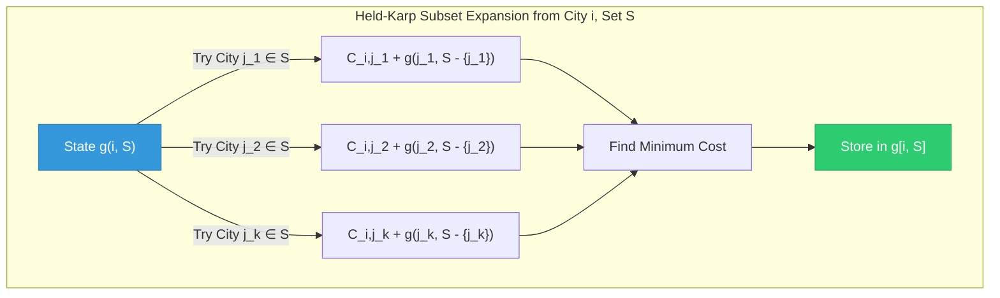

### 9. Complexity Analysis
*   **Time Complexity:** $\Theta(n^2 \cdot 2^n)$ — Iterates over $O(2^n)$ subsets, with $O(n)$ choices per subset. Much faster than $O(n!)$ brute force.
*   **Space Complexity:** $\Theta(n \cdot 2^n)$ — Storing optimal costs for $n$ cities and $2^n$ subsets.

---

## 10. Rod Cutting Problem

### 1. The Real-Life Analogy
Imagine you own a steel mill. Customers want to buy steel rods of various lengths (e.g., 1 meter, 2 meters, etc.). You have a long rod of length $n$ meters. Different cut lengths sell for different prices. How do you cut the rod into smaller pieces to maximize your total selling price?

### 2. Inputs and Outputs
*   **Input:** 
    *   A total rod of length $n = 5$.
    *   An array of segment lengths with their corresponding prices:
        *   Length 1: $p_1 = 1$
        *   Length 2: $p_2 = 5$
        *   Length 3: $p_3 = 8$
        *   Length 4: $p_4 = 9$
        *   Length 5: $p_5 = 10$
*   **Output:** The maximum revenue obtainable by cutting up the rod.

### 3. Subproblem Decomposition
To solve the problem step-by-step using a 2D dynamic programming grid (similar to the Unbounded Knapsack problem), let $T[i, j]$ be the maximum profit obtained using pieces of length up to $i$ for a total rod length $j$:
*   **Exclude the piece of length $i$:** The maximum profit is the same as the previous row: $T[i-1, j]$.
*   **Include the piece of length $i$:** We gain its price $p_i$ plus the optimal profit from the remaining length $j - i$ (which can still use piece $i$): $p_i + T[i, j - i]$.
*   **Recurrence Relation:**
    ```math
    T[i, j] = \max\Big( T[i-1, j],\; p_i + T[i, j - i] \Big) \quad \text{for } j \ge i
    ```
    With base cases $T[i, 0] = 0$ for all $i$, and $T[0, j] = 0$ for all $j$.

### 4. The 2D Dynamic Programming Table
By evaluating each cell row-by-row, we fill the following grid:

| Allowed Pieces \ Rod Length ($j$) | 0 | 1 | 2 | 3 | 4 | 5 |
| :--- | :---: | :---: | :---: | :---: | :---: | :---: |
| **None** (0) | 0 | 0 | 0 | 0 | 0 | 0 |
| **{1}** ($p_1=1$) | 0 | 1 | 2 | 3 | 4 | 5 |
| **{1, 2}** ($p_2=5$) | 0 | 1 | 5 | 6 | 10 | 11 |
| **{1, 2, 3}** ($p_3=8$) | 0 | 1 | 5 | 8 | 10 | **13** |
| **{1, 2, 3, 4}** ($p_4=9$) | 0 | 1 | 5 | 8 | 10 | 13 |
| **{1, 2, 3, 4, 5}** ($p_5=10$) | 0 | 1 | 5 | 8 | 10 | 13 |

#### Step-by-Step Row Calculations
1.  **Row 1 (Piece of length 1, price = 1):**
    *   We can only make cuts of length 1. Thus, the profit is equal to the length of the rod: $T[1, j] = j$.
2.  **Row 2 (Pieces of length 1, 2 allowed; $p_2 = 5$):**
    *   $j=1$: Since $j < 2$, we cannot use piece 2 $\implies T[2, 1] = T[1, 1] = 1$.
    *   $j=2$: $\max(T[1, 2], p_2 + T[2, 0]) = \max(2, 5 + 0) = 5$.
    *   $j=3$: $\max(T[1, 3], p_2 + T[2, 1]) = \max(3, 5 + 1) = 6$.
    *   $j=4$: $\max(T[1, 4], p_2 + T[2, 2]) = \max(4, 5 + 5) = 10$.
    *   $j=5$: $\max(T[1, 5], p_2 + T[2, 3]) = \max(5, 5 + 6) = 11$.
3.  **Row 3 (Pieces of length 1, 2, 3 allowed; $p_3 = 8$):**
    *   $j < 3$: Segment of length 3 cannot fit $\implies T[3, j] = T[2, j]$.
    *   $j=3$: $\max(T[2, 3], p_3 + T[3, 0]) = \max(6, 8 + 0) = 8$.
    *   $j=4$: $\max(T[2, 4], p_3 + T[3, 1]) = \max(10, 8 + 1) = 10$.
    *   $j=5$: $\max(T[2, 5], p_3 + T[3, 2]) = \max(11, 8 + 5) = 13$.
4.  **Row 4 (Pieces of length 1, 2, 3, 4 allowed; $p_4 = 9$):**
    *   $j < 4$: Segment of length 4 cannot fit $\implies T[4, j] = T[3, j]$.
    *   $j=4$: $\max(T[3, 4], p_4 + T[4, 0]) = \max(10, 9 + 0) = 10$.
    *   $j=5$: $\max(T[3, 5], p_4 + T[4, 1]) = \max(13, 9 + 1) = 13$.
5.  **Row 5 (Pieces of length 1, 2, 3, 4, 5 allowed; $p_5 = 10$):**
    *   $j < 5$: Segment of length 5 cannot fit $\implies T[5, j] = T[4, j]$.
    *   $j=5$: $\max(T[4, 5], p_5 + T[5, 0]) = \max(13, 10 + 0) = 13$.

### 5. Reconstructing the Optimal Cuts (Backtracking)
To find the actual cut lengths that yield the maximum profit of **13**:
1.  Start at the bottom-right cell $T[5, 5] = 13$.
2.  Compare it with the cell directly above it, $T[4, 5] = 13$. Since they are equal, the piece of length 5 was **not used**. Move up to $T[4, 5]$.
3.  Compare $T[4, 5]$ with $T[3, 5] = 13$. Since they are equal, the piece of length 4 was **not used**. Move up to $T[3, 5]$.
4.  Compare $T[3, 5]$ with $T[2, 5] = 11$. Since they are different ($13 \ne 11$), the piece of length **3** **was used**.
    *   Record cut length: **3**.
    *   Subtract length 3 from remaining rod length: $5 - 3 = 2$.
    *   Move to column 2 in row 3: $T[3, 2] = 5$.
5.  At $T[3, 2]$, compare with cell directly above, $T[2, 2] = 5$. Since they are equal, piece 3 was not used for this sub-length. Move up to $T[2, 2]$.
6.  At $T[2, 2]$, compare with cell directly above, $T[1, 2] = 2$. Since they are different ($5 \ne 2$), the piece of length **2** **was used**.
    *   Record cut length: **2**.
    *   Subtract length 2 from remaining rod length: $2 - 2 = 0$.
7.  Since remaining rod length is $0$, we stop.
*   **Max Revenue:** **13** (Cut into two pieces of length **2** and **3**: $5 + 8 = 13$).

---

## 11. Climbing Stairs Problem

### 1. The Real-Life Analogy
Imagine you are climbing a staircase with $n$ steps. You can take either **1 step**, **2 steps**, or **3 steps** at a time. In how many distinct ways can you climb to the top?

### 2. Inputs and Outputs
*   **Input:** An integer $n$ representing the number of stairs.
*   **Output:** The number of unique ways to reach the $n$-th step.

### 3. The Core Struggle
For a staircase of size $n$, exploring all path combinations recursively creates a branching factor of 3 at each level. This results in an exponential time complexity of $O(3^n)$ because we repeatedly solve the same subproblems (e.g., computing the ways to reach step $n-3$ multiple times).

### 4. Subproblem Decomposition
To reach the $n$-th step, you can only arrive from:
1.  The $(n-1)$-th step (by taking a 1-step jump).
2.  The $(n-2)$-th step (by taking a 2-step jump).
3.  The $(n-3)$-th step (by taking a 3-step jump).

Therefore, the number of ways to reach step $n$ is the sum of the ways to reach steps $n-1$, $n-2$, and $n-3$:
```math
Ways(n) = Ways(n-1) + Ways(n-2) + Ways(n-3) \quad \text{for } n \ge 3
```

#### Base Cases
*   $Ways(0) = 1$: There is exactly 1 way to stay at the ground level (by doing nothing).
*   $Ways(1) = 1$: Only 1 way to reach the first step (taking 1 step).
*   $Ways(2) = 2$: Two ways to reach the second step (taking $1+1$ steps or a single $2$-step jump).

*(Note: Therefore, $Ways(3) = Ways(2) + Ways(1) + Ways(0) = 2 + 1 + 1 = 4$ distinct ways: $1+1+1$, $1+2$, $2+1$, $3$.)*

### 5. Walkthrough with Small Numbers
Let's find the number of ways to climb $n = 5$ steps:
*   $Ways(0) = 1$
*   $Ways(1) = 1$
*   $Ways(2) = 2$
*   $Ways(3) = Ways(2) + Ways(1) + Ways(0) = 2 + 1 + 1 = 4$
*   $Ways(4) = Ways(3) + Ways(2) + Ways(1) = 4 + 2 + 1 = 7$
*   $Ways(5) = Ways(4) + Ways(3) + Ways(2) = 7 + 4 + 2 = 13$
*   **Answer:** **13** distinct ways.

### 6. The Memory Table
*   We use a 1D array `dp[0...n]`.
*   `dp[i]` stores the number of ways to reach the $i$-th step.
*   We initialize `dp[0] = 1`, `dp[1] = 1`, `dp[2] = 2`, and fill the array from index 3 to $n$ using the recurrence relation.

### 7. Implementation Approaches

The video explains four progressive approaches to solve this problem:

#### Approach A: Recursion (Brute Force)
Instead of using stored values, the direct recursive logic is executed as follows:
1.  **Base Case Check (Negative Step):** If the target stair $n < 0$, return `0` (it is impossible to land on a negative step).
2.  **Success Case Check (Ground Step):** If the target stair $n = 0$, return `1` (we successfully reached the top/destination, representing 1 valid combination of steps).
3.  **Recursive Step:** For any step $n$, calculate the sum of recursively calling the function for:
    *   $n - 1$ (taking a 1-step jump)
    *   $n - 2$ (taking a 2-step jump)
    *   $n - 3$ (taking a 3-step jump)
4.  **Complexity:** Since each state spawns 3 recursive branches, the execution time grows exponentially to $O(3^n)$, and the system call stack grows to $O(n)$ depth.

#### Approach B: Memoization (Top-Down DP)
To optimize recursion and avoid redundant calculations, we use a lookup table (cache):
1.  **Initialization:** Create a memory table (array) of size $n+1$ filled with `-1` (representing uncalculated states).
2.  **Base Cases:** When the function is called with $n$:
    *   If $n < 0$, return `0`.
    *   If $n = 0$, return `1`.
3.  **Cache Lookup:** Before calculating, check if `dp[n]` is not `-1`. If it has a value, immediately return that cached result.
4.  **Recursive Calculation & Storage:** If not cached:
    *   Calculate $Ways(n) = Ways(n-1) + Ways(n-2) + Ways(n-3)$ recursively.
    *   Store the result in `dp[n]`.
    *   Return `dp[n]`.
5.  **Complexity:** Reduces the time complexity to $\Theta(n)$ as each step is calculated once, using $\Theta(n)$ space for the table and stack.

#### Approach C: Tabulation (Bottom-Up DP)
To avoid the memory overhead of the recursive call stack, we build the solution from the ground up:
1.  **Array Allocation:** Define an array `dp` of size $n+1$.
2.  **Base Cases Initialization:**
    *   Set `dp[0] = 1` (1 way to stay at step 0)
    *   Set `dp[1] = 1` (1 way to reach step 1)
    *   Set `dp[2] = 2` (2 ways to reach step 2: $\{1+1, 2\}$)
3.  **Iterative Step:** Run a loop from $i = 3$ to $n$. At each step:
    *   Compute `dp[i] = dp[i-1] + dp[i-2] + dp[i-3]`.
4.  **Final Return:** Return `dp[n]`.
5.  **Complexity:** $\Theta(n)$ time complexity using a single loop, and $\Theta(n)$ space complexity for the array.

#### Approach D: Space-Optimized Tabulation
Since calculating `dp[i]` only requires the values of the last three steps (`dp[i-1]`, `dp[i-2]`, `dp[i-3]`), we can discard the rest of the array:
1.  **State Variable Initialization:**
    *   Let `a = 1` (representing $Ways(i-3)$, initially step 0)
    *   Let `b = 1` (representing $Ways(i-2)$, initially step 1)
    *   Let `c = 2` (representing $Ways(i-1)$, initially step 2)
2.  **Iterative Step:** Run a loop from $i = 3$ to $n$. At each iteration:
    *   Calculate the current value: `current = a + b + c`.
    *   Shift the state window forward:
        *   Set `a = b`
        *   Set `b = c`
        *   Set `c = current`
3.  **Final Return:** The answer for step $n$ is stored in `c`. Return `c`.
4.  **Complexity:** $\Theta(n)$ time complexity, but uses constant space $\Theta(1)$ since only three integer variables are maintained.

### 8. Visual State Transition (Mermaid)

The diagram below represents the top-down decision path and lookup dependencies for calculating the ways to reach step $i$:

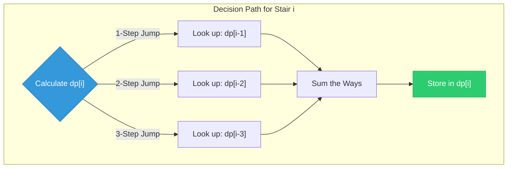

### 9. Complexity Analysis

| Approach | Time Complexity | Space Complexity | Notes |
| :--- | :--- | :--- | :--- |
| **Recursion** | $O(3^n)$ | $O(n)$ | High overhead due to overlapping subproblems. |
| **Memoization** | $\Theta(n)$ | $\Theta(n)$ | Top-down with auxiliary cache table and recursion overhead. |
| **Tabulation** | $\Theta(n)$ | $\Theta(n)$ | Bottom-up, iterative, no recursion overhead. |
| **Space-Optimized** | $\Theta(n)$ | $\Theta(1)$ | Optimal space complexity by keeping only the last 3 states. |

---

## Summary and Quick Reference

### 📊 Algorithm Quick Reference

| Algorithm | Purpose | Time Complexity | Space Complexity |
|---|---|---|---|
| **8.1** | Fibonacci DP | $\Theta(n)$ | $\Theta(n)$ |
| **8.2** | Coin-Row Problem | $\Theta(n)$ | $\Theta(n)$ |
| **8.3** | Change-Making DP | $\Theta(n \cdot m)$ | $\Theta(n)$ |
| **8.4** | Coin Collecting | $\Theta(m \cdot n)$ | $\Theta(m \cdot n)$ |
| **8.5** | 0/1 Knapsack | $\Theta(n \cdot W)$ | $\Theta(n \cdot W)$ |
| **8.6** | LCS Length | $\Theta(m \cdot n)$ | $O(m \cdot n)$ |
| **8.7** | Print LCS | $O(m+n)$ | $O(m+n)$ |
| **8.8** | Multi-Stage Graph | $O(\vert V \vert + \vert E \vert)$ | $O(\vert V \vert)$ |
| **8.9** | Floyd-Warshall | $\Theta(n^3)$ | $\Theta(n^2)$ |
| **8.10** | Transitive Closure | $\Theta(n^3)$ | $\Theta(n^2)$ |
| **8.11** | TSP (Held-Karp) | $\Theta(n^2 \cdot 2^n)$ | $\Theta(n \cdot 2^n)$ |
| **8.12** | Rod Cutting | $\Theta(n^2)$ | $\Theta(n)$ |
| **8.13** | Climbing Stairs | $\Theta(n)$ | $\Theta(n)$ |

---

### When to Use Each Technique

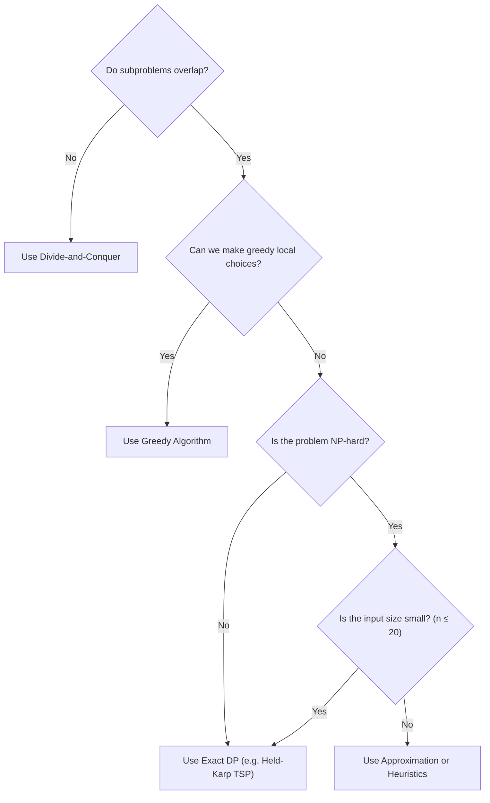

### ⚠️ Important Takeaways

1.  **Overlapping Subproblems:** Dynamic programming only speeds up algorithms when intermediate subproblems are solved repeatedly.
2.  **Tabulation vs. Memoization:** Tabulation (bottom-up) is generally faster because it has no recursion overhead. Memoization (top-down) is preferred if you only need to solve a fraction of the subproblems.
3.  **Reconstruction Needs Choices:** To construct the optimal path or selections, you must store the local decisions (e.g., traceback pointers) during the computation phase.
4.  **NP-Hard Constraints:** For NP-hard problems (like 0/1 Knapsack and TSP), exact dynamic programming algorithms run in pseudo-polynomial or exponential time, meaning they are only practical for small inputs.

---

**End of Chapter 8**

*Continue to [Chapter 9: Backtracking](../Chapter%209%20-%20Backtracking/README.md)*
