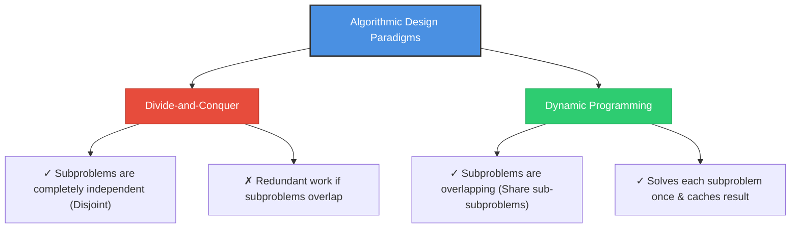
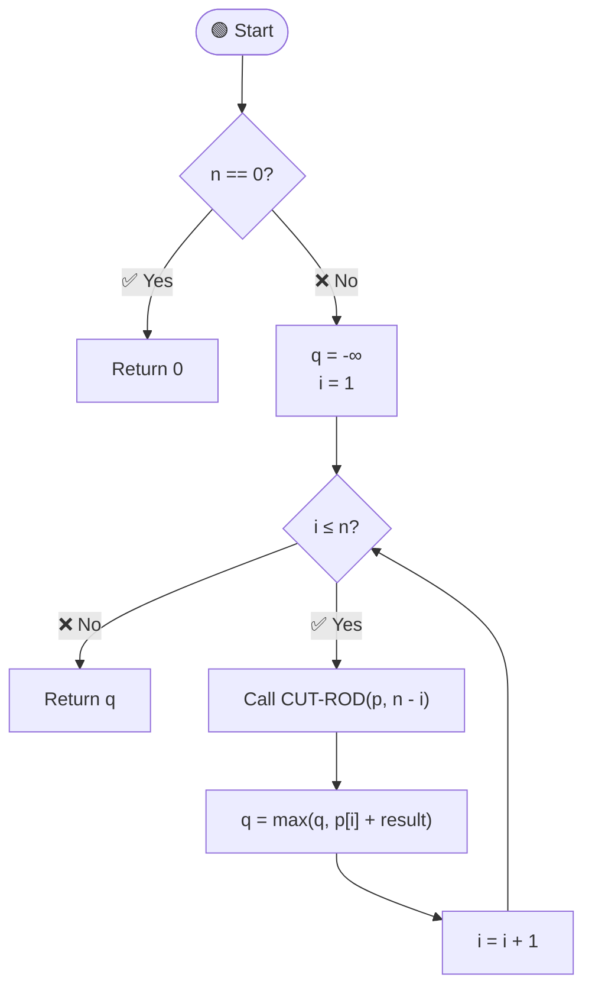
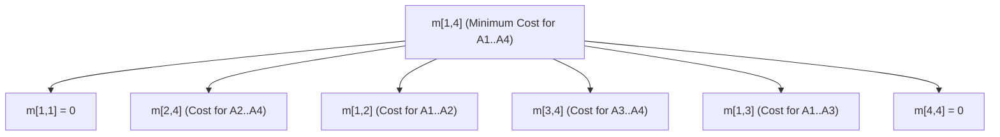
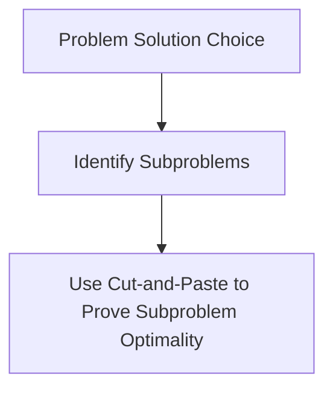
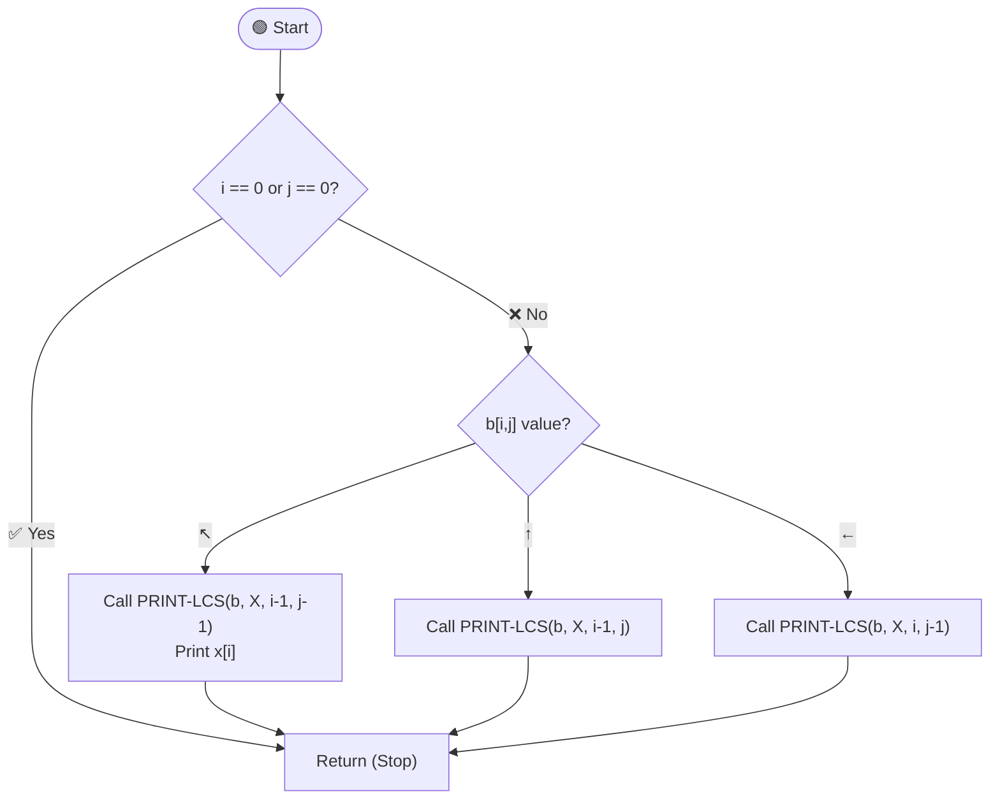
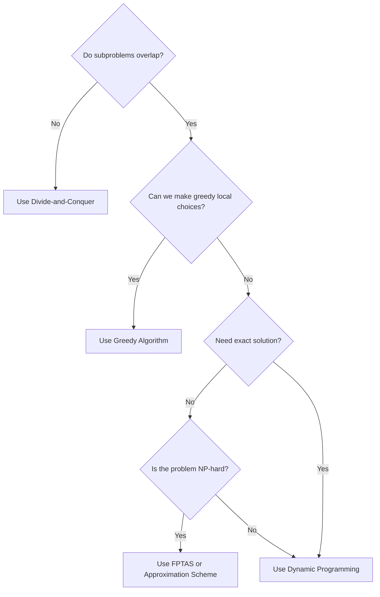

# Chapter 8: Dynamic Programming

Welcome to the comprehensive guide on **Dynamic Programming** for the [CSE 2201 Algorithm Design and Analysis](file:///workspaces/CSE-2201-2202-Algorithm-Design-and-Analysis-Sessional/SYLLABUS.md) sessional course. This chapter covers the core concepts, mathematical recurrences, and visual traceback operations for major dynamic programming topics.

---

## Table of Contents

1. [Introduction to Dynamic Programming](#introduction-to-dynamic-programming)
2. [Rod Cutting](#rod-cutting)
3. [Matrix-Chain Multiplication](#matrix-chain-multiplication)
4. [Elements of Dynamic Programming](#elements-of-dynamic-programming)
5. [Longest Common Subsequence (LCS)](#longest-common-subsequence-lcs)
6. [Optimal Binary Search Trees](#optimal-binary-search-trees)
7. [Floyd-Warshall Algorithm](#floyd-warshall-algorithm)
8. [Traveling Salesperson Problem (TSP) with Triangle Inequality](#traveling-salesperson-problem-tsp-with-triangle-inequality)
9. [Subset-Sum Problem and FPTAS](#subset-sum-problem-and-fptas)
10. [Summary and Quick Reference](#summary-and-quick-reference)

---

## Introduction to Dynamic Programming

### 💡 The Easiest Explanation
Imagine you are walking up a flight of stairs and counting the steps. If someone stops you halfway and asks, "How many steps have you taken so far?" you do not go back to the bottom and start counting from 1. You remember that you are on step 10, and if you take 1 more step, you know you are on step 11.

**Dynamic Programming (DP)** is exactly that: it is the art of **remembering answers to smaller questions** so that when you face a larger question, you can build on top of your saved answers instead of starting from scratch. In this context, "Programming" does not mean writing computer code; it refers to a **tabular method** (solving problems by filling in a table of values).

### 🔍 Terminology and Definitions

*   **Subproblem:** A smaller version of the original problem. For example, finding the shortest path between two intermediate vertices instead of the whole path.
*   **Overlapping Subproblems:** When a recursive algorithm visits the same subproblem repeatedly.
*   **Memoization (Top-Down):** Solving recursively but checking a table first. If the subproblem has already been solved, return the saved answer. If not, solve it and store the result.
*   **Tabulation (Bottom-Up):** Solving subproblems in size order (smallest first), saving the result of each subproblem in a table. Larger subproblems are solved by looking up the results of smaller ones.

### ⚔️ Divide-and-Conquer vs. Dynamic Programming



---

## Rod Cutting

### 1. The Real-Life Analogy
Imagine you own a steel company. You buy long steel rods and cut them into shorter pieces to sell. Each cut is free, and you have a price sheet that tells you how much people will pay for different lengths. If you have a rod of length 4, you could sell it uncut, cut it into four 1-inch pieces, or cut it into two 2-inch pieces. How do you decide where to make cuts so that you earn the maximum possible money?

### 2. Inputs and Outputs
*   **Inputs:** 
    *   An integer $n$ (the length of the rod we want to cut).
    *   An array $p$ of prices, where $p[i]$ is the price of a rod of length $i$ inches.
*   **Output:** 
    *   A single number representing the maximum revenue $r_n$ obtainable.

### 3. The Core Struggle
A rod of length $n$ has $n-1$ places where we can choose to cut or not cut. This means there are $2^{n-1}$ different ways to cut the rod. For a rod of length 4, there are only $2^3 = 8$ ways, but for a rod of length 40, there are $2^{39} \approx 550$ billion ways! Checking all of them one by one is too slow for a computer.

### 4. The Subproblem Decomposition
Instead of guessing all cuts at once, we make a single choice: **How long should the very first piece be?**
*   If we cut off a first piece of length $i$, we sell it for price $p[i]$.
*   We are then left with a smaller rod of length $n-i$.
*   The maximum revenue for the remainder is $r_{n-i}$.
*   Therefore, the total revenue is $p[i] + r_{n-i}$.
*   We try all possible values for $i$ (from 1 to $n$) and pick the one that gives the maximum value:
    $$r_n = \max_{1 \le i \le n} (p_i + r_{n-i}) \quad \text{with } r_0 = 0$$

### 5. The Memory Table
We create an array $r[0 \dots n]$ to store the optimal revenue values.
*   $r[0]$ represents the revenue from a rod of length 0 (which is \$0).
*   $r[j]$ represents the maximum revenue from a rod of length $j$.
*   We fill the table from index 1 up to $n$.

### 6. Walkthrough with Small Numbers
Let $n = 4$ and prices be: $p[1]=\$1$, $p[2]=\$5$, $p[3]=\$8$, $p[4]=\$9$.
*   **$r[0] = 0$** (Base case).
*   **For $j = 1$:** 
    *   $i = 1 \implies p[1] + r[0] = 1 + 0 = 1$.
    *   **$r[1] = 1$**.
*   **For $j = 2$:**
    *   $i = 1 \implies p[1] + r[1] = 1 + 1 = 2$.
    *   $i = 2 \implies p[2] + r[0] = 5 + 0 = 5$.
    *   **$r[2] = \max(2, 5) = 5$**.
*   **For $j = 3$:**
    *   $i = 1 \implies p[1] + r[2] = 1 + 5 = 6$.
    *   $i = 2 \implies p[2] + r[1] = 5 + 1 = 6$.
    *   $i = 3 \implies p[3] + r[0] = 8 + 0 = 8$.
    *   **$r[3] = \max(6, 6, 8) = 8$**.
*   **For $j = 4$:**
    *   $i = 1 \implies p[1] + r[3] = 1 + 8 = 9$.
    *   $i = 2 \implies p[2] + r[2] = 5 + 5 = 10$.
    *   $i = 3 \implies p[3] + r[1] = 8 + 1 = 9$.
    *   $i = 4 \implies p[4] + r[0] = 9 + 0 = 9$.
    *   **$r[4] = \max(9, 10, 9, 9) = 10$**.

---

### 📘 Algorithm 8.1: Naive Rod Cutting

> **Purpose:** Calculate maximum revenue recursively without saving intermediate results.

#### Pseudocode
```
Algorithm 8.1: CUT-ROD(p, n)
────────────────────────────────────────────
p = Array of prices
n = Length of the rod

1. If n == 0, then:
       Return 0
   [End of If structure]
2. Set q := -∞
3. Repeat Step 4 for i = 1 to n:
4.     Set q := max(q, p[i] + CUT-ROD(p, n - i))
   [End of Step 3 loop]
5. Return q
```

#### 🎯 Visual Flowchart


---

### 📘 Algorithm 8.2: Memoized Rod Cutting (Top-Down Helper)

> **Purpose:** Entry point for top-down memoization. Allocates the lookup table and calls the recursive helper.

#### Pseudocode
```
Algorithm 8.2: MEMOIZED-CUT-ROD(p, n)
────────────────────────────────────────────
p = Array of prices
n = Length of the rod

1. Let r[0...n] be a new array
2. Repeat Step 3 for i = 0 to n:
3.     Set r[i] := -∞
   [End of Step 2 loop]
4. Return MEMOIZED-CUT-ROD-AUX(p, n, r)
```

```
Procedure: MEMOIZED-CUT-ROD-AUX(p, n, r)
────────────────────────────────────────────
1. If r[n] ≥ 0, then:
       Return r[n]
   [End of If structure]
2. If n == 0, then:
       Set q := 0
   Else:
       Set q := -∞
       Repeat Step 3 for i = 1 to n:
3.         Set q := max(q, p[i] + MEMOIZED-CUT-ROD-AUX(p, n - i, r))
       [End of loop]
   [End of If structure]
4. Set r[n] := q
5. Return q
```

---

### 📘 Algorithm 8.3: Bottom-Up Rod Cutting

> **Purpose:** Calculate maximum revenue by solving smaller subproblems first.

#### Pseudocode
```
Algorithm 8.3: BOTTOM-UP-CUT-ROD(p, n)
────────────────────────────────────────────
1. Let r[0...n] be a new array
2. Set r[0] := 0
3. Repeat Steps 4 through 7 for j = 1 to n:
4.     Set q := -∞
5.     Repeat Step 6 for i = 1 to j:
6.         Set q := max(q, p[i] + r[j - i])
       [End of Step 5 loop]
7.     Set r[j] := q
   [End of Step 3 loop]
8. Return r[n]
```

---

### 📘 Algorithm 8.4: Extended Bottom-Up Rod Cutting

> **Purpose:** Calculate both the maximum revenue and the optimal first cut size.

#### Pseudocode
```
Algorithm 8.4: EXTENDED-BOTTOM-UP-CUT-ROD(p, n)
────────────────────────────────────────────
r = Array for optimal values
s = Array for optimal first-piece sizes

1. Let r[0...n] and s[1...n] be new arrays
2. Set r[0] := 0
3. Repeat Steps 4 through 9 for j = 1 to n:
4.     Set q := -∞
5.     Repeat Steps 6 through 8 for i = 1 to j:
6.         If q < p[i] + r[j - i], then:
7.             Set q := p[i] + r[j - i]
8.             Set s[j] := i
           [End of If structure]
       [End of Step 5 loop]
9.     Set r[j] := q
   [End of Step 3 loop]
10. Return r and s
```

---

### 📘 Procedure 8.5: Print Rod Cutting Solution

> **Purpose:** Print the sequence of piece sizes that makes up the optimal cut.

#### Pseudocode
```
Procedure: PRINT-CUT-ROD-SOLUTION(p, n)
────────────────────────────────────────────
1. (r, s) := EXTENDED-BOTTOM-UP-CUT-ROD(p, n)
2. Repeat Steps 3 and 4 while n > 0:
3.     Print s[n]
4.     Set n := n - s[n]
   [End of Step 2 loop]
```

#### ⏱️ Complexity Analysis

| Metric | Naive Recursive | Memoized Top-Down | Bottom-Up Tabulation |
|---|---|---|---|
| **Time Complexity** | $O(2^n)$ | $\Theta(n^2)$ | $\Theta(n^2)$ |
| **Space Complexity** | $O(n)$ | $\Theta(n)$ | $\Theta(n)$ |

---

## Matrix-Chain Multiplication

### 1. The Real-Life Analogy
Imagine you have to pack boxes of different sizes into a truck. When multiplying matrices, the order in which you multiply them matters. Because matrix multiplication is associative: $(A \times B) \times C = A \times (B \times C)$. 

Both parenthesizations yield the exact same final matrix, but one way might require lifting 7,500 boxes (scalar operations) while the other way requires lifting 75,000 boxes! We want to find the optimal order of parenthesization to minimize work.

### 2. Inputs and Outputs
*   **Input:** An array $p = \langle p_0, p_1, \dots, p_n \rangle$ of dimensions, where the $i$-th matrix $A_i$ has size $p_{i-1} \times p_i$.
*   **Outputs:** 
    *   The minimum number of scalar multiplications required to multiply the chain.
    *   The optimal split location table to reconstruct parenthesization.

### 3. The Core Struggle
To find the best way to group the matrices, we could try all possible ways to place parentheses. However, the number of ways to parenthesize $n$ matrices is given by the Catalan numbers:
$$P(n) = \sum_{k=1}^{n-1} P(k)P(n-k)$$
This sequence grows as $\Omega(2^n)$. For a chain of 10 matrices, there are 4,862 parenthesizations. For 20 matrices, there are over 17.6 million! We cannot afford to evaluate every single one.

### 4. The Subproblem Decomposition
To multiply a chain of matrices $A_i A_{i+1} \dots A_j$, we must perform a final multiplication step: multiplying the left subchain $A_{i \dots k}$ by the right subchain $A_{k+1 \dots j}$ for some split point $k$.
*   The cost of computing the left subchain is $m[i, k]$.
*   The cost of computing the right subchain is $m[k+1, j]$.
*   The cost of multiplying the two resulting matrices together is $p_{i-1} \cdot p_k \cdot p_j$.
*   Therefore, the total cost for a split at $k$ is:
    $$m[i, j] = m[i, k] + m[k+1, j] + p_{i-1} p_k p_j$$
*   We try all possible split locations $k$ (where $i \le k < j$) and select the minimum cost:
    $$m[i, j] = \min_{i \le k < j} \left( m[i, k] + m[k+1, j] + p_{i-1} p_k p_j \right)$$

### 5. The Memory Table
We use two tables:
*   $m[1 \dots n, 1 \dots n]$: $m[i, j]$ stores the minimum multiplication cost for $A_i \dots A_j$.
*   $s[1 \dots n-1, 2 \dots n]$: $s[i, j]$ stores the split index $k$ that achieved the minimum cost.



### 6. Walkthrough with Small Numbers
Let's find the minimum cost for 3 matrices: $A_1 (10 \times 100)$, $A_2 (100 \times 5)$, and $A_3 (5 \times 50)$.
The dimension array is $p = \langle 10, 100, 5, 50 \rangle$.
*   **Base cases (Length 1):**
    *   $m[1, 1] = 0$, $m[2, 2] = 0$, $m[3, 3] = 0$.
*   **Length 2 chains:**
    *   $m[1, 2] = m[1,1] + m[2,2] + p_0 p_1 p_2 = 0 + 0 + 10 \cdot 100 \cdot 5 = 5,000$.
    *   $m[2, 3] = m[2,2] + m[3,3] + p_1 p_2 p_3 = 0 + 0 + 100 \cdot 5 \cdot 50 = 25,000$.
*   **Length 3 chain ($m[1, 3]$):**
    *   **Split at $k = 1$:**
        $m[1, 1] + m[2, 3] + p_0 p_1 p_3 = 0 + 25,000 + 10 \cdot 100 \cdot 50 = 25,000 + 50,000 = 75,000$.
    *   **Split at $k = 2$:**
        $m[1, 2] + m[3, 3] + p_0 p_2 p_3 = 5,000 + 0 + 10 \cdot 5 \cdot 50 = 5,000 + 2,500 = 7,500$.
    *   The minimum cost is **7,500** (using split $k = 2$).

---

### 📘 Algorithm 8.6: Recursive Matrix-Chain Cost (Naive)

> **Purpose:** Calculate the optimal multiplication cost recursively without caching.

#### Pseudocode
```
Algorithm 8.6: RECURSIVE-MATRIX-CHAIN(p, i, j)
────────────────────────────────────────────
1. If i == j, then:
       Return 0
   [End of If structure]
2. Set m[i, j] := ∞
3. Repeat Steps 4 through 6 for k = i to j - 1:
4.     Set q := RECURSIVE-MATRIX-CHAIN(p, i, k) 
              + RECURSIVE-MATRIX-CHAIN(p, k + 1, j) 
              + p[i-1] * p[k] * p[j]
5.     If q < m[i, j], then:
6.         Set m[i, j] := q
       [End of If structure]
   [End of Step 3 loop]
7. Return m[i, j]
```

---

### 📘 Algorithm 8.7: Matrix-Chain Order (Bottom-Up Tabulation)

> **Purpose:** Fill the cost and split tables bottom-up, starting with the shortest subchains.

#### Pseudocode
```
Algorithm 8.7: MATRIX-CHAIN-ORDER(p, n)
────────────────────────────────────────────
1. Let m[1...n, 1...n] and s[1...n-1, 2...n] be new tables
2. Repeat Step 3 for i = 1 to n:
3.     Set m[i, i] := 0
   [End of Step 2 loop]
4. Repeat Steps 5 through 12 for l = 2 to n:      [l is chain length]
5.     Repeat Steps 6 through 12 for i = 1 to n - l + 1:
6.         Set j := i + l - 1
7.         Set m[i, j] := ∞
8.         Repeat Steps 9 through 12 for k = i to j - 1:
9.             Set q := m[i, k] + m[k + 1, j] + p[i-1] * p[k] * p[j]
10.            If q < m[i, j], then:
11.                Set m[i, j] := q
12.                Set s[i, j] := k
               [End of If structure]
           [End of Step 8 loop]
       [End of Step 5 loop]
   [End of Step 4 loop]
13. Return m and s
```

---

### 📘 Algorithm 8.8: Memoized Matrix-Chain

> **Purpose:** Calculate matrix chain multiplication costs top-down using memoization.

#### Pseudocode
```
Algorithm 8.8: MEMOIZED-MATRIX-CHAIN(p, n)
────────────────────────────────────────────
1. Let m[1...n, 1...n] be a new table
2. Repeat Steps 3 and 4 for i = 1 to n:
3.     Repeat Step 4 for j = i to n:
4.         Set m[i, j] := ∞
   [End of Step 2 loop]
5. Return LOOKUP-CHAIN(m, p, 1, n)
```

```
Procedure: LOOKUP-CHAIN(m, p, i, j)
────────────────────────────────────────────
1. If m[i, j] < ∞, then:
       Return m[i, j]
   [End of If structure]
2. If i == j, then:
       Set m[i, j] := 0
   Else:
       Repeat Steps 3 through 5 for k = i to j - 1:
3.         Set q := LOOKUP-CHAIN(m, p, i, k) 
                  + LOOKUP-CHAIN(m, p, k + 1, j) 
                  + p[i-1] * p[k] * p[j]
4.         If q < m[i, j], then:
5.             Set m[i, j] := q
           [End of If structure]
       [End of loop]
   [End of If structure]
6. Return m[i, j]
```

---

### 📘 Procedure 8.9: Print Optimal Parenthesizations

> **Purpose:** Recursively print the parenthesized matrix product based on split indices.

#### Pseudocode
```
Procedure: PRINT-OPTIMAL-PARENS(s, i, j)
────────────────────────────────────────────
1. If i == j, then:
       Print "A" followed by index i
   Else:
       Print "("
       Call PRINT-OPTIMAL-PARENS(s, i, s[i, j])
       Call PRINT-OPTIMAL-PARENS(s, s[i, j] + 1, j)
       Print ")"
   [End of If structure]
```

#### ⏱️ Complexity Analysis

| Metric | Recursive (Naive) | Tabular / Memoized |
|---|---|---|
| **Time Complexity** | $O(2^n)$ | $\Theta(n^3)$ |
| **Space Complexity** | $O(n)$ | $\Theta(n^2)$ |

---

## Elements of Dynamic Programming

Understanding when dynamic programming applies requires breaking down its two core requirements:

### 1. Optimal Substructure
An optimal solution to the problem contains within it optimal solutions to its subproblems.



*   **Subproblem Independence:** To assemble an optimal solution from subproblem solutions, the subproblems must be independent.
    *   **Shortest Path** subproblems do not share vertices (they are independent).
    *   **Longest Simple Path** subproblems share vertices (they are dependent). Since choosing a vertex in one subpath prevents its use in the other, subproblem solutions cannot be safely combined.

### 2. Overlapping Subproblems
The subproblem space must be small (polynomial size). A recursive algorithm visits the same subproblems repeatedly, allowing a table of cached solutions to save significant time.

| Approach | Setup | Best Used When |
|---|---|---|
| **Memoization (Top-Down)** | Recursive solver with lookup check. | Only a subset of all possible states needs to be evaluated. |
| **Tabulation (Bottom-Up)** | Iteratively fills a table from smallest to largest. | All subproblems must be solved. Has lower overhead. |

---

## Longest Common Subsequence (LCS)

### 1. The Real-Life Analogy
Imagine comparing two books to see if one was copied from the other. The plagiarist might have added or removed words to hide the copying. We want to find the longest sequence of words that appears in both books in the exact same order, even if there are different words inserted between them.

### 2. Inputs and Outputs
*   **Inputs:** Two sequences (strings) $X = \langle x_1, x_2, \dots, x_m \rangle$ and $Y = \langle y_1, y_2, \dots, y_n \rangle$.
*   **Outputs:** 
    *   The length of the longest sequence of elements common to both strings.
    *   A traceback path to print the common elements in order.

### 3. The Core Struggle
To find the longest common subsequence of two strings of length $m$ and $n$, we could check all subsequences of string $X$. Since string $X$ has $2^m$ possible subsequences, checking all of them against $Y$ takes exponential time and is too slow for long strings.

### 4. The Subproblem Decomposition
Let's look at the final characters $x_m$ and $y_n$ of both strings:
*   **If $x_m == y_n$:** The final characters match. They must be part of the LCS. We solve the smaller problem of finding the LCS of $X_{m-1}$ and $Y_{n-1}$, then append this character:
    $$c[i, j] = c[i-1, j-1] + 1$$
*   **If $x_m \neq y_n$:** The final characters do not match. The LCS could end with $x_m$ (excluding $y_n$) or end with $y_n$ (excluding $x_m$). We solve both cases and take the maximum:
    $$c[i, j] = \max(c[i-1, j], c[i, j-1])$$

### 5. The Memory Table
*   We use a 2D grid $c[0 \dots m, 0 \dots n]$ to store lengths, where $c[i, j]$ is the LCS length of prefixes $X_i$ and $Y_j$.
*   We use a 2D table $b[1 \dots m, 1 \dots n]$ to store directions ($\nwarrow$, $\uparrow$, $\leftarrow$) representing matching choices.

### 6. Walkthrough with Small Numbers
Let's find the LCS of $X = \text{"ABC"}$ and $Y = \text{"BDC"}$.
*   **Initialize:** Set Row 0 and Column 0 of table $c$ to 0.
*   **Row 1 ($i=1, x_1=\text{'A'}$):**
    *   $j=1 (y_1=\text{'B'}): \text{'A'} \neq \text{'B'} \implies c[1, 1] = \max(c[0, 1], c[1, 0]) = 0$.
    *   $j=2 (y_2=\text{'D'}): \text{'A'} \neq \text{'D'} \implies c[1, 2] = \max(c[0, 2], c[1, 1]) = 0$.
    *   $j=3 (y_3=\text{'C'}): \text{'A'} \neq \text{'C'} \implies c[1, 3] = \max(c[0, 3], c[1, 2]) = 0$.
*   **Row 2 ($i=2, x_2=\text{'B'}$):**
    *   $j=1 (y_1=\text{'B'}): \text{'B'} == \text{'B'} \implies c[2, 1] = c[1, 0] + 1 = 1$.
    *   $j=2 (y_2=\text{'D'}): \text{'B'} \neq \text{'D'} \implies c[2, 2] = \max(c[1, 2], c[2, 1]) = 1$.
    *   $j=3 (y_3=\text{'C'}): \text{'B'} \neq \text{'C'} \implies c[2, 3] = \max(c[1, 3], c[2, 2]) = 1$.
*   **Row 3 ($i=3, x_3=\text{'C'}$):**
    *   $j=1 (y_1=\text{'B'}): \text{'C'} \neq \text{'B'} \implies c[3, 1] = \max(c[2, 1], c[3, 0]) = 1$.
    *   $j=2 (y_2=\text{'D'}): \text{'C'} \neq \text{'D'} \implies c[3, 2] = \max(c[2, 2], c[3, 1]) = 1$.
    *   $j=3 (y_3=\text{'C'}): \text{'C'} == \text{'C'} \implies c[3, 3] = c[2, 2] + 1 = 2$.
*   The final cell value is **2**, representing LCS length. Traceback path matches 'C' at (3,3) and 'B' at (2,1) $\implies$ LCS is "BC".

---

### 📘 Algorithm 8.10: LCS Length

> **Purpose:** Calculate the length of the LCS of two sequences and populate the traceback tables.

#### Pseudocode
```
Algorithm 8.10: LCS-LENGTH(X, Y, m, n)
────────────────────────────────────────────
1. Let b[1...m, 1...n] and c[0...m, 0...n] be new tables
2. Repeat Step 3 for i = 1 to m:
3.     Set c[i, 0] := 0
   [End of loop]
4. Repeat Step 5 for j = 0 to n:
5.     Set c[0, j] := 0
   [End of loop]
6. Repeat Steps 7 through 15 for i = 1 to m:
7.     Repeat Steps 8 through 15 for j = 1 to n:
8.         If x[i] == y[j], then:
9.             Set c[i, j] := c[i - 1, j - 1] + 1
10.            Set b[i, j] := "↖"
11.        Else if c[i - 1, j] ≥ c[i, j - 1], then:
12.            Set c[i, j] := c[i - 1, j]
13.            Set b[i, j] := "↑"
14.        Else:
15.            Set c[i, j] := c[i, j - 1]
16.            Set b[i, j] := "←"
           [End of If structure]
       [End of Step 7 loop]
   [End of Step 6 loop]
17. Return c and b
```

---

### 📘 Procedure 8.11: Print LCS

> **Purpose:** Recursively print the characters of the LCS in the correct order.

#### Pseudocode
```
Procedure: PRINT-LCS(b, X, i, j)
────────────────────────────────────────────
1. If i == 0 or j == 0, then:
       Return
   [End of If structure]
2. If b[i, j] == "↖", then:
       Call PRINT-LCS(b, X, i - 1, j - 1)
       Print x[i]
   Else if b[i, j] == "↑", then:
       Call PRINT-LCS(b, X, i - 1, j)
   Else:
       Call PRINT-LCS(b, X, i, j - 1)
   [End of If structure]
```

#### 🎯 Visual Flowchart


#### ⏱️ Complexity Analysis

| Metric | Complexity | Explanation |
|---|---|---|
| **LCS-LENGTH Time** | $\Theta(mn)$ | Fills a table of size $m \times n$ iteratively |
| **LCS-LENGTH Space** | $O(mn)$ | Can be optimized to $O(\min(m, n))$ if only the length is needed |
| **PRINT-LCS Time** | $O(m+n)$ | Trace path moves up or left at least one step each time |

---

## Optimal Binary Search Trees

### 1. The Real-Life Analogy
Imagine you are building a search bar for a Latvian dictionary. Some words like "the" are searched for constantly, while other words like "naumachia" are rarely searched. If we build a standard balanced search tree, rare words might sit near the root, forcing the search program to make many comparisons for common words. We want to place the most frequently searched words near the root to minimize search times.

### 2. Inputs and Outputs
*   **Inputs:** 
    *   Sorted keys $K = \langle k_1, \dots, k_n \rangle$ with probabilities $p_i$ of searching for key $k_i$.
    *   Dummy keys $d_0, \dots, d_n$ representing values not in the tree, with probabilities $q_i$.
*   **Output:** 
    *   A binary search tree structure that minimizes the expected search cost.

### 3. The Core Struggle
To find the absolute best tree configuration, we could build every possible binary tree with $n$ nodes and calculate its expected cost. However, the number of binary search trees with $n$ nodes is given by Catalan numbers, which grow as $\Omega(4^n/n^{3/2})$. This means checking all trees is impossible for large keys.

### 4. The Subproblem Decomposition
In any binary search tree containing keys $k_i \dots k_j$, one key $k_r$ (where $i \le r \le j$) must be the root.
*   The left subtree containing keys $k_i \dots k_{r-1}$ must be an optimal search tree for those keys.
*   The right subtree containing keys $k_{r+1} \dots k_j$ must be an optimal search tree for those keys.
*   When we combine these subtrees under root $k_r$, the depth of every node in the subtrees increases by 1. This adds the sum of all probabilities in the subtrees ($w(i, j)$) to the expected cost:
    $$e[i, j] = e[i, r-1] + e[r+1, j] + w(i, j)$$
*   We try all candidate roots $r$ and choose the minimum:
    $$e[i, j] = \min_{i \le r \le j} \left( e[i, r-1] + e[r+1, j] + w(i, j) \right)$$

### 5. The Memory Table
*   $e[1 \dots n+1, 0 \dots n]$: $e[i, j]$ is the expected cost of an optimal BST for keys $k_i \dots k_j$.
*   $w[1 \dots n+1, 0 \dots n]$: $w[i, j]$ is the sum of probabilities for keys $k_i \dots k_j$ and dummy keys $d_{i-1} \dots d_j$.
*   $root[1 \dots n, 1 \dots n]$: $root[i, j]$ stores the root index $r$ that achieved the minimum cost.

### 6. Walkthrough with Small Numbers
Let's build an optimal BST for 2 keys: $k_1$ ($p_1 = 0.4$) and $k_2$ ($p_2 = 0.1$), with dummy keys $d_0$ ($q_0 = 0.1$), $d_1$ ($q_1 = 0.2$), and $d_2$ ($q_2 = 0.2$).
*   **Base cases (Subtree size 0):**
    *   $e[1, 0] = q_0 = 0.1$, $e[2, 1] = q_1 = 0.2$, $e[3, 2] = q_2 = 0.2$.
    *   $w[1, 0] = q_0 = 0.1$, $w[2, 1] = q_1 = 0.2$, $w[3, 2] = q_2 = 0.2$.
*   **Subtree size 1:**
    *   **For $k_1$ ($e[1, 1]$):**
        $w[1, 1] = w[1, 0] + p_1 + q_1 = 0.1 + 0.4 + 0.2 = 0.7$.
        $e[1, 1] = e[1, 0] + e[2, 1] + w[1, 1] = 0.1 + 0.2 + 0.7 = 1.0$.
    *   **For $k_2$ ($e[2, 2]$):**
        $w[2, 2] = w[2, 1] + p_2 + q_2 = 0.2 + 0.1 + 0.2 = 0.5$.
        $e[2, 2] = e[2, 1] + e[3, 2] + w[2, 2] = 0.2 + 0.2 + 0.5 = 0.9$.
*   **Subtree size 2 ($e[1, 2]$):**
    *   $w[1, 2] = w[1, 1] + p_2 + q_2 = 0.7 + 0.1 + 0.2 = 1.0$.
    *   **If $k_1$ is root ($r = 1$):**
        $e[1, 0] + e[2, 2] + w[1, 2] = 0.1 + 0.9 + 1.0 = 2.0$.
    *   **If $k_2$ is root ($r = 2$):**
        $e[1, 1] + e[3, 2] + w[1, 2] = 1.0 + 0.2 + 1.0 = 2.2$.
    *   The minimum cost is **2.0**, meaning $k_1$ is chosen as the root of the optimal tree.

---

### 📘 Algorithm 8.12: Optimal BST

> **Purpose:** Populate expected cost and root selection tables bottom-up.

#### Pseudocode
```
Algorithm 8.12: OPTIMAL-BST(p, q, n)
────────────────────────────────────────────
1. Let e[1...n+1, 0...n], w[1...n+1, 0...n], and root[1...n, 1...n] be new tables
2. Repeat Steps 3 and 4 for i = 1 to n + 1:
3.     Set e[i, i - 1] := q[i - 1]
4.     Set w[i, i - 1] := q[i - 1]
   [End of Step 2 loop]
5. Repeat Steps 6 through 14 for l = 1 to n:      [l is subtree size]
6.     Repeat Steps 7 through 14 for i = 1 to n - l + 1:
7.         Set j := i + l - 1
8.         Set e[i, j] := ∞
9.         Set w[i, j] := w[i, j - 1] + p[j] + q[j]
10.        Repeat Steps 11 through 14 for r = i to j:  [Test each root r]
11.            Set t := e[i, r - 1] + e[r + 1, j] + w[i, j]
12.            If t < e[i, j], then:
13.                Set e[i, j] := t
14.                Set root[i, j] := r
               [End of If structure]
           [End of Step 10 loop]
       [End of Step 6 loop]
   [End of Step 5 loop]
15. Return e and root
```

#### ⏱️ Complexity Analysis

| Metric | Complexity | Explanation |
|---|---|---|
| **Time Complexity** | $O(n^3)$ | Three nested loops (subtree size, start key, and root candidate) |
| **Space Complexity** | $\Theta(n^2)$ | Storing three 2D matrices of size $n \times n$ |

---

## Floyd-Warshall Algorithm

### 1. The Real-Life Analogy
Imagine you want to build a flight search engine. You want to show users the cheapest ticket between **every single pair of airports**. 

Instead of running a separate search for every pair of airports, the Floyd-Warshall algorithm updates the entire flight database step-by-step. It asks: "Is it cheaper to fly from Airport A to Airport B directly, or by taking a detour through Airport C?" We repeat this query for every airport, letting each one take a turn as a detour hub.

### 2. Inputs and Outputs
*   **Input:** An adjacency weight matrix $W$ of size $n \times n$, where $w_{ij}$ is the direct weight of edge $i \to j$.
*   **Output:** An $n \times n$ matrix $D$ containing the shortest path weights between all pairs of vertices.

### 3. The Core Struggle
We want to find all shortest paths in a graph. If we run Dijkstra's algorithm from every single vertex, it works but is complex to implement and fails if there are negative-weight edges. The Floyd-Warshall algorithm handles negative-weight edges efficiently using a clean matrix update.

### 4. The Subproblem Decomposition
Number the vertices of the graph from 1 to $n$. Let $d_{ij}^{(k)}$ be the weight of a shortest path from $i$ to $j$ using intermediate vertices only from the set $\{1, 2, \dots, k\}$.
When we allow vertex $k$ to be used as a detour:
*   **Case 1 (Skip $k$):** The path does not go through $k$. The shortest path remains $d_{ij}^{(k-1)}$.
*   **Case 2 (Detour through $k$):** The path goes through $k$. It splits into a path from $i \to k$ and a path from $k \to j$. The cost is $d_{ik}^{(k-1)} + d_{kj}^{(k-1)}$.
*   We choose the minimum of these two cases:
    $$d_{ij}^{(k)} = \min \left( d_{ij}^{(k-1)}, d_{ik}^{(k-1)} + d_{kj}^{(k-1)} \right)$$

### 5. The Memory Table
*   A 3D grid of size $n \times n \times (n+1)$ is used, where index $k$ represents the maximum intermediate vertex allowed.
*   **Memory Optimization:** In practice, we only need a 2D matrix of size $n \times n$ and can update it in-place since the values at step $k$ only depend on the values at step $k-1$.

### 6. Walkthrough with Small Numbers
Let's solve for a 3-vertex graph:
*   Edge $1 \to 2$ has weight 3
*   Edge $2 \to 3$ has weight 1
*   Edge $1 \to 3$ has weight 6 (direct)

Initially ($k=0$):
*   $D^{(0)} = \begin{pmatrix} 0 & 3 & 6 \\ \infty & 0 & 1 \\ \infty & \infty & 0 \end{pmatrix}$.

Detour through vertex 1 ($k=1$):
*   No paths are shortened by detouring through vertex 1. $D^{(1)} = D^{(0)}$.

Detour through vertex 2 ($k=2$):
*   Check path $1 \to 3$: $\min(d_{13}^{(1)}, d_{12}^{(1)} + d_{23}^{(1)}) = \min(6, 3 + 1) = 4$.
*   $D^{(2)} = \begin{pmatrix} 0 & 3 & 4 \\ \infty & 0 & 1 \\ \infty & \infty & 0 \end{pmatrix}$.

The shortest path from $1 \to 3$ is updated to **4** by detouring through vertex 2.

---

### 📘 Algorithm 8.13: Floyd-Warshall

> **Purpose:** Calculate all-pairs shortest path weights in a graph with no negative-weight cycles.

#### Pseudocode
```
Algorithm 8.13: FLOYD-WARSHALL(W, n)
────────────────────────────────────────────
W = Adjacency weight matrix of size n x n
D = Distance matrix of shortest path weights

1. Set D^(0) := W
2. Repeat Steps 3 through 6 for k = 1 to n:      [k is the detour vertex]
3.     Let D^(k) be a new n x n matrix
4.     Repeat Steps 5 and 6 for i = 1 to n:
5.         Repeat Step 6 for j = 1 to n:
6.             Set d^(k)[i, j] := min(d^(k-1)[i, j], d^(k-1)[i, k] + d^(k-1)[k, j])
           [End of Step 5 loop]
       [End of Step 4 loop]
   [End of Step 2 loop]
7. Return D^(n)
```

---

### 📘 Algorithm 8.14: Transitive Closure

> **Purpose:** Find if there is a path from vertex $i$ to vertex $j$ for all pairs of vertices.

#### Pseudocode
```
Algorithm 8.14: TRANSITIVE-CLOSURE(G, n)
────────────────────────────────────────────
1. Let T^(0) be a new n x n matrix
2. Repeat Steps 3 through 6 for i = 1 to n:
3.     Repeat Steps 4 through 6 for j = 1 to n:
4.         If i == j or (i, j) is an edge in G.E, then:
5.             Set t^(0)[i, j] := 1
6.         Else:
7.             Set t^(0)[i, j] := 0
           [End of If structure]
       [End of Step 3 loop]
   [End of Step 2 loop]
8. Repeat Steps 9 through 12 for k = 1 to n:
9.     Let T^(k) be a new n x n matrix
10.    Repeat Steps 11 and 12 for i = 1 to n:
11.        Repeat Step 12 for j = 1 to n:
12.            Set t^(k)[i, j] := t^(k-1)[i, j] OR (t^(k-1)[i, k] AND t^(k-1)[k, j])
           [End of Step 11 loop]
       [End of Step 10 loop]
   [End of Step 8 loop]
13. Return T^(n)
```

#### ⏱️ Complexity Analysis

| Metric | Floyd-Warshall | Transitive Closure |
|---|---|---|
| **Time Complexity** | $\Theta(n^3)$ | $\Theta(n^3)$ (logical operations are faster in practice) |
| **Space Complexity** | $\Theta(n^2)$ | $\Theta(n^2)$ (stores boolean values) |

---

## Traveling Salesperson Problem (TSP) with Triangle Inequality

### 1. The Real-Life Analogy
Imagine you are a delivery driver who needs to visit a set of houses and return home. You want to visit each house exactly once and travel the shortest total distance. Finding the absolute best route is a hard problem that could take a computer years to solve for many houses. 

However, if your map satisfies the rule that **"a straight line between two houses is always shorter than taking a detour"** (called the Triangle Inequality), we can construct a route that is **at most twice as long** as the optimal route using a tree outline.

### 2. Inputs and Outputs
*   **Inputs:** 
    *   A complete undirected graph $G = (V, E)$.
    *   A cost function $c$ satisfying the triangle inequality: $c(u, w) \le c(u, v) + c(v, w)$ for all $u, v, w \in V$.
*   **Output:** 
    *   A Hamiltonian cycle (tour) of vertices.

### 3. The Core Struggle
Finding the absolute best Hamiltonian cycle is NP-hard, meaning no polynomial-time algorithm is known. However, if the triangle inequality holds, we can find a good approximate solution in polynomial time. If it does not hold, finding a good approximation is also NP-hard.

### 4. The Subproblem Decomposition
*   **Step 1:** Build a Minimum Spanning Tree (MST) of the graph. The total weight of this MST is a lower bound on the optimal tour cost because removing any edge from the optimal tour yields a spanning tree.
*   **Step 2:** Traverse the MST, visiting each edge exactly twice. This full walk has a cost of $2 \cdot \text{cost}(MST)$.
*   **Step 3:** Skip duplicate vertices (shortcuts) during the walk. By the triangle inequality, taking shortcuts never increases the total cost.


### 5. Walkthrough with Small Numbers
Let's find a tour for a triangle graph with vertices $A, B, C$ and weights: $c(A, B) = 3$, $c(B, C) = 4$, $c(A, C) = 5$.
*   **MST:** The minimum spanning tree includes edges $A-B$ (weight 3) and $B-C$ (weight 4). The cost of the MST is $3 + 4 = 7$.
*   **Full Walk:** We walk $A \to B \to C \to B \to A$. The total cost of the walk is $2 \cdot 7 = 14$.
*   **Shortcuts:** We perform a preorder walk starting at $A$.
    *   Visit $A$.
    *   Visit $B$.
    *   Visit $C$.
    *   The next node in the walk is $B$, which we have already visited. We skip it and return to $A$.
    *   **Approximate Tour:** $A \to B \to C \to A$.
    *   **Cost:** $c(A, B) + c(B, C) + c(C, A) = 3 + 4 + 5 = 12$.
    *   $12 \le 2 \cdot 7$, meaning the cost of the approximate tour is less than twice the optimal tour cost.

---

### 📘 Algorithm 8.15: Approximate TSP Tour

> **Purpose:** Calculate a Hamiltonian cycle whose cost is at most twice the optimal tour cost.

#### Pseudocode
```
Algorithm 8.15: APPROX-TSP-TOUR(G, c)
────────────────────────────────────────────
G = Complete undirected graph
c = Cost function satisfying triangle inequality

1. Select a starting root vertex r from G.V
2. Compute a Minimum Spanning Tree T for G from root r
   using Prim's Algorithm (MST-PRIM)
3. Let H be a list of vertices, ordered according to when 
   they are first visited in a preorder tree walk of T
4. Return the Hamiltonian cycle H
```

#### ⏱️ Complexity Analysis

| Metric | Complexity | Explanation |
|---|---|---|
| **Time Complexity** | $\Theta(V^2)$ | Dominated by Prim's minimum spanning tree calculation |
| **Space Complexity** | $\Theta(V)$ | Storing the MST structure and preorder list |

---

## Subset-Sum Problem and FPTAS

### 1. The Real-Life Analogy
Imagine you have a shipping box that can hold at most 1,000 lbs. You have a pile of items with different weights, and you want to pack the box so it is as full as possible without going over 1,000 lbs. 

Checking every possible combination takes too long for large inputs. However, we can speed up the search dramatically by ignoring tiny weight differences. If we have choices of 500 lbs and 501 lbs, they are so close that we throw away the 501 lbs choice to simplify our options. This is a **Fully Polynomial-Time Approximation Scheme (FPTAS)**. It finds an answer very close to the optimal in a fraction of the time.

### 2. Inputs and Outputs
*   **Inputs:**
    *   A set $S = \{x_1, \dots, x_n\}$ of positive integers.
    *   A target integer $t$.
    *   An approximation parameter $\epsilon$ (allowable error rate, where $0 < \epsilon < 1$).
*   **Output:**
    *   An approximate sum $z^*$ that is close to the optimal sum but does not exceed $t$.

### 3. The Core Struggle
To find the exact subset that sums closest to $t$, we could check all $2^n$ possible subsets of $S$. This is an exponential-time search. By trimming values that are close to each other, we can reduce the search space and find a near-optimal solution in polynomial time.

### 4. The Subproblem Decomposition
Let $L_i$ be the list of all possible sums of subsets of $\{x_1, \dots, x_i\}$ that do not exceed $t$.
*   To compute $L_i$, we take the previous list $L_{i-1}$ and merge it with a list of those same sums increased by $x_i$ ($L_{i-1} + x_i$).
*   To keep the list size small, we trim it using a trimming parameter $\delta = \epsilon / 2n$.
*   Trimming ensures that if we remove a sum $y$, there is a representative sum $z$ remaining in the list that is close to it:
    $$\frac{y}{1+\delta} \le z \le y$$

### 5. Walkthrough with Small Numbers
Let $S = \{104, 102, 201\}$, $t = 308$, and $\epsilon = 0.40$.
The trimming parameter is $\delta = \epsilon / 2n = 0.40 / 6 \approx 0.066$.
*   **$L_0 = \langle 0 \rangle$**.
*   **Add $104$:**
    *   Merge: $L_1 = \langle 0, 104 \rangle$.
    *   Trim: No elements are close enough to be trimmed. $L_1 = \langle 0, 104 \rangle$.
*   **Add $102$:**
    *   Merge: $\langle 0, 104 \rangle \cup \langle 102, 206 \rangle = \langle 0, 102, 104, 206 \rangle$.
    *   Trim: $104 \le 102 \cdot (1 + \delta) \approx 108.7 \implies$ Trim 104.
    *   $L_2 = \langle 0, 102, 206 \rangle$.
*   **Add $201$:**
    *   Merge: $\langle 0, 102, 206 \rangle \cup \langle 201, 303, 407 \rangle = \langle 0, 102, 201, 206, 303, 407 \rangle$.
    *   Trim: $206 \le 201 \cdot (1 + \delta) \approx 214.2 \implies$ Trim 206.
    *   Remove sums $> t=308$: Remove 407.
    *   $L_3 = \langle 0, 102, 201, 303 \rangle$.
*   **Result:** The largest value in the final list is **303**, which is close to the optimal sum of 307.

---

### 📘 Algorithm 8.16: Exact Subset Sum

> **Purpose:** Calculate the exact optimal subset sum using an iterative merging process.

#### Pseudocode
```
Algorithm 8.16: EXACT-SUBSET-SUM(S, n, t)
────────────────────────────────────────────
S = Input set of integers
n = Size of set S
t = Target sum

1. Set L_0 := ⟨0⟩
2. Repeat Steps 3 through 5 for i = 1 to n:
3.     Set L_i := MERGE-LISTS(L_i-1, L_i-1 + x_i)
4.     Remove from L_i every element greater than t
   [End of Step 2 loop]
5. Return the largest element in L_n
```

---

### 📘 Algorithm 8.17: List Trimming

> **Purpose:** Trim close values from a sorted list to reduce its size.

#### Pseudocode
```
Algorithm 8.17: TRIM(L, δ)
────────────────────────────────────────────
L = Sorted list of integers
δ = Trimming parameter

1. Let m be the length of L
2. Set L' := ⟨y_1⟩
3. Set last := y_1
4. Repeat Steps 5 through 7 for i = 2 to m:
5.     If y_i > last * (1 + δ), then:
6.         Append y_i to the end of L'
7.         Set last := y_i
       [End of If structure]
   [End of Step 4 loop]
8. Return L'
```

---

### 📘 Algorithm 8.18: Approximate Subset Sum (FPTAS)

> **Purpose:** Compute a subset sum within a factor of $1 + \epsilon$ of the optimal solution in polynomial time.

#### Pseudocode
```
Algorithm 8.18: APPROX-SUBSET-SUM(S, n, t, ϵ)
────────────────────────────────────────────
ϵ = Approximation parameter (allowable error)

1. Set L_0 := ⟨0⟩
2. Repeat Steps 3 through 5 for i = 1 to n:
3.     Set L_i := MERGE-LISTS(L_i-1, L_i-1 + x_i)
4.     Set L_i := TRIM(L_i, ϵ / (2 * n))
5.     Remove from L_i every element greater than t
   [End of Step 2 loop]
6. Return the largest value in L_n
```

#### ⏱️ Complexity Analysis

| Algorithm | Time Complexity | Space Complexity |
|-----------|-----------------|------------------|
| **EXACT-SUBSET-SUM** | $O(2^n)$ | $O(2^n)$ |
| **APPROX-SUBSET-SUM** | $O\left( \frac{n^2 \log t}{\epsilon} \right)$ | $O\left( \frac{n \log t}{\epsilon} \right)$ |

---

## Summary and Quick Reference

### 📊 Algorithm Quick Reference

| Algorithm | Purpose | Time Complexity | Space Complexity |
|---|---|---|---|
| **8.1** | Naive Rod Cutting | $O(2^n)$ | $O(n)$ |
| **8.2** | Memoized Rod Cutting | $O(n^2)$ | $O(n)$ |
| **8.3** | Bottom-Up Rod Cutting | $O(n^2)$ | $O(n)$ |
| **8.4** | Extended Bottom-Up Rod Cutting | $O(n^2)$ | $O(n)$ |
| **8.5** | Print Rod Cutting Solution | $O(n)$ | $O(1)$ |
| **8.6** | Naive Matrix Chain Cost | $O(2^n)$ | $O(n)$ |
| **8.7** | Matrix-Chain Order | $\Theta(n^3)$ | $\Theta(n^2)$ |
| **8.8** | Memoized Matrix-Chain | $\Theta(n^3)$ | $\Theta(n^2)$ |
| **8.9** | Print Optimal Parenthesizations | $O(n)$ | $O(n)$ |
| **8.10** | LCS Length | $\Theta(mn)$ | $O(mn)$ |
| **8.11** | Print LCS | $O(m+n)$ | $O(m+n)$ |
| **8.12** | Optimal BST | $\Theta(n^3)$ | $\Theta(n^2)$ |
| **8.13** | Floyd-Warshall | $\Theta(n^3)$ | $\Theta(n^2)$ |
| **8.14** | Transitive Closure | $\Theta(n^3)$ | $\Theta(n^2)$ |
| **8.15** | Approximate TSP Tour | $\Theta(V^2)$ | $\Theta(V)$ |
| **8.16** | Exact Subset Sum | $O(2^n)$ | $O(2^n)$ |
| **8.17** | List Trimming | $O(m)$ | $O(m)$ |
| **8.18** | Approximate Subset Sum (FPTAS) | $O\left( \frac{n^2 \log t}{\epsilon} \right)$ | $O\left( \frac{n \log t}{\epsilon} \right)$ |

---

### When to Use Each Technique



### ⚠️ Important Takeaways

1.  **Subproblems Must Overlap:** Dynamic programming is only useful if subproblems share sub-subproblems. Otherwise, it behaves like Divide-and-Conquer but with higher memory overhead.
2.  **Tabulation vs. Memoization:** Tabulation (bottom-up) is generally faster because it has no recursion overhead. Memoization (top-down) is preferred if you only need to solve a fraction of the subproblems.
3.  **Reconstruction Needs Choices:** To construct the optimal path or cuts, you must store the local decisions (e.g., table $s$, table $b$, table $root$) during the computation phase.
4.  **Subproblem Independence:** Dynamic programming fails if subproblems share vertices or constraints (e.g., Unweighted Longest Simple Path).
5.  **Approximating Hard Problems:** For NP-hard problems like TSP or Subset-Sum, dynamic programming can be adapted into fast approximation schemes (like FPTAS) by pruning close values.

---

**End of Chapter 8**

*Continue to [Chapter 9: Backtracking](file:///workspaces/CSE-2201-2202-Algorithm-Design-and-Analysis-Sessional/Chapter%209%20-%20Backtracking/README.md)*
