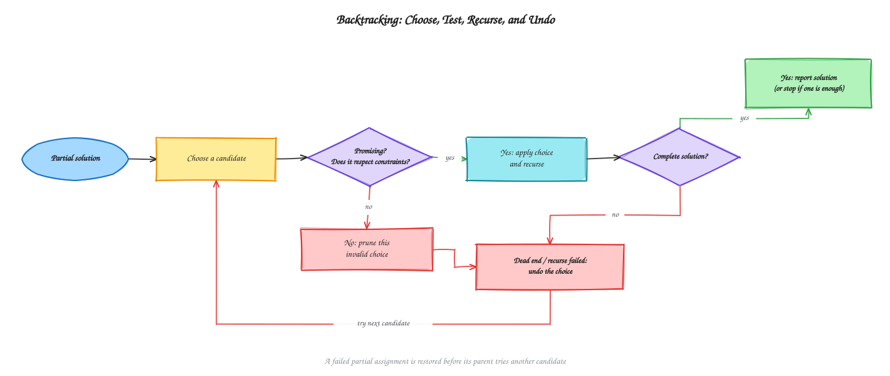
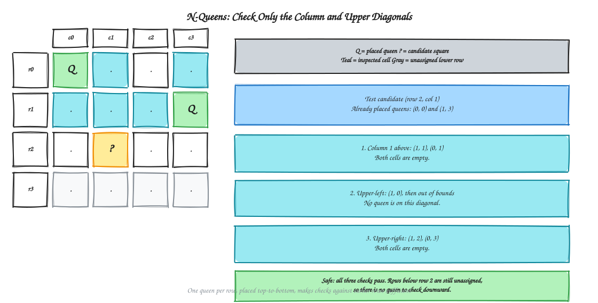
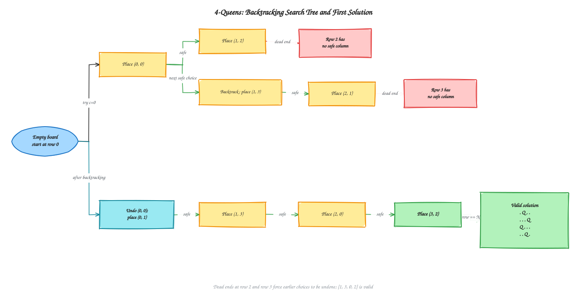
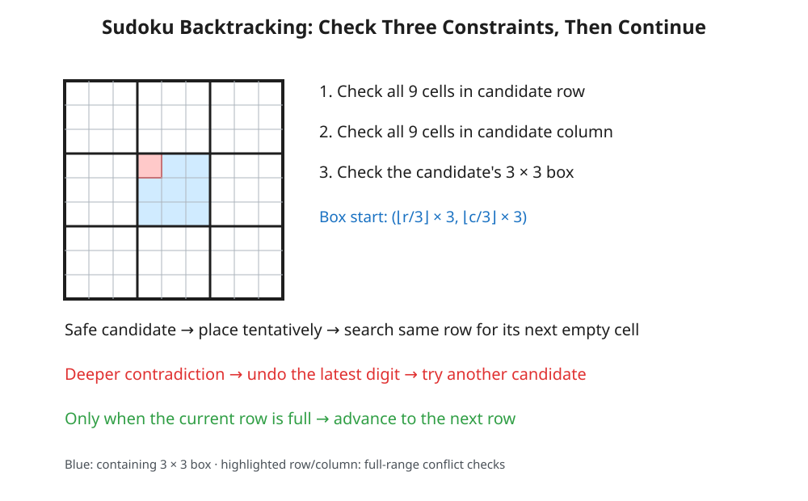

# Chapter 9 - Backtracking

[Previous: Chapter 8 - Dynamic Programming](../Chapter%208%20-%20Dynamic%20Programming/README.md) | [Home](../README.md) | [Next: Chapter 10 - Branch and Bound](../Chapter%2010%20-%20Branch%20and%20Bound/README.md)

---

Backtracking searches a space of candidate solutions by making one choice at a time. It continues from a choice only while the partial solution remains **promising**. When a contradiction or dead end is reached, it undoes the latest choice and tries another.

This chapter follows the two lecture sheets on Backtracking and N-Queens. It explains the search model, derives the board safety checks, traces the 4-Queens problem, compares finding one solution with enumerating all solutions, and discusses correctness, complexity, and related problems. It intentionally contains no implementation code.

---

## Table of Contents

1. [Backtracking](#backtracking)
2. [State-Space Search and Promising Choices](#state-space-search-and-promising-choices)
3. [The N-Queens Problem](#the-n-queens-problem)
4. [The 4-Queens Walkthrough](#the-4-queens-walkthrough)
5. [Checking Whether a Position Is Safe](#checking-whether-a-position-is-safe)
6. [Finding One Solution or Every Solution](#finding-one-solution-or-every-solution)
7. [Correctness: Why the Search Works](#correctness-why-the-search-works)
8. [Complexity Analysis](#complexity-analysis)
9. [Sudoku: Backtracking with Three Constraints](#sudoku-backtracking-with-three-constraints)
10. [Related Backtracking Problems](#related-backtracking-problems)
11. [Practice and Exam Notes](#practice-and-exam-notes)

---

## Backtracking

A backtracking algorithm explores a decision path one choice at a time. If a choice cannot lead to a complete valid answer, the algorithm restores the previous state and tries a different choice.

> **Try a choice → continue the search → if it fails, undo it → try another choice.**

This approach is useful when a problem asks for one or more arrangements satisfying constraints, and partial assignments can be tested before they are complete. Unlike a greedy algorithm, backtracking does not irrevocably commit to a locally attractive choice. Unlike divide and conquer, it explores alternative candidate decisions and may abandon a branch without combining it into the answer.

### Visual: The Backtracking Cycle

See the [diagram index](diagrams/README.md) for editable Excalidraw sources and SVG previews.

---

## State-Space Search and Promising Choices

A **state-space tree** represents the possible decisions:

- A node is a partial solution.
- An edge represents one additional choice.
- A leaf is either a complete solution or a partial assignment that cannot be extended.
- A **promising test**, also called a feasibility test, rejects a partial assignment as soon as it violates a constraint.

Rejecting a branch early is called **pruning**. Pruning does not change which valid solutions exist; it avoids exploring partial states that cannot possibly become valid solutions.

For N-Queens, a state at depth r contains placements for rows 0 through r − 1. The promising test checks whether a candidate square in row r conflicts with any queen already placed. The search continues to the next row only when that candidate is safe.

The conceptual sequence is: check whether the solution is complete; otherwise try each possible next choice; keep a choice and continue only when it is promising; restore it when the continuation fails. A search may stop after its first solution or continue to enumerate every solution.

---

## The N-Queens Problem

Given an N × N chessboard, place N queens so that no two queens attack each other. A queen attacks along its row, column, and both diagonals. Therefore, a valid arrangement has no pair of queens sharing a row, column, or diagonal.

### One Queen per Row

Place queens in order, one row at a time, from top to bottom. This guarantees at most one queen in each row, so a separate same-row check is unnecessary. When considering row r, all rows below it are still empty. It is sufficient to check only the already-filled rows above r.

A board can be represented as an N × N matrix, using one marker for a queen and another for an empty square. The lecture sheets use both integer markers and the familiar Q-and-dot notation. Their C++ example resizes a dynamic two-dimensional vector after reading N and makes it globally accessible; the important algorithmic idea is the board state, not that particular storage choice.

### Safety Conditions for a Candidate Square

Only three directions can contain queens that have already been placed:

1. **Column:** inspect the same column in every row above the candidate.
2. **Upper-right diagonal:** move up one row and right one column at each step.
3. **Upper-left diagonal:** move up one row and left one column at each step.

If any inspected square contains a queen, the candidate is unsafe. Otherwise it is safe. There is no need to inspect downward: those rows have not been assigned yet. This reasoning depends on placing queens top-to-bottom; a solver using a different order must adapt its checks.

---

## The 4-Queens Walkthrough

The lecture traces the search with zero-based row and column indices. It first explores dead ends, undoes earlier choices, and then finds a valid arrangement.

| Step | Attempt or state | Result |
| :--- | :--- | :--- |
| 1 | Place a queen at (0, 0) | Safe: the board is empty. |
| 2 | In row 1, try columns 0 and 1 | Reject: the first shares a column; the second is diagonal to the first queen. |
| 3 | Place a queen at (1, 2) | Safe. |
| 4 | Try every column in row 2 | All four are unsafe; this branch is a dead end. |
| 5 | Backtrack to row 1 and move that queen to (1, 3) | Safe. |
| 6 | Place a queen at (2, 1) | Safe. |
| 7 | Try every column in row 3 | All four are unsafe; backtrack through rows 2 and 1. |
| 8 | Backtrack to row 0 and move its queen to (0, 1) | Safe. Earlier lower-row placements have been undone. |
| 9 | Place queens at (1, 3), (2, 0), then (3, 2) | All safe; every row now contains a queen. |

The resulting board is:

| Row | Column 0 | Column 1 | Column 2 | Column 3 |
| :---: | :---: | :---: | :---: | :---: |
| 0 | . | Q | . | . |
| 1 | . | . | . | Q |
| 2 | Q | . | . | . |
| 3 | . | . | Q | . |

The queen-column positions by row are 1, 3, 0, 2. The mirror image, with positions 2, 0, 3, 1, is the other 4-Queens solution. There are exactly two solutions for a 4 × 4 board.

---

## Checking Whether a Position Is Safe

The two lecture sheets list the column and diagonal checks in different orders. Their order does not affect correctness; all three checks must pass.

- **Column check:** look straight upward in the candidate's column, from the first row through the row immediately above the candidate.
- **Upper-left diagonal check:** begin one row up and one column left; continue while both indices remain on the board.
- **Upper-right diagonal check:** begin one row up and one column right; continue while the row remains on the board and the column stays within the right edge.

On the upper-right diagonal, the row index decreases while the column index increases. This direction is easy to get wrong: moving upward requires decrementing the row index, not incrementing it. If any of the three checks finds a queen, reject the candidate. If all three checks finish without finding one, the candidate is safe.

The recursive continuation must happen immediately after a safe placement, before trying another column in that row. If the continuation is moved outside the candidate loop, the search no longer explores each candidate as its own branch. Depending on where placements are made and restored, it can continue from an empty or inconsistent row state and skip valid branches.

---

## Finding One Solution or Every Solution

The lecture sheets present two valid search goals. They use the same board constraints and the same try, continue, and undo pattern, but handle success differently.

| Goal | What happens when a complete board is found? | What happens after a failed continuation? |
| :--- | :--- | :--- |
| Find the first solution | Report success and stop searching. Keep the successful queen placements on the board. | Remove the failed placement and try the next column. If every column fails, return to the previous row. |
| Find every solution | Record a copy of the completed board, then continue searching. | Remove the placement even after recording a solution, so later branches start from the correct earlier state. |

The base case occurs after all N rows have been filled safely. In the first-solution version, success propagates back through the search without undoing the successful board. In the all-solutions version, each result must be copied before the shared working board is changed by further search. For N = 4, the all-solutions version finds the two mirror-image boards.

### Sample Results

For N = 4, the left-to-right search may first find the following valid board:

| Row | Column 0 | Column 1 | Column 2 | Column 3 |
| :---: | :---: | :---: | :---: | :---: |
| 0 | . | Q | . | . |
| 1 | . | . | . | Q |
| 2 | Q | . | . | . |
| 3 | . | . | Q | . |

For N = 3, every branch is exhausted and no solution exists. N = 2 also has no solution, while N = 1 has a solution on its only square.

**Source consistency note:** The Part 2 PDF prints a different 4-Queens board, corresponding to queen-column positions 0, 2, 3, 1. Its queens at (1, 2) and (2, 3) share a diagonal, so that printed matrix is not a valid solution and conflicts with the safety checks in the same PDF. The corrected result above has been checked against the constraints.

---

## Correctness: Why the Search Works

At the start of the search for row r, the invariant is that rows 0 through r − 1 each contain one queen and no two of those queens attack each other.

- **Base case:** If r equals N, the invariant says all N rows are filled and every placement passed the safety test. The board is therefore a valid solution.
- **Safe choice:** The safety test checks every already-filled row that could attack the candidate. Since earlier rows contain the only queens on the board, a passing candidate preserves the invariant when placed.
- **Exhaustive choices:** The search tries every column in the current row. If each candidate fails or leads to a dead end, no solution extends the current partial board; the previous row must try another candidate.
- **Undo:** Removing a failed placement restores the board to its state before that choice, so later branches do not inherit stale queens.

Together, the invariant and exhaustive search show that the solver reports only valid arrangements and does not miss a solution in the explored search space.

---

## Complexity Analysis

| Measure | Bound | Explanation |
| :--- | :--- | :--- |
| One safety check | O(N) | The column and two diagonals inspect at most N squares each, up to a constant factor. |
| Search | O(N² · N!) as a conservative bound for the direct matrix-and-scan approach; O(N!) is the common search-tree shorthand. | There are O(N!) possible partial arrangements after enforcing distinct columns; each can test up to N columns, and each safety check can scan O(N) squares. |
| Board storage | O(N²) | The board contains N × N squares. |
| Recursion stack | O(N) | The search has at most one level per row. |
| Total storage, excluding saved answers | O(N²) | The board dominates the recursion stack. Enumerating every answer additionally requires space for the saved boards. |

The lecture notes quote O(N!) for the N-Queens search. That is the common search-tree shorthand. Counting the candidate-column loop and linear scan in each safety check gives the more conservative O(N² · N!) bound for the direct implementation described here. Keeping track of occupied columns and diagonals can make each check constant time; generating only legal candidate placements further reduces unnecessary work. Actual runs are usually much faster because unsafe branches are pruned early. Stopping at the first solution often helps in practice, but does not improve the worst-case bound.

---

## Sudoku: Backtracking with Three Constraints

Sudoku is a constraint-placement problem like N-Queens: choose a value for an unfilled position, test whether the partial board remains valid, continue if it does, and undo the choice if a later decision leads to a dead end. The difference is the constraints and the way the next position is selected. This section develops the Sudoku material from the lecture sheet conceptually; it intentionally does not reproduce its Python or C++ implementation.

### Board and constraints

A standard puzzle is a 9 × 9 grid divided into nine 3 × 3 boxes. Some cells are givens; empty cells can be represented conceptually by 0. A completed board must satisfy all three rules:

- Each row contains digits 1 through 9 without repetition.
- Each column contains digits 1 through 9 without repetition.
- Each 3 × 3 box contains digits 1 through 9 without repetition.

A candidate digit is **locally safe** when it conflicts with none of the current digits in its row, column, or box. Local safety is necessary, but it does not prove that the candidate belongs in the final solution. A choice can appear valid now and cause a contradiction much deeper in the search; that delayed failure is exactly why the algorithm must preserve the ability to backtrack.

### From N-Queens to Sudoku

Both problems use the same high-level cycle: choose, test, continue, and undo. In N-Queens, queens are placed row by row, so safety checks need only consider already-filled rows above the candidate. Sudoku givens can occur anywhere, so a candidate must be checked across the entire row and column as well as its box. Sudoku also tests a specific candidate digit (one of 1–9), rather than placing one indistinguishable queen marker. Its safety question therefore depends on the cell and the proposed digit.

### The three-part safety test

For a proposed digit at cell (r, c), reject the candidate if that digit already occurs in any of these regions:

1. **Row r:** inspect all nine columns while keeping the row fixed.
2. **Column c:** inspect all nine rows while keeping the column fixed.
3. **The cell's 3 × 3 box:** inspect all nine cells in that box.

The first two checks cover the whole row and column—not just earlier positions—because the initial clues are distributed throughout the board. The box check is the new geometric step compared with N-Queens.

For zero-based row and column indices, the top-left coordinate of the relevant box is obtained by rounding each index down to the nearest multiple of three:

- Box start row = ⌊r / 3⌋ × 3
- Box start column = ⌊c / 3⌋ × 3

For example, cell (2, 7) belongs to the box starting at (0, 6), while (8, 5) belongs to the box starting at (6, 3). This is constant-time index arithmetic and avoids branching through separate cases for the top, middle, and bottom bands (or left, middle, and right bands).

### Search order: finish the row before advancing

The lecture's recursive search scans the current row from left to right until it finds an empty cell, then considers candidate digits 1 through 9. For each safe digit, it tentatively fills that cell and searches again **in the same row**. Several empty cells may remain in that row, so advancing immediately to the next row would skip them. Only after the scan finds no empty cell in the current row does the search continue to the next row.

If a candidate eventually leads to a state where no digit can be placed, the failure returns to the most recent tentative placement. That digit is cleared, and the next candidate is tried. Failures may appear several recursive decisions later; the call stack preserves the chain of choices so they can be undone in reverse order. Reaching row 9 means every row has been completed and the search has found a solution. If every candidate for an empty cell fails, the current partial board has no completion along that branch.

The editable source is [`ch9-04-sudoku-backtracking.excalidraw`](diagrams/ch9-04-sudoku-backtracking.excalidraw).

### Human solving and the search discipline

Human Sudoku strategies often look for constrained digits or cells and postpone a placement when several locations remain possible. This reflects a useful distinction: a candidate may be locally permitted without being forced or ultimately correct. The backtracking search can tentatively explore such a candidate, but it must retain the option to undo it. Skilled human solvers generally use deduction and candidate notes to avoid guessing; the basic backtracking model is more general and systematically explores alternatives when deduction alone does not settle the puzzle.

### Complexity and scope

For a fixed 9 × 9 board, one safety test examines at most nine row cells, nine column cells, and nine box cells, so its cost is O(1) with respect to the fixed puzzle size. In a generalized puzzle of side length N, these checks are O(N). The search is exponential in the worst case: each empty cell may admit multiple candidate digits, and later conflicts can force long chains of choices to be undone. A precise bound depends on the puzzle and search strategy; a useful conceptual upper bound is branching over up to nine choices at each of up to 81 empty cells. The board itself takes O(1) space for standard Sudoku, while the recursion stack can grow with the number of empty cells. This discussion describes the search model, not a code-level performance claim.

---

## Related Backtracking Problems

The same choose, check, continue, and undo structure applies to other problems:

- **Graph coloring:** assign a color to a vertex only when it differs from the colors of already-colored neighbors; undo it if later vertices cannot be assigned.
- **Graph coloring:** assign a color to a vertex only when it differs from the colors of already-colored neighbors; undo it if later vertices cannot be assigned.
- **Subset sum:** include or exclude each number and prune when the partial sum cannot meet the target, subject to the assumptions on the input values.
- **Hamiltonian circuit:** extend a path by an unvisited adjacent vertex and backtrack if no extension can complete a cycle through all vertices.

For each problem, identify the state, the valid next choices, a promising test, the stopping condition, and exactly what must be restored when a branch fails.

---

## Practice and Exam Notes

- Derive the safety checks from the board geometry rather than memorizing loop syntax. Explain why the upper-right check moves upward and rightward at the same time.
- Trace one failed branch and one successful branch on a 4 × 4 N-Queens board. Identify where each failed queen placement is undone.
- For Sudoku, explain why checking the full row and column differs from N-Queens, derive the 3 × 3 box start for several cells, and distinguish the recursive continuation within the same row from advancing to the next row.
- Distinguish the two search goals: report the first valid board and stop, or record every board and continue.
- Useful cases to reason through are N = 1 (one solution), N = 2 and N = 3 (no solution), and N = 4 (two solutions when enumerating all).
- The lecture notes emphasize understanding and reconstructing the algorithm rather than memorizing a long program. They describe Backtracking and N-Queens primarily as conceptual and complexity-analysis topics for the course exam; the specific coding question was noted as coming from Segment Tree or Maximum Sum Subarray.
