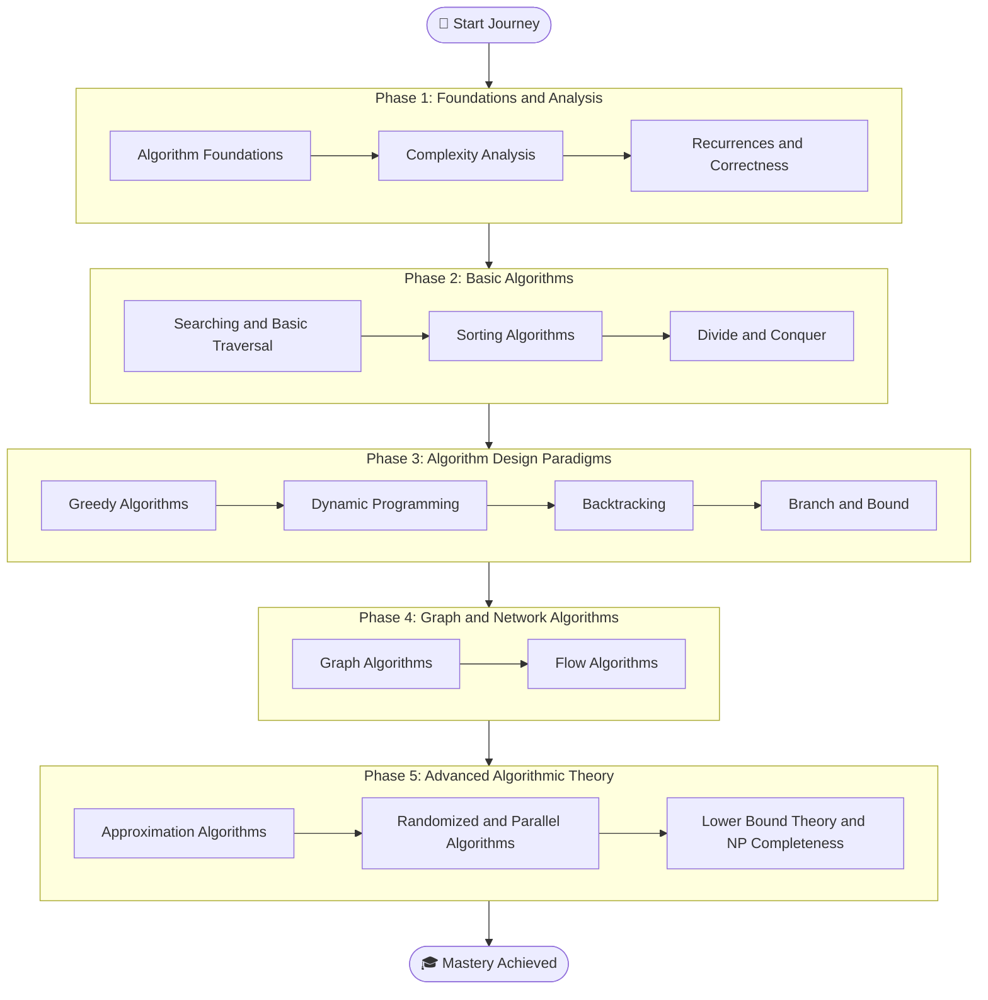

# CSE 2201, 2202: Algorithm Design and Analysis, Sessional

A comprehensive repository for the university course **CSE 2201, 2202: Algorithm Design and Analysis, Sessional** with Python implementations, theory notes, algorithm explanations, previous-year questions, solved problems, dry runs, complexity analysis, and exam-oriented resources.

This repository is designed to help students learn Algorithm Design and Analysis in a structured, practical, and exam-focused way.

---

## Course Overview

- **Course Code:** CSE 2201
- **Course Title:** Algorithm Design and Analysis
- **Credit Hours:** 3.00
- **Weekly Class Hours:** 3 hours
- **Programming Language:** Python
- **Primary Reference:** Introduction to Algorithms, 4th Edition by Thomas H. Cormen, Charles E. Leiserson, Ronald L. Rivest, and Clifford Stein

This course focuses on designing efficient algorithms, analyzing their complexity, proving correctness, and applying suitable algorithmic techniques to solve computational problems.

---

## Repository Goals

This repository aims to provide:

- Chapter-wise notes following the CSE 2201 syllabus
- Clean and well-commented Python implementations
- Step-by-step algorithm explanations
- Pseudocode and dry runs
- Time and space complexity analysis
- Previous-year question mapping
- Lab and sessional preparation resources
- Exam-focused solved problems
- Reference mapping with CLRS / Introduction to Algorithms and Python examples

---

## 🧭 Course Roadmap



---

## Course Topics

This repository covers the following major topics:

- Algorithm foundations
- Complexity analysis
- Asymptotic notation
- Recurrence relations
- Correctness and loop invariants
- Searching techniques
- Sorting algorithms
- Divide-and-Conquer paradigm
- Greedy method
- Dynamic programming
- Backtracking
- Branch and Bound
- Graph algorithms
- Shortest path algorithms
- Topological sorting
- Connected components
- Spanning trees
- Flow algorithms
- Approximation algorithms
- Randomized algorithms
- Parallel algorithms
- Lower bound theory
- NP, NP-hard, and NP-complete problems

---

## Repository Structure

```
CSE 2201, 2202: Algorithm Design and Analysis, Sessional/
│
├── README.md
├── SYLLABUS.md
├── CONTRIBUTING.md
├── LICENSE
│
├── Chapter 0 - Previous Year Questions/
├── Chapter 1 - Introduction and Algorithm Foundations/
├── Chapter 2 - Complexity Analysis and Asymptotic Notation/
├── Chapter 3 - Recurrences Correctness and Loop Invariants/
├── Chapter 4 - Searching and Basic Traversal/
├── Chapter 5 - Sorting Algorithms/
├── Chapter 6 - Divide and Conquer/
├── Chapter 7 - Greedy Algorithms/
├── Chapter 8 - Dynamic Programming/
├── Chapter 9 - Backtracking/
├── Chapter 10 - Branch and Bound/
├── Chapter 11 - Graph Algorithms/
├── Chapter 12 - Flow Algorithms/
├── Chapter 13 - Approximation Algorithms/
├── Chapter 14 - Randomized and Parallel Algorithms/
├── Chapter 15 - Lower Bound Theory and NP Completeness/
│
└── References/
```

---

## Chapter Overview

### Chapter 0 - Previous Year Questions

Contains previous final questions, sessional questions, lab questions, solved problems, and topic-wise question mapping.

### Chapter 1 - Introduction and Algorithm Foundations

Covers algorithm definition, properties of algorithms, algorithm design, algorithm analysis, and major design paradigms.

### Chapter 2 - Complexity Analysis and Asymptotic Notation

Covers time complexity, space complexity, best-case, average-case, worst-case analysis, Big-O, Big-Omega, Big-Theta, and growth of functions.

### Chapter 3 - Recurrences Correctness and Loop Invariants

Covers recurrence relations, substitution method, recursion-tree method, master theorem, correctness proof, mathematical induction, and loop invariants.

### Chapter 4 - Searching and Basic Traversal

Covers linear search, binary search, comparison analysis, and basic traversal concepts.

### Chapter 5 - Sorting Algorithms

Covers insertion sort, bubble sort, selection sort, merge sort, quick sort, heap sort, and sorting comparison.

### Chapter 6 - Divide and Conquer

Covers divide-and-conquer strategy, merge sort, quick sort, binary search, Strassen matrix multiplication, and recurrence analysis.

### Chapter 7 - Greedy Algorithms

Covers greedy method, greedy-choice property, optimal substructure, activity selection, fractional knapsack, change-making, Huffman coding, Prim, and Kruskal.

### Chapter 8 - Dynamic Programming

Covers memoization, tabulation, Fibonacci, coin-row, change-making, coin-collecting, 0/1 knapsack, LCS, Floyd-Warshall, and TSP using DP.

### Chapter 9 - Backtracking

Covers state-space tree, promising function, N-Queens, graph coloring, subset sum, and Hamiltonian circuit.

### Chapter 10 - Branch and Bound

Covers branch and bound concept, bounding function, LC search, 0/1 knapsack using branch and bound, job sequencing, and TSP branch and bound.

### Chapter 11 - Graph Algorithms

Covers graph representation, BFS, DFS, topological sort, connected components, MST, Dijkstra, Bellman-Ford, and Floyd-Warshall.

### Chapter 12 - Flow Algorithms

Covers flow networks, residual graphs, augmenting paths, Ford-Fulkerson, Edmonds-Karp, and bipartite matching.

### Chapter 13 - Approximation Algorithms

Covers approximation algorithms, approximation ratio, vertex cover, approximate TSP, and set cover.

### Chapter 14 - Randomized and Parallel Algorithms

Covers randomized algorithms, probabilistic analysis, randomized quicksort, randomized selection, parallel algorithms, fork-join model, and parallel merge sort.

### Chapter 15 - Lower Bound Theory and NP Completeness

Covers lower bound theory, comparison sorting lower bound, decision tree model, P, NP, NP-hard, NP-complete, decision problems, optimization problems, and polynomial-time reduction.

---

## Book Reference Mapping

| Repository Chapter | Main Reference |
| --- | --- |
| Chapter 1 - Introduction and Algorithm Foundations | CLRS Chapter 1, Chapter 2 |
| Chapter 2 - Complexity Analysis and Asymptotic Notation | CLRS Chapter 3 |
| Chapter 3 - Recurrences Correctness and Loop Invariants | CLRS Chapter 2, Chapter 4 |
| Chapter 4 - Searching and Basic Traversal | CLRS Chapter 2, Chapter 20 |
| Chapter 5 - Sorting Algorithms | CLRS Chapter 2, Chapter 6, Chapter 7, Chapter 8 |
| Chapter 6 - Divide and Conquer | CLRS Chapter 4 |
| Chapter 7 - Greedy Algorithms | CLRS Chapter 15, Chapter 21 |
| Chapter 8 - Dynamic Programming | CLRS Chapter 14, Chapter 23 |
| Chapter 9 - Backtracking | Course notes, previous questions, CLRS Chapter 34 and Chapter 35 as supporting references |
| Chapter 10 - Branch and Bound | Course notes, previous questions, CLRS Chapter 34 and Chapter 35 as supporting references |
| Chapter 11 - Graph Algorithms | CLRS Chapter 19, Chapter 20, Chapter 21, Chapter 22, Chapter 23 |
| Chapter 12 - Flow Algorithms | CLRS Chapter 24, Chapter 25 |
| Chapter 13 - Approximation Algorithms | CLRS Chapter 35 |
| Chapter 14 - Randomized and Parallel Algorithms | CLRS Chapter 5, Chapter 7, Chapter 9, Chapter 26 |
| Chapter 15 - Lower Bound Theory and NP Completeness | CLRS Chapter 8, Chapter 34, Chapter 35 |

---

## Getting Started

### Prerequisites

To use the code examples in this repository, you need:

- GCC or any C compiler
- VS Code, Code::Blocks, Dev-C++, CLion, or any C-supported IDE
- Basic C programming knowledge
- Basic data structure knowledge

### Clone the Repository

```bash
git clone https://github.com/M-F-Tushar/CSE-2201-Algorithm-Design-and-Analysis.git
cd CSE-2201-Algorithm-Design-and-Analysis
```

### Compile a C Program

```bash
gcc filename.c -o output
./output
```

### Example

```bash
cd "Chapter 5 - Sorting Algorithms/Merge Sort"
gcc merge_sort.c -o merge_sort
./merge_sort
```

---

## Usage

Each chapter folder should contain:

```text
README.md
Notes/
Solved Problems/
Practice Problems/
Previous Question References.md
```

Each algorithm folder should contain:

```text
Algorithm Name/
├── README.md
├── theory.md
├── pseudocode.md
├── implementation.c
├── sample_input.txt
├── sample_output.txt
├── dry_run.md
├── complexity_analysis.md
├── correctness.md
└── previous_question_reference.md
```

---

## Lab and Sessional Format

For lab or sessional problems, each solution should include:

1. Problem statement
2. Theory
3. Algorithm or recurrence relation
4. C implementation
5. Sample input
6. Sample output
7. Dry run
8. Time complexity
9. Space complexity
10. Result analysis or comparison table

---

## Learning Outcomes

By the end of this course, students should be able to:

- Understand the role of algorithms in computing.
- Analyze time and space complexity.
- Use asymptotic notation correctly.
- Solve recurrence relations.
- Prove correctness using loop invariants.
- Apply divide-and-conquer, greedy, dynamic programming, backtracking, and branch-and-bound techniques.
- Implement searching and sorting algorithms.
- Implement graph traversal, shortest path, MST, and flow algorithms.
- Understand randomized, parallel, and approximation algorithms.
- Explain lower bound theory and NP-completeness.
- Solve previous-year exam questions with structured explanations.

---

## Reference Materials

### Primary Reference

- Thomas H. Cormen, Charles E. Leiserson, Ronald L. Rivest, Clifford Stein

**Introduction to Algorithms, 4th Edition**

### Additional Resources

- Course lectures
- Class notes
- Previous-year questions
- Lab and sessional questions
- Online algorithm visualizers
- Competitive programming resources

> Note: This repository does not redistribute copyrighted textbook content. It only provides original notes, implementations, explanations, and topic mapping for educational purposes.

---

## Course Progress

- Chapter 0 - Previous Year Questions
- Chapter 1 - Introduction and Algorithm Foundations
- Chapter 2 - Complexity Analysis and Asymptotic Notation
- Chapter 3 - Recurrences Correctness and Loop Invariants
- Chapter 4 - Searching and Basic Traversal
- Chapter 5 - Sorting Algorithms
- Chapter 6 - Divide and Conquer
- Chapter 7 - Greedy Algorithms
- Chapter 8 - Dynamic Programming
- Chapter 9 - Backtracking
- Chapter 10 - Branch and Bound
- Chapter 11 - Graph Algorithms
- Chapter 12 - Flow Algorithms
- Chapter 13 - Approximation Algorithms
- Chapter 14 - Randomized and Parallel Algorithms
- Chapter 15 - Lower Bound Theory and NP Completeness

---

## Contributing

Contributions are welcome.

You can contribute by:

1. Fixing errors in notes or code.
2. Adding new algorithm implementations.
3. Adding sample input and output.
4. Adding dry runs.
5. Adding complexity analysis.
6. Solving previous-year questions.
7. Improving documentation.

### Contribution Guidelines

- Follow the existing folder structure.
- Use clear file names.
- Write clean and commented C code.
- Add sample input and output.
- Mention time and space complexity.
- Add references where needed.
- Test code before submitting.

---

## Contact

**Mahir Faysal Tusher**

- GitHub: [https://github.com/M-F-Tushar](https://github.com/M-F-Tushar)
- Location: Chandpur, Bangladesh

---

## License

This project is licensed under the MIT License. See the LICENSE file for details.

---

## Acknowledgments

- Course instructors and teaching assistants
- Fellow students for discussions and collaboration
- Authors of Introduction to Algorithms
- Open-source algorithm learning communities
- Previous-year question contributors

---

## Repository Purpose

This repository is created to help students learn **Algorithm Design and Analysis** in a structured, practical, and exam-oriented way.

If you find this repository helpful, consider giving it a star.